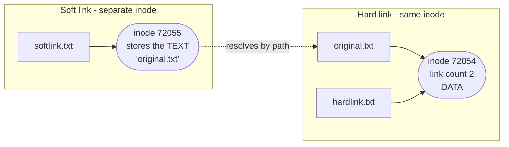
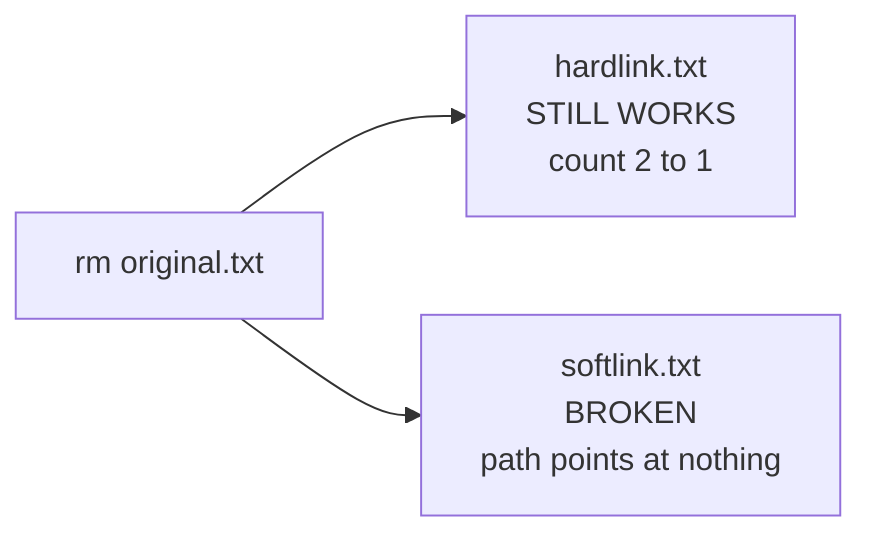

Linux Fundamentals – Learning Notes
===================================

Name: Anshul Mohanty    Roll No: 24BCS10191    Section: A

## In one line

A filename is not a file — the **inode** is the file, and names are just pointers to it.

## The picture

Delete `original.txt` and the two behave completely differently:

## Mental model

| | Hard link | Soft link |
|---|---|---|
| Points to | The inode | A **path string** |
| Own inode | No, shares it | Yes |
| Original deleted | Survives | Breaks |
| Across filesystems | Not allowed | Allowed |
| Directories | Not allowed | Allowed |

| | `useradd` | `adduser` |
|---|---|---|
| Is a | Compiled **ELF binary** | **Perl script** wrapping useradd |
| Home dir | Not created | Created |
| Shell | `/bin/sh` | `/bin/bash` |
| `/etc/skel` copied | No | Yes |

## Gotchas

- Data is freed only when the **link count hits zero** — so `rm` on a hard-linked file frees
  nothing. `ls -li` showing the same inode number is the proof two names are one file.
- A symlink can look perfectly valid in `ls` and still be dangling; only reading it fails.
- `useradd` silently gives `/bin/sh` and no home directory. A user who "can't log in properly"
  is usually this, not a permissions problem.
- **`journalctl` does not exist in a normal container** — no init system, no journald. I had
  to run a container with `/sbin/init` as PID 1 before systemd existed at all.
- `systemctl` only reports *that* a unit failed. `journalctl -u <unit>` gives the actual
  reason — for me, the exact nginx config line that was malformed.
