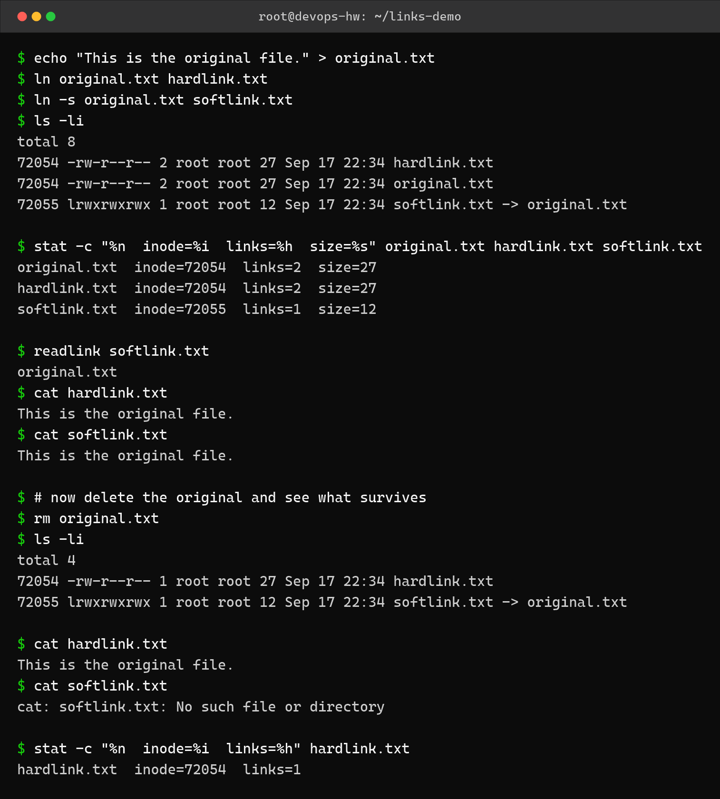
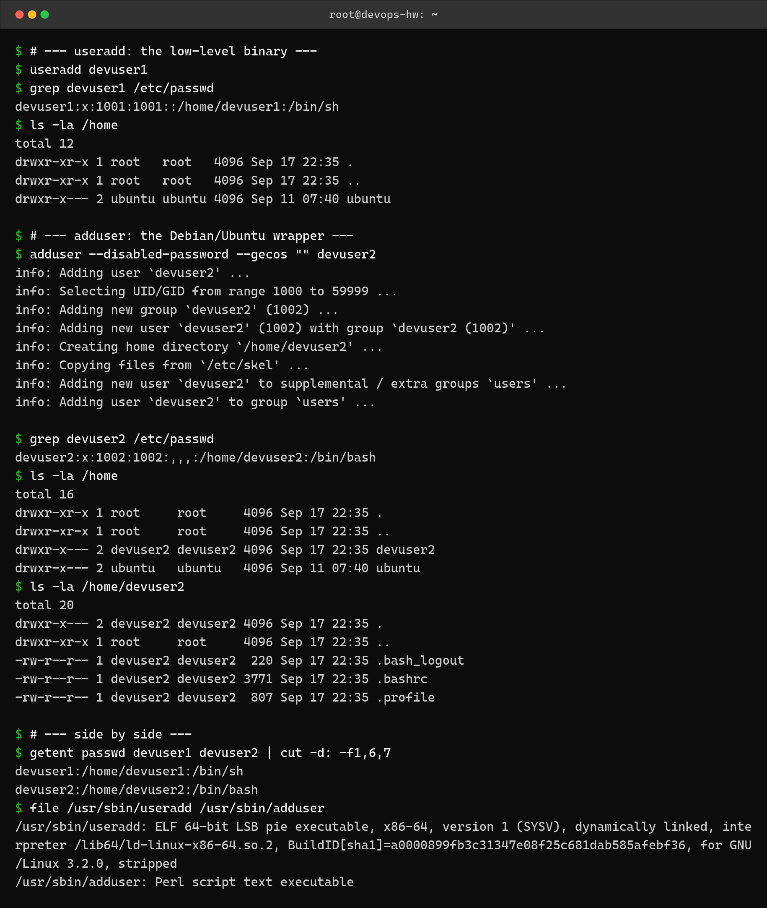
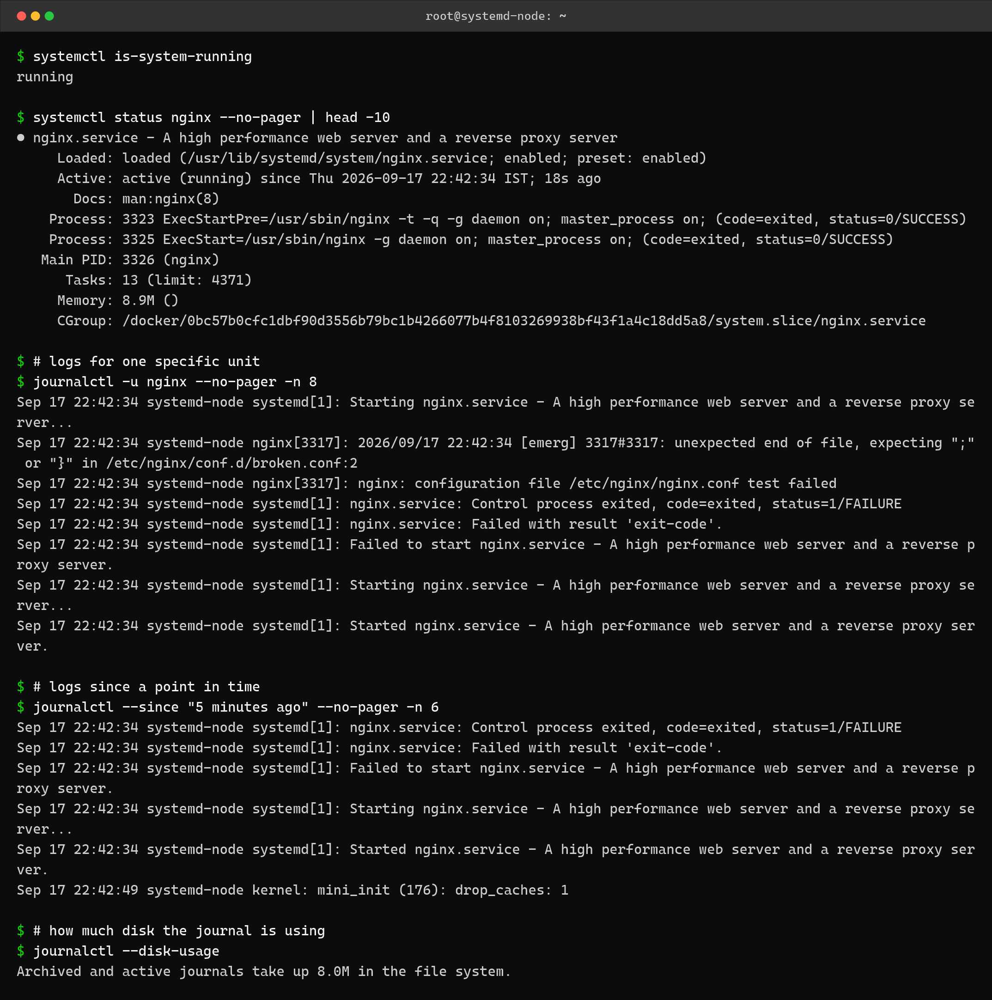
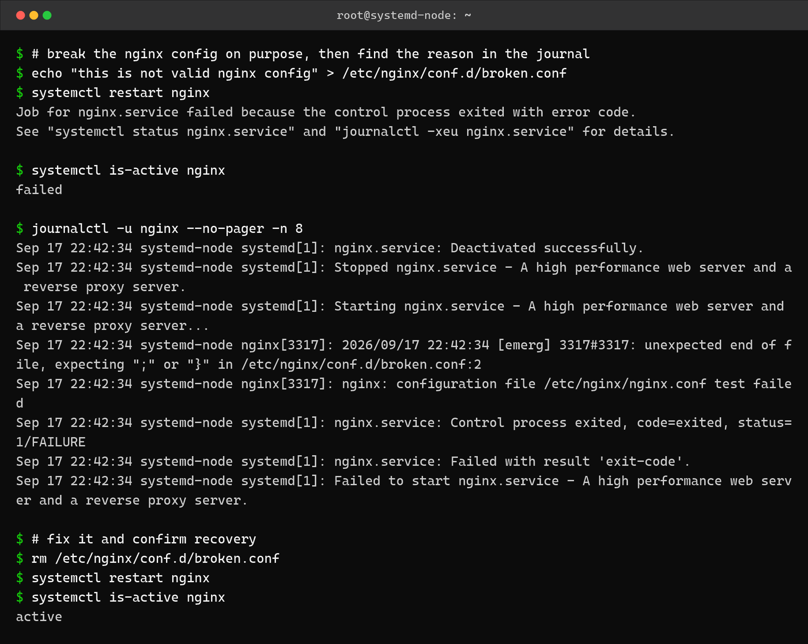

Linux Fundamentals – Homework
=============================

Name: Anshul Mohanty    Roll No: 24BCS10191

Environment: Ubuntu 24.04 container on Docker Desktop (Windows 11 host).
Task 3 needs a running init system, so it was done in a second container started with
`/sbin/init` as PID 1 so that systemd and journald are actually running.

---

Task 1: Hard links vs soft links
--------------------------------

| | Hard link | Soft (symbolic) link |
|---|---|---|
| What it is | Another name for the **same inode** | A small separate file that stores a **path** |
| Inode | Same as the original | Its own inode |
| Link count | Increases the original's link count | Original's link count unchanged |
| If original is deleted | Still works, data survives | Breaks (dangling link) |
| Across filesystems | Not allowed | Allowed |
| Command | `ln original.txt hardlink.txt` | `ln -s original.txt softlink.txt` |

### Commands

```bash
mkdir -p links-demo && cd links-demo
echo "This is the original file." > original.txt
ln original.txt hardlink.txt
ln -s original.txt softlink.txt
ls -li
stat -c "%n  inode=%i  links=%h  size=%s" original.txt hardlink.txt softlink.txt
rm original.txt          # delete the original and see what survives
cat hardlink.txt
cat softlink.txt
```

### Output



```
$ echo "This is the original file." > original.txt
$ ln original.txt hardlink.txt
$ ln -s original.txt softlink.txt
$ ls -li
total 8
72054 -rw-r--r-- 2 root root 27 Sep 17 22:34 hardlink.txt
72054 -rw-r--r-- 2 root root 27 Sep 17 22:34 original.txt
72055 lrwxrwxrwx 1 root root 12 Sep 17 22:34 softlink.txt -> original.txt

$ stat -c "%n  inode=%i  links=%h  size=%s" original.txt hardlink.txt softlink.txt
original.txt  inode=72054  links=2  size=27
hardlink.txt  inode=72054  links=2  size=27
softlink.txt  inode=72055  links=1  size=12

$ readlink softlink.txt
original.txt
$ cat hardlink.txt
This is the original file.
$ cat softlink.txt
This is the original file.

$ # now delete the original and see what survives
$ rm original.txt
$ ls -li
total 4
72054 -rw-r--r-- 1 root root 27 Sep 17 22:34 hardlink.txt
72055 lrwxrwxrwx 1 root root 12 Sep 17 22:34 softlink.txt -> original.txt

$ cat hardlink.txt
This is the original file.
$ cat softlink.txt
cat: softlink.txt: No such file or directory

$ stat -c "%n  inode=%i  links=%h" hardlink.txt
hardlink.txt  inode=72054  links=1
```

The important part: `original.txt` and `hardlink.txt` both show inode **72054** and a link
count of **2**, while `softlink.txt` has its own inode **72055**. After `rm original.txt` the
link count drops to **1**, `cat hardlink.txt` still prints the contents, and
`cat softlink.txt` fails with *No such file or directory* because the path it stored is gone.

---

Task 2: useradd vs adduser
--------------------------

| | `useradd` | `adduser` |
|---|---|---|
| What it is | Low-level **binary** (`ELF executable`) | High-level **Perl script** that wraps `useradd` |
| Home directory | Not created unless you pass `-m` | Created automatically |
| Skeleton files | Not copied | Copies `/etc/skel` (`.bashrc`, `.profile`, `.bash_logout`) |
| Default shell | `/bin/sh` | `/bin/bash` |
| Prompts | None, fully non-interactive | Asks for password and user details |
| Available on | Every Linux distro | Debian / Ubuntu family |

### Commands

```bash
useradd devuser1                                    # low-level
adduser --disabled-password --gecos "" devuser2     # wrapper
getent passwd devuser1 devuser2 | cut -d: -f1,6,7
file /usr/sbin/useradd /usr/sbin/adduser
```

### Output



```
$ # --- useradd: the low-level binary ---
$ useradd devuser1
$ grep devuser1 /etc/passwd
devuser1:x:1001:1001::/home/devuser1:/bin/sh
$ ls -la /home
total 12
drwxr-xr-x 1 root   root   4096 Sep 17 22:35 .
drwxr-xr-x 1 root   root   4096 Sep 17 22:35 ..
drwxr-x--- 2 ubuntu ubuntu 4096 Sep 11 07:40 ubuntu

$ # --- adduser: the Debian/Ubuntu wrapper ---
$ adduser --disabled-password --gecos "" devuser2
info: Adding user `devuser2' ...
info: Selecting UID/GID from range 1000 to 59999 ...
info: Adding new group `devuser2' (1002) ...
info: Adding new user `devuser2' (1002) with group `devuser2 (1002)' ...
info: Creating home directory `/home/devuser2' ...
info: Copying files from `/etc/skel' ...
info: Adding new user `devuser2' to supplemental / extra groups `users' ...
info: Adding user `devuser2' to group `users' ...

$ grep devuser2 /etc/passwd
devuser2:x:1002:1002:,,,:/home/devuser2:/bin/bash
$ ls -la /home
total 16
drwxr-xr-x 1 root     root     4096 Sep 17 22:35 .
drwxr-xr-x 1 root     root     4096 Sep 17 22:35 ..
drwxr-x--- 2 devuser2 devuser2 4096 Sep 17 22:35 devuser2
drwxr-x--- 2 ubuntu   ubuntu   4096 Sep 11 07:40 ubuntu
$ ls -la /home/devuser2
total 20
drwxr-x--- 2 devuser2 devuser2 4096 Sep 17 22:35 .
drwxr-xr-x 1 root     root     4096 Sep 17 22:35 ..
-rw-r--r-- 1 devuser2 devuser2  220 Sep 17 22:35 .bash_logout
-rw-r--r-- 1 devuser2 devuser2 3771 Sep 17 22:35 .bashrc
-rw-r--r-- 1 devuser2 devuser2  807 Sep 17 22:35 .profile

$ # --- side by side ---
$ getent passwd devuser1 devuser2 | cut -d: -f1,6,7
devuser1:/home/devuser1:/bin/sh
devuser2:/home/devuser2:/bin/bash
$ file /usr/sbin/useradd /usr/sbin/adduser
/usr/sbin/useradd: ELF 64-bit LSB pie executable, x86-64, version 1 (SYSV), dynamically linked, interpreter /lib64/ld-linux-x86-64.so.2, BuildID[sha1]=a0000899fb3c31347e08f25c681dab585afebf36, for GNU/Linux 3.2.0, stripped
/usr/sbin/adduser: Perl script text executable
```

`devuser1` (useradd) got **no home directory** in `/home` and the shell `/bin/sh`.
`devuser2` (adduser) got `/home/devuser2` created, the three skeleton files copied into it,
and the shell `/bin/bash`. The last command shows why: `useradd` is a compiled binary,
`adduser` is a Perl script that calls it with sensible defaults.

---

Task 3: Journal logs (journalctl)
---------------------------------

`journalctl` reads the logs collected by `systemd-journald`. It is one place for kernel
messages, boot messages and every service's output, instead of hunting through separate
files in `/var/log`.

| Command | What it shows |
|---|---|
| `journalctl` | Everything, oldest first |
| `journalctl -u nginx` | Only the `nginx` unit |
| `journalctl -n 20` | Last 20 lines |
| `journalctl -f` | Follow live, like `tail -f` |
| `journalctl -p err` | Only error priority and worse |
| `journalctl --since "5 minutes ago"` | Time-filtered |
| `journalctl -b` | Current boot only |
| `journalctl --disk-usage` | How much space the journal uses |
| `journalctl -xeu <unit>` | Last entries for a unit, with explanations |

### Output



```
$ systemctl is-system-running
running

$ systemctl status nginx --no-pager | head -10
● nginx.service - A high performance web server and a reverse proxy server
     Loaded: loaded (/usr/lib/systemd/system/nginx.service; enabled; preset: enabled)
     Active: active (running) since Thu 2026-09-17 22:42:34 IST; 18s ago
       Docs: man:nginx(8)
    Process: 3323 ExecStartPre=/usr/sbin/nginx -t -q -g daemon on; master_process on; (code=exited, status=0/SUCCESS)
    Process: 3325 ExecStart=/usr/sbin/nginx -g daemon on; master_process on; (code=exited, status=0/SUCCESS)
   Main PID: 3326 (nginx)
      Tasks: 13 (limit: 4371)
     Memory: 8.9M ()
     CGroup: /docker/0bc57b0cfc1dbf90d3556b79bc1b4266077b4f8103269938bf43f1a4c18dd5a8/system.slice/nginx.service

$ # logs for one specific unit
$ journalctl -u nginx --no-pager -n 8
Sep 17 22:42:34 systemd-node systemd[1]: Starting nginx.service - A high performance web server and a reverse proxy server...
Sep 17 22:42:34 systemd-node nginx[3317]: 2026/09/17 22:42:34 [emerg] 3317#3317: unexpected end of file, expecting ";" or "}" in /etc/nginx/conf.d/broken.conf:2
Sep 17 22:42:34 systemd-node nginx[3317]: nginx: configuration file /etc/nginx/nginx.conf test failed
Sep 17 22:42:34 systemd-node systemd[1]: nginx.service: Control process exited, code=exited, status=1/FAILURE
Sep 17 22:42:34 systemd-node systemd[1]: nginx.service: Failed with result 'exit-code'.
Sep 17 22:42:34 systemd-node systemd[1]: Failed to start nginx.service - A high performance web server and a reverse proxy server.
Sep 17 22:42:34 systemd-node systemd[1]: Starting nginx.service - A high performance web server and a reverse proxy server...
Sep 17 22:42:34 systemd-node systemd[1]: Started nginx.service - A high performance web server and a reverse proxy server.

$ # logs since a point in time
$ journalctl --since "5 minutes ago" --no-pager -n 6
Sep 17 22:42:34 systemd-node systemd[1]: nginx.service: Control process exited, code=exited, status=1/FAILURE
Sep 17 22:42:34 systemd-node systemd[1]: nginx.service: Failed with result 'exit-code'.
Sep 17 22:42:34 systemd-node systemd[1]: Failed to start nginx.service - A high performance web server and a reverse proxy server.
Sep 17 22:42:34 systemd-node systemd[1]: Starting nginx.service - A high performance web server and a reverse proxy server...
Sep 17 22:42:34 systemd-node systemd[1]: Started nginx.service - A high performance web server and a reverse proxy server.
Sep 17 22:42:49 systemd-node kernel: mini_init (176): drop_caches: 1

$ # how much disk the journal is using
$ journalctl --disk-usage
Archived and active journals take up 8.0M in the file system.
```

### Using the journal to debug a real failure

This is what `journalctl` is actually for. I broke the nginx config on purpose, restarted the
service, and used the journal to find the reason.



```
$ # break the nginx config on purpose, then find the reason in the journal
$ echo "this is not valid nginx config" > /etc/nginx/conf.d/broken.conf
$ systemctl restart nginx
Job for nginx.service failed because the control process exited with error code.
See "systemctl status nginx.service" and "journalctl -xeu nginx.service" for details.

$ systemctl is-active nginx
failed

$ journalctl -u nginx --no-pager -n 8
Sep 17 22:42:34 systemd-node systemd[1]: nginx.service: Deactivated successfully.
Sep 17 22:42:34 systemd-node systemd[1]: Stopped nginx.service - A high performance web server and a reverse proxy server.
Sep 17 22:42:34 systemd-node systemd[1]: Starting nginx.service - A high performance web server and a reverse proxy server...
Sep 17 22:42:34 systemd-node nginx[3317]: 2026/09/17 22:42:34 [emerg] 3317#3317: unexpected end of file, expecting ";" or "}" in /etc/nginx/conf.d/broken.conf:2
Sep 17 22:42:34 systemd-node nginx[3317]: nginx: configuration file /etc/nginx/nginx.conf test failed
Sep 17 22:42:34 systemd-node systemd[1]: nginx.service: Control process exited, code=exited, status=1/FAILURE
Sep 17 22:42:34 systemd-node systemd[1]: nginx.service: Failed with result 'exit-code'.
Sep 17 22:42:34 systemd-node systemd[1]: Failed to start nginx.service - A high performance web server and a reverse proxy server.

$ # fix it and confirm recovery
$ rm /etc/nginx/conf.d/broken.conf
$ systemctl restart nginx
$ systemctl is-active nginx
active
```

`systemctl restart nginx` only said the control process failed. The journal gave the actual
cause: `[emerg] unexpected end of file, expecting ";" or "}" in /etc/nginx/conf.d/broken.conf:2`.
After deleting that file the service went back to `active`.

---

Task 4: Linux command reference
-------------------------------

### Navigation
| Command | Use |
|---|---|
| `pwd` | Print working directory |
| `ls -la` | List all files with details |
| `cd /path` / `cd ..` / `cd ~` | Change directory / up one / home |
| `tree -L 2` | Directory tree, 2 levels deep |
| `find / -name "*.conf"` | Find files by name |

### Files and directories
| Command | Use |
|---|---|
| `touch file` | Create an empty file / update timestamp |
| `mkdir -p a/b/c` | Create nested directories, no error if they exist |
| `cp -r src dst` | Copy recursively |
| `mv old new` | Move or rename |
| `rm -rf dir` | Delete recursively and forcefully |
| `ln -s target link` | Create a symbolic link |

### Viewing and text processing
| Command | Use |
|---|---|
| `cat` / `less` / `head -n 20` / `tail -f` | Show file, page it, first 20 lines, follow live |
| `grep -i "error" file` | Search text, case-insensitive |
| `grep -rn "TODO" .` | Recursive search with line numbers |
| `wc -l file` | Count lines |
| `sort` / `uniq -c` | Sort / count duplicates |
| `awk '{print $1}'` | Print a column |
| `sed 's/old/new/g' file` | Find and replace |
| `cut -d: -f1 /etc/passwd` | Cut a delimited field |

### Permissions and ownership
| Command | Use |
|---|---|
| `chmod +x script.sh` | Make executable |
| `chmod 644 file` | rw for owner, r for others |
| `chown user:group file` | Change owner and group |
| `umask` | Default permission mask |
| `sudo command` | Run as root |

### Users and groups
| Command | Use |
|---|---|
| `whoami` / `id` | Current user / uid, gid, groups |
| `useradd` / `adduser` | Create a user (see Task 2) |
| `passwd user` | Set a password |
| `usermod -aG sudo user` | Add user to a group |
| `userdel -r user` | Delete user and home directory |
| `getent passwd` | Read the user database |

### Processes
| Command | Use |
|---|---|
| `ps aux` | All running processes |
| `top` / `htop` | Live process view |
| `kill -9 PID` | Force kill a process |
| `pkill name` | Kill by name |
| `jobs` / `fg` / `bg` | Manage shell jobs |
| `nohup cmd &` | Run detached in the background |

### Disk and system
| Command | Use |
|---|---|
| `df -h` | Disk free, human readable |
| `du -sh dir` | Size of a directory |
| `free -h` | Memory usage |
| `uname -a` | Kernel and architecture |
| `uptime` | Load average |
| `lsblk` | Block devices |

### Networking
| Command | Use |
|---|---|
| `ip addr` / `ip route` | Interfaces / routing table |
| `ping -c 4 host` | Test reachability |
| `ss -tuln` | Listening sockets |
| `dig` / `nslookup` | DNS lookups |
| `curl -I url` | HTTP headers only |
| `traceroute host` | Path to a host |

### Packages (Debian/Ubuntu)
| Command | Use |
|---|---|
| `apt update` | Refresh package lists |
| `apt install pkg` | Install |
| `apt remove pkg` | Remove |
| `dpkg -l` | List installed packages |
| `which cmd` | Path of a command |

---

What I understood
-----------------

- A hard link is just another name for the same inode, so the file's data only disappears
  when the link count reaches zero. A soft link is its own file holding a path, so it breaks
  the moment the target moves or is deleted.
- `ls -li` is the quickest way to prove this - same inode number means the same file.
- `useradd` does the bare minimum, `adduser` is the friendly wrapper. On Ubuntu I should use
  `adduser` for real people and `useradd -r` for service accounts.
- A container normally has no init system, so `journalctl` does not work in it. I had to run
  a container with `/sbin/init` as PID 1 before systemd and journald existed at all.
- When a service fails, `systemctl` only tells me *that* it failed. `journalctl -u <unit>`
  tells me *why* - in my case the exact nginx config line that was wrong.
