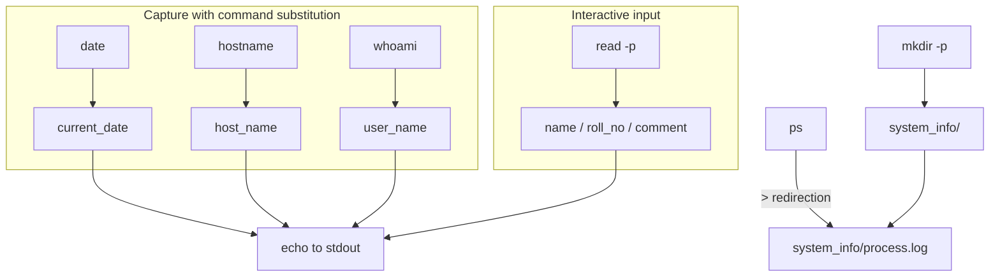

Shell Scripting – Learning Notes
================================

Name: Anshul Mohanty    Roll No: 24BCS10191    Section: A

## In one line

A shell script is glue: capture command output into variables, take input, and redirect
results into files.

## The picture

## Mental model

| Syntax | Meaning |
|---|---|
| `$(command)` | Run it, substitute its **output** |
| `read -p "text" var` | Prompt, store the typed answer |
| `>` | **Overwrite** the file |
| `>>` | **Append** to the file |
| `2>&1` | Send stderr to the same place as stdout |
| `mkdir -p` | Create nested, no error if it exists |
| `"$var"` | Quoted — survives spaces in the value |

## Gotchas

- `>` truncates on every run. `ps > process.log` is a snapshot, not a log — use `>>` if you
  actually want history.
- **Unquoted variables split on spaces.** `$log_file` with a space in the path becomes two
  arguments and the command breaks in a confusing way. Always `"$log_file"`.
- `mkdir` without `-p` fails on the second run, which makes a script non-idempotent.
- An interactive script can be tested without typing: `printf 'a\nb\n' | ./script.sh` feeds
  every `read` in order — far faster than retyping answers each time.
- `$0` inside `bash -c` shows the shell you *invoked*, not the user's login shell. To see a
  real login shell, read field 7 of `/etc/passwd` via `getent passwd`.
