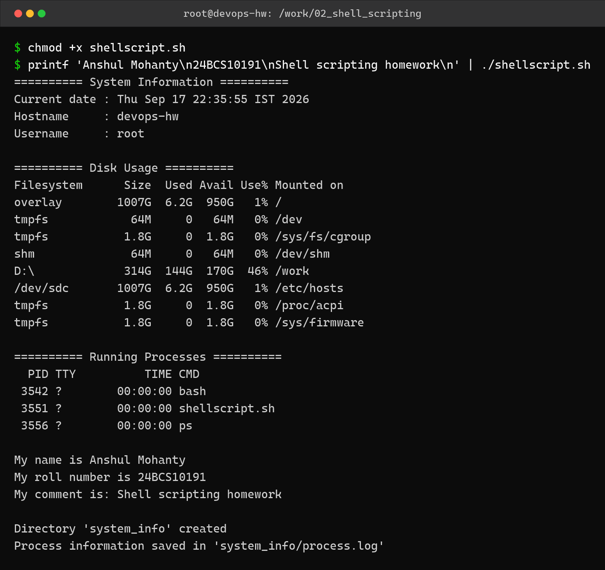
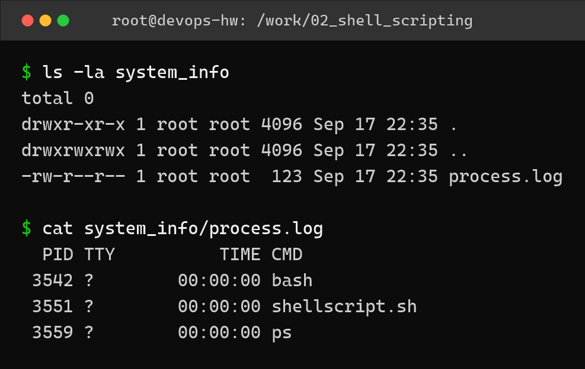

Shell Scripting – Homework
==========================

Name: Anshul Mohanty    Roll No: 24BCS10191    Section: A

See also: [LEARNING.md](LEARNING.md) - diagram and revision notes for this topic.

Task: System Information Script
-------------------------------

Script: `shellscript.sh`

| Requirement | How the script does it |
|---|---|
| Print the current date | `current_date=$(date)` then `echo` |
| Print the hostname | `host_name=$(hostname)` |
| Print the username | `user_name=$(whoami)` |
| Print the disk usage | `df -h` |
| Print the running processes | `ps` |
| Use variables | `current_date`, `host_name`, `user_name`, `work_dir`, `log_file`, `name`, `roll_no`, `comment` |
| Take user input | `read -p "Enter your name: " name` |
| Create a directory | `mkdir -p "$work_dir"` |
| Create a file | `touch "$log_file"` |
| Store processes in a file using `>` | `ps > "$log_file"` |

The script
----------

```bash
#!/bin/bash
# System Information Script - DevOps Homework (Shell Scripting)
# Name: Anshul Mohanty   Roll No: 24BCS10191   Section: A

# Variables to store and reuse data
current_date=$(date)
host_name=$(hostname)
user_name=$(whoami)
work_dir="system_info"
log_file="$work_dir/process.log"

echo "========== System Information =========="
echo "Current date : $current_date"
echo "Hostname     : $host_name"
echo "Username     : $user_name"

echo
echo "========== Disk Usage =========="
df -h

echo
echo "========== Running Processes =========="
ps

# Take user input using read -p
echo
read -p "Enter your name: " name
read -p "Enter your roll number: " roll_no
read -p "Enter your comment: " comment

echo "My name is $name"
echo "My roll number is $roll_no"
echo "My comment is: $comment"

# Create a directory using mkdir and a file using touch
mkdir -p "$work_dir"
touch "$log_file"

# Store the running processes in the file using > output redirection
ps > "$log_file"

echo
echo "Directory '$work_dir' created"
echo "Process information saved in '$log_file'"
```

How to run
----------

```bash
chmod +x shellscript.sh
./shellscript.sh
```

The script uses `read -p`, so it waits for input. To run it non-interactively I piped the
three answers into it:

Output
------



```
$ chmod +x shellscript.sh
$ printf 'Anshul Mohanty\n24BCS10191\nShell scripting homework\n' | ./shellscript.sh
========== System Information ==========
Current date : Thu Sep 17 22:35:55 IST 2026
Hostname     : devops-hw
Username     : root

========== Disk Usage ==========
Filesystem      Size  Used Avail Use% Mounted on
overlay        1007G  6.2G  950G   1% /
tmpfs            64M     0   64M   0% /dev
tmpfs           1.8G     0  1.8G   0% /sys/fs/cgroup
shm              64M     0   64M   0% /dev/shm
D:\             314G  144G  170G  46% /work
/dev/sdc       1007G  6.2G  950G   1% /etc/hosts
tmpfs           1.8G     0  1.8G   0% /proc/acpi
tmpfs           1.8G     0  1.8G   0% /sys/firmware

========== Running Processes ==========
  PID TTY          TIME CMD
 3542 ?        00:00:00 bash
 3551 ?        00:00:00 shellscript.sh
 3556 ?        00:00:00 ps

My name is Anshul Mohanty
My roll number is 24BCS10191
My comment is: Shell scripting homework

Directory 'system_info' created
Process information saved in 'system_info/process.log'
```

Directory and file created by the script
----------------------------------------



```
$ ls -la system_info
total 0
drwxr-xr-x 1 root root 4096 Sep 17 22:35 .
drwxrwxrwx 1 root root 4096 Sep 17 22:35 ..
-rw-r--r-- 1 root root  123 Sep 17 22:35 process.log

$ cat system_info/process.log
  PID TTY          TIME CMD
 3542 ?        00:00:00 bash
 3551 ?        00:00:00 shellscript.sh
 3559 ?        00:00:00 ps
```

Note: `df -h` shows `D:\ ... /work` because the assignment folder on the Windows host is
bind-mounted into the container at `/work`, which is where the script was run from.

What I understood
-----------------

- `$(command)` runs a command and stores its output in a variable, so I can reuse it later
  without running the command again.
- `read -p "text" var` prints the prompt and saves whatever is typed into `var`.
- `>` overwrites the file with the command output, `>>` appends to it. `ps > process.log`
  replaces the file every run, which is what the task asked for.
- `mkdir -p` does not fail when the directory already exists, so the script is safe to run
  repeatedly.
- Variables should be quoted (`"$log_file"`) so that paths containing spaces do not split
  into two arguments and break the script.
- Piping input (`printf '...' | ./script.sh`) is a clean way to test an interactive script
  without typing the answers by hand every time.
