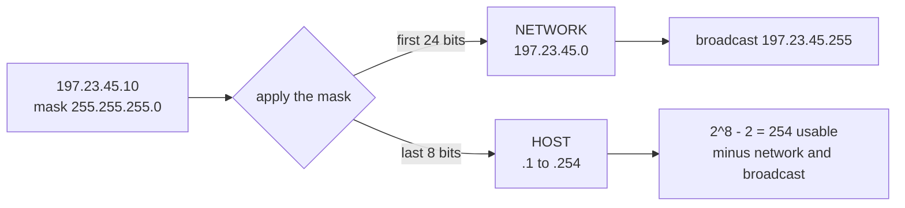
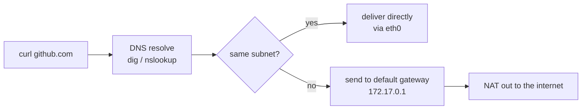

Networking – Learning Notes
===========================

Name: Anshul Mohanty    Roll No: 24BCS10191

## In one line

The subnet mask is the only thing that decides where the network part of an address ends and
the host part begins.

## The picture

What happens when a container calls out:

## Mental model

| Class | First octet | Default mask | Host bits |
|---|---|---|---|
| A | 1 – 126 | `255.0.0.0` (/8) | 24 |
| B | 128 – 191 | `255.255.0.0` (/16) | 16 |
| C | 192 – 223 | `255.255.255.0` (/24) | 8 |

| Command | Answers |
|---|---|
| `ip addr` | What is my address? |
| `ip route` | Where do packets go? |
| `dig +short` | What does this name resolve to? |
| `ping` | Is it reachable at all? |
| `ss -tlnp` | What is listening, and **which process**? |
| `curl -I` | Does HTTP work, headers only? |

## Gotchas

- Usable hosts is always `2^host_bits - 2` — the first address is the network, the last is
  the broadcast, and neither can be assigned.
- Private ranges (`10.x`, `172.16–31.x`, `192.168.x`) are not internet-routable, which is why
  a container on `172.17.0.2` needs NAT to reach anything outside.
- **A tool timing out does not mean the network is broken.** My `traceroute` showed `* * *`
  after hop 1 while `ping` and `curl` both succeeded — Docker's NAT swallows the intermediate
  ICMP replies. Symptom, not cause.
- `ss -tuln` on an idle box legitimately shows nothing. Absence of output is not an error.
- `ss -tlnp` beats `ss -tuln` when debugging, because "which process owns this port" is
  usually the real question.
