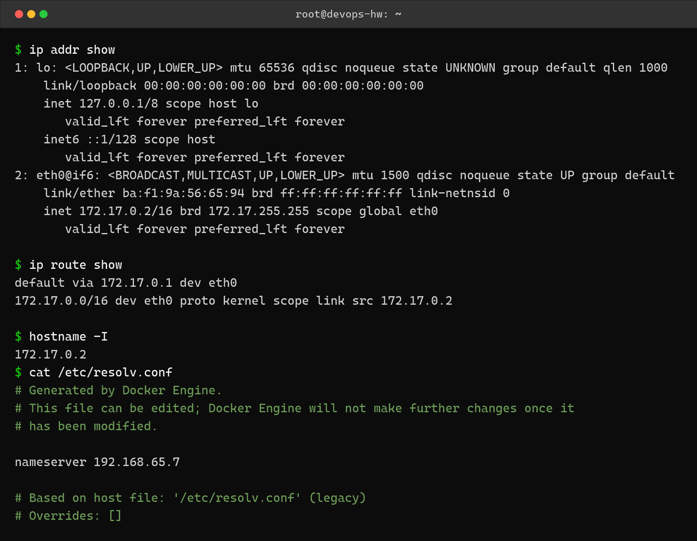
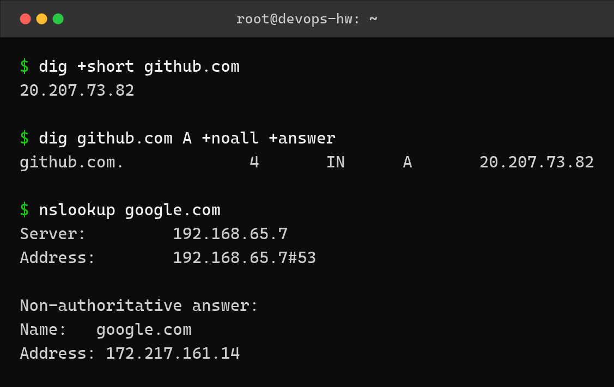
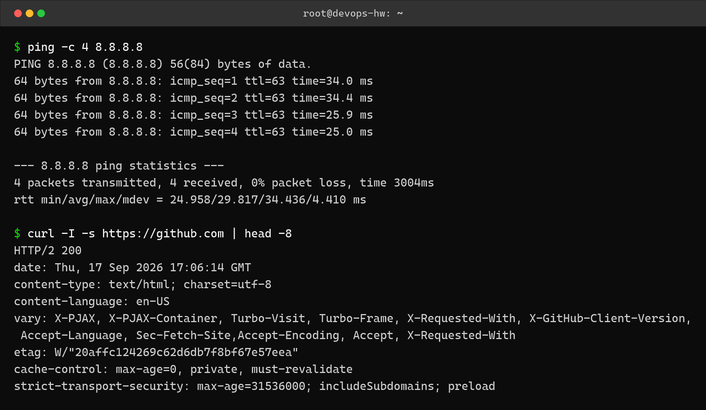
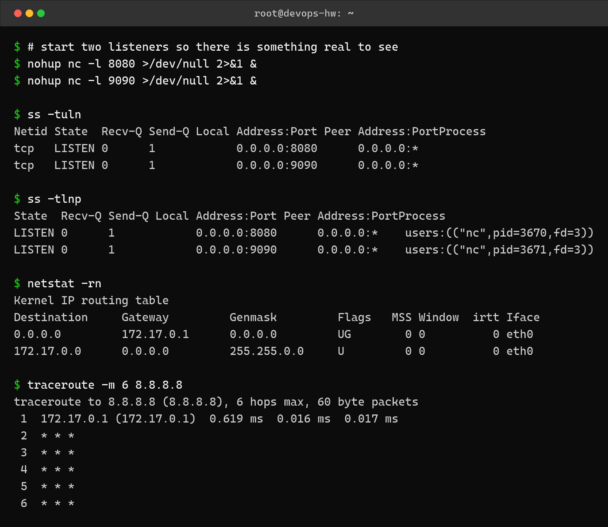

Networking – Homework
=====================

Name: Anshul Mohanty    Roll No: 24BCS10191    Section: A

See also: [LEARNING.md](LEARNING.md) - diagram and revision notes for this topic.

Environment: Ubuntu 24.04 container on Docker Desktop. The container sits on Docker's default
bridge network `172.17.0.0/16`, with the gateway `172.17.0.1` acting as its router.

---

Task 1: IP addressing and subnetting
------------------------------------

An IP address is a 32-bit number that identifies a device on a network. The subnet mask
splits it into a **network part** and a **host part**.

| Class | First octet | Default mask | Network bits | Host bits |
|---|---|---|---|---|
| A | 1 – 126 | `255.0.0.0` (/8) | 8 | 24 |
| B | 128 – 191 | `255.255.0.0` (/16) | 16 | 16 |
| C | 192 – 223 | `255.255.255.0` (/24) | 24 | 8 |
| D | 224 – 239 | multicast | – | – |

**Worked example – `197.23.45.10` with mask `255.255.255.0`**

- First octet is 197, so this is **Class C**, a /24.
- Network bits = 24, host bits = 32 − 24 = **8**.
- Network address = `197.23.45.0`
- Broadcast address = `197.23.45.255`
- Total addresses = 2^8 = 256
- Usable hosts = 2^8 − 2 = **254** (minus network and broadcast)

**Worked example – `120.27.1.0/8`**

- First octet is 120, so **Class A**, mask `255.0.0.0`.
- Network bits = 8, host bits = **24**.
- Usable hosts = 2^24 − 2 = **16,777,214**
- Broadcast = `120.255.255.255`

**Private ranges** (not routable on the internet):

| Class | Range |
|---|---|
| A | `10.0.0.0` – `10.255.255.255` |
| B | `172.16.0.0` – `172.31.255.255` |
| C | `192.168.0.0` – `192.168.255.255` |

The container's own address `172.17.0.2` falls inside the Class B private range, which is
why it needs NAT to reach the internet.

---

Task 2: Interfaces and routing
------------------------------

```bash
ip addr show
ip route show
hostname -I
cat /etc/resolv.conf
```



```
$ ip addr show
1: lo: <LOOPBACK,UP,LOWER_UP> mtu 65536 qdisc noqueue state UNKNOWN group default qlen 1000
    link/loopback 00:00:00:00:00:00 brd 00:00:00:00:00:00
    inet 127.0.0.1/8 scope host lo
       valid_lft forever preferred_lft forever
    inet6 ::1/128 scope host 
       valid_lft forever preferred_lft forever
2: eth0@if6: <BROADCAST,MULTICAST,UP,LOWER_UP> mtu 1500 qdisc noqueue state UP group default 
    link/ether ba:f1:9a:56:65:94 brd ff:ff:ff:ff:ff:ff link-netnsid 0
    inet 172.17.0.2/16 brd 172.17.255.255 scope global eth0
       valid_lft forever preferred_lft forever

$ ip route show
default via 172.17.0.1 dev eth0 
172.17.0.0/16 dev eth0 proto kernel scope link src 172.17.0.2 

$ hostname -I
172.17.0.2 
$ cat /etc/resolv.conf
# Generated by Docker Engine.
# This file can be edited; Docker Engine will not make further changes once it
# has been modified.

nameserver 192.168.65.7

# Based on host file: '/etc/resolv.conf' (legacy)
# Overrides: []
```

`eth0` has `172.17.0.2/16`. The default route sends anything not on that subnet to
`172.17.0.1`, which is the Docker bridge gateway.

---

Task 3: DNS lookups
-------------------

```bash
dig +short github.com
dig github.com A +noall +answer
nslookup google.com
```



```
$ dig +short github.com
20.207.73.82

$ dig github.com A +noall +answer
github.com.		4	IN	A	20.207.73.82

$ nslookup google.com
Server:		192.168.65.7
Address:	192.168.65.7#53

Non-authoritative answer:
Name:	google.com
Address: 172.217.161.14

```

`dig +short` gives just the address, which is handy in scripts. The full form also shows the
TTL (`4` seconds here). `nslookup` reports *Non-authoritative answer* because the reply came
from the local resolver's cache, not from Google's own nameserver.

---

Task 4: Connectivity testing
----------------------------

```bash
ping -c 4 8.8.8.8
curl -I -s https://github.com | head -8
```



```
$ ping -c 4 8.8.8.8
PING 8.8.8.8 (8.8.8.8) 56(84) bytes of data.
64 bytes from 8.8.8.8: icmp_seq=1 ttl=63 time=34.0 ms
64 bytes from 8.8.8.8: icmp_seq=2 ttl=63 time=34.4 ms
64 bytes from 8.8.8.8: icmp_seq=3 ttl=63 time=25.9 ms
64 bytes from 8.8.8.8: icmp_seq=4 ttl=63 time=25.0 ms

--- 8.8.8.8 ping statistics ---
4 packets transmitted, 4 received, 0% packet loss, time 3004ms
rtt min/avg/max/mdev = 24.958/29.817/34.436/4.410 ms

$ curl -I -s https://github.com | head -8
HTTP/2 200 
date: Thu, 17 Sep 2026 17:06:14 GMT
content-type: text/html; charset=utf-8
content-language: en-US
vary: X-PJAX, X-PJAX-Container, Turbo-Visit, Turbo-Frame, X-Requested-With, X-GitHub-Client-Version, Accept-Language, Sec-Fetch-Site,Accept-Encoding, Accept, X-Requested-With
etag: W/"20affc124269c62d6db7f8bf67e57eea"
cache-control: max-age=0, private, must-revalidate
strict-transport-security: max-age=31536000; includeSubdomains; preload
```

All 4 packets returned, 0% loss, average round trip about 30 ms. `curl -I` fetches only the
response headers - `HTTP/2 200` confirms the request succeeded without downloading the page.

---

Task 5: Listening ports and path tracing
----------------------------------------

An empty container has nothing listening, so I started two `nc` listeners first to give
`ss` something real to report.

```bash
nohup nc -l 8080 >/dev/null 2>&1 &
nohup nc -l 9090 >/dev/null 2>&1 &
ss -tuln
ss -tlnp
netstat -rn
traceroute -m 6 8.8.8.8
```



```
$ # start two listeners so there is something real to see
$ nohup nc -l 8080 >/dev/null 2>&1 &
$ nohup nc -l 9090 >/dev/null 2>&1 &

$ ss -tuln
Netid State  Recv-Q Send-Q Local Address:Port Peer Address:PortProcess
tcp   LISTEN 0      1            0.0.0.0:8080      0.0.0.0:*          
tcp   LISTEN 0      1            0.0.0.0:9090      0.0.0.0:*          

$ ss -tlnp
State  Recv-Q Send-Q Local Address:Port Peer Address:PortProcess                      
LISTEN 0      1            0.0.0.0:8080      0.0.0.0:*    users:(("nc",pid=3670,fd=3))
LISTEN 0      1            0.0.0.0:9090      0.0.0.0:*    users:(("nc",pid=3671,fd=3))

$ netstat -rn
Kernel IP routing table
Destination     Gateway         Genmask         Flags   MSS Window  irtt Iface
0.0.0.0         172.17.0.1      0.0.0.0         UG        0 0          0 eth0
172.17.0.0      0.0.0.0         255.255.0.0     U         0 0          0 eth0

$ traceroute -m 6 8.8.8.8
traceroute to 8.8.8.8 (8.8.8.8), 6 hops max, 60 byte packets
 1  172.17.0.1 (172.17.0.1)  0.619 ms  0.016 ms  0.017 ms
 2  * * *
 3  * * *
 4  * * *
 5  * * *
 6  * * *
```

`ss -tlnp` adds the process column, showing exactly which PID owns each port - that is how I
would find what is occupying a port that a service cannot bind to.

**About the `* * *` in traceroute:** only the first hop (the Docker bridge gateway
`172.17.0.1`) answers. Docker Desktop's NAT layer does not forward the ICMP "time exceeded"
replies back into the container, so every hop after that times out. The route still works -
`ping` and `curl` both succeeded - the intermediate routers just stay invisible from inside
a container.

---

What I understood
-----------------

- The subnet mask is what decides where the network part ends and the host part begins, and
  the usable host count is always 2^(host bits) − 2 because the first and last addresses are
  the network and broadcast addresses.
- `ip addr` and `ip route` are the modern replacements for `ifconfig` and `route`; the
  default route is the one that matters for anything leaving the local subnet.
- `dig +short` is for scripts, full `dig` is for debugging, because the TTL and the answer
  section tell you whether you are looking at a cached or a fresh record.
- `ss -tlnp` is better than plain `ss -tuln` when troubleshooting, because knowing *which
  process* holds a port is usually the actual question.
- A tool timing out does not always mean the network is broken. traceroute failing while
  ping succeeds told me the packets get through but the intermediate ICMP replies are being
  swallowed by NAT.
