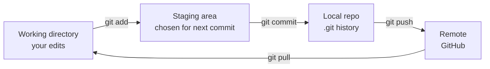
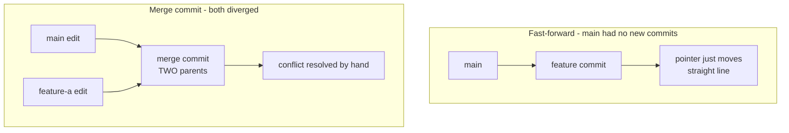

Git and GitHub – Learning Notes
===============================

Name: Anshul Mohanty    Roll No: 24BCS10191

## In one line

A commit is a **snapshot**, not a diff, and the staging area is how you choose what goes into
that snapshot.

## The picture

Fast-forward vs a real merge:

## Mental model

| State | Meaning | Shown by |
|---|---|---|
| Untracked | Git has never seen it | `git status` |
| Modified | Changed, not staged | `git status` |
| Staged | Will be in the next commit | `git diff --staged` |
| Committed | Safely in history | `git log` |

| Merge type | When | Result |
|---|---|---|
| **Fast-forward** | Target branch has no new commits | Pointer moves, straight line |
| **Merge commit** | Both branches diverged | New commit with **two parents** |
| **Conflict** | Both changed the *same line* | Marked `UU`, you decide |

## Gotchas

- A conflict is **not an error**. Git is saying it cannot pick between two edits to the same
  line, so it hands the choice to you.
- Resolving means: edit the file, delete the `<<<<<<<`, `=======`, `>>>>>>>` markers, then
  `git add` to signal it is settled. Forgetting the markers commits them into the code.
- `git commit -am` only stages files git **already tracks**. A brand new file is silently
  skipped and needs an explicit `git add`.
- Fast-forward merges leave a straight-line graph, which is why a merge can seem to "not show
  up" — nothing had diverged, so there was nothing to record.
- `.gitignore` only affects **untracked** files. Once a file has been committed, adding it to
  `.gitignore` changes nothing — it stays tracked until `git rm --cached` removes it.
