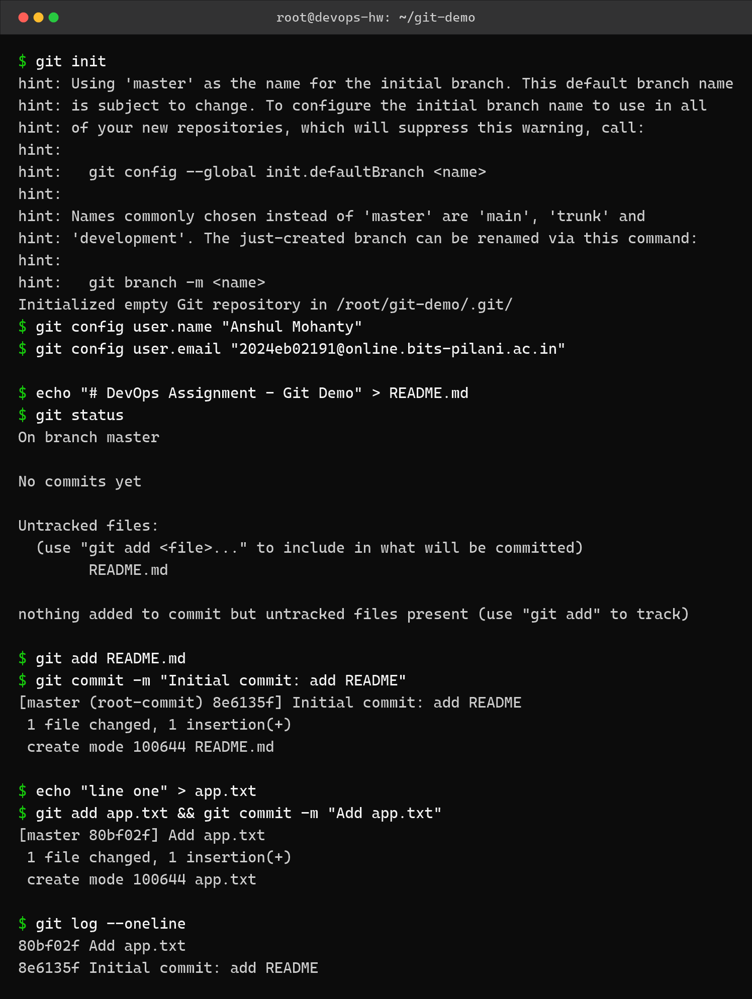
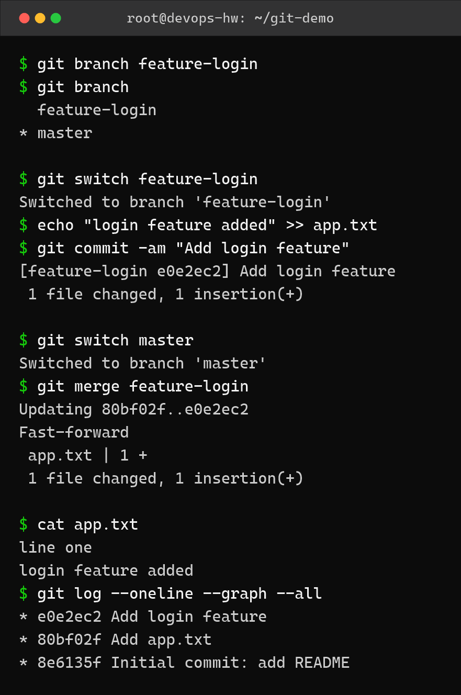
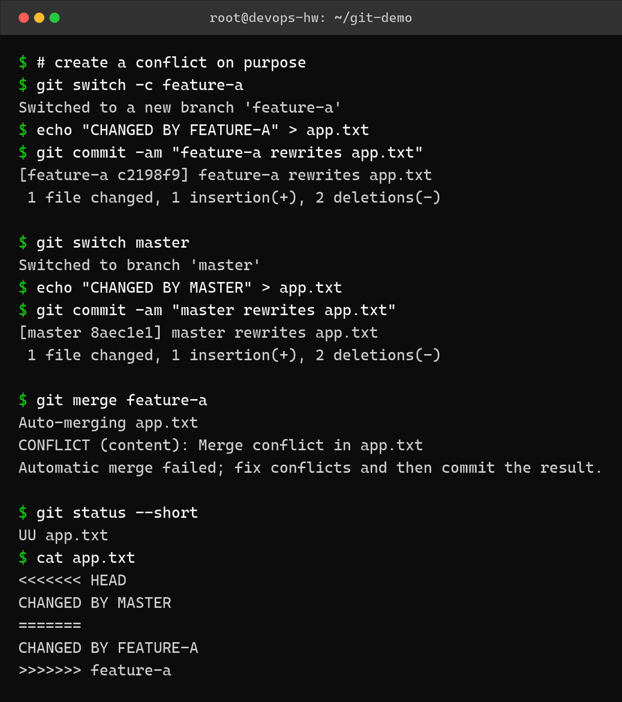
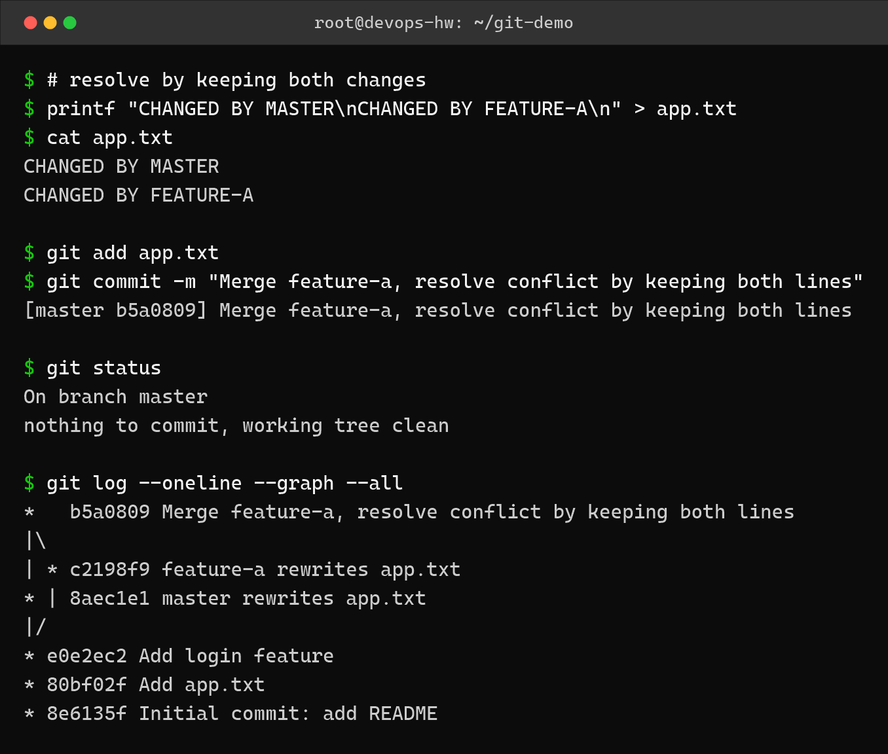

Git and GitHub – Homework
=========================

Name: Anshul Mohanty    Roll No: 24BCS10191    Section: A

See also: [LEARNING.md](LEARNING.md) - diagram and revision notes for this topic.

Environment: Ubuntu 24.04 container, git 2.43. Everything below was run in a throwaway repo
at `~/git-demo` so the assignment repo itself stays clean.

---

Task 1: Initialise a repository and make commits
------------------------------------------------

| Command | What it does |
|---|---|
| `git init` | Creates the `.git` directory and starts tracking |
| `git config user.name/user.email` | Sets the identity recorded in each commit |
| `git status` | Shows staged, unstaged and untracked files |
| `git add <file>` | Moves changes into the staging area |
| `git commit -m "msg"` | Records the staged snapshot |
| `git log --oneline` | Compact history |

```bash
git init
git config user.name "Anshul Mohanty"
git config user.email "2024eb02191@online.bits-pilani.ac.in"
echo "# DevOps Assignment - Git Demo" > README.md
git add README.md
git commit -m "Initial commit: add README"
git log --oneline
```



```
$ git init
hint: Using 'master' as the name for the initial branch. This default branch name
hint: is subject to change. To configure the initial branch name to use in all
hint: of your new repositories, which will suppress this warning, call:
hint: 
hint: 	git config --global init.defaultBranch <name>
hint: 
hint: Names commonly chosen instead of 'master' are 'main', 'trunk' and
hint: 'development'. The just-created branch can be renamed via this command:
hint: 
hint: 	git branch -m <name>
Initialized empty Git repository in /root/git-demo/.git/
$ git config user.name "Anshul Mohanty"
$ git config user.email "2024eb02191@online.bits-pilani.ac.in"

$ echo "# DevOps Assignment - Git Demo" > README.md
$ git status
On branch master

No commits yet

Untracked files:
  (use "git add <file>..." to include in what will be committed)
	README.md

nothing added to commit but untracked files present (use "git add" to track)

$ git add README.md
$ git commit -m "Initial commit: add README"
[master (root-commit) 8e6135f] Initial commit: add README
 1 file changed, 1 insertion(+)
 create mode 100644 README.md

$ echo "line one" > app.txt
$ git add app.txt && git commit -m "Add app.txt"
[master 80bf02f] Add app.txt
 1 file changed, 1 insertion(+)
 create mode 100644 app.txt

$ git log --oneline
80bf02f Add app.txt
8e6135f Initial commit: add README
```

The three states are visible here: `README.md` starts as **untracked**, `git add` makes it
**staged**, and `git commit` makes it **committed**.

---

Task 2: Branching and merging
-----------------------------

```bash
git branch feature-login
git switch feature-login
echo "login feature added" >> app.txt
git commit -am "Add login feature"
git switch master
git merge feature-login
git log --oneline --graph --all
```



```
$ git branch feature-login
$ git branch
  feature-login
* master

$ git switch feature-login
Switched to branch 'feature-login'
$ echo "login feature added" >> app.txt
$ git commit -am "Add login feature"
[feature-login e0e2ec2] Add login feature
 1 file changed, 1 insertion(+)

$ git switch master
Switched to branch 'master'
$ git merge feature-login
Updating 80bf02f..e0e2ec2
Fast-forward
 app.txt | 1 +
 1 file changed, 1 insertion(+)

$ cat app.txt
line one
login feature added
$ git log --oneline --graph --all
* e0e2ec2 Add login feature
* 80bf02f Add app.txt
* 8e6135f Initial commit: add README
```

This produced a **fast-forward** merge (`Updating 80bf02f..e0e2ec2`). Because `master` had no
new commits of its own, git just moved the branch pointer forward instead of creating a merge
commit, which is why the graph is still a straight line.

---

Task 3: Creating and resolving a merge conflict
-----------------------------------------------

To get a real conflict, both branches had to change **the same line of the same file**.

```bash
git switch -c feature-a
echo "CHANGED BY FEATURE-A" > app.txt
git commit -am "feature-a rewrites app.txt"

git switch master
echo "CHANGED BY MASTER" > app.txt
git commit -am "master rewrites app.txt"

git merge feature-a          # conflict
```



```
$ # create a conflict on purpose
$ git switch -c feature-a
Switched to a new branch 'feature-a'
$ echo "CHANGED BY FEATURE-A" > app.txt
$ git commit -am "feature-a rewrites app.txt"
[feature-a c2198f9] feature-a rewrites app.txt
 1 file changed, 1 insertion(+), 2 deletions(-)

$ git switch master
Switched to branch 'master'
$ echo "CHANGED BY MASTER" > app.txt
$ git commit -am "master rewrites app.txt"
[master 8aec1e1] master rewrites app.txt
 1 file changed, 1 insertion(+), 2 deletions(-)

$ git merge feature-a
Auto-merging app.txt
CONFLICT (content): Merge conflict in app.txt
Automatic merge failed; fix conflicts and then commit the result.

$ git status --short
UU app.txt
$ cat app.txt
<<<<<<< HEAD
CHANGED BY MASTER
=======
CHANGED BY FEATURE-A
>>>>>>> feature-a
```

`git status --short` shows `UU app.txt` - **U**nmerged on both sides. Git wrote conflict
markers into the file: `<<<<<<< HEAD` is my branch's version, `>>>>>>> feature-a` is the
incoming version, separated by `=======`.

### Resolving it

```bash
# edit app.txt, remove the markers, keep what you want
git add app.txt
git commit -m "Merge feature-a, resolve conflict by keeping both lines"
git log --oneline --graph --all
```



```
$ # resolve by keeping both changes
$ printf "CHANGED BY MASTER\nCHANGED BY FEATURE-A\n" > app.txt
$ cat app.txt
CHANGED BY MASTER
CHANGED BY FEATURE-A

$ git add app.txt
$ git commit -m "Merge feature-a, resolve conflict by keeping both lines"
[master b5a0809] Merge feature-a, resolve conflict by keeping both lines

$ git status
On branch master
nothing to commit, working tree clean

$ git log --oneline --graph --all
*   b5a0809 Merge feature-a, resolve conflict by keeping both lines
|\  
| * c2198f9 feature-a rewrites app.txt
* | 8aec1e1 master rewrites app.txt
|/  
* e0e2ec2 Add login feature
* 80bf02f Add app.txt
* 8e6135f Initial commit: add README
```

This time the graph actually branches and rejoins, because a real **merge commit**
(`b5a0809`) was created with two parents.

---

Common git commands
-------------------

| Command | Use |
|---|---|
| `git clone <url>` | Copy a remote repo locally |
| `git status` | What has changed |
| `git add .` / `git add -p` | Stage everything / stage interactively |
| `git commit -m "msg"` | Commit staged changes |
| `git commit -am "msg"` | Stage tracked files and commit in one step |
| `git log --oneline --graph --all` | Visual history of all branches |
| `git diff` / `git diff --staged` | Unstaged / staged changes |
| `git branch` / `git branch -d name` | List / delete a branch |
| `git switch -c name` | Create and switch to a branch |
| `git merge <branch>` | Merge a branch into the current one |
| `git restore <file>` | Discard local changes to a file |
| `git reset --soft HEAD~1` | Undo last commit, keep the changes staged |
| `git revert <commit>` | Undo a commit by adding an opposite commit |
| `git remote -v` | Show configured remotes |
| `git push -u origin main` | Push and set the upstream branch |
| `git pull` | Fetch and merge from the remote |
| `git stash` / `git stash pop` | Shelve work temporarily / bring it back |

---

What I understood
-----------------

- A commit is a snapshot, not a diff, and the staging area is what lets me choose exactly
  which changes go into that snapshot.
- A fast-forward merge happens when the target branch has no commits of its own - git just
  moves the pointer. A real merge commit only appears when both branches have diverged.
- A conflict is not an error. Git is saying it cannot decide which of two changes to the same
  line should win, so it hands the decision to me and marks the file `UU`.
- Resolving a conflict means editing the file, deleting the `<<<<<<<`, `=======` and `>>>>>>>`
  markers, then `git add` to tell git the file is settled, and committing.
- `git log --oneline --graph --all` is the fastest way to actually see branch structure
  instead of guessing at it.
- `git commit -am` only stages files git already tracks, so a brand new file still needs an
  explicit `git add`.
