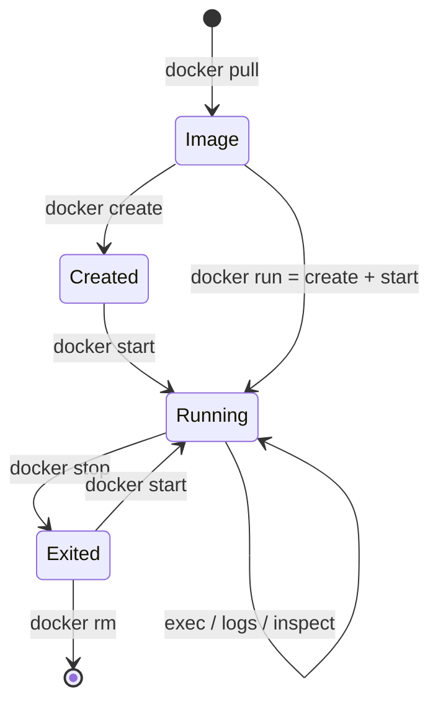
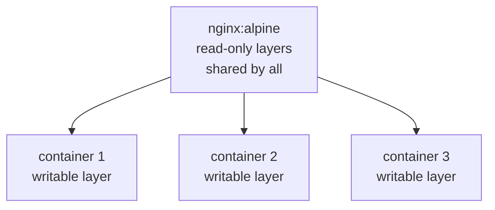

Docker Fundamentals – Learning Notes
====================================

Name: Anshul Mohanty    Roll No: 24BCS10191

## In one line

An image is the read-only template; a container is a running instance of it with a thin
writable layer on top.

## The picture

`Exited` is the state people forget — the container is stopped but still on disk.

Layers are shared, writable layers are not:

## Mental model

| | Image | Container |
|---|---|---|
| Mutable | No | Yes, thin writable layer |
| Listed by | `docker images` | `docker ps` / `docker ps -a` |
| Analogy | The class | The object |

| Command | Does |
|---|---|
| `docker run -d -p 8081:80` | Detached, **host port : container port** |
| `docker exec <n> <cmd>` | Run a command in a *running* container |
| `docker logs <n>` | Its stdout and stderr |
| `docker inspect -f` | Pull one field instead of the whole JSON |
| `docker stop` vs `docker rm` | Stop keeps it, rm deletes it |

## Gotchas

- `docker stop` does **not** remove anything. `docker ps -a` still lists it as `Exited (0)`,
  writable layer and all — this is how disk quietly fills up.
- `-p 8081:80` is host:container. The container always listens on its own port; only the left
  number is visible from the host.
- `docker run` silently pulls a missing image first, so the very first run is slow for reasons
  that have nothing to do with your application.
- **`inspect` field paths are not stable across versions.**
  `.NetworkSettings.IPAddress` returned empty on Docker 29; the working path was
  `.NetworkSettings.Networks.bridge.IPAddress`.
- Anything written inside a container without a volume dies with the container.
