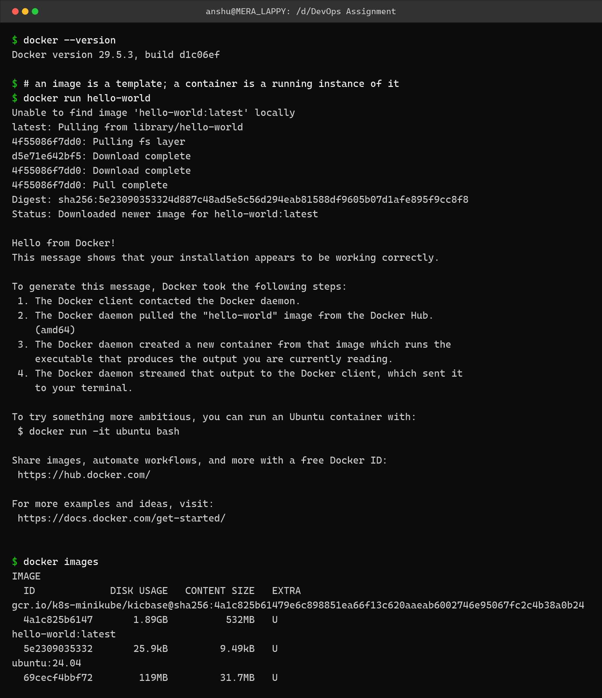
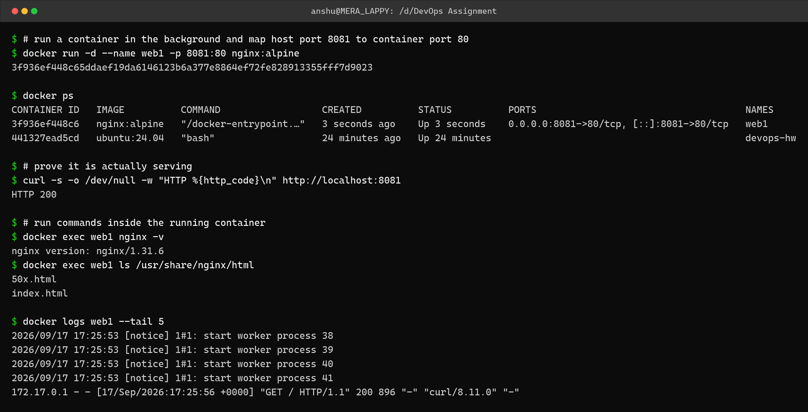
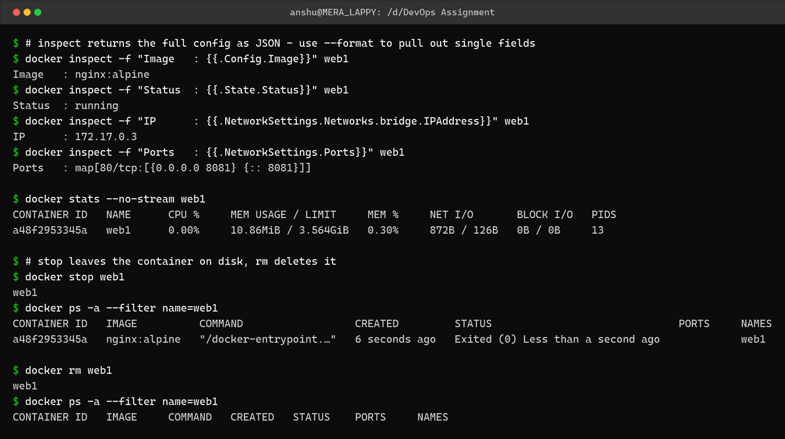

Docker Fundamentals – Homework
==============================

Name: Anshul Mohanty    Roll No: 24BCS10191

See also: [LEARNING.md](LEARNING.md) - diagram and revision notes for this topic.

Environment: Docker Engine 29.5.3 via Docker Desktop on Windows 11. Commands were run from
Git Bash on the host.

---

Image vs container
------------------

| | Image | Container |
|---|---|---|
| What it is | A read-only template - filesystem layers plus metadata | A running instance of an image |
| State | Immutable | Has state, can be started/stopped/deleted |
| Storage | Shared between all containers using it | Thin writable layer on top of the image |
| Command | `docker images` | `docker ps` |
| Analogy | The class | The object |

Task 1: Docker version and the first container
----------------------------------------------

```bash
docker --version
docker run hello-world
docker images
```



```
$ docker --version
Docker version 29.5.3, build d1c06ef

$ # an image is a template; a container is a running instance of it
$ docker run hello-world
Unable to find image 'hello-world:latest' locally
latest: Pulling from library/hello-world
4f55086f7dd0: Pulling fs layer
d5e71e642bf5: Download complete
4f55086f7dd0: Download complete
4f55086f7dd0: Pull complete
Digest: sha256:5e23090353324d887c48ad5e5c56d294eab81588df9605b07d1afe895f9cc8f8
Status: Downloaded newer image for hello-world:latest

Hello from Docker!
This message shows that your installation appears to be working correctly.

To generate this message, Docker took the following steps:
 1. The Docker client contacted the Docker daemon.
 2. The Docker daemon pulled the "hello-world" image from the Docker Hub.
    (amd64)
 3. The Docker daemon created a new container from that image which runs the
    executable that produces the output you are currently reading.
 4. The Docker daemon streamed that output to the Docker client, which sent it
    to your terminal.

To try something more ambitious, you can run an Ubuntu container with:
 $ docker run -it ubuntu bash

Share images, automate workflows, and more with a free Docker ID:
 https://hub.docker.com/

For more examples and ideas, visit:
 https://docs.docker.com/get-started/


$ docker images
IMAGE                                                                                                 ID             DISK USAGE   CONTENT SIZE   EXTRA
gcr.io/k8s-minikube/kicbase@sha256:4a1c825b61479e6c898851ea66f13c620aaeab6002746e95067fc2c4b38a0b24   4a1c825b6147       1.89GB          532MB   U    
hello-world:latest                                                                                    5e2309035332       25.9kB         9.49kB   U    
ubuntu:24.04                                                                                          69cecf4bbf72        119MB         31.7MB   U    
```

`hello-world` was not on the machine, so Docker pulled it first (`Unable to find image ...
locally`), then created a container from it. The message printed by the container describes
exactly those steps.

---

Task 2: Running, listing, executing and logging
-----------------------------------------------

| Command | What it does |
|---|---|
| `docker run -d --name web1 -p 8081:80 nginx:alpine` | Run detached, map host 8081 to container 80 |
| `docker ps` | List running containers |
| `docker ps -a` | Include stopped containers |
| `docker exec <name> <cmd>` | Run a command inside a running container |
| `docker logs <name>` | Show the container's stdout/stderr |



```
$ # run a container in the background and map host port 8081 to container port 80
$ docker run -d --name web1 -p 8081:80 nginx:alpine
3f936ef448c65ddaef19da6146123b6a377e8864ef72fe828913355fff7d9023

$ docker ps
CONTAINER ID   IMAGE          COMMAND                  CREATED          STATUS          PORTS                                     NAMES
3f936ef448c6   nginx:alpine   "/docker-entrypoint.…"   3 seconds ago    Up 3 seconds    0.0.0.0:8081->80/tcp, [::]:8081->80/tcp   web1
441327ead5cd   ubuntu:24.04   "bash"                   24 minutes ago   Up 24 minutes                                             devops-hw

$ # prove it is actually serving
$ curl -s -o /dev/null -w "HTTP %{http_code}\n" http://localhost:8081
HTTP 200

$ # run commands inside the running container
$ docker exec web1 nginx -v
nginx version: nginx/1.31.6
$ docker exec web1 ls /usr/share/nginx/html
50x.html
index.html

$ docker logs web1 --tail 5
2026/09/17 17:25:53 [notice] 1#1: start worker process 38
2026/09/17 17:25:53 [notice] 1#1: start worker process 39
2026/09/17 17:25:53 [notice] 1#1: start worker process 40
2026/09/17 17:25:53 [notice] 1#1: start worker process 41
172.17.0.1 - - [17/Sep/2026:17:25:56 +0000] "GET / HTTP/1.1" 200 896 "-" "curl/8.11.0" "-"
```

The `curl` returned **HTTP 200**, and that same request then appears at the bottom of
`docker logs` as an nginx access-log line - proof the traffic actually reached the container
through the port mapping.

---

Task 3: Inspecting, stopping and removing
-----------------------------------------

```bash
docker inspect -f "{{.State.Status}}" web1
docker stats --no-stream web1
docker stop web1      # container stops but still exists
docker rm web1        # container is deleted
```



```
$ # inspect returns the full config as JSON - use --format to pull out single fields
$ docker inspect -f "Image   : {{.Config.Image}}" web1
Image   : nginx:alpine
$ docker inspect -f "Status  : {{.State.Status}}" web1
Status  : running
$ docker inspect -f "IP      : {{.NetworkSettings.Networks.bridge.IPAddress}}" web1
IP      : 172.17.0.3
$ docker inspect -f "Ports   : {{.NetworkSettings.Ports}}" web1
Ports   : map[80/tcp:[{0.0.0.0 8081} {:: 8081}]]

$ docker stats --no-stream web1
CONTAINER ID   NAME      CPU %     MEM USAGE / LIMIT     MEM %     NET I/O       BLOCK I/O   PIDS
a48f2953345a   web1      0.00%     10.86MiB / 3.564GiB   0.30%     872B / 126B   0B / 0B     13

$ # stop leaves the container on disk, rm deletes it
$ docker stop web1
web1
$ docker ps -a --filter name=web1
CONTAINER ID   IMAGE          COMMAND                  CREATED         STATUS                              PORTS     NAMES
a48f2953345a   nginx:alpine   "/docker-entrypoint.…"   6 seconds ago   Exited (0) Less than a second ago             web1

$ docker rm web1
web1
$ docker ps -a --filter name=web1
CONTAINER ID   IMAGE     COMMAND   CREATED   STATUS    PORTS     NAMES
```

After `docker stop`, `docker ps -a` still lists the container with status
**Exited (0)** - it is stopped, not gone. Only after `docker rm` does it disappear from
`docker ps -a` entirely.

---

Common Docker commands
----------------------

| Command | Use |
|---|---|
| `docker pull <image>` | Download an image |
| `docker images` | List local images |
| `docker rmi <image>` | Delete an image |
| `docker run -d -p h:c --name n ` | Run detached with a port mapping |
| `docker run -it  sh` | Run interactively with a shell |
| `docker ps` / `docker ps -a` | Running / all containers |
| `docker exec -it <n> sh` | Shell into a running container |
| `docker logs -f <n>` | Follow container logs |
| `docker inspect <n>` | Full JSON config |
| `docker stats` | Live resource usage |
| `docker stop` / `start` / `restart` | Lifecycle control |
| `docker rm <n>` / `docker rm -f <n>` | Remove / force remove |
| `docker system df` | Disk used by Docker |
| `docker system prune` | Clean up unused data |

---

What I understood
-----------------

- An image is the template and a container is a running instance of it. Many containers can
  share one image because each only adds a thin writable layer on top.
- `docker run` is really two steps - create a container from an image, then start it. If the
  image is missing locally, it silently pulls it first.
- `-p 8081:80` maps **host port : container port**. The container always listens on its own
  port; the left number is the only part the host sees.
- `docker stop` and `docker rm` are different things. Stopping keeps the container and its
  writable layer on disk, which is why `docker ps -a` still shows it as `Exited`.
- `docker inspect -f` with a Go template is much more practical than reading the whole JSON
  blob when I only want one field.
- Field paths in `inspect` are not stable across versions - `.NetworkSettings.IPAddress` was
  empty on Docker 29 and I had to use `.NetworkSettings.Networks.bridge.IPAddress` instead.
