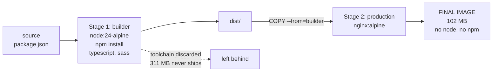

Dockerfiles and Images – Learning Notes
=======================================

Name: Anshul Mohanty    Roll No: 24BCS10191

## In one line

Each `FROM` starts a new stage, only the **last** stage ships, and `COPY --from=` is the
bridge that carries build artifacts across.

## The picture

## Mental model

| Concept | Point |
|---|---|
| Stage | Everything between one `FROM` and the next |
| `COPY --from=<stage>` | Pull a built artifact forward |
| `--target <stage>` | Build only one stage — how I measured the builder |
| Layer caching | Copy `package.json` and install **before** copying source, so editing code does not bust the dependency layer |

**Measured on this machine, not assumed:**

| Image | Size | Note |
|---|---|---|
| `singlestage-hello` | 253 MB | baseline |
| `multistage-hello` | 247 MB | only **6 MB** saved |
| `static-builderstage` | 311 MB | build stage alone |
| `static-multistage` | **102 MB** | **67% smaller** |

## Gotchas

- **Multi-stage is not automatically smaller.** On the assignment's own example it saved
  6 MB, because there were no devDependencies to discard and both stages shared
  `node:24-alpine`. An image can never be smaller than its base.
- The real saving comes from **changing the final base** (`node` → `nginx`) or dropping a
  genuine toolchain — not from the words "multi-stage".
- Proof the toolchain is gone: `docker exec static-site node --version` fails with
  *executable file not found*. If node were still inside, it would answer.
- Smaller is also safer — no compiler or package manager left in the running container to be
  abused.
- Port mapping is what let six apps with overlapping internal ports (3000, 8000, 8080, 80,
  80, 80) run simultaneously — each just got a different host port.
