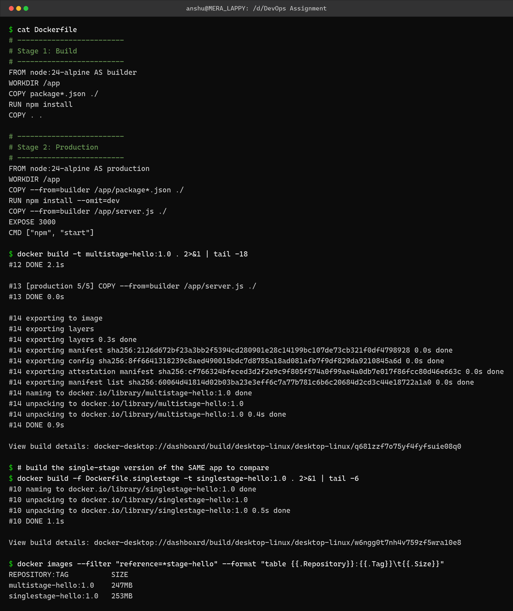
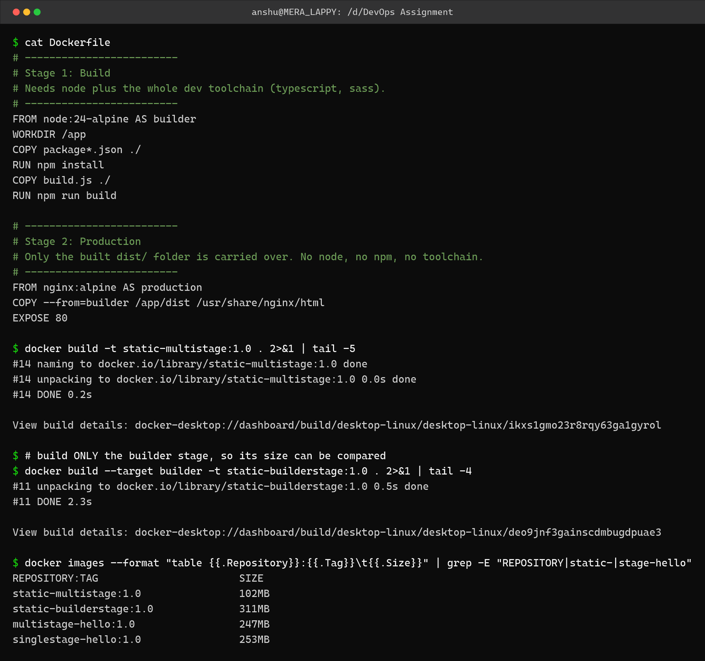
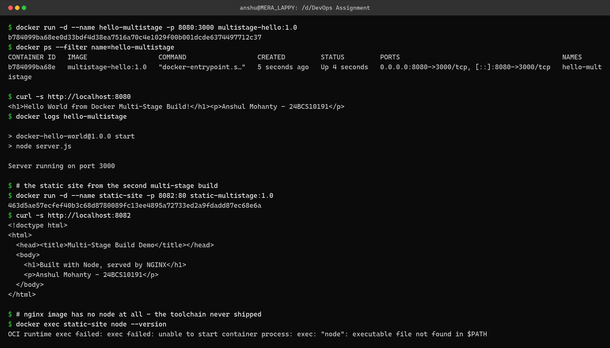
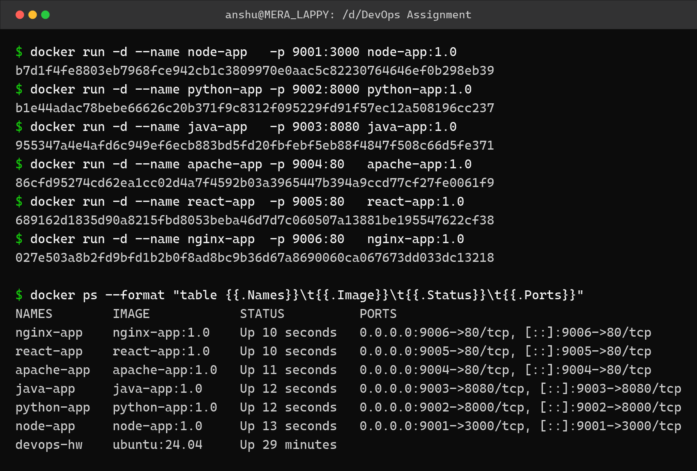
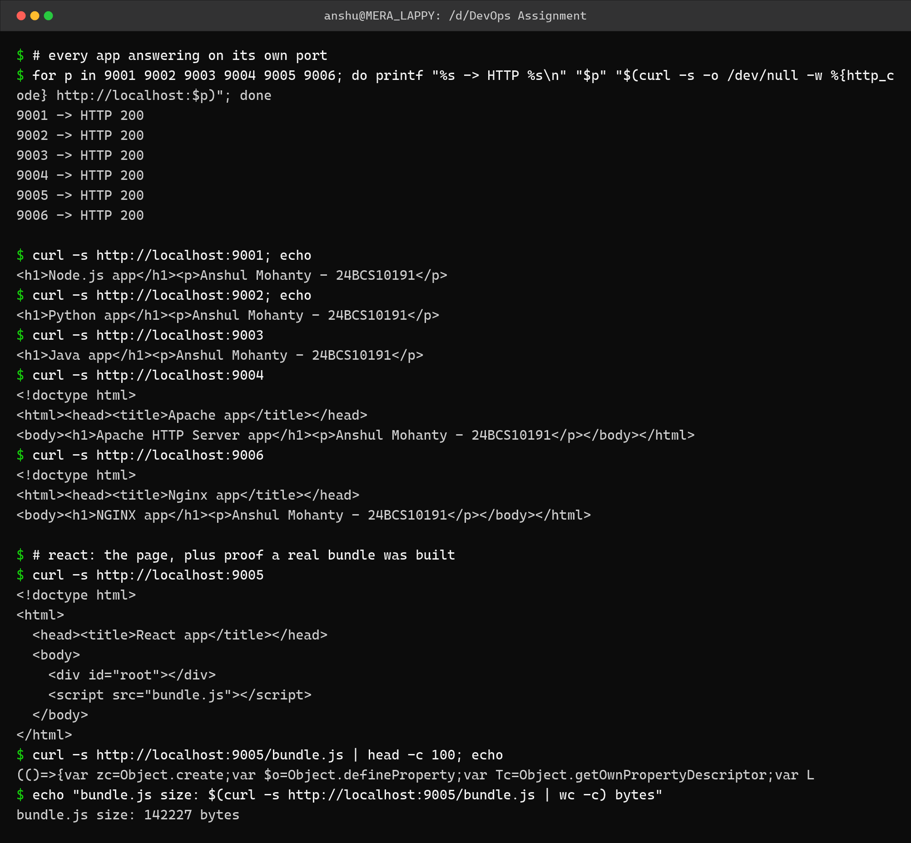

Dockerfiles and Images – Homework
=================================

Name: Anshul Mohanty    Roll No: 24BCS10191

Folder contents:

```
multistage-app/      Node + Express app, multi-stage and single-stage Dockerfiles
multistage-static/   Node build -> NGINX serve, where multi-stage actually pays off
apps/                The six application types (Node, Python, Java, Apache, React, NGINX)
```

---

Task 1: Multi-stage build
-------------------------

A multi-stage Dockerfile uses more than one `FROM`. Each `FROM` starts a new stage, and the
final image contains **only** what the last stage produced. `COPY --from=<stage>` is what
carries artifacts across.

### Dockerfile

```dockerfile
# -------------------------
# Stage 1: Build
# -------------------------
FROM node:24-alpine AS builder
WORKDIR /app
COPY package*.json ./
RUN npm install
COPY . .

# -------------------------
# Stage 2: Production
# -------------------------
FROM node:24-alpine AS production
WORKDIR /app
COPY --from=builder /app/package*.json ./
RUN npm install --omit=dev
COPY --from=builder /app/server.js ./
EXPOSE 3000
CMD ["npm", "start"]
```

### Build



```
$ cat Dockerfile
# -------------------------
# Stage 1: Build
# -------------------------
FROM node:24-alpine AS builder
WORKDIR /app
COPY package*.json ./
RUN npm install
COPY . .

# -------------------------
# Stage 2: Production
# -------------------------
FROM node:24-alpine AS production
WORKDIR /app
COPY --from=builder /app/package*.json ./
RUN npm install --omit=dev
COPY --from=builder /app/server.js ./
EXPOSE 3000
CMD ["npm", "start"]

$ docker build -t multistage-hello:1.0 . 2>&1 | tail -18
#12 DONE 2.1s

#13 [production 5/5] COPY --from=builder /app/server.js ./
#13 DONE 0.0s

#14 exporting to image
#14 exporting layers
#14 exporting layers 0.3s done
#14 exporting manifest sha256:2126d672bf23a3bb2f5394cd280901e28c14199bc107de73cb321f0df4798928 0.0s done
#14 exporting config sha256:8ff6641318239c8aed490015bdc7d8785a18ad081afb7f9df829da9210845a6d 0.0s done
#14 exporting attestation manifest sha256:cf766324bfeced3d2f2e9c9f805f574a0f99ae4a0db7e017f86fcc80d46e663c 0.0s done
#14 exporting manifest list sha256:60064d41814d02b03ba23e3eff6c7a77b781c6b6c20684d2cd3c44e18722a1a0 0.0s done
#14 naming to docker.io/library/multistage-hello:1.0 done
#14 unpacking to docker.io/library/multistage-hello:1.0
#14 unpacking to docker.io/library/multistage-hello:1.0 0.4s done
#14 DONE 0.9s

View build details: docker-desktop://dashboard/build/desktop-linux/desktop-linux/q681zzf7o75yf4fyfsuie08q0

$ # build the single-stage version of the SAME app to compare
$ docker build -f Dockerfile.singlestage -t singlestage-hello:1.0 . 2>&1 | tail -6
#10 naming to docker.io/library/singlestage-hello:1.0 done
#10 unpacking to docker.io/library/singlestage-hello:1.0
#10 unpacking to docker.io/library/singlestage-hello:1.0 0.5s done
#10 DONE 1.1s

View build details: docker-desktop://dashboard/build/desktop-linux/desktop-linux/w6ngg0t7nh4v759zf5wra10e8

$ docker images --filter "reference=*stage-hello" --format "table {{.Repository}}:{{.Tag}}\t{{.Size}}"
REPOSITORY:TAG          SIZE
multistage-hello:1.0    247MB
singlestage-hello:1.0   253MB
```

### An honest note on the size saving

The task expects multi-stage builds to produce a much smaller image. For **this particular
app** they barely do:

| Image | Size |
|---|---|
| `singlestage-hello:1.0` | 253 MB |
| `multistage-hello:1.0` | 247 MB |

Only **6 MB** saved. The reason is that this app has no real build step - the only dependency
is `express`, there are no devDependencies to throw away, and both stages use the *same*
`node:24-alpine` base. Multi-stage cannot shrink an image below its base image.

So I built a second example where the pattern actually matters: install a real toolchain
(`typescript`, `sass`), build static files with Node, then serve them from `nginx:alpine`.
The final image never contains Node at all.

```dockerfile
# -------------------------
# Stage 1: Build
# Needs node plus the whole dev toolchain (typescript, sass).
# -------------------------
FROM node:24-alpine AS builder
WORKDIR /app
COPY package*.json ./
RUN npm install
COPY build.js ./
RUN npm run build

# -------------------------
# Stage 2: Production
# Only the built dist/ folder is carried over. No node, no npm, no toolchain.
# -------------------------
FROM nginx:alpine AS production
COPY --from=builder /app/dist /usr/share/nginx/html
EXPOSE 80
```



```
$ cat Dockerfile
# -------------------------
# Stage 1: Build
# Needs node plus the whole dev toolchain (typescript, sass).
# -------------------------
FROM node:24-alpine AS builder
WORKDIR /app
COPY package*.json ./
RUN npm install
COPY build.js ./
RUN npm run build

# -------------------------
# Stage 2: Production
# Only the built dist/ folder is carried over. No node, no npm, no toolchain.
# -------------------------
FROM nginx:alpine AS production
COPY --from=builder /app/dist /usr/share/nginx/html
EXPOSE 80

$ docker build -t static-multistage:1.0 . 2>&1 | tail -5
#14 naming to docker.io/library/static-multistage:1.0 done
#14 unpacking to docker.io/library/static-multistage:1.0 0.0s done
#14 DONE 0.2s

View build details: docker-desktop://dashboard/build/desktop-linux/desktop-linux/ikxs1gmo23r8rqy63ga1gyrol

$ # build ONLY the builder stage, so its size can be compared
$ docker build --target builder -t static-builderstage:1.0 . 2>&1 | tail -4
#11 unpacking to docker.io/library/static-builderstage:1.0 0.5s done
#11 DONE 2.3s

View build details: docker-desktop://dashboard/build/desktop-linux/desktop-linux/deo9jnf3gainscdmbugdpuae3

$ docker images --format "table {{.Repository}}:{{.Tag}}\t{{.Size}}" | grep -E "REPOSITORY|static-|stage-hello"
REPOSITORY:TAG                       SIZE
static-multistage:1.0                102MB
static-builderstage:1.0              311MB
multistage-hello:1.0                 247MB
singlestage-hello:1.0                253MB
```

| Image | Size |
|---|---|
| `static-builderstage:1.0` (build stage only) | 311 MB |
| `static-multistage:1.0` (final image) | **102 MB** |

That is a **67% reduction**, and it is the honest version of the lesson: multi-stage helps in
proportion to how much build tooling you can leave behind.

### Running the built images



```
$ docker run -d --name hello-multistage -p 8080:3000 multistage-hello:1.0
b784099ba68ee0d33bdf4d38ea7516a70c4e1029f00b001dcde6374497712c37
$ docker ps --filter name=hello-multistage
CONTAINER ID   IMAGE                  COMMAND                  CREATED         STATUS         PORTS                                         NAMES
b784099ba68e   multistage-hello:1.0   "docker-entrypoint.s…"   5 seconds ago   Up 4 seconds   0.0.0.0:8080->3000/tcp, [::]:8080->3000/tcp   hello-multistage

$ curl -s http://localhost:8080
<h1>Hello World from Docker Multi-Stage Build!</h1><p>Anshul Mohanty - 24BCS10191</p>
$ docker logs hello-multistage

> docker-hello-world@1.0.0 start
> node server.js

Server running on port 3000

$ # the static site from the second multi-stage build
$ docker run -d --name static-site -p 8082:80 static-multistage:1.0
463d5ae57ecfef40b3c68d8780089fc13ee4895a72733ed2a9fdadd87ec68e6a
$ curl -s http://localhost:8082
<!doctype html>
<html>
  <head><title>Multi-Stage Build Demo</title></head>
  <body>
    <h1>Built with Node, served by NGINX</h1>
    <p>Anshul Mohanty - 24BCS10191</p>
  </body>
</html>

$ # nginx image has no node at all - the toolchain never shipped
$ docker exec static-site node --version
OCI runtime exec failed: exec failed: unable to start container process: exec: "node": executable file not found in $PATH
```

The last command is the proof: `docker exec static-site node --version` fails with
*executable file not found*. Node was used to build the site and then left behind in the
builder stage - exactly what multi-stage is for.

---

Task 2: Documentation
---------------------

This README is the documentation for the task, including the enrollment number
**24BCS10191** and the terminal output of every step.

---

Task 3: Six application types
-----------------------------

Six different application stacks, each with its own Dockerfile, each mapped to its own host
port.

| App | Port | Base image | Notes |
|---|---|---|---|
| Node.js | 9001 | `node:24-alpine` | Express server |
| Python | 9002 | `python:3.13-alpine` | stdlib `http.server`, no dependencies |
| Java | 9003 | `eclipse-temurin:21-jdk` → `21-jre` | Multi-stage: JDK compiles, JRE runs |
| Apache | 9004 | `httpd:alpine` | Static page in `htdocs` |
| React | 9005 | `node:24-alpine` → `nginx:alpine` | Real esbuild bundle, served by NGINX |
| NGINX | 9006 | `nginx:alpine` | Static page in `/usr/share/nginx/html` |

### All six running at once



```
$ docker run -d --name node-app   -p 9001:3000 node-app:1.0
b7d1f4fe8803eb7968fce942cb1c3809970e0aac5c82230764646ef0b298eb39
$ docker run -d --name python-app -p 9002:8000 python-app:1.0
b1e44adac78bebe66626c20b371f9c8312f095229fd91f57ec12a508196cc237
$ docker run -d --name java-app   -p 9003:8080 java-app:1.0
955347a4e4afd6c949ef6ecb883bd5fd20fbfebf5eb88f4847f508c66d5fe371
$ docker run -d --name apache-app -p 9004:80   apache-app:1.0
86cfd95274cd62ea1cc02d4a7f4592b03a3965447b394a9ccd77cf27fe0061f9
$ docker run -d --name react-app  -p 9005:80   react-app:1.0
689162d1835d90a8215fbd8053beba46d7d7c060507a13881be195547622cf38
$ docker run -d --name nginx-app  -p 9006:80   nginx-app:1.0
027e503a8b2fd9bfd1b2b0f8ad8bc9b36d67a8690060ca067673dd033dc13218

$ docker ps --format "table {{.Names}}\t{{.Image}}\t{{.Status}}\t{{.Ports}}"
NAMES        IMAGE            STATUS          PORTS
nginx-app    nginx-app:1.0    Up 10 seconds   0.0.0.0:9006->80/tcp, [::]:9006->80/tcp
react-app    react-app:1.0    Up 10 seconds   0.0.0.0:9005->80/tcp, [::]:9005->80/tcp
apache-app   apache-app:1.0   Up 11 seconds   0.0.0.0:9004->80/tcp, [::]:9004->80/tcp
java-app     java-app:1.0     Up 12 seconds   0.0.0.0:9003->8080/tcp, [::]:9003->8080/tcp
python-app   python-app:1.0   Up 12 seconds   0.0.0.0:9002->8000/tcp, [::]:9002->8000/tcp
node-app     node-app:1.0     Up 13 seconds   0.0.0.0:9001->3000/tcp, [::]:9001->3000/tcp
devops-hw    ubuntu:24.04     Up 29 minutes   
```

### All six responding



```
$ # every app answering on its own port
$ for p in 9001 9002 9003 9004 9005 9006; do printf "%s -> HTTP %s\n" "$p" "$(curl -s -o /dev/null -w %{http_code} http://localhost:$p)"; done
9001 -> HTTP 200
9002 -> HTTP 200
9003 -> HTTP 200
9004 -> HTTP 200
9005 -> HTTP 200
9006 -> HTTP 200

$ curl -s http://localhost:9001; echo
<h1>Node.js app</h1><p>Anshul Mohanty - 24BCS10191</p>
$ curl -s http://localhost:9002; echo
<h1>Python app</h1><p>Anshul Mohanty - 24BCS10191</p>
$ curl -s http://localhost:9003
<h1>Java app</h1><p>Anshul Mohanty - 24BCS10191</p>
$ curl -s http://localhost:9004
<!doctype html>
<html><head><title>Apache app</title></head>
<body><h1>Apache HTTP Server app</h1><p>Anshul Mohanty - 24BCS10191</p></body></html>
$ curl -s http://localhost:9006
<!doctype html>
<html><head><title>Nginx app</title></head>
<body><h1>NGINX app</h1><p>Anshul Mohanty - 24BCS10191</p></body></html>

$ # react: the page, plus proof a real bundle was built
$ curl -s http://localhost:9005
<!doctype html>
<html>
  <head><title>React app</title></head>
  <body>
    <div id="root"></div>
    <script src="bundle.js"></script>
  </body>
</html>
$ curl -s http://localhost:9005/bundle.js | head -c 100; echo
(()=>{var zc=Object.create;var $o=Object.defineProperty;var Tc=Object.getOwnPropertyDescriptor;var L
$ echo "bundle.js size: $(curl -s http://localhost:9005/bundle.js | wc -c) bytes"
bundle.js size: 142227 bytes
```

Every port returned **HTTP 200**. For the React app I also fetched `bundle.js` - it is
142,227 bytes of minified JavaScript starting with esbuild's `(()=>{var ...` wrapper, which
confirms React was genuinely bundled during the build rather than loaded from a CDN.

Image sizes:

| Image | Size |
|---|---|
| `java-app:1.0` | 286 MB |
| `node-app:1.0` | 253 MB |
| `nginx-app:1.0` | 102 MB |
| `react-app:1.0` | 102 MB |
| `apache-app:1.0` | 96.1 MB |
| `python-app:1.0` | 78.6 MB |

The React app ends up the same size as the plain NGINX app despite needing a whole Node
toolchain to build, because that toolchain stayed in the builder stage.

---

What I understood
-----------------

- Each `FROM` starts a new stage and only the last one becomes the image. `COPY --from=`
  is the bridge that moves build output across without dragging the build tools with it.
- Multi-stage does not automatically shrink anything. If both stages share a base image and
  there is nothing heavy to discard, the saving is almost zero - I measured 6 MB. The win
  comes from changing the final base (`node` → `nginx`) or dropping a real toolchain.
- `docker build --target <stage>` builds just one stage, which is how I measured the builder
  stage separately to prove the difference.
- A smaller image is not only about disk. The final React and NGINX images have no Node, no
  npm and no compiler in them, so there is far less inside the container that could be
  exploited.
- Port mapping is what let six containers with overlapping internal ports (3000, 8000, 8080,
  80, 80, 80) all run at the same time - each just gets a different host port.
- The Java app shows the same idea in a different language: compile with the JDK, ship with
  the JRE.
