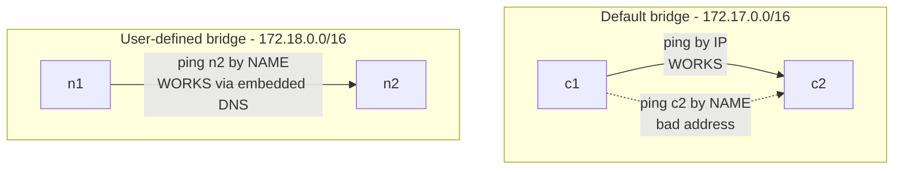
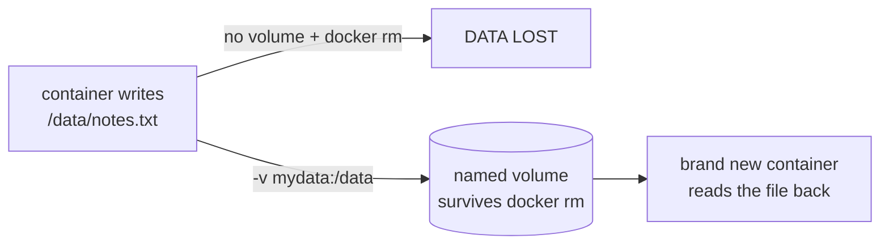

Docker Networking and Volumes – Learning Notes
=============================================

Name: Anshul Mohanty    Roll No: 24BCS10191

## In one line

The default bridge gives connectivity but **no DNS**; a user-defined bridge adds name
resolution — and anything that must outlive the container needs a volume.

## The picture

Why volumes exist:

## Mental model

| Driver | Container gets | Use when |
|---|---|---|
| `bridge` (default) | Own IP, NAT out, **no DNS** | Simple single containers |
| user-defined bridge | Own IP **plus DNS by name** | Multi-container apps |
| `host` | The host's own interfaces, `-p` meaningless | Max performance, exact ports |
| `none` | Loopback only | Fully isolated jobs |

| Storage | Lives | Best for |
|---|---|---|
| Named volume | `/var/lib/docker/volumes/` | Application data |
| Bind mount | A specific host path | Source code you are editing |
| tmpfs | Memory only | Scratch data, gone on stop |

## Gotchas

- **Container IPs change on every restart**, so hard-coding them is not an option. On a
  user-defined network you use the container *name* instead — which is exactly why
  docker-compose creates its own network rather than using the default bridge.
- `ping c2` failing with `bad address` on the default bridge is expected behaviour, not a
  broken network.
- `docker rm` does **not** delete volumes. That is deliberate, but it means orphaned volumes
  pile up — hence `docker volume prune` existing as a separate step.
- `--network host` removes isolation entirely, and `-p` stops meaning anything.
- A bind mount is what made this whole assignment work: `D:\DevOps Assignment` mounted at
  `/work` is why `df -h` inside the container shows a `D:\` filesystem.
