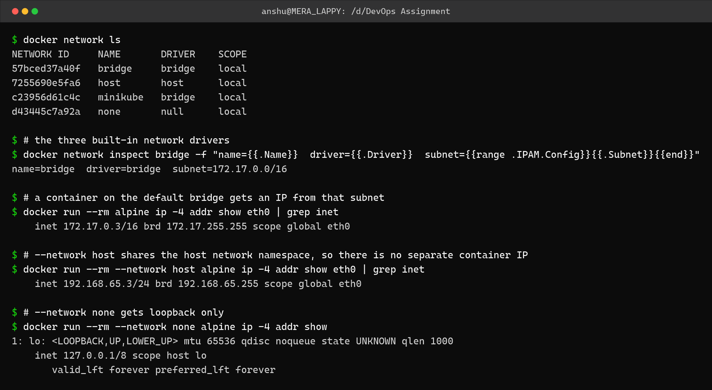
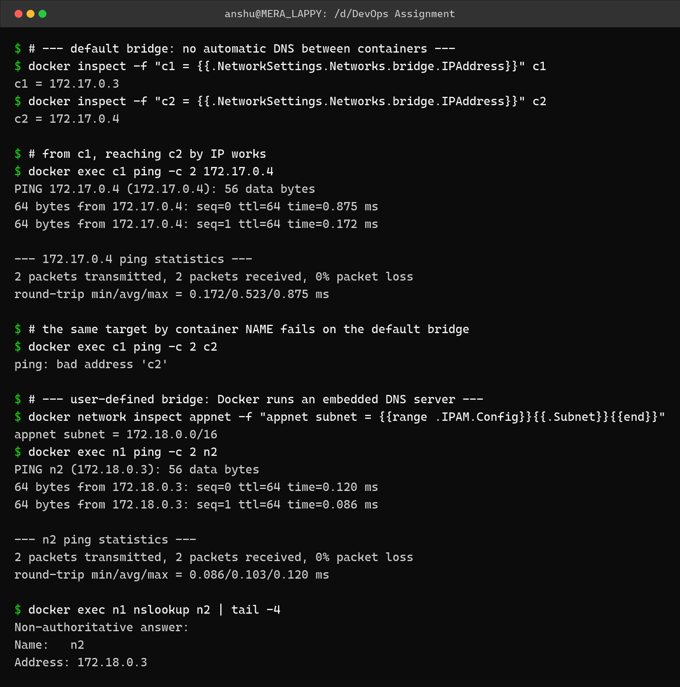
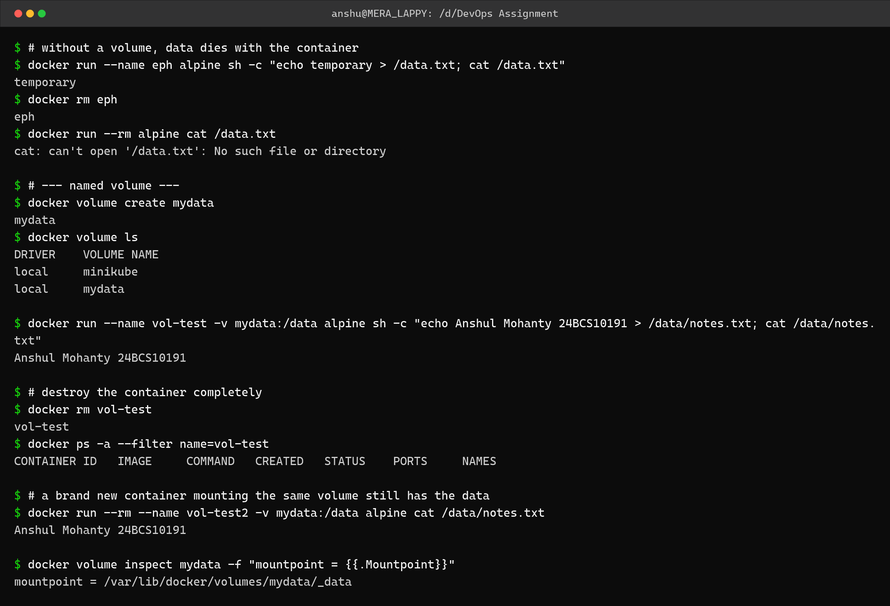

Docker Networking and Volumes – Homework
========================================

Name: Anshul Mohanty    Roll No: 24BCS10191    Section: A

See also: [LEARNING.md](LEARNING.md) - diagram and revision notes for this topic.

---

Task 1: The network drivers
---------------------------

| Driver | What it does | When to use |
|---|---|---|
| `bridge` (default) | Private internal network, container gets its own IP, reaches outside via NAT | Normal single-host containers |
| `host` | Container shares the host's network namespace directly - no separate IP, no port mapping | When you need maximum network performance or the host's exact ports |
| `none` | Only a loopback interface, completely isolated | Batch jobs that must not touch the network |
| user-defined `bridge` | Same as bridge, **plus** built-in DNS between containers | Multi-container apps |

```bash
docker network ls
docker run --rm alpine ip -4 addr show eth0
docker run --rm --network host alpine ip -4 addr show eth0
docker run --rm --network none alpine ip -4 addr show
```



```
$ docker network ls
NETWORK ID     NAME       DRIVER    SCOPE
57bced37a40f   bridge     bridge    local
7255690e5fa6   host       host      local
c23956d61c4c   minikube   bridge    local
d43445c7a92a   none       null      local

$ # the three built-in network drivers
$ docker network inspect bridge -f "name={{.Name}}  driver={{.Driver}}  subnet={{range .IPAM.Config}}{{.Subnet}}{{end}}"
name=bridge  driver=bridge  subnet=172.17.0.0/16

$ # a container on the default bridge gets an IP from that subnet
$ docker run --rm alpine ip -4 addr show eth0 | grep inet
    inet 172.17.0.3/16 brd 172.17.255.255 scope global eth0

$ # --network host shares the host network namespace, so there is no separate container IP
$ docker run --rm --network host alpine ip -4 addr show eth0 | grep inet
    inet 192.168.65.3/24 brd 192.168.65.255 scope global eth0

$ # --network none gets loopback only
$ docker run --rm --network none alpine ip -4 addr show
1: lo: <LOOPBACK,UP,LOWER_UP> mtu 65536 qdisc noqueue state UNKNOWN qlen 1000
    inet 127.0.0.1/8 scope host lo
       valid_lft forever preferred_lft forever
```

The three drivers give three clearly different results: a `172.17.x.x` address on the default
bridge, the host's own `192.168.65.3` on `--network host`, and loopback only on
`--network none`.

---

Task 2: Container-to-container DNS
----------------------------------

This is the most useful difference between the default bridge and a user-defined one.

```bash
# default bridge
docker run -d --name c1 alpine sleep 600
docker run -d --name c2 alpine sleep 600
docker exec c1 ping -c 2 172.17.0.4     # by IP  -> works
docker exec c1 ping -c 2 c2             # by name -> fails

# user-defined bridge
docker network create appnet
docker run -d --name n1 --network appnet alpine sleep 600
docker run -d --name n2 --network appnet alpine sleep 600
docker exec n1 ping -c 2 n2             # by name -> works
```



```
$ # --- default bridge: no automatic DNS between containers ---
$ docker inspect -f "c1 = {{.NetworkSettings.Networks.bridge.IPAddress}}" c1
c1 = 172.17.0.3
$ docker inspect -f "c2 = {{.NetworkSettings.Networks.bridge.IPAddress}}" c2
c2 = 172.17.0.4

$ # from c1, reaching c2 by IP works
$ docker exec c1 ping -c 2 172.17.0.4
PING 172.17.0.4 (172.17.0.4): 56 data bytes
64 bytes from 172.17.0.4: seq=0 ttl=64 time=0.875 ms
64 bytes from 172.17.0.4: seq=1 ttl=64 time=0.172 ms

--- 172.17.0.4 ping statistics ---
2 packets transmitted, 2 packets received, 0% packet loss
round-trip min/avg/max = 0.172/0.523/0.875 ms

$ # the same target by container NAME fails on the default bridge
$ docker exec c1 ping -c 2 c2
ping: bad address 'c2'

$ # --- user-defined bridge: Docker runs an embedded DNS server ---
$ docker network inspect appnet -f "appnet subnet = {{range .IPAM.Config}}{{.Subnet}}{{end}}"
appnet subnet = 172.18.0.0/16
$ docker exec n1 ping -c 2 n2
PING n2 (172.18.0.3): 56 data bytes
64 bytes from 172.18.0.3: seq=0 ttl=64 time=0.120 ms
64 bytes from 172.18.0.3: seq=1 ttl=64 time=0.086 ms

--- n2 ping statistics ---
2 packets transmitted, 2 packets received, 0% packet loss
round-trip min/avg/max = 0.086/0.103/0.120 ms

$ docker exec n1 nslookup n2 | tail -4
Non-authoritative answer:
Name:	n2
Address: 172.18.0.3

```

On the default bridge, `ping c2` fails with **`ping: bad address 'c2'`** - there is no name
resolution, only IPs. On the user-defined network `appnet` (subnet `172.18.0.0/16`), the exact
same command works, and `nslookup n2` shows Docker's embedded DNS server resolving the
container name to `172.18.0.3`.

This matters because container IPs change every time they restart, so hard-coding them is not
an option. On a user-defined network I can just use the container name.

---

Task 3: Volumes and data persistence
------------------------------------

| Type | Syntax | Where the data lives |
|---|---|---|
| Named volume | `-v mydata:/data` | Managed by Docker under `/var/lib/docker/volumes/` |
| Bind mount | `-v /host/path:/data` | A specific directory on the host |
| tmpfs | `--tmpfs /data` | Memory only, gone on stop |

```bash
docker volume create mydata
docker run --name vol-test -v mydata:/data alpine sh -c "echo ... > /data/notes.txt"
docker rm vol-test                                    # destroy the container
docker run --rm -v mydata:/data alpine cat /data/notes.txt   # data is still there
```



```
$ # without a volume, data dies with the container
$ docker run --name eph alpine sh -c "echo temporary > /data.txt; cat /data.txt"
temporary
$ docker rm eph
eph
$ docker run --rm alpine cat /data.txt
cat: can't open '/data.txt': No such file or directory

$ # --- named volume ---
$ docker volume create mydata
mydata
$ docker volume ls
DRIVER    VOLUME NAME
local     minikube
local     mydata

$ docker run --name vol-test -v mydata:/data alpine sh -c "echo Anshul Mohanty 24BCS10191 > /data/notes.txt; cat /data/notes.txt"
Anshul Mohanty 24BCS10191

$ # destroy the container completely
$ docker rm vol-test
vol-test
$ docker ps -a --filter name=vol-test
CONTAINER ID   IMAGE     COMMAND   CREATED   STATUS    PORTS     NAMES

$ # a brand new container mounting the same volume still has the data
$ docker run --rm --name vol-test2 -v mydata:/data alpine cat /data/notes.txt
Anshul Mohanty 24BCS10191

$ docker volume inspect mydata -f "mountpoint = {{.Mountpoint}}"
mountpoint = /var/lib/docker/volumes/mydata/_data
```

The first part shows the problem: a file written inside a container with no volume is gone
as soon as the container is removed (`cat: can't open '/data.txt'`). The second part shows
the fix - the container was deleted entirely (`docker ps -a` lists nothing), yet a brand new
container mounting `mydata` still reads back `Anshul Mohanty 24BCS10191`.

A bind mount of this kind is also what made this whole assignment work: the Windows folder
`D:\DevOps Assignment` is mounted into the Ubuntu container at `/work`, which is why `df -h`
in the shell-scripting task shows a `D:\` filesystem.

---

What I understood
-----------------

- A container's writable layer is deleted with the container. Anything that has to survive -
  database files, uploads, logs worth keeping - has to live in a volume or a bind mount.
- The default bridge gives connectivity but **no DNS**. A user-defined bridge adds Docker's
  embedded DNS, so containers can find each other by name. This is why docker-compose
  creates its own network rather than using the default one.
- `--network host` removes the isolation entirely - the container sees the host's interfaces
  and `-p` port mapping stops being meaningful.
- Named volumes are better than bind mounts for application data because Docker manages the
  location and they are not tied to one machine's directory layout. Bind mounts are better
  for source code you are actively editing.
- Volumes outlive containers by design - `docker rm` does not delete them, which is why
  `docker volume prune` exists as a separate cleanup step.
