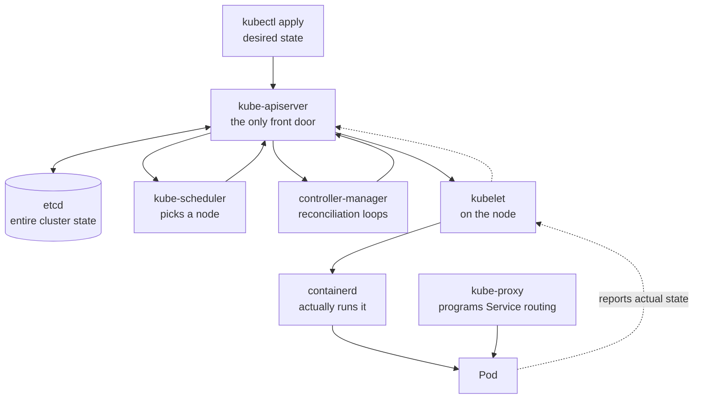
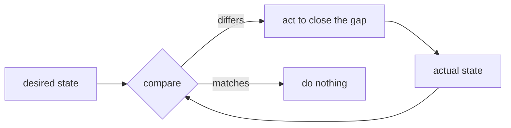

Kubernetes Fundamentals – Learning Notes
========================================

Name: Anshul Mohanty    Roll No: 24BCS10191    Section: A

## In one line

You declare **desired state**; controllers run a loop that continuously drags actual state
toward it.

## The picture

The loop that everything is built on:

## Mental model

| Component | Responsibility |
|---|---|
| `kube-apiserver` | Front door; **the only component that writes to etcd** |
| `etcd` | Key-value store holding all cluster state |
| `kube-scheduler` | *Decides* which node a Pod belongs on — never starts it |
| `controller-manager` | Runs the reconciliation loops |
| `kubelet` | Node agent; makes the containers actually exist |
| `kube-proxy` | Programs network rules so Service IPs reach Pods |

| Namespace | Purpose |
|---|---|
| `default` | Your objects if you do not specify one |
| `kube-system` | Kubernetes' own components |
| `kube-public` | Readable by all, bootstrap info |
| `kube-node-lease` | Node heartbeats for health detection |

## Gotchas

- The scheduler only **decides**; the kubelet on that node is what pulls the image and runs
  the container. Confusing the two makes scheduling failures hard to read.
- Everything goes through the API server, which makes it the single thing to secure *and* the
  single point of failure.
- Nothing is a one-off command. Delete a managed Pod and the loop simply recreates it —
  that is the system working, not ignoring you.
- **`kubectl` must be within one minor version of the cluster.** Docker Desktop's v1.34.1 on
  my v1.37.0 cluster exceeded the skew and warned; minikube's cached matching binary fixed it.
- A single-node cluster is still a real cluster. The difference shows up in *scheduling*
  (taints), not in the API.
