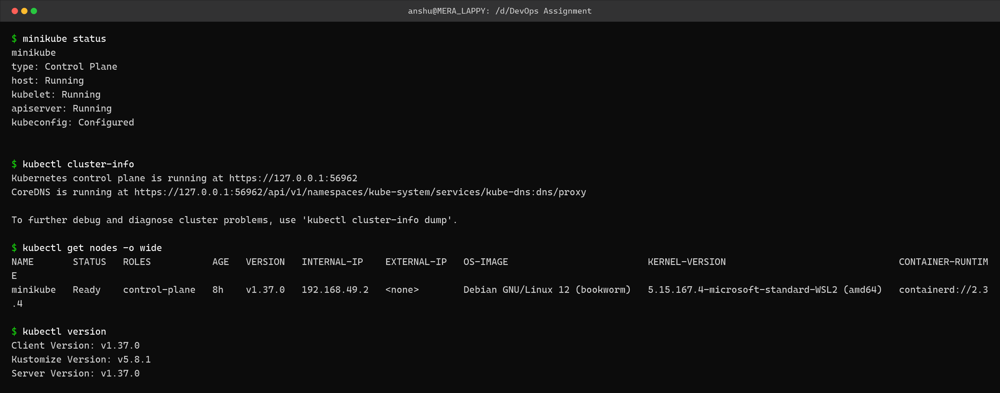
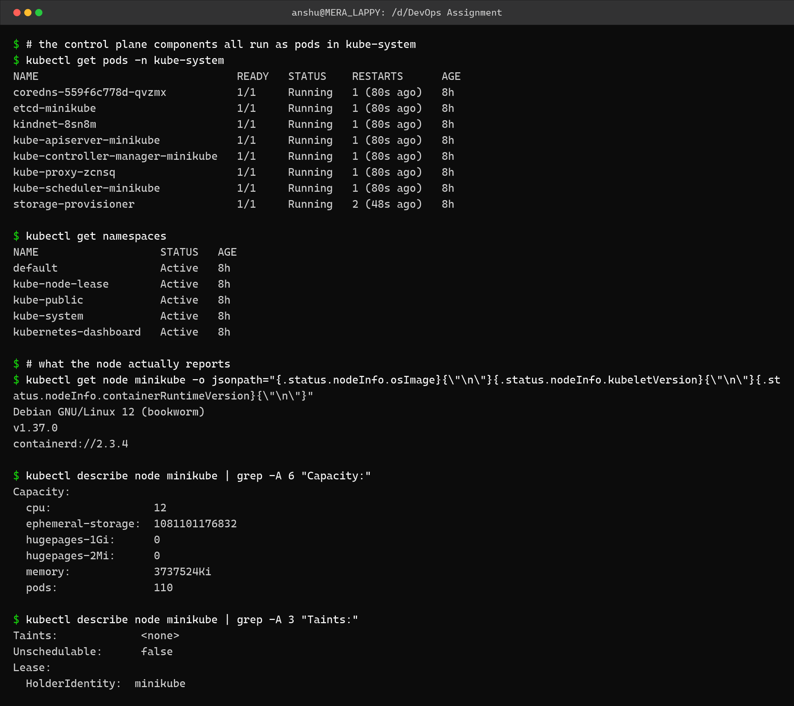

Kubernetes Fundamentals – Homework
==================================

Name: Anshul Mohanty    Roll No: 24BCS10191

Cluster used: **minikube v1.37.0, single node, docker driver**, Kubernetes v1.37.0 with
containerd as the runtime. The node runs Debian 12 inside a container on Docker Desktop.

---

Task 1: Cluster architecture
----------------------------

A Kubernetes cluster is split into a **control plane** that makes decisions and **worker
nodes** that run the actual workloads.

### Control plane components

| Component | Responsibility |
|---|---|
| `kube-apiserver` | The front door. Every command and every controller talks to the cluster through it. The only component that talks to etcd. |
| `etcd` | Key-value store holding the entire cluster state. If etcd is lost, the cluster is lost. |
| `kube-scheduler` | Watches for Pods with no node assigned and picks a node based on resources, taints and affinity. |
| `kube-controller-manager` | Runs the control loops (node, replicaset, deployment, endpoint...) that drive actual state toward desired state. |
| `cloud-controller-manager` | Talks to the cloud provider for load balancers, routes and volumes. Not present on minikube. |

### Node components

| Component | Responsibility |
|---|---|
| `kubelet` | The agent on every node. Takes PodSpecs from the API server and makes sure those containers are running and healthy. |
| `kube-proxy` | Programs the node's network rules so Service IPs reach the right Pods. |
| Container runtime | Actually runs the containers. Here it is **containerd 2.3.4**. |

### The reconciliation loop

This is the idea the whole system is built on: I declare **desired state** (a YAML manifest),
the API server stores it in etcd, and controllers continuously compare desired state against
**actual state** and act to close the gap. Nothing is a one-off command - if a Pod dies, the
loop notices and recreates it.

---

Task 2: Inspecting the cluster
------------------------------

```bash
minikube status
kubectl cluster-info
kubectl get nodes -o wide
kubectl version
```



```
$ minikube status
minikube
type: Control Plane
host: Running
kubelet: Running
apiserver: Running
kubeconfig: Configured


$ kubectl cluster-info
Kubernetes control plane is running at https://127.0.0.1:56962
CoreDNS is running at https://127.0.0.1:56962/api/v1/namespaces/kube-system/services/kube-dns:dns/proxy

To further debug and diagnose cluster problems, use 'kubectl cluster-info dump'.

$ kubectl get nodes -o wide
NAME       STATUS   ROLES           AGE   VERSION   INTERNAL-IP    EXTERNAL-IP   OS-IMAGE                         KERNEL-VERSION                               CONTAINER-RUNTIME
minikube   Ready    control-plane   8h    v1.37.0   192.168.49.2   <none>        Debian GNU/Linux 12 (bookworm)   5.15.167.4-microsoft-standard-WSL2 (amd64)   containerd://2.3.4

$ kubectl version
Client Version: v1.37.0
Kustomize Version: v5.8.1
Server Version: v1.37.0
```

Note on `kubectl` version: Docker Desktop ships `kubectl` v1.34.1, but this cluster runs
Kubernetes v1.37.0, and `kubectl` warned that the skew exceeded the supported +/-1 minor
versions. I switched to the matching v1.37.0 binary that minikube caches, which is why the
output above shows client and server both at v1.37.0.

---

Task 3: Control plane components as Pods
----------------------------------------

On a real cluster these run as static Pods on the control-plane node, and `kubectl` can show
them because the kubelet registers them with the API server.

```bash
kubectl get pods -n kube-system
kubectl get namespaces
kubectl describe node minikube
```



```
$ # the control plane components all run as pods in kube-system
$ kubectl get pods -n kube-system
NAME                               READY   STATUS    RESTARTS      AGE
coredns-559f6c778d-qvzmx           1/1     Running   1 (80s ago)   8h
etcd-minikube                      1/1     Running   1 (80s ago)   8h
kindnet-8sn8m                      1/1     Running   1 (80s ago)   8h
kube-apiserver-minikube            1/1     Running   1 (80s ago)   8h
kube-controller-manager-minikube   1/1     Running   1 (80s ago)   8h
kube-proxy-zcnsq                   1/1     Running   1 (80s ago)   8h
kube-scheduler-minikube            1/1     Running   1 (80s ago)   8h
storage-provisioner                1/1     Running   2 (48s ago)   8h

$ kubectl get namespaces
NAME                   STATUS   AGE
default                Active   8h
kube-node-lease        Active   8h
kube-public            Active   8h
kube-system            Active   8h
kubernetes-dashboard   Active   8h

$ # what the node actually reports
$ kubectl get node minikube -o jsonpath="{.status.nodeInfo.osImage}{\"\n\"}{.status.nodeInfo.kubeletVersion}{\"\n\"}{.status.nodeInfo.containerRuntimeVersion}{\"\n\"}"
Debian GNU/Linux 12 (bookworm)
v1.37.0
containerd://2.3.4

$ kubectl describe node minikube | grep -A 6 "Capacity:"
Capacity:
  cpu:                12
  ephemeral-storage:  1081101176832
  hugepages-1Gi:      0
  hugepages-2Mi:      0
  memory:             3737524Ki
  pods:               110

$ kubectl describe node minikube | grep -A 3 "Taints:"
Taints:             <none>
Unschedulable:      false
Lease:
  HolderIdentity:  minikube
```

Every component from the table above is visible as a running Pod: `etcd-minikube`,
`kube-apiserver-minikube`, `kube-scheduler-minikube`, `kube-controller-manager-minikube`,
plus `coredns` for cluster DNS, `kube-proxy` for Service networking and `kindnet` as the CNI
plugin.

### The four default namespaces

| Namespace | Purpose |
|---|---|
| `default` | Where my own objects go if I do not specify one |
| `kube-system` | Kubernetes' own components |
| `kube-public` | Readable by everyone, used for cluster bootstrap info |
| `kube-node-lease` | Node heartbeat leases, used for node health detection |

(`kubernetes-dashboard` is an extra one added by the minikube dashboard addon.)

### One thing worth recording for later

```
Taints:             <none>
```

On a multi-node cluster the control-plane node normally carries a
`node-role.kubernetes.io/control-plane:NoSchedule` taint so that ordinary workloads do not
land on it. minikube **removes** that taint, because on a single-node cluster nothing would
be schedulable otherwise. This directly affects the DaemonSet task in topic 09, and is
documented there.

---

What I understood
-----------------

- The API server is the only component that writes to etcd. Everything else - kubectl, the
  scheduler, the controllers, the kubelets - goes through it, which is what makes it the
  single point to secure and the single point of failure.
- The scheduler only *decides* which node a Pod belongs on; it never starts anything. The
  kubelet on that node is what actually pulls the image and runs the container.
- Kubernetes is declarative, not imperative. I describe the end state and controllers
  reconcile toward it continuously, which is why deleting a managed Pod just gets it
  recreated.
- A single-node cluster is a real cluster - the control plane and the workload run on the
  same machine. The difference shows up in scheduling behaviour (taints), not in the API.
- `kubectl` and the cluster must be within one minor version of each other. Having Docker
  Desktop's kubectl on PATH ahead of the right one is an easy trap to fall into.
