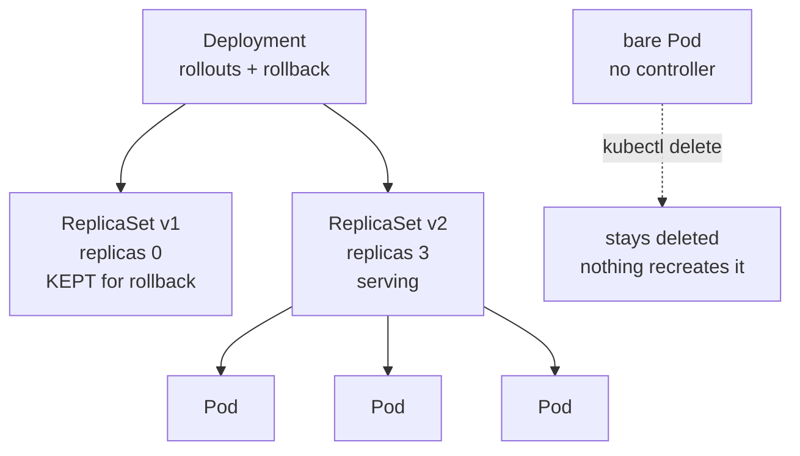
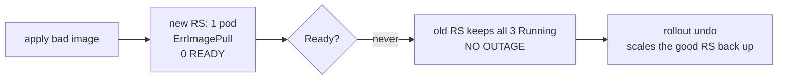

Pods, ReplicaSets and Deployments – Learning Notes
==================================================

Name: Anshul Mohanty    Roll No: 24BCS10191    Section: A

## In one line

Pods are disposable; a ReplicaSet keeps N of them alive; a Deployment manages *changing* what
those N are running.

## The picture

What a failed rollout actually does:

## Mental model

| Object | Gives you | Does not give you |
|---|---|---|
| Pod | A running container | Any recovery if it dies |
| ReplicaSet | N Pods, self-healing | Controlled updates |
| Deployment | Rolling updates, history, rollback | — |
| DaemonSet | Exactly one Pod **per node** | — |

| Symptom | Usual cause |
|---|---|
| `ImagePullBackOff` | Wrong image/tag, or private registry |
| `CrashLoopBackOff` | Starts then exits — check `logs --previous` |
| `Pending` | No node fits the requests, or a taint blocks it |
| `0/1 Running` | Up, but the readiness probe is failing |

Debug order: `get pods` → `describe pod` (read **Events**) → `logs` → `logs --previous`.

## Gotchas

- A ReplicaSet does not restart a Pod, it creates a **new one with a new name**. My deleted
  `nginx-rs-q5gfd` came back as `nginx-rs-mtzqg` in 2 seconds — so anything depending on a
  specific Pod name is broken by design.
- The old ReplicaSet is kept at **0 replicas**, not deleted. That is the entire mechanism
  behind `rollout undo` being instant.
- **A bad image does not cause an outage.** The rollout stalls because a new Pod must be Ready
  before an old one is removed — all 3 old Pods stayed Running throughout.
- `DESIRED 0` on a DaemonSet does not mean it is broken; it means the scheduler found **no
  eligible node**.
- minikube **removes** the control-plane `NoSchedule` taint, so single-node clusters hide the
  real DaemonSet behaviour. I had to add the taint manually to see DESIRED go 0, then 1 once
  a matching toleration was added.
