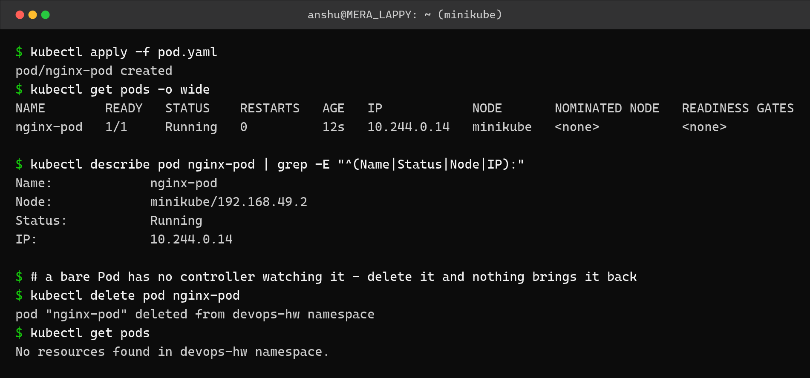
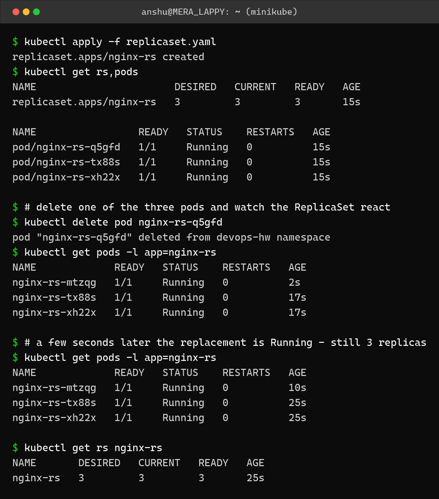
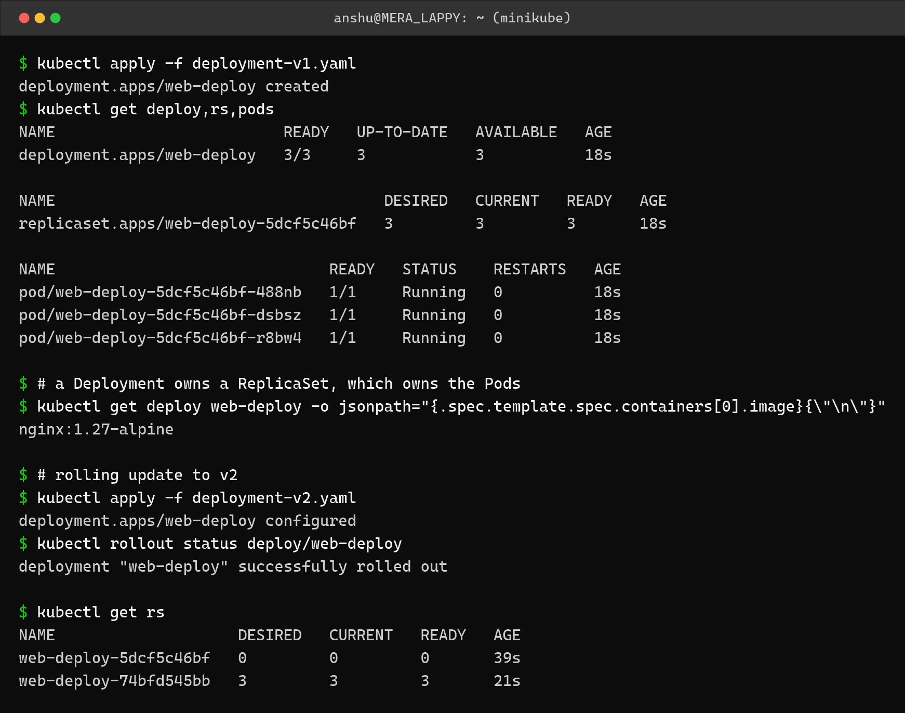
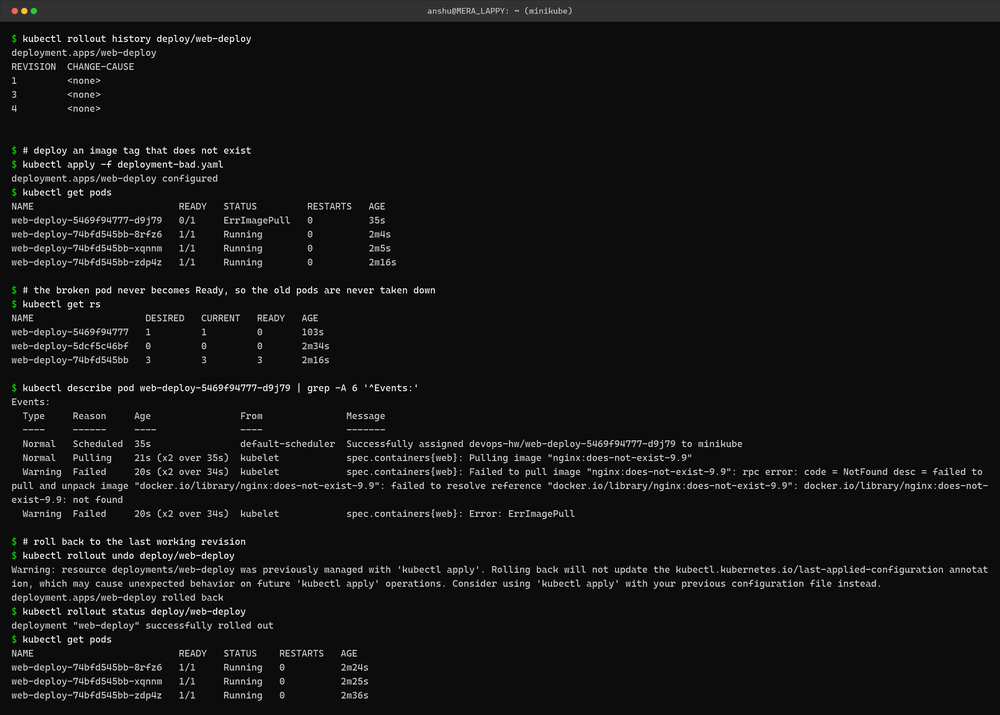
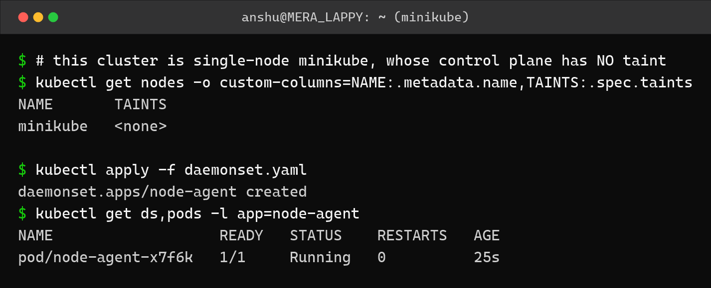
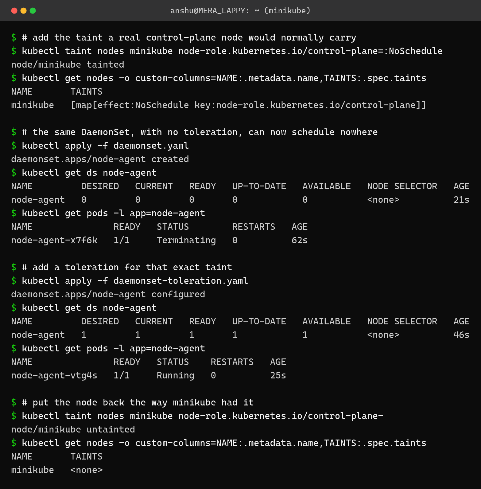

Kubernetes Core Objects – Pods, ReplicaSets, Deployments
========================================================

Name: Anshul Mohanty    Roll No: 24BCS10191

Cluster: **single-node minikube v1.37.0** (docker driver, containerd).
All objects were created in a dedicated `devops-hw` namespace so the output is not mixed up
with anything else on the cluster.

### The hierarchy

```
Deployment  ->  manages rollouts and rollbacks
   └── ReplicaSet  ->  keeps N identical Pods alive
         └── Pod   ->  one or more containers sharing a network namespace
```

| Object | Gives you | Does NOT give you |
|---|---|---|
| Pod | A running container | Any recovery if it dies |
| ReplicaSet | A fixed number of Pods, self-healing | Controlled updates |
| Deployment | Rolling updates, history, rollback | – |

---

Task 1: A bare Pod has no safety net
------------------------------------

```yaml
apiVersion: v1
kind: Pod
metadata:
  name: nginx-pod
  labels:
    app: nginx-standalone
spec:
  containers:
    - name: nginx
      image: nginx:alpine
      ports:
        - containerPort: 80
```



```
$ kubectl apply -f pod.yaml
pod/nginx-pod created
$ kubectl get pods -o wide
NAME        READY   STATUS    RESTARTS   AGE   IP            NODE       NOMINATED NODE   READINESS GATES
nginx-pod   1/1     Running   0          12s   10.244.0.14   minikube   <none>           <none>

$ kubectl describe pod nginx-pod | grep -E "^(Name|Status|Node|IP):" 
Name:             nginx-pod
Node:             minikube/192.168.49.2
Status:           Running
IP:               10.244.0.14

$ # a bare Pod has no controller watching it - delete it and nothing brings it back
$ kubectl delete pod nginx-pod
pod "nginx-pod" deleted from devops-hw namespace
$ kubectl get pods
No resources found in devops-hw namespace.
```

After `kubectl delete pod nginx-pod` the namespace is empty - **No resources found**. Nothing
recreated it, because a bare Pod has no controller watching it. This is why Pods are almost
never created directly in real use.

---

Task 2: ReplicaSet self-healing
-------------------------------

```yaml
apiVersion: apps/v1
kind: ReplicaSet
metadata:
  name: nginx-rs
spec:
  replicas: 3
  selector:
    matchLabels:
      app: nginx-rs
  template:
    metadata:
      labels:
        app: nginx-rs
    spec:
      containers:
        - name: nginx
          image: nginx:alpine
          ports:
            - containerPort: 80
```



```
$ kubectl apply -f replicaset.yaml
replicaset.apps/nginx-rs created
$ kubectl get rs,pods
NAME                       DESIRED   CURRENT   READY   AGE
replicaset.apps/nginx-rs   3         3         3       15s

NAME                 READY   STATUS    RESTARTS   AGE
pod/nginx-rs-q5gfd   1/1     Running   0          15s
pod/nginx-rs-tx88s   1/1     Running   0          15s
pod/nginx-rs-xh22x   1/1     Running   0          15s

$ # delete one of the three pods and watch the ReplicaSet react
$ kubectl delete pod nginx-rs-q5gfd
pod "nginx-rs-q5gfd" deleted from devops-hw namespace
$ kubectl get pods -l app=nginx-rs
NAME             READY   STATUS    RESTARTS   AGE
nginx-rs-mtzqg   1/1     Running   0          2s
nginx-rs-tx88s   1/1     Running   0          17s
nginx-rs-xh22x   1/1     Running   0          17s

$ # a few seconds later the replacement is Running - still 3 replicas
$ kubectl get pods -l app=nginx-rs
NAME             READY   STATUS    RESTARTS   AGE
nginx-rs-mtzqg   1/1     Running   0          10s
nginx-rs-tx88s   1/1     Running   0          25s
nginx-rs-xh22x   1/1     Running   0          25s

$ kubectl get rs nginx-rs
NAME       DESIRED   CURRENT   READY   AGE
nginx-rs   3         3         3       25s
```

I deleted `nginx-rs-q5gfd`. By the time the very next command ran, the ReplicaSet had already
created **`nginx-rs-mtzqg`** - age 2 seconds - and the count was back to 3/3. No manual step,
no alert, just the reconciliation loop doing its job.

---

Task 3: Deployment and rolling update
-------------------------------------

```yaml
apiVersion: apps/v1
kind: Deployment
metadata:
  name: web-deploy
spec:
  replicas: 3
  selector:
    matchLabels:
      app: web
  template:
    metadata:
      labels:
        app: web
    spec:
      containers:
        - name: web
          image: nginx:1.27-alpine
          ports:
            - containerPort: 80
```

v2 is the same manifest with `nginx:1.27-alpine` changed to `nginx:1.28-alpine`.



```
$ kubectl apply -f deployment-v1.yaml
deployment.apps/web-deploy created
$ kubectl get deploy,rs,pods
NAME                         READY   UP-TO-DATE   AVAILABLE   AGE
deployment.apps/web-deploy   3/3     3            3           18s

NAME                                    DESIRED   CURRENT   READY   AGE
replicaset.apps/web-deploy-5dcf5c46bf   3         3         3       18s

NAME                              READY   STATUS    RESTARTS   AGE
pod/web-deploy-5dcf5c46bf-488nb   1/1     Running   0          18s
pod/web-deploy-5dcf5c46bf-dsbsz   1/1     Running   0          18s
pod/web-deploy-5dcf5c46bf-r8bw4   1/1     Running   0          18s

$ # a Deployment owns a ReplicaSet, which owns the Pods
$ kubectl get deploy web-deploy -o jsonpath="{.spec.template.spec.containers[0].image}{\"\n\"}"
nginx:1.27-alpine

$ # rolling update to v2
$ kubectl apply -f deployment-v2.yaml
deployment.apps/web-deploy configured
$ kubectl rollout status deploy/web-deploy
deployment "web-deploy" successfully rolled out

$ kubectl get rs
NAME                    DESIRED   CURRENT   READY   AGE
web-deploy-5dcf5c46bf   0         0         0       39s
web-deploy-74bfd545bb   3         3         3       21s
```

The important line is the `kubectl get rs` at the end:

```
web-deploy-5dcf5c46bf   0   0   0     <- old ReplicaSet, scaled to zero but kept
web-deploy-74bfd545bb   3   3   3     <- new ReplicaSet, serving
```

The Deployment did not delete the old ReplicaSet, it scaled it to 0. That retained ReplicaSet
is exactly what makes an instant rollback possible.

---

Task 4: A failed rollout, and rolling back
------------------------------------------

I deliberately deployed `nginx:does-not-exist-9.9`.



```
$ kubectl rollout history deploy/web-deploy
deployment.apps/web-deploy 
REVISION  CHANGE-CAUSE
1         <none>
3         <none>
4         <none>


$ # deploy an image tag that does not exist
$ kubectl apply -f deployment-bad.yaml
deployment.apps/web-deploy configured
$ kubectl get pods
NAME                          READY   STATUS         RESTARTS   AGE
web-deploy-5469f94777-d9j79   0/1     ErrImagePull   0          35s
web-deploy-74bfd545bb-8rfz6   1/1     Running        0          2m4s
web-deploy-74bfd545bb-xqnnm   1/1     Running        0          2m5s
web-deploy-74bfd545bb-zdp4z   1/1     Running        0          2m16s

$ # the broken pod never becomes Ready, so the old pods are never taken down
$ kubectl get rs
NAME                    DESIRED   CURRENT   READY   AGE
web-deploy-5469f94777   1         1         0       103s
web-deploy-5dcf5c46bf   0         0         0       2m34s
web-deploy-74bfd545bb   3         3         3       2m16s

$ kubectl describe pod web-deploy-5469f94777-d9j79 | grep -A 6 '^Events:'
Events:
  Type     Reason     Age                From               Message
  ----     ------     ----               ----               -------
  Normal   Scheduled  35s                default-scheduler  Successfully assigned devops-hw/web-deploy-5469f94777-d9j79 to minikube
  Normal   Pulling    21s (x2 over 35s)  kubelet            spec.containers{web}: Pulling image "nginx:does-not-exist-9.9"
  Warning  Failed     20s (x2 over 34s)  kubelet            spec.containers{web}: Failed to pull image "nginx:does-not-exist-9.9": rpc error: code = NotFound desc = failed to pull and unpack image "docker.io/library/nginx:does-not-exist-9.9": failed to resolve reference "docker.io/library/nginx:does-not-exist-9.9": docker.io/library/nginx:does-not-exist-9.9: not found
  Warning  Failed     20s (x2 over 34s)  kubelet            spec.containers{web}: Error: ErrImagePull

$ # roll back to the last working revision
$ kubectl rollout undo deploy/web-deploy
Warning: resource deployments/web-deploy was previously managed with 'kubectl apply'. Rolling back will not update the kubectl.kubernetes.io/last-applied-configuration annotation, which may cause unexpected behavior on future 'kubectl apply' operations. Consider using 'kubectl apply' with your previous configuration file instead.
deployment.apps/web-deploy rolled back
$ kubectl rollout status deploy/web-deploy
deployment "web-deploy" successfully rolled out
$ kubectl get pods
NAME                          READY   STATUS    RESTARTS   AGE
web-deploy-74bfd545bb-8rfz6   1/1     Running   0          2m24s
web-deploy-74bfd545bb-xqnnm   1/1     Running   0          2m25s
web-deploy-74bfd545bb-zdp4z   1/1     Running   0          2m36s
```

This is the part worth understanding. The new Pod sat in **ErrImagePull**, and:

```
web-deploy-5469f94777   1   1   0     <- new RS: 1 pod, 0 ready
web-deploy-74bfd545bb   3   3   3     <- old RS: still serving all 3
```

All three old Pods stayed **Running** the entire time. A rolling update only removes an old
Pod once a new one reports Ready, so a broken image causes a *stalled* rollout, not an
outage. `kubectl describe pod` gave the precise reason:
`failed to resolve reference "docker.io/library/nginx:does-not-exist-9.9": not found`.

`kubectl rollout undo` then scaled the good ReplicaSet back up.

---

Task 5: DaemonSet
-----------------

A DaemonSet runs exactly one Pod **per node** - used for log collectors, monitoring agents
and CNI plugins.

```yaml
apiVersion: apps/v1
kind: DaemonSet
metadata:
  name: node-agent
spec:
  selector:
    matchLabels:
      app: node-agent
  template:
    metadata:
      labels:
        app: node-agent
    spec:
      containers:
        - name: agent
          image: busybox:1.36
          command: ["sh", "-c", "while true; do sleep 3600; done"]
```



```
$ # this cluster is single-node minikube, whose control plane has NO taint
$ kubectl get nodes -o custom-columns=NAME:.metadata.name,TAINTS:.spec.taints
NAME       TAINTS
minikube   <none>

$ kubectl apply -f daemonset.yaml
daemonset.apps/node-agent created
$ kubectl get ds,pods -l app=node-agent
NAME                   READY   STATUS    RESTARTS   AGE
pod/node-agent-x7f6k   1/1     Running   0          25s
```

One node, so one Pod.

### Taints and tolerations - an honest note about this cluster

On a normal multi-node cluster the control-plane node carries a
`node-role.kubernetes.io/control-plane:NoSchedule` taint, so a DaemonSet without a toleration
skips it. **minikube removes that taint**, because on a single-node cluster nothing could be
scheduled otherwise - the output above shows `TAINTS  <none>`.

That means my cluster cannot show the behaviour by itself. Rather than skip the concept, I
added the taint manually and demonstrated it directly.



```
$ # add the taint a real control-plane node would normally carry
$ kubectl taint nodes minikube node-role.kubernetes.io/control-plane=:NoSchedule
node/minikube tainted
$ kubectl get nodes -o custom-columns=NAME:.metadata.name,TAINTS:.spec.taints
NAME       TAINTS
minikube   [map[effect:NoSchedule key:node-role.kubernetes.io/control-plane]]

$ # the same DaemonSet, with no toleration, can now schedule nowhere
$ kubectl apply -f daemonset.yaml
daemonset.apps/node-agent created
$ kubectl get ds node-agent
NAME         DESIRED   CURRENT   READY   UP-TO-DATE   AVAILABLE   NODE SELECTOR   AGE
node-agent   0         0         0       0            0           <none>          21s
$ kubectl get pods -l app=node-agent
NAME               READY   STATUS        RESTARTS   AGE
node-agent-x7f6k   1/1     Terminating   0          62s

$ # add a toleration for that exact taint
$ kubectl apply -f daemonset-toleration.yaml
daemonset.apps/node-agent configured
$ kubectl get ds node-agent
NAME         DESIRED   CURRENT   READY   UP-TO-DATE   AVAILABLE   NODE SELECTOR   AGE
node-agent   1         1         1       1            1           <none>          46s
$ kubectl get pods -l app=node-agent
NAME               READY   STATUS    RESTARTS   AGE
node-agent-vtg4s   1/1     Running   0          25s

$ # put the node back the way minikube had it
$ kubectl taint nodes minikube node-role.kubernetes.io/control-plane-
node/minikube untainted
$ kubectl get nodes -o custom-columns=NAME:.metadata.name,TAINTS:.spec.taints
NAME       TAINTS
minikube   <none>
```

The DaemonSet's own numbers tell the story:

| State | DESIRED | READY |
|---|---|---|
| Node tainted, DaemonSet has no toleration | **0** | 0 |
| Node tainted, DaemonSet tolerates that taint | **1** | 1 |

With the taint and no toleration, `DESIRED` is 0 - the scheduler reports that there is no
node it is allowed to place the Pod on, so the DaemonSet does not even want a replica. Adding
the matching toleration immediately brings it to 1/1. I then removed the taint to leave the
node as minikube had it.

---

Debugging workflow
------------------

| Step | Command |
|---|---|
| 1. What is the state? | `kubectl get pods` |
| 2. Why is it in that state? | `kubectl describe pod <name>` - read **Events** at the bottom |
| 3. What did the app say? | `kubectl logs <name>` |
| 4. What did it say before it crashed? | `kubectl logs <name> --previous` |
| 5. Get inside it | `kubectl exec -it <name> -- sh` |

| Status | Usual cause |
|---|---|
| `ImagePullBackOff` / `ErrImagePull` | Wrong image name/tag, or private registry without credentials |
| `CrashLoopBackOff` | Container starts then exits - check `logs --previous` |
| `Pending` | No node can satisfy the resource requests, or a taint blocks it |
| `0/1 Running` | Container is up but the readiness probe is failing |

---

What I understood
-----------------

- Pods are disposable. Nothing about a Pod is meant to be permanent, which is why the object
  you actually deploy is almost always a Deployment.
- A ReplicaSet does not "restart" a Pod - it creates a **new** one with a new name. The
  replacement had a different name (`mtzqg` vs `q5gfd`), so anything depending on a specific
  Pod name is broken by design.
- A Deployment keeps the old ReplicaSet at 0 replicas instead of deleting it. That is the
  whole mechanism behind `rollout undo` being instant.
- A bad image does not take the service down. The rollout stalls with the old Pods still
  serving, because a new Pod must be Ready before an old one is removed. That is a much safer
  default than I expected.
- `DESIRED 0` on a DaemonSet does not mean it is broken - it means the scheduler found no
  eligible node. Taints are about the node refusing Pods; tolerations are the Pod's way of
  saying it accepts that condition.
- Testing on a single-node minikube hides some real-cluster behaviour. It is worth knowing
  *which* behaviour is being hidden rather than assuming the local result generalises.
