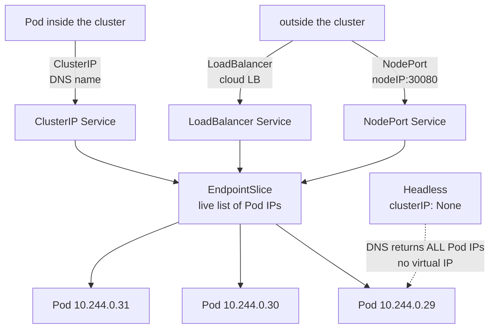
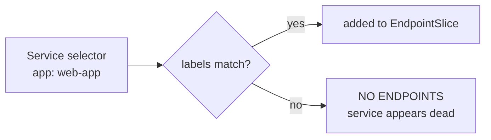

Kubernetes Services – Learning Notes
====================================

Name: Anshul Mohanty    Roll No: 24BCS10191    Section: A

## In one line

Pod IPs change constantly, so a Service is a **stable name in front of a moving set of Pods**,
chosen by label selector.

## The picture

How a Service finds its Pods:

## Mental model

| Type | Reachable from | Note |
|---|---|---|
| `ClusterIP` | Inside only | Default; one virtual IP |
| `NodePort` | Outside via `nodeIP:30000-32767` | Opens the port on every node |
| `LoadBalancer` | Internet | Needs a cloud provider |
| `ExternalName` | DNS only | A CNAME out of the cluster, no proxying |
| Headless | Inside | **No** virtual IP; DNS returns Pod IPs |

DNS name: **`<service>.<namespace>.svc.cluster.local`**

| Service | DNS answer (measured) |
|---|---|
| `web-clusterip` | **one** virtual IP — `10.108.155.198` |
| `web-headless` | **three** Pod IPs — `.29 / .30 / .31` |

## Gotchas

- **No endpoints = selector does not match the Pod labels.** `kubectl get endpointslice` is
  the fastest way to confirm it, and it is almost always the cause of a "broken" Service.
- Load balancing is **random per connection** in iptables mode, not round-robin. Seeing the
  same Pod answer twice in a row is normal.
- `EXTERNAL-IP: <pending>` on a LoadBalancer is **correct** on a local cluster — nothing
  exists to fulfil it. Not a failure to debug.
- The short name resolves only because the Pod's `/etc/resolv.conf` lists the namespace as a
  search domain; across namespaces you need the FQDN.
- My NodePort returned **HTTP 000** from Windows while working fine from inside the node. The
  NodePort was never broken — with the docker driver, `192.168.49.2` lives inside Docker's VM
  and Windows has no route to it. `minikube service --url` tunnels past that.
