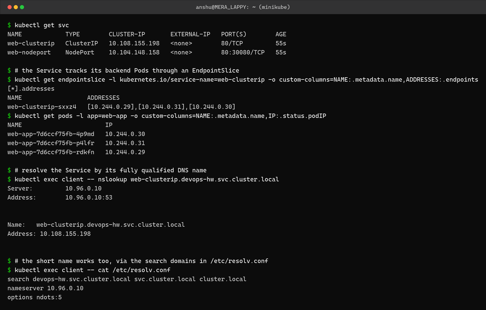
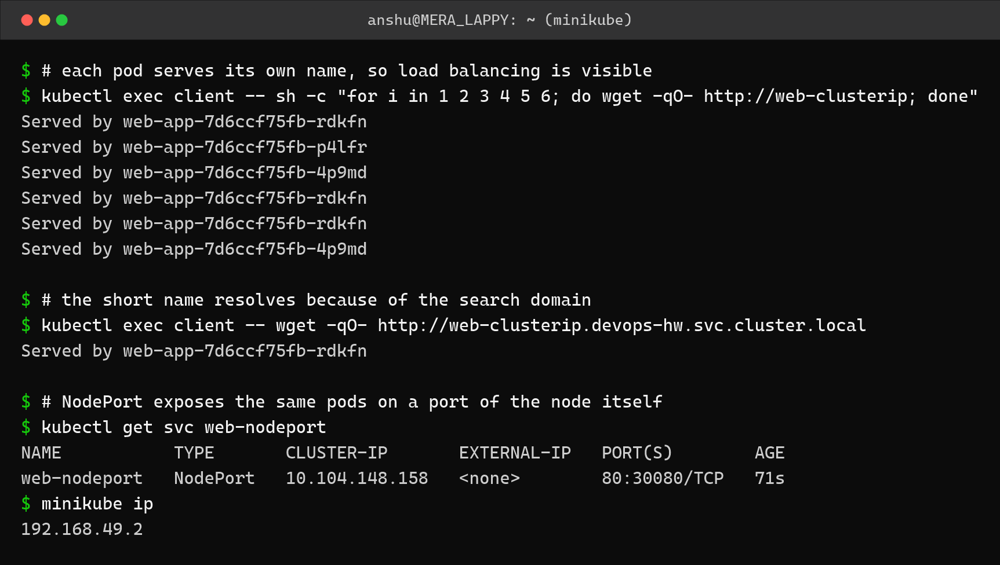
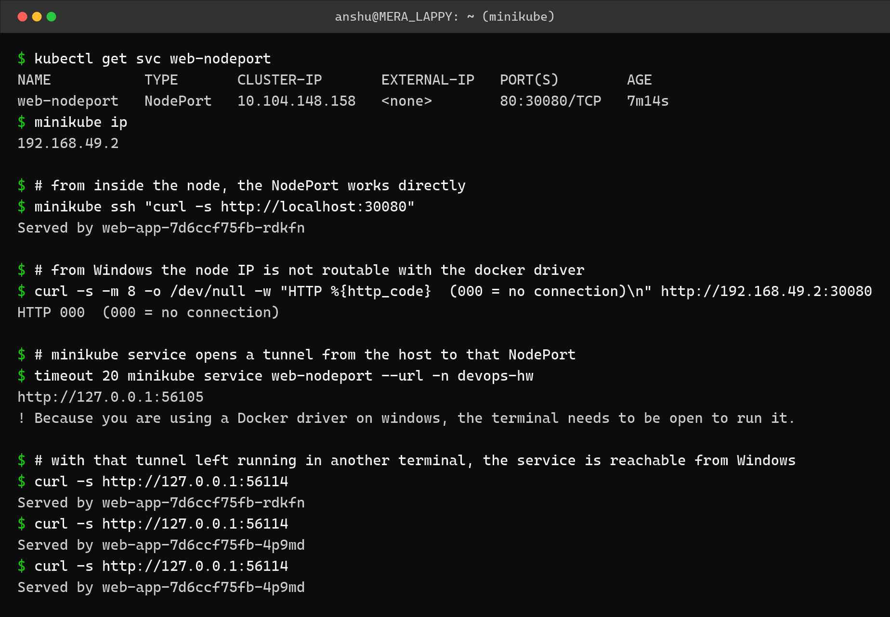
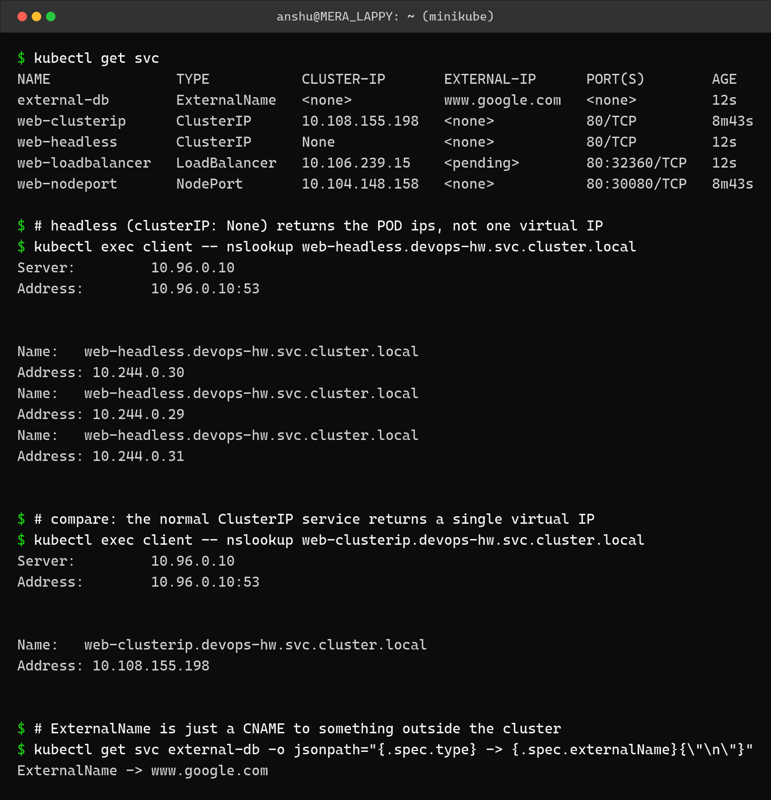

Kubernetes Networking and Services – Homework
=============================================

Name: Anshul Mohanty    Roll No: 24BCS10191

Cluster: single-node minikube v1.37.0, namespace `devops-hw`.

---

Why Services exist
------------------

Pod IPs are not stable. Every time a Pod is recreated it gets a new IP, so nothing can talk
to a Pod by address. A **Service** is a stable name and virtual IP in front of a changing set
of Pods, selected by **labels**.

| Type | What it does | Reachable from |
|---|---|---|
| `ClusterIP` (default) | Virtual IP inside the cluster | Inside the cluster only |
| `NodePort` | Opens the same port on every node (30000-32767) | Outside, via `<nodeIP>:<nodePort>` |
| `LoadBalancer` | Asks the cloud provider for an external load balancer | The internet (cloud only) |
| `ExternalName` | A CNAME to a DNS name outside the cluster | n/a - DNS only, no proxying |
| Headless (`clusterIP: None`) | No virtual IP; DNS returns the Pod IPs directly | Inside, for clients that do their own balancing |

The test app is a 3-replica Deployment where each Pod writes **its own name** into
`index.html`, so load balancing is visible in the response:

```yaml
apiVersion: apps/v1
kind: Deployment
metadata:
  name: web-app
spec:
  replicas: 3
  selector:
    matchLabels:
      app: web-app
  template:
    metadata:
      labels:
        app: web-app
    spec:
      containers:
        - name: web
          image: nginx:alpine
          ports:
            - containerPort: 80
          env:
            - name: POD_NAME
              valueFrom:
                fieldRef:
                  fieldPath: metadata.name
          # write the pod's own name into the page so load balancing is visible
          command:
            - /bin/sh
            - -c
            - echo "Served by $POD_NAME" > /usr/share/nginx/html/index.html && nginx -g 'daemon off;'
```

---

Task 1: ClusterIP, Endpoints and cluster DNS
--------------------------------------------

```yaml
apiVersion: v1
kind: Service
metadata:
  name: web-clusterip
spec:
  type: ClusterIP
  selector:
    app: web-app
  ports:
    - port: 80
      targetPort: 80
```



```
$ kubectl get svc
NAME            TYPE        CLUSTER-IP       EXTERNAL-IP   PORT(S)        AGE
web-clusterip   ClusterIP   10.108.155.198   <none>        80/TCP         55s
web-nodeport    NodePort    10.104.148.158   <none>        80:30080/TCP   55s

$ # the Service tracks its backend Pods through an EndpointSlice
$ kubectl get endpointslice -l kubernetes.io/service-name=web-clusterip -o custom-columns=NAME:.metadata.name,ADDRESSES:.endpoints[*].addresses
NAME                  ADDRESSES
web-clusterip-sxxz4   [10.244.0.29],[10.244.0.31],[10.244.0.30]
$ kubectl get pods -l app=web-app -o custom-columns=NAME:.metadata.name,IP:.status.podIP
NAME                       IP
web-app-7d6ccf75fb-4p9md   10.244.0.30
web-app-7d6ccf75fb-p4lfr   10.244.0.31
web-app-7d6ccf75fb-rdkfn   10.244.0.29

$ # resolve the Service by its fully qualified DNS name
$ kubectl exec client -- nslookup web-clusterip.devops-hw.svc.cluster.local
Server:		10.96.0.10
Address:	10.96.0.10:53


Name:	web-clusterip.devops-hw.svc.cluster.local
Address: 10.108.155.198


$ # the short name works too, via the search domains in /etc/resolv.conf
$ kubectl exec client -- cat /etc/resolv.conf
search devops-hw.svc.cluster.local svc.cluster.local cluster.local
nameserver 10.96.0.10
options ndots:5
```

The EndpointSlice addresses `[10.244.0.29], [10.244.0.31], [10.244.0.30]` are exactly the
three Pod IPs listed underneath. That is the link between a Service and its backends: the
label selector decides membership, and the EndpointSlice is the live list the kube-proxy
actually programs.

The DNS name follows the pattern **`<service>.<namespace>.svc.cluster.local`**. The short
name `web-clusterip` also works because `/etc/resolv.conf` inside every Pod lists
`devops-hw.svc.cluster.local` as a search domain.

---

Task 2: Load balancing across Pods
----------------------------------



```
$ # each pod serves its own name, so load balancing is visible
$ kubectl exec client -- sh -c "for i in 1 2 3 4 5 6; do wget -qO- http://web-clusterip; done"
Served by web-app-7d6ccf75fb-rdkfn
Served by web-app-7d6ccf75fb-p4lfr
Served by web-app-7d6ccf75fb-4p9md
Served by web-app-7d6ccf75fb-rdkfn
Served by web-app-7d6ccf75fb-rdkfn
Served by web-app-7d6ccf75fb-4p9md

$ # the short name resolves because of the search domain
$ kubectl exec client -- wget -qO- http://web-clusterip.devops-hw.svc.cluster.local
Served by web-app-7d6ccf75fb-rdkfn

$ # NodePort exposes the same pods on a port of the node itself
$ kubectl get svc web-nodeport
NAME           TYPE       CLUSTER-IP       EXTERNAL-IP   PORT(S)        AGE
web-nodeport   NodePort   10.104.148.158   <none>        80:30080/TCP   71s
$ minikube ip
192.168.49.2
```

Six requests to the single Service name were answered by all three different Pods. The
distribution is not strict round-robin - `rdkfn` answered three times - because kube-proxy in
iptables mode picks a backend at random per connection.

---

Task 3: NodePort
----------------

```yaml
apiVersion: v1
kind: Service
metadata:
  name: web-nodeport
spec:
  type: NodePort
  selector:
    app: web-app
  ports:
    - port: 80
      targetPort: 80
      nodePort: 30080
```



```
$ kubectl get svc web-nodeport
NAME           TYPE       CLUSTER-IP       EXTERNAL-IP   PORT(S)        AGE
web-nodeport   NodePort   10.104.148.158   <none>        80:30080/TCP   7m14s
$ minikube ip
192.168.49.2

$ # from inside the node, the NodePort works directly
$ minikube ssh "curl -s http://localhost:30080"
Served by web-app-7d6ccf75fb-rdkfn

$ # from Windows the node IP is not routable with the docker driver
$ curl -s -m 8 -o /dev/null -w "HTTP %{http_code}  (000 = no connection)\n" http://192.168.49.2:30080
HTTP 000  (000 = no connection)

$ # minikube service opens a tunnel from the host to that NodePort
$ timeout 20 minikube service web-nodeport --url -n devops-hw
http://127.0.0.1:56105
! Because you are using a Docker driver on windows, the terminal needs to be open to run it.

$ # with that tunnel left running in another terminal, the service is reachable from Windows
$ curl -s http://127.0.0.1:56114
Served by web-app-7d6ccf75fb-rdkfn
$ curl -s http://127.0.0.1:56114
Served by web-app-7d6ccf75fb-4p9md
$ curl -s http://127.0.0.1:56114
Served by web-app-7d6ccf75fb-4p9md
```

Worth recording honestly: the NodePort **works**, but not the way the textbook describes on
this setup. `minikube ssh curl http://localhost:30080` succeeds from inside the node, while
`curl http://192.168.49.2:30080` from Windows returns **HTTP 000** - no connection.

The reason is the **docker driver on Windows**. The node is a container inside Docker
Desktop's Linux VM, and `192.168.49.2` is an address inside that VM which Windows has no
route to. `minikube service --url` solves it by opening a tunnel from a localhost port on
Windows to the NodePort, and through that tunnel the requests are served and load balanced
normally.

(The tunnel port differs between the two commands above - `56105` then `56114` - because
each `minikube service` invocation opens a fresh tunnel on a new random port.)

---

Task 4: Headless, ExternalName and LoadBalancer
-----------------------------------------------

```yaml
apiVersion: v1
kind: Service
metadata:
  name: web-headless
spec:
  clusterIP: None        # headless - no virtual IP, DNS returns the Pod IPs
  selector:
    app: web-app
  ports:
    - port: 80
---
apiVersion: v1
kind: Service
metadata:
  name: external-db
spec:
  type: ExternalName
  externalName: www.google.com
```



```
$ kubectl get svc
NAME               TYPE           CLUSTER-IP       EXTERNAL-IP      PORT(S)        AGE
external-db        ExternalName   <none>           www.google.com   <none>         12s
web-clusterip      ClusterIP      10.108.155.198   <none>           80/TCP         8m43s
web-headless       ClusterIP      None             <none>           80/TCP         12s
web-loadbalancer   LoadBalancer   10.106.239.15    <pending>        80:32360/TCP   12s
web-nodeport       NodePort       10.104.148.158   <none>           80:30080/TCP   8m43s

$ # headless (clusterIP: None) returns the POD ips, not one virtual IP
$ kubectl exec client -- nslookup web-headless.devops-hw.svc.cluster.local
Server:		10.96.0.10
Address:	10.96.0.10:53


Name:	web-headless.devops-hw.svc.cluster.local
Address: 10.244.0.30
Name:	web-headless.devops-hw.svc.cluster.local
Address: 10.244.0.29
Name:	web-headless.devops-hw.svc.cluster.local
Address: 10.244.0.31


$ # compare: the normal ClusterIP service returns a single virtual IP
$ kubectl exec client -- nslookup web-clusterip.devops-hw.svc.cluster.local
Server:		10.96.0.10
Address:	10.96.0.10:53


Name:	web-clusterip.devops-hw.svc.cluster.local
Address: 10.108.155.198


$ # ExternalName is just a CNAME to something outside the cluster
$ kubectl get svc external-db -o jsonpath="{.spec.type} -> {.spec.externalName}{\"\n\"}"
ExternalName -> www.google.com
```

This is the clearest contrast in the whole topic:

| Service | DNS answer |
|---|---|
| `web-clusterip` (ClusterIP) | **one** virtual IP - `10.108.155.198` |
| `web-headless` (headless) | **three** Pod IPs - `10.244.0.29/.30/.31` |

A ClusterIP hides the Pods behind one address and balances for you. A headless Service hands
the client the real Pod addresses and lets it decide - which is what StatefulSet workloads
like databases need, because each replica has its own identity.

`web-loadbalancer` sits at **`EXTERNAL-IP: <pending>`** forever, and that is correct
behaviour, not a failure. `LoadBalancer` asks the cloud provider to provision a real load
balancer; there is no cloud provider here, so nothing ever fulfils it. On minikube,
`minikube tunnel` would be needed to assign one.

---

What I understood
-----------------

- A Service is a label selector plus a stable address. It does not "contain" Pods - it
  watches for Pods matching its selector and keeps an EndpointSlice up to date.
- If a Service has no endpoints, the cause is almost always a selector that does not match
  the Pod labels. Checking `kubectl get endpointslice` is the fastest way to confirm that.
- Cluster DNS is `<service>.<namespace>.svc.cluster.local`, and the search domains in the
  Pod's `resolv.conf` are what make the short name work within the same namespace.
- Load balancing is per-connection and random in iptables mode, not round-robin, so seeing
  the same Pod answer twice in a row is normal rather than a bug.
- `EXTERNAL-IP: <pending>` on a LoadBalancer is the expected state on a local cluster, and
  recognising that saves a lot of pointless debugging.
- A headless Service is the opposite of the usual one: instead of hiding the Pods behind a
  single IP, it exposes all of them so the client can choose.
- Local clusters have networking quirks that are not Kubernetes' fault. The NodePort was
  working the entire time; what failed was the route from Windows into Docker's VM.
