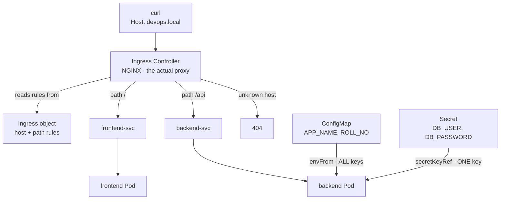
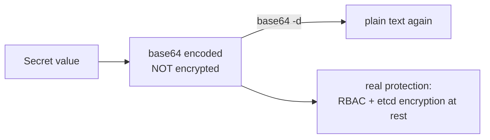

Ingress, ConfigMaps and Secrets – Learning Notes
================================================

Name: Anshul Mohanty    Roll No: 24BCS10191

## In one line

Configuration lives **outside** the image so one image runs anywhere — and an Ingress is only
a set of rules, useless without a controller to enforce them.

## The picture

What a Secret actually protects:

## Mental model

| Object | Holds | Stored as |
|---|---|---|
| ConfigMap | Non-sensitive config | Plain text in etcd |
| Secret | Passwords, tokens | **base64** in etcd |
| Ingress | Routing rules only | Does nothing alone |
| Ingress Controller | The proxy that enforces them | A Deployment |

| Injection | Brings in |
|---|---|
| `envFrom` + `configMapRef` | **Every** key as an env var |
| `env` + `secretKeyRef` | **One** named key |

| Command | Result |
|---|---|
| `echo "admin_user" \| base64` | 11 bytes — includes a newline |
| `echo -n "admin_user" \| base64` | 10 bytes — correct |

## Gotchas

- **Secrets are encoded, not encrypted.** One `base64 -d` recovers the password. Treating
  base64 as security is the actual mistake; RBAC and encryption at rest are the real controls.
- The **trailing newline trap**: `echo` adds `\n`, so the credential becomes `admin_user\n`
  and logins fail with an error that points at the password, not at an invisible byte. Using
  `stringData:` sidesteps the entire class of bug — Kubernetes encodes it correctly for you.
- An Ingress with no controller running changes nothing. `minikube addons enable ingress` was
  a required step, not an optional one.
- A **404 from the controller is a routing answer**, not a dead backend — no host/path rule
  matched. Completely different to debug than a 502.
- Env vars from a ConfigMap are read **once at container start**. Editing the ConfigMap does
  not update a running Pod; it has to be restarted. Volume mounts behave differently.
