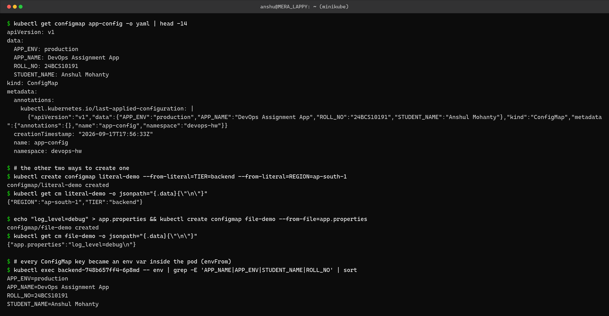
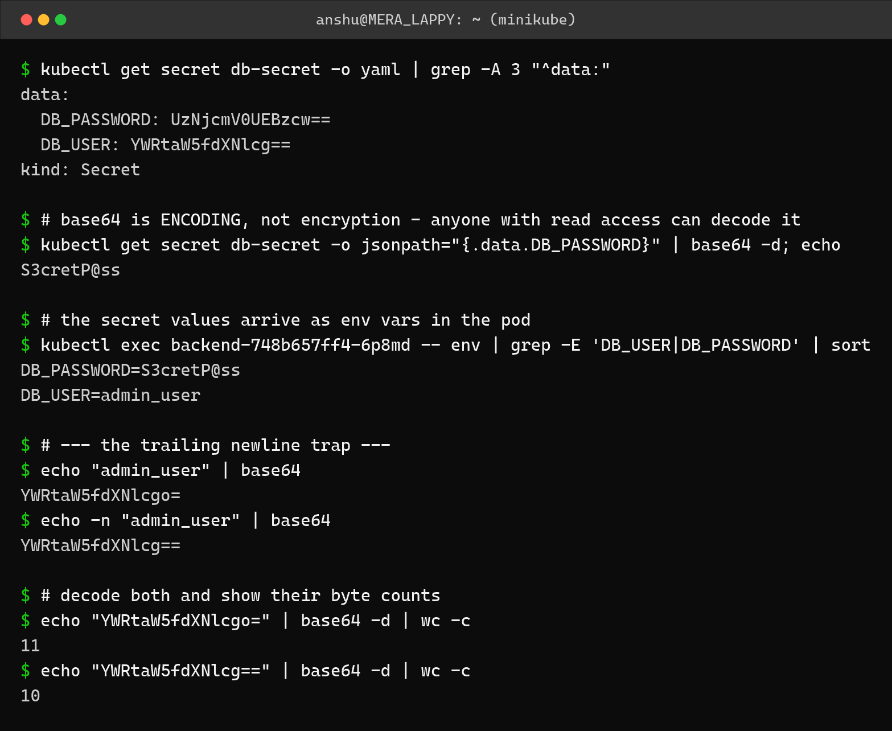
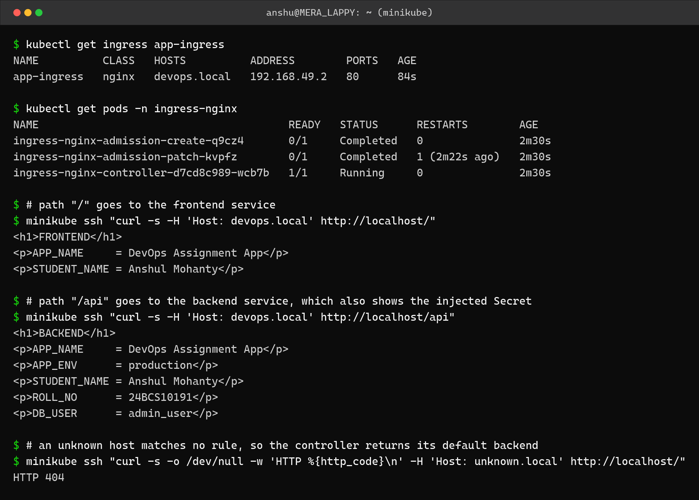

Kubernetes Ingress, ConfigMaps and Secrets – Homework
=====================================================

Name: Anshul Mohanty    Roll No: 24BCS10191

See also: [LEARNING.md](LEARNING.md) - diagram and revision notes for this topic.

Cluster: single-node minikube v1.37.0, namespace `devops-hw`.
Ingress controller: the **NGINX** controller installed with `minikube addons enable ingress`.

| Object | Holds | Stored as |
|---|---|---|
| ConfigMap | Non-sensitive configuration | Plain text in etcd |
| Secret | Passwords, tokens, keys | **base64-encoded** in etcd - encoding, not encryption |
| Ingress | HTTP routing rules (host + path) | Rules only - it does nothing on its own |
| Ingress Controller | The actual reverse proxy that reads Ingress objects and serves traffic | A Deployment in the cluster |

An Ingress object with no controller running does nothing at all. The controller is the part
that actually listens on port 80 and proxies.

---

Task 1: ConfigMaps
------------------

```yaml
apiVersion: v1
kind: ConfigMap
metadata:
  name: app-config
data:
  APP_NAME: "DevOps Assignment App"
  APP_ENV: "production"
  STUDENT_NAME: "Anshul Mohanty"
  ROLL_NO: "24BCS10191"
```

Three ways to create one:

| Method | Command |
|---|---|
| From a YAML manifest | `kubectl apply -f configmap.yaml` |
| From literals | `kubectl create configmap literal-demo --from-literal=TIER=backend` |
| From a file | `kubectl create configmap file-demo --from-file=app.properties` |



```
$ kubectl get configmap app-config -o yaml | head -14
apiVersion: v1
data:
  APP_ENV: production
  APP_NAME: DevOps Assignment App
  ROLL_NO: 24BCS10191
  STUDENT_NAME: Anshul Mohanty
kind: ConfigMap
metadata:
  annotations:
    kubectl.kubernetes.io/last-applied-configuration: |
      {"apiVersion":"v1","data":{"APP_ENV":"production","APP_NAME":"DevOps Assignment App","ROLL_NO":"24BCS10191","STUDENT_NAME":"Anshul Mohanty"},"kind":"ConfigMap","metadata":{"annotations":{},"name":"app-config","namespace":"devops-hw"}}
  creationTimestamp: "2026-09-17T17:56:33Z"
  name: app-config
  namespace: devops-hw

$ # the other two ways to create one
$ kubectl create configmap literal-demo --from-literal=TIER=backend --from-literal=REGION=ap-south-1
configmap/literal-demo created
$ kubectl get cm literal-demo -o jsonpath="{.data}{\"\n\"}"
{"REGION":"ap-south-1","TIER":"backend"}

$ echo "log_level=debug" > app.properties && kubectl create configmap file-demo --from-file=app.properties
configmap/file-demo created
$ kubectl get cm file-demo -o jsonpath="{.data}{\"\n\"}"
{"app.properties":"log_level=debug\n"}

$ # every ConfigMap key became an env var inside the pod (envFrom)
$ kubectl exec backend-748b657ff4-6p8md -- env | grep -E 'APP_NAME|APP_ENV|STUDENT_NAME|ROLL_NO' | sort
APP_ENV=production
APP_NAME=DevOps Assignment App
ROLL_NO=24BCS10191
STUDENT_NAME=Anshul Mohanty
```

The `--from-file` result is worth noticing: the **key becomes the filename** and the value is
the whole file contents, including the trailing newline (`"app.properties":"log_level=debug\n"`).

The last command proves the injection worked - all four ConfigMap keys are real environment
variables inside the running container, because the Deployment uses `envFrom` with a
`configMapRef`:

```yaml
envFrom:
  - configMapRef:
      name: app-config
```

---

Task 2: Secrets
---------------

```yaml
apiVersion: v1
kind: Secret
metadata:
  name: db-secret
type: Opaque
# stringData takes plain text and lets Kubernetes do the base64 encoding.
# This avoids the trailing-newline mistake that `echo | base64` causes.
stringData:
  DB_USER: "admin_user"
  DB_PASSWORD: "S3cretP@ss"
```



```
$ kubectl get secret db-secret -o yaml | grep -A 3 "^data:"
data:
  DB_PASSWORD: UzNjcmV0UEBzcw==
  DB_USER: YWRtaW5fdXNlcg==
kind: Secret

$ # base64 is ENCODING, not encryption - anyone with read access can decode it
$ kubectl get secret db-secret -o jsonpath="{.data.DB_PASSWORD}" | base64 -d; echo
S3cretP@ss

$ # the secret values arrive as env vars in the pod
$ kubectl exec backend-748b657ff4-6p8md -- env | grep -E 'DB_USER|DB_PASSWORD' | sort
DB_PASSWORD=S3cretP@ss
DB_USER=admin_user

$ # --- the trailing newline trap ---
$ echo "admin_user" | base64
YWRtaW5fdXNlcgo=
$ echo -n "admin_user" | base64
YWRtaW5fdXNlcg==

$ # decode both and show their byte counts
$ echo "YWRtaW5fdXNlcgo=" | base64 -d | wc -c
11
$ echo "YWRtaW5fdXNlcg==" | base64 -d | wc -c
10
```

### Secrets are not encrypted

`kubectl get secret -o yaml` shows `UzNjcmV0UEBzcw==`, which looks protected but is not -
one `base64 -d` turns it straight back into `S3cretP@ss`. Anyone who can read Secrets in a
namespace can read the actual values. Real protection comes from **RBAC** limiting who can
read them, and **encryption at rest** for etcd.

### The trailing newline trap

This is the mistake that silently breaks logins:

| Command | Output | Decoded length |
|---|---|---|
| `echo "admin_user" \| base64` | `YWRtaW5fdXNlcgo=` | **11 bytes** |
| `echo -n "admin_user" \| base64` | `YWRtaW5fdXNlcg==` | **10 bytes** |

`echo` adds a newline, so the first one encodes `admin_user\n`. The application then tries to
authenticate as `"admin_user\n"` and fails, with an error that points at credentials rather
than at an invisible extra byte. The `-n` flag is the fix.

The way to avoid the problem entirely is to use **`stringData:`** instead of `data:`, as this
manifest does. Kubernetes does the encoding itself - and the resulting value in the screenshot
is `YWRtaW5fdXNlcg==`, the correct 10-byte form.

### Injecting individual Secret keys

```yaml
env:
  - name: DB_PASSWORD
    valueFrom:
      secretKeyRef:
        name: db-secret
        key: DB_PASSWORD
```

`envFrom` takes everything; `secretKeyRef` takes one named key. Secrets are usually pulled in
one at a time so a pod only receives what it actually needs.

---

Task 3: Ingress
---------------

```yaml
apiVersion: networking.k8s.io/v1
kind: Ingress
metadata:
  name: app-ingress
  annotations:
    nginx.ingress.kubernetes.io/rewrite-target: /
spec:
  ingressClassName: nginx
  rules:
    - host: devops.local
      http:
        paths:
          - path: /
            pathType: Prefix
            backend:
              service:
                name: frontend-svc
                port:
                  number: 80
          - path: /api
            pathType: Prefix
            backend:
              service:
                name: backend-svc
                port:
                  number: 80
```



```
$ kubectl get ingress app-ingress
NAME          CLASS   HOSTS          ADDRESS        PORTS   AGE
app-ingress   nginx   devops.local   192.168.49.2   80      84s

$ kubectl get pods -n ingress-nginx
NAME                                       READY   STATUS      RESTARTS        AGE
ingress-nginx-admission-create-q9cz4       0/1     Completed   0               2m30s
ingress-nginx-admission-patch-kvpfz        0/1     Completed   1 (2m22s ago)   2m30s
ingress-nginx-controller-d7cd8c989-wcb7b   1/1     Running     0               2m30s

$ # path "/" goes to the frontend service
$ minikube ssh "curl -s -H 'Host: devops.local' http://localhost/"
<h1>FRONTEND</h1>
<p>APP_NAME     = DevOps Assignment App</p>
<p>STUDENT_NAME = Anshul Mohanty</p>

$ # path "/api" goes to the backend service, which also shows the injected Secret
$ minikube ssh "curl -s -H 'Host: devops.local' http://localhost/api"
<h1>BACKEND</h1>
<p>APP_NAME     = DevOps Assignment App</p>
<p>APP_ENV      = production</p>
<p>STUDENT_NAME = Anshul Mohanty</p>
<p>ROLL_NO      = 24BCS10191</p>
<p>DB_USER      = admin_user</p>

$ # an unknown host matches no rule, so the controller returns its default backend
$ minikube ssh "curl -s -o /dev/null -w 'HTTP %{http_code}\n' -H 'Host: unknown.local' http://localhost/"
HTTP 404
```

All three routing behaviours worked:

| Request | Result |
|---|---|
| `Host: devops.local` + `/` | **FRONTEND** page |
| `Host: devops.local` + `/api` | **BACKEND** page, showing the injected ConfigMap and Secret values |
| `Host: unknown.local` + `/` | **HTTP 404** - no rule matched |

One Ingress, one IP, two different backing Services chosen by path. The `/api` response is
also the end-to-end proof of the whole topic: `APP_NAME` and `ROLL_NO` came from the
ConfigMap, `DB_USER` came from the Secret, and both were injected as environment variables
into a Pod that the Ingress routed to.

Requests were made with `minikube ssh` and an explicit `Host:` header, because `devops.local`
is not a real DNS name. On a normal machine the equivalent is adding
`192.168.49.2  devops.local` to the hosts file; the `Host` header does the same job without
editing system files. (With the docker driver on Windows the node IP is not routable from
the host, which is the same limitation documented in topic 10.)

---

What I understood
-----------------

- ConfigMaps and Secrets exist so that configuration is **not baked into the image**. The
  same image can then run in dev and production with different values.
- `envFrom` injects every key, `secretKeyRef`/`configMapKeyRef` injects one. For Secrets the
  narrow form is the better habit.
- A Secret is only base64-encoded. Treating it as encrypted is the actual security mistake -
  what protects it is RBAC and etcd encryption at rest.
- `echo` adds a trailing newline and `base64` faithfully encodes it, producing a credential
  that is one invisible byte wrong. `stringData:` avoids the whole class of bug.
- An Ingress is just a set of rules. Without a controller running, applying one changes
  nothing - which is why `minikube addons enable ingress` was a required step.
- A 404 from the ingress controller is a *routing* answer, not a dead backend. It means no
  host/path rule matched, which is a completely different thing to debug than a 502.
- Env vars from a ConfigMap are read **once at container start**. Changing the ConfigMap does
  not update a running Pod - it has to be restarted. Mounting as a volume behaves differently.
