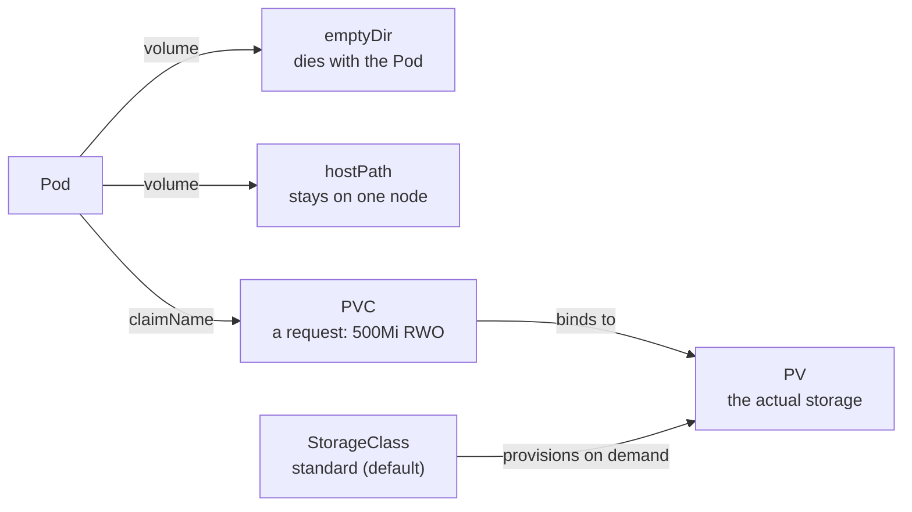
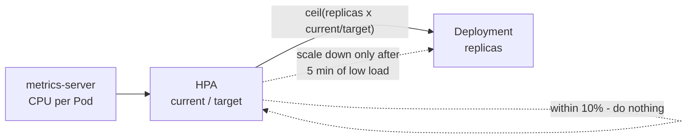

Storage, HPA and Probes – Learning Notes
=======================================

Name: Anshul Mohanty    Roll No: 24BCS10191    Section: A

## In one line

Data lives as long as the volume it is on, Pods scale on CPU **relative to their request**, and
probes decide whether a container gets restarted or just gets no traffic.

## The picture

How the HPA decides:

## Mental model

| Volume | Survives Pod delete | Survives node change |
|---|---|---|
| emptyDir | No | No |
| hostPath | Yes | **No** |
| PV / PVC | Yes | Yes (network storage) |

| Reclaim policy | Claim deleted → |
|---|---|
| `Retain` | PV `Released`, data kept |
| `Delete` | PV and disk removed |

| Probe | Fails → |
|---|---|
| Liveness | Container **restarted** |
| Readiness | Removed from Service endpoints, **not** restarted |
| Startup | Holds off the other two until the app is up |

| HPA run | Calculation | Replicas |
|---|---|---|
| Backend, 85% of 50% | ceil(2 × 85/50) | 4 |
| Backend, 81% of 50% | ceil(4 × 81/50) | 7 |
| Mini project, 46% of 30% | ceil(2 × 46/30) | 4 |

## Gotchas

- A PVC with **no** `storageClassName` gets the **default** class and a new dynamic volume - it
  will ignore your hand-made PV. Use `storageClassName: ""` to bind to an existing PV.
- A claim binds a whole PV: asking for 500Mi on a 1Gi PV gives you 1Gi.
- **RWO is per node, not per Pod** - two replicas on one node shared the same RWO volume.
- HPA percentages are of the **CPU request**. No request, no autoscaling.
- 51% against a 50% target does nothing - the HPA has a **10% tolerance** band.
- Scale-down waits **5 minutes** (stabilization window); scale-up is immediate.
- A **port-forward** load generator sends everything to one Pod - generate load through the Service.
- New Pods show `<unknown>` / `FailedGetResourceMetric` for the first minute until metrics-server
  has scraped them.
- A wrong **liveness** path turns a healthy app into a `CrashLoopBackOff`. Probes are immutable on
  a Pod - fix the YAML and recreate.
