Kubernetes Storage, HPA and Probes – Homework
=============================================

Name: Anshul Mohanty    Roll No: 24BCS10191    Section: A

See also: [LEARNING.md](LEARNING.md) - diagram and revision notes for this topic.

Cluster: single-node minikube v1.39.0 (Kubernetes v1.37.0, docker driver, containerd), namespace
`devops-hw`. The **metrics-server** addon was enabled with `minikube addons enable metrics-server` -
without it `kubectl top` fails and every HPA shows `<unknown>`.

| Folder | Contents |
|---|---|
| [01-kubernetes-volumes/](01-kubernetes-volumes/) | Volume manifests + [README](01-kubernetes-volumes/README.md) with the theory notes |
| [hpa/](hpa/) | Backend Deployment, Service, `hpa.yaml`, in-cluster load generator |
| [probes/](probes/) | Liveness, readiness and startup probe demos |
| [mini-project/](mini-project/) | The Session 13 "production-ready web app" |

---

Task 1: Kubernetes Volumes
--------------------------

The concepts (emptyDir, hostPath, PV, PVC, StorageClass, dynamic provisioning) are written up in
[01-kubernetes-volumes/README.md](01-kubernetes-volumes/README.md). This section is the hands-on
proof of each one.

| Type | Lives where | Survives pod deletion? |
|---|---|---|
| `emptyDir` | Inside the Pod | **No** - created with the Pod, deleted with it |
| `hostPath` | A directory on the node | Yes, but only on **that** node |
| PV + PVC | Storage managed by the cluster | Yes - independent of any Pod |

### 1a. emptyDir - shared scratch space, gone with the Pod

```yaml
volumes:
  - name: shared-cache
    emptyDir: {}
```

Two containers in one Pod mount the same `emptyDir`: `writer` (busybox) appends a timestamp every
5 seconds, `reader` (nginx) serves that directory.

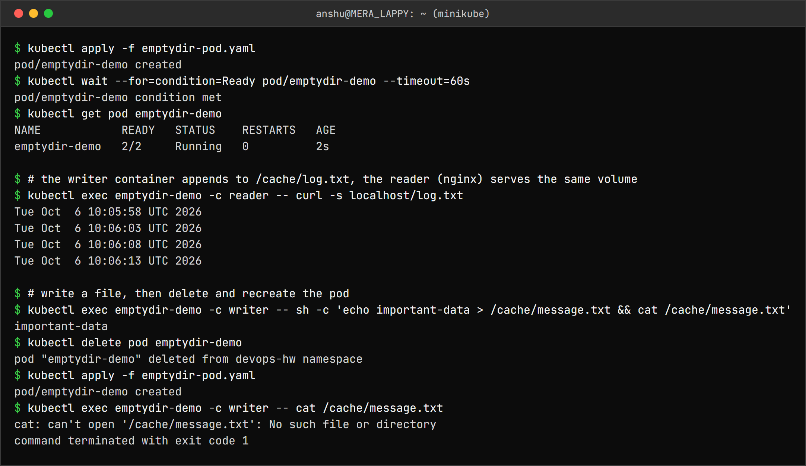

```
$ kubectl apply -f emptydir-pod.yaml
pod/emptydir-demo created
$ kubectl wait --for=condition=Ready pod/emptydir-demo --timeout=60s
pod/emptydir-demo condition met
$ kubectl get pod emptydir-demo
NAME            READY   STATUS    RESTARTS   AGE
emptydir-demo   2/2     Running   0          2s

$ # the writer container appends to /cache/log.txt, the reader (nginx) serves the same volume
$ kubectl exec emptydir-demo -c reader -- curl -s localhost/log.txt
Tue Oct  6 10:05:58 UTC 2026
Tue Oct  6 10:06:03 UTC 2026
Tue Oct  6 10:06:08 UTC 2026
Tue Oct  6 10:06:13 UTC 2026

$ # write a file, then delete and recreate the pod
$ kubectl exec emptydir-demo -c writer -- sh -c 'echo important-data > /cache/message.txt && cat /cache/message.txt'
important-data
$ kubectl delete pod emptydir-demo
pod "emptydir-demo" deleted from devops-hw namespace
$ kubectl apply -f emptydir-pod.yaml
pod/emptydir-demo created
$ kubectl exec emptydir-demo -c writer -- cat /cache/message.txt
cat: can't open '/cache/message.txt': No such file or directory
command terminated with exit code 1
```

The reader served the file the writer was producing - that is the main real use of `emptyDir`,
sharing files **between containers of the same Pod**. After the Pod was deleted and recreated,
`message.txt` was gone: a new Pod gets a brand-new empty directory.

### 1b. hostPath - stored on the node

```yaml
volumes:
  - name: host-storage
    hostPath:
      path: /tmp/hostpath-data
      type: DirectoryOrCreate
```

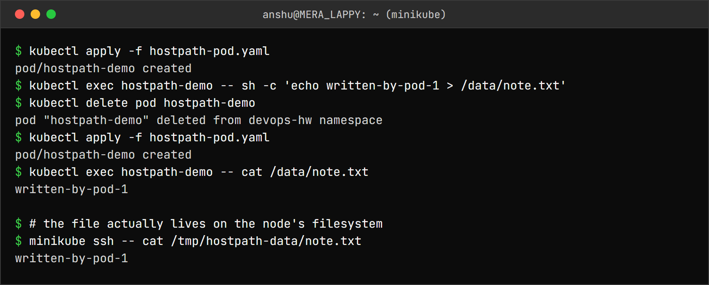

```
$ kubectl apply -f hostpath-pod.yaml
pod/hostpath-demo created
$ kubectl exec hostpath-demo -- sh -c 'echo written-by-pod-1 > /data/note.txt'
$ kubectl delete pod hostpath-demo
pod "hostpath-demo" deleted from devops-hw namespace
$ kubectl apply -f hostpath-pod.yaml
pod/hostpath-demo created
$ kubectl exec hostpath-demo -- cat /data/note.txt
written-by-pod-1

$ # the file actually lives on the node's filesystem
$ minikube ssh -- cat /tmp/hostpath-data/note.txt
written-by-pod-1
```

The file survived the Pod being deleted, and `minikube ssh` shows it really is on the node's disk.
On a multi-node cluster this would break as soon as the replacement Pod landed on a different node
- the data stays behind on the old one. That is why hostPath is for node-level agents (log
collectors, monitoring), not for application data.

### 1c. PersistentVolume + PersistentVolumeClaim (and a binding gotcha)

A PV is the storage; a PVC is a Pod's request for storage. Kubernetes binds a claim to a volume
that satisfies it.

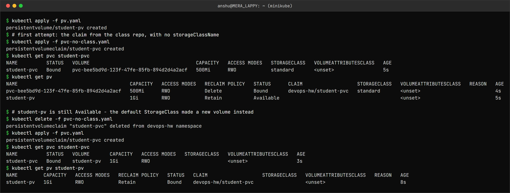

```
$ kubectl apply -f pv.yaml
persistentvolume/student-pv created
$ # first attempt: the claim from the class repo, with no storageClassName
$ kubectl apply -f pvc-no-class.yaml
persistentvolumeclaim/student-pvc created
$ kubectl get pvc student-pvc
NAME          STATUS   VOLUME                                     CAPACITY   ACCESS MODES   STORAGECLASS   VOLUMEATTRIBUTESCLASS   AGE
student-pvc   Bound    pvc-bee5bd9d-123f-47fe-85fb-894d2d4a2acf   500Mi      RWO            standard       <unset>                 5s
$ kubectl get pv
NAME                                       CAPACITY   ACCESS MODES   RECLAIM POLICY   STATUS      CLAIM                   STORAGECLASS   VOLUMEATTRIBUTESCLASS   REASON   AGE
pvc-bee5bd9d-123f-47fe-85fb-894d2d4a2acf   500Mi      RWO            Delete           Bound       devops-hw/student-pvc   standard       <unset>                          4s
student-pv                                 1Gi        RWO            Retain           Available                                          <unset>                          5s

$ # student-pv is still Available - the default StorageClass made a new volume instead
$ kubectl delete -f pvc-no-class.yaml
persistentvolumeclaim "student-pvc" deleted from devops-hw namespace
$ kubectl apply -f pvc.yaml
persistentvolumeclaim/student-pvc created
$ kubectl get pvc student-pvc
NAME          STATUS   VOLUME       CAPACITY   ACCESS MODES   STORAGECLASS   VOLUMEATTRIBUTESCLASS   AGE
student-pvc   Bound    student-pv   1Gi        RWO                           <unset>                 3s
$ kubectl get pv student-pv
NAME         CAPACITY   ACCESS MODES   RECLAIM POLICY   STATUS   CLAIM                   STORAGECLASS   VOLUMEATTRIBUTESCLASS   REASON   AGE
student-pv   1Gi        RWO            Retain           Bound    devops-hw/student-pvc                  <unset>                          8s
```

**The claim from the class repo did not bind to `student-pv`.** A PVC with no `storageClassName`
gets the cluster's **default** StorageClass (`standard` on minikube), so the provisioner created a
fresh `pvc-bee5...` volume and `student-pv` stayed `Available`. The fix is to opt out of the
default class explicitly:

```yaml
spec:
  storageClassName: ""      # bind to a pre-created PV, do not provision a new one
```

Also visible: the claim asked for `500Mi` but got `1Gi`. A claim binds to a whole PV, so it
receives the full capacity of the volume it matched.

### 1d. Data outlives the Pod - and with `Retain`, outlives the claim

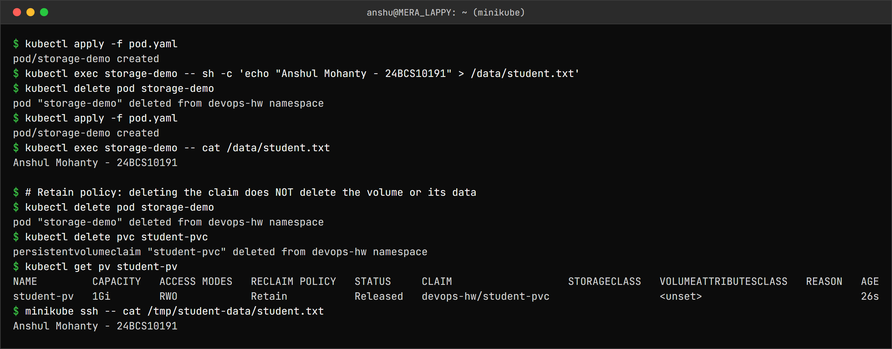

```
$ kubectl apply -f pod.yaml
pod/storage-demo created
$ kubectl exec storage-demo -- sh -c 'echo "Anshul Mohanty - 24BCS10191" > /data/student.txt'
$ kubectl delete pod storage-demo
pod "storage-demo" deleted from devops-hw namespace
$ kubectl apply -f pod.yaml
pod/storage-demo created
$ kubectl exec storage-demo -- cat /data/student.txt
Anshul Mohanty - 24BCS10191

$ # Retain policy: deleting the claim does NOT delete the volume or its data
$ kubectl delete pod storage-demo
pod "storage-demo" deleted from devops-hw namespace
$ kubectl delete pvc student-pvc
persistentvolumeclaim "student-pvc" deleted from devops-hw namespace
$ kubectl get pv student-pv
NAME         CAPACITY   ACCESS MODES   RECLAIM POLICY   STATUS     CLAIM                   STORAGECLASS   VOLUMEATTRIBUTESCLASS   REASON   AGE
student-pv   1Gi        RWO            Retain           Released   devops-hw/student-pvc                  <unset>                          26s
$ minikube ssh -- cat /tmp/student-data/student.txt
Anshul Mohanty - 24BCS10191
```

The second Pod read the file the first Pod wrote. After the claim was deleted, the PV moved to
**`Released`** and the data was still on disk - that is `persistentVolumeReclaimPolicy: Retain`.
A `Released` volume is not handed to a new claim automatically; an admin has to clean it up.

### 1e. StorageClass and dynamic provisioning

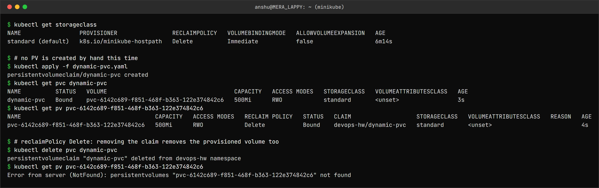

```
$ kubectl get storageclass
NAME                 PROVISIONER                RECLAIMPOLICY   VOLUMEBINDINGMODE   ALLOWVOLUMEEXPANSION   AGE
standard (default)   k8s.io/minikube-hostpath   Delete          Immediate           false                  6m14s

$ # no PV is created by hand this time
$ kubectl apply -f dynamic-pvc.yaml
persistentvolumeclaim/dynamic-pvc created
$ kubectl get pvc dynamic-pvc
NAME          STATUS   VOLUME                                     CAPACITY   ACCESS MODES   STORAGECLASS   VOLUMEATTRIBUTESCLASS   AGE
dynamic-pvc   Bound    pvc-6142c689-f851-468f-b363-122e374842c6   500Mi      RWO            standard       <unset>                 3s
$ kubectl get pv pvc-6142c689-f851-468f-b363-122e374842c6
NAME                                       CAPACITY   ACCESS MODES   RECLAIM POLICY   STATUS   CLAIM                   STORAGECLASS   VOLUMEATTRIBUTESCLASS   REASON   AGE
pvc-6142c689-f851-468f-b363-122e374842c6   500Mi      RWO            Delete           Bound    devops-hw/dynamic-pvc   standard       <unset>                          4s

$ # reclaimPolicy Delete: removing the claim removes the provisioned volume too
$ kubectl delete pvc dynamic-pvc
persistentvolumeclaim "dynamic-pvc" deleted from devops-hw namespace
$ kubectl get pv pvc-6142c689-f851-468f-b363-122e374842c6
Error from server (NotFound): persistentvolumes "pvc-6142c689-f851-468f-b363-122e374842c6" not found
```

| | Static (1c) | Dynamic (1e) |
|---|---|---|
| Who creates the PV | An admin, by hand | The StorageClass provisioner, on demand |
| PV name | `student-pv` | `pvc-<uid>` |
| Reclaim policy here | `Retain` - data kept | `Delete` - PV removed with the claim |

`VOLUMEBINDINGMODE Immediate` means the volume is created as soon as the claim exists. Cloud
StorageClasses usually use `WaitForFirstConsumer` instead, so the disk is created in the same zone
as the node the Pod is scheduled on.

---

Task 2: HPA hands-on
--------------------

The class `hpa.yml` (`hpa/hpa-backend.yaml` in the class repo) scales the `yatri-backend` Deployment
from the Services session, so the same Deployment is included here.

```yaml
apiVersion: autoscaling/v2
kind: HorizontalPodAutoscaler
metadata:
  name: yatri-backend-hpa
spec:
  scaleTargetRef:
    apiVersion: apps/v1
    kind: Deployment
    name: yatri-backend
  minReplicas: 2
  maxReplicas: 10
  metrics:
    - type: Resource
      resource:
        name: cpu
        target:
          type: Utilization
          averageUtilization: 50   # % of the CPU *request* (50m), i.e. 25m per pod
```

The load generator ([hpa/load-generator.yaml](hpa/load-generator.yaml)) runs **inside** the
cluster: 3 busybox pods, each calling the Service in a tight `wget` loop. The class
`load_generator.sh` goes through `kubectl port-forward`, and a port-forward to a Service picks a
**single** Pod - so new replicas would never receive any of the load. Going through the Service
spreads requests over every Pod.

### Deploy and verify

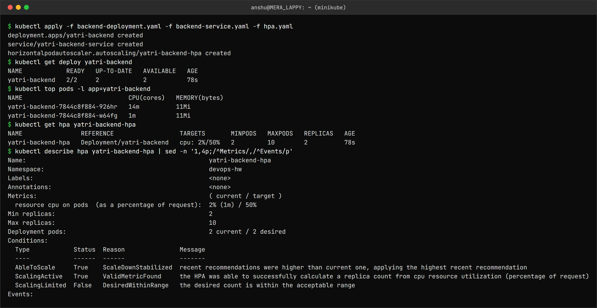

```
$ kubectl apply -f backend-deployment.yaml -f backend-service.yaml -f hpa.yaml
deployment.apps/yatri-backend created
service/yatri-backend-service created
horizontalpodautoscaler.autoscaling/yatri-backend-hpa created
$ kubectl get deploy yatri-backend
NAME            READY   UP-TO-DATE   AVAILABLE   AGE
yatri-backend   2/2     2            2           78s
$ kubectl top pods -l app=yatri-backend
NAME                             CPU(cores)   MEMORY(bytes)
yatri-backend-7844c8f884-926hr   14m          11Mi
yatri-backend-7844c8f884-w64fg   1m           11Mi
$ kubectl get hpa yatri-backend-hpa
NAME                REFERENCE                  TARGETS       MINPODS   MAXPODS   REPLICAS   AGE
yatri-backend-hpa   Deployment/yatri-backend   cpu: 2%/50%   2         10        2          78s
$ kubectl describe hpa yatri-backend-hpa | sed -n '1,4p;/^Metrics/,/^Events/p'
Name:                                                  yatri-backend-hpa
Namespace:                                             devops-hw
Labels:                                                <none>
Annotations:                                           <none>
Metrics:                                               ( current / target )
  resource cpu on pods  (as a percentage of request):  2% (1m) / 50%
Min replicas:                                          2
Max replicas:                                          10
Deployment pods:                                       2 current / 2 desired
Conditions:
  Type            Status  Reason               Message
  ----            ------  ------               -------
  AbleToScale     True    ScaleDownStabilized  recent recommendations were higher than current one, applying the highest recent recommendation
  ScalingActive   True    ValidMetricFound     the HPA was able to successfully calculate a replica count from cpu resource utilization (percentage of request)
  ScalingLimited  False   DesiredWithinRange   the desired count is within the acceptable range
Events:
```

`cpu: 2%/50%` - 2% of the 50m request is ~1m, an idle Python server.

### Increase the load - watch it scale

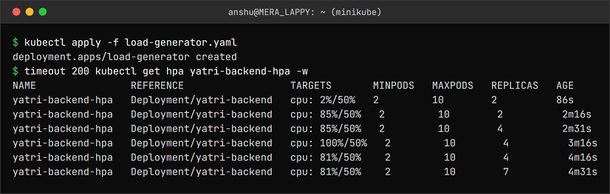

```
$ kubectl apply -f load-generator.yaml
deployment.apps/load-generator created
$ timeout 200 kubectl get hpa yatri-backend-hpa -w
NAME                REFERENCE                  TARGETS       MINPODS   MAXPODS   REPLICAS   AGE
yatri-backend-hpa   Deployment/yatri-backend   cpu: 2%/50%   2         10        2          86s
yatri-backend-hpa   Deployment/yatri-backend   cpu: 85%/50%   2         10        2          2m16s
yatri-backend-hpa   Deployment/yatri-backend   cpu: 85%/50%   2         10        4          2m31s
yatri-backend-hpa   Deployment/yatri-backend   cpu: 100%/50%   2         10        4          3m16s
yatri-backend-hpa   Deployment/yatri-backend   cpu: 81%/50%    2         10        4          4m16s
yatri-backend-hpa   Deployment/yatri-backend   cpu: 81%/50%    2         10        7          4m31s
```

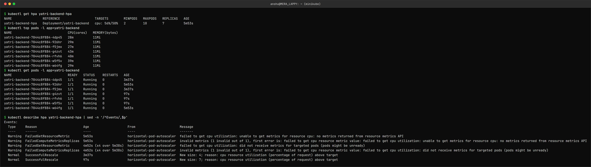

```
$ kubectl get hpa yatri-backend-hpa
NAME                REFERENCE                  TARGETS        MINPODS   MAXPODS   REPLICAS   AGE
yatri-backend-hpa   Deployment/yatri-backend   cpu: 56%/50%   2         10        7          5m53s
$ kubectl top pods -l app=yatri-backend
NAME                             CPU(cores)   MEMORY(bytes)
yatri-backend-7844c8f884-4dp45   28m          11Mi
yatri-backend-7844c8f884-926hr   29m          11Mi
yatri-backend-7844c8f884-f5jmx   27m          11Mi
yatri-backend-7844c8f884-g4zvt   43m          11Mi
yatri-backend-7844c8f884-rfvh6   40m          11Mi
yatri-backend-7844c8f884-w5f5v   39m          11Mi
yatri-backend-7844c8f884-w64fg   29m          11Mi
$ kubectl get pods -l app=yatri-backend
NAME                             READY   STATUS    RESTARTS   AGE
yatri-backend-7844c8f884-4dp45   1/1     Running   0          3m37s
yatri-backend-7844c8f884-926hr   1/1     Running   0          5m53s
yatri-backend-7844c8f884-f5jmx   1/1     Running   0          3m37s
yatri-backend-7844c8f884-g4zvt   1/1     Running   0          97s
yatri-backend-7844c8f884-rfvh6   1/1     Running   0          97s
yatri-backend-7844c8f884-w5f5v   1/1     Running   0          97s
yatri-backend-7844c8f884-w64fg   1/1     Running   0          5m53s

$ kubectl describe hpa yatri-backend-hpa | sed -n '/^Events/,$p'
Events:
  Type     Reason                        Age                    From                       Message
  ----     ------                        ----                   ----                       -------
  Warning  FailedGetResourceMetric       5m53s                  horizontal-pod-autoscaler  failed to get cpu utilization: unable to get metrics for resource cpu: no metrics returned from resource metrics API
  Warning  FailedComputeMetricsReplicas  5m53s                  horizontal-pod-autoscaler  invalid metrics (1 invalid out of 1), first error is: failed to get cpu resource metric value: failed to get cpu utilization: unable to get metrics for resource cpu: no metrics returned from resource metrics API
  Warning  FailedGetResourceMetric       4m52s (x4 over 5m38s)  horizontal-pod-autoscaler  failed to get cpu utilization: did not receive metrics for targeted pods (pods might be unready)
  Warning  FailedComputeMetricsReplicas  4m52s (x4 over 5m38s)  horizontal-pod-autoscaler  invalid metrics (1 invalid out of 1), first error is: failed to get cpu resource metric value: failed to get cpu utilization: did not receive metrics for targeted pods (pods might be unready)
  Normal   SuccessfulRescale             3m37s                  horizontal-pod-autoscaler  New size: 4; reason: cpu resource utilization (percentage of request) above target
  Normal   SuccessfulRescale             97s                    horizontal-pod-autoscaler  New size: 7; reason: cpu resource utilization (percentage of request) above target
```

The HPA formula is `desired = ceil(current × currentUtilization / target)`:

| When | Calculation | Result |
|---|---|---|
| First scale-up | ceil(2 × 85 / 50) = ceil(3.4) | **4** |
| Second scale-up | ceil(4 × 81 / 50) = ceil(6.48) | **7** |
| Under load with 7 pods | 56% vs 50% target - inside the 10% tolerance | stays at **7** |

`kubectl top` shows each Pod at 27-43m against a 50m request, which averages to the 56% the HPA
reports.

The first four events are warnings: `no metrics returned from resource metrics API`. Those were
from the first minute after the Deployment was created - metrics-server needs a scrape or two
before a new Pod has any numbers. The HPA refuses to act on missing data rather than guessing.

### Remove the load - watch it scale down

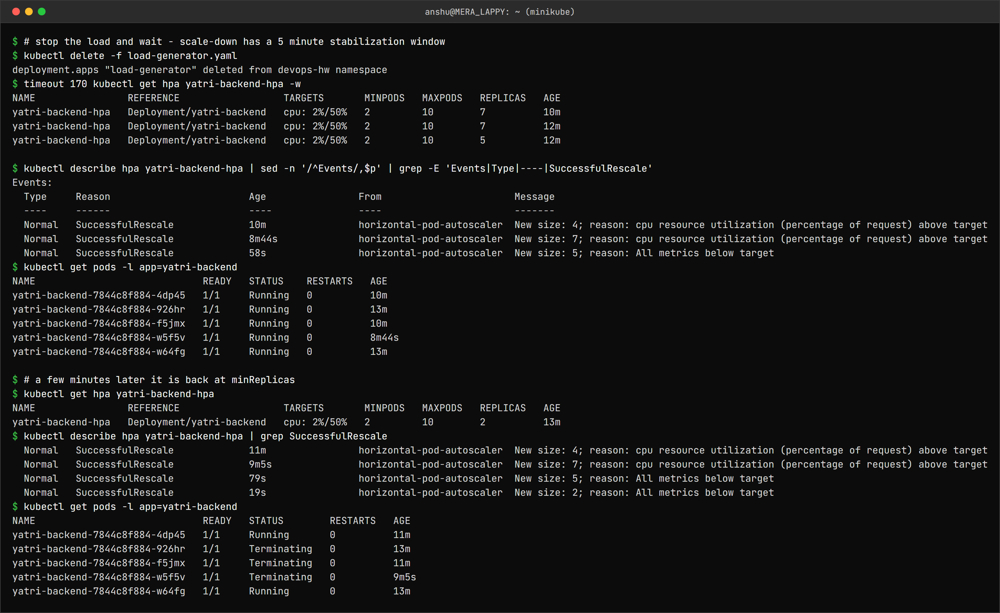

```
$ # stop the load and wait - scale-down has a 5 minute stabilization window
$ kubectl delete -f load-generator.yaml
deployment.apps "load-generator" deleted from devops-hw namespace
$ timeout 170 kubectl get hpa yatri-backend-hpa -w
NAME                REFERENCE                  TARGETS       MINPODS   MAXPODS   REPLICAS   AGE
yatri-backend-hpa   Deployment/yatri-backend   cpu: 2%/50%   2         10        7          10m
yatri-backend-hpa   Deployment/yatri-backend   cpu: 2%/50%   2         10        7          12m
yatri-backend-hpa   Deployment/yatri-backend   cpu: 2%/50%   2         10        5          12m

$ kubectl describe hpa yatri-backend-hpa | sed -n '/^Events/,$p' | grep -E 'Events|Type|----|SuccessfulRescale'
Events:
  Type     Reason                        Age                From                       Message
  ----     ------                        ----               ----                       -------
  Normal   SuccessfulRescale             10m                horizontal-pod-autoscaler  New size: 4; reason: cpu resource utilization (percentage of request) above target
  Normal   SuccessfulRescale             8m44s              horizontal-pod-autoscaler  New size: 7; reason: cpu resource utilization (percentage of request) above target
  Normal   SuccessfulRescale             58s                horizontal-pod-autoscaler  New size: 5; reason: All metrics below target
$ kubectl get pods -l app=yatri-backend
NAME                             READY   STATUS    RESTARTS   AGE
yatri-backend-7844c8f884-4dp45   1/1     Running   0          10m
yatri-backend-7844c8f884-926hr   1/1     Running   0          13m
yatri-backend-7844c8f884-f5jmx   1/1     Running   0          10m
yatri-backend-7844c8f884-w5f5v   1/1     Running   0          8m44s
yatri-backend-7844c8f884-w64fg   1/1     Running   0          13m

$ # a few minutes later it is back at minReplicas
$ kubectl get hpa yatri-backend-hpa
NAME                REFERENCE                  TARGETS       MINPODS   MAXPODS   REPLICAS   AGE
yatri-backend-hpa   Deployment/yatri-backend   cpu: 2%/50%   2         10        2          13m
$ kubectl describe hpa yatri-backend-hpa | grep SuccessfulRescale
  Normal   SuccessfulRescale             11m                horizontal-pod-autoscaler  New size: 4; reason: cpu resource utilization (percentage of request) above target
  Normal   SuccessfulRescale             9m5s               horizontal-pod-autoscaler  New size: 7; reason: cpu resource utilization (percentage of request) above target
  Normal   SuccessfulRescale             79s                horizontal-pod-autoscaler  New size: 5; reason: All metrics below target
  Normal   SuccessfulRescale             19s                horizontal-pod-autoscaler  New size: 2; reason: All metrics below target
$ kubectl get pods -l app=yatri-backend
NAME                             READY   STATUS        RESTARTS   AGE
yatri-backend-7844c8f884-4dp45   1/1     Running       0          11m
yatri-backend-7844c8f884-926hr   1/1     Terminating   0          13m
yatri-backend-7844c8f884-f5jmx   1/1     Terminating   0          11m
yatri-backend-7844c8f884-w5f5v   1/1     Terminating   0          9m5s
yatri-backend-7844c8f884-w64fg   1/1     Running       0          13m
```

CPU was back at 2% within a minute, but the replica count stayed at 7 for about 5 minutes. That
is the **scale-down stabilization window** (300s by default): the HPA uses the *highest*
recommendation from the last 5 minutes, so a short dip in traffic does not tear Pods down only to
need them again. Scale-up has no such delay.

---

Task 3: Probes
--------------

| Probe | Question it answers | When it fails |
|---|---|---|
| Liveness | Is the container still working? | The kubelet **restarts** the container |
| Readiness | Can it take traffic right now? | Removed from Service endpoints - **no restart** |
| Startup | Has it finished starting? | Liveness/readiness are held off until it passes |

### Liveness - a wrong path restarts a healthy container

```yaml
livenessProbe:
  httpGet:
    path: /crash            # nginx returns 404
    port: 80
  periodSeconds: 5
  failureThreshold: 3
```

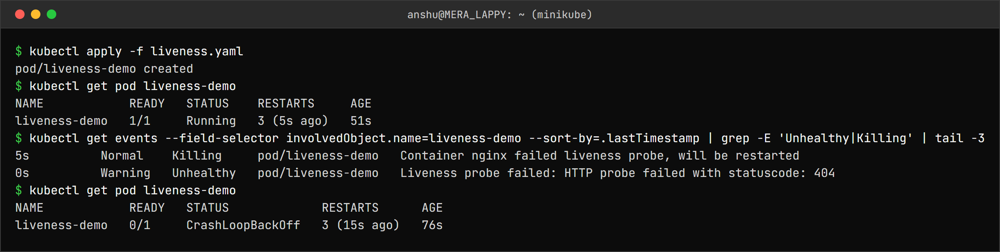

```
$ kubectl apply -f liveness.yaml
pod/liveness-demo created
$ kubectl get pod liveness-demo
NAME            READY   STATUS    RESTARTS     AGE
liveness-demo   1/1     Running   3 (5s ago)   51s
$ kubectl get events --field-selector involvedObject.name=liveness-demo --sort-by=.lastTimestamp | grep -E 'Unhealthy|Killing' | tail -3
5s          Normal    Killing     pod/liveness-demo   Container nginx failed liveness probe, will be restarted
0s          Warning   Unhealthy   pod/liveness-demo   Liveness probe failed: HTTP probe failed with statuscode: 404
$ kubectl get pod liveness-demo
NAME            READY   STATUS             RESTARTS      AGE
liveness-demo   0/1     CrashLoopBackOff   3 (15s ago)   76s
```

nginx itself was perfectly fine - only the probe was wrong. It still got restarted every ~15
seconds (3 failures × 5s), and after a few restarts the kubelet backs off and the Pod shows
**`CrashLoopBackOff`**. A badly written liveness probe can take down a healthy app.

### Readiness - running but receiving no traffic

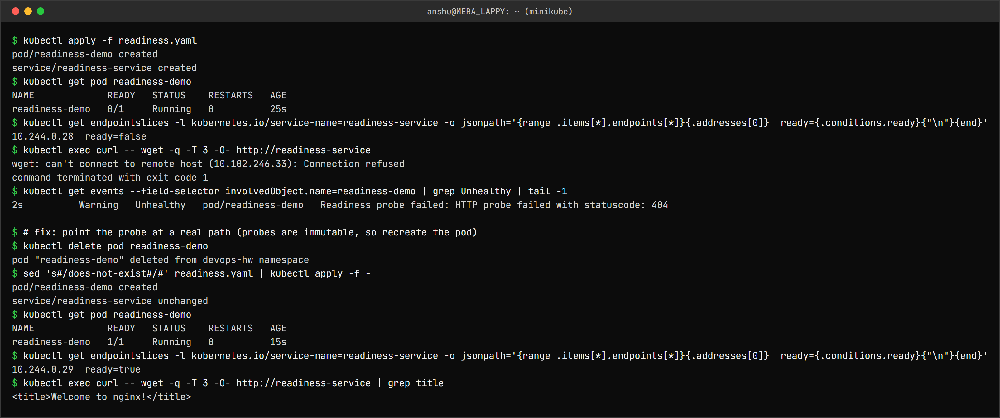

```
$ kubectl apply -f readiness.yaml
pod/readiness-demo created
service/readiness-service created
$ kubectl get pod readiness-demo
NAME             READY   STATUS    RESTARTS   AGE
readiness-demo   0/1     Running   0          25s
$ kubectl get endpointslices -l kubernetes.io/service-name=readiness-service -o jsonpath='{range .items[*].endpoints[*]}{.addresses[0]}  ready={.conditions.ready}{"\n"}{end}'
10.244.0.28  ready=false
$ kubectl exec curl -- wget -q -T 3 -O- http://readiness-service
wget: can't connect to remote host (10.102.246.33): Connection refused
command terminated with exit code 1
$ kubectl get events --field-selector involvedObject.name=readiness-demo | grep Unhealthy | tail -1
2s          Warning   Unhealthy   pod/readiness-demo   Readiness probe failed: HTTP probe failed with statuscode: 404

$ # fix: point the probe at a real path (probes are immutable, so recreate the pod)
$ kubectl delete pod readiness-demo
pod "readiness-demo" deleted from devops-hw namespace
$ sed 's#/does-not-exist#/#' readiness.yaml | kubectl apply -f -
pod/readiness-demo created
service/readiness-service unchanged
$ kubectl get pod readiness-demo
NAME             READY   STATUS    RESTARTS   AGE
readiness-demo   1/1     Running   0          15s
$ kubectl get endpointslices -l kubernetes.io/service-name=readiness-service -o jsonpath='{range .items[*].endpoints[*]}{.addresses[0]}  ready={.conditions.ready}{"\n"}{end}'
10.244.0.29  ready=true
$ kubectl exec curl -- wget -q -T 3 -O- http://readiness-service | grep title
<title>Welcome to nginx!</title>
```

With the broken readiness probe the Pod was `Running` with **0 restarts**, but `0/1` ready, its
endpoint marked `ready=false`, and a request through the Service was refused. After fixing the
path, the same Service returned the nginx page.

### Startup - protecting a slow starter

The container sleeps 25 seconds before starting nginx. The startup probe allows up to
30 × 2s = 60s.

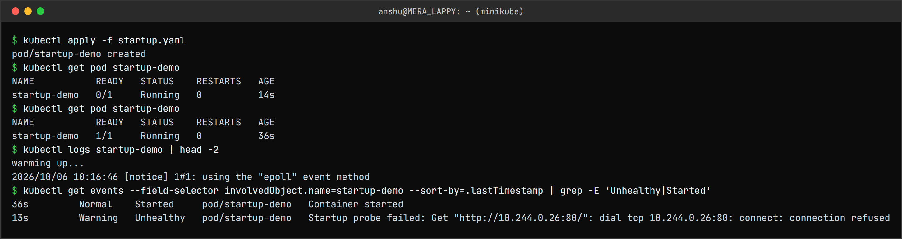

```
$ kubectl apply -f startup.yaml
pod/startup-demo created
$ kubectl get pod startup-demo
NAME           READY   STATUS    RESTARTS   AGE
startup-demo   0/1     Running   0          14s
$ kubectl get pod startup-demo
NAME           READY   STATUS    RESTARTS   AGE
startup-demo   1/1     Running   0          36s
$ kubectl logs startup-demo | head -2
warming up...
2026/10/06 10:16:46 [notice] 1#1: using the "epoll" event method
$ kubectl get events --field-selector involvedObject.name=startup-demo --sort-by=.lastTimestamp | grep -E 'Unhealthy|Started'
36s         Normal    Started     pod/startup-demo   Container started
13s         Warning   Unhealthy   pod/startup-demo   Startup probe failed: Get "http://10.244.0.26:80/": dial tcp 10.244.0.26:80: connect: connection refused
```

At 14s the Pod was `0/1` and the startup probe was failing with `connection refused`, but the
Pod was **not** restarted. Once nginx came up, the startup probe passed, liveness and readiness
took over, and the Pod became `1/1` with `RESTARTS 0`. Without the startup probe, a liveness probe
would have killed the container before it ever finished starting.

---

Task 4: Mini Project - production-ready web app
-----------------------------------------------

Namespace `production-webapp`: a 500Mi PVC, a 2-replica nginx Deployment with CPU requests/limits,
all three probes, the PVC mounted at `/data`, `strategy: Recreate`, a ClusterIP Service and an HPA
(2-5 replicas at 50% CPU). Files are in [mini-project/](mini-project/).

### Deploy

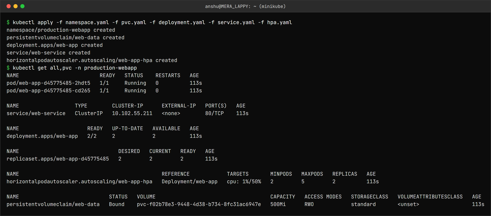

```
$ kubectl apply -f namespace.yaml -f pvc.yaml -f deployment.yaml -f service.yaml -f hpa.yaml
namespace/production-webapp created
persistentvolumeclaim/web-data created
deployment.apps/web-app created
service/web-service created
horizontalpodautoscaler.autoscaling/web-app-hpa created
$ kubectl get all,pvc -n production-webapp
NAME                          READY   STATUS    RESTARTS   AGE
pod/web-app-d45775485-2hdt5   1/1     Running   0          113s
pod/web-app-d45775485-cd265   1/1     Running   0          113s

NAME                  TYPE        CLUSTER-IP      EXTERNAL-IP   PORT(S)   AGE
service/web-service   ClusterIP   10.102.55.211   <none>        80/TCP    113s

NAME                      READY   UP-TO-DATE   AVAILABLE   AGE
deployment.apps/web-app   2/2     2            2           113s

NAME                                DESIRED   CURRENT   READY   AGE
replicaset.apps/web-app-d45775485   2         2         2       113s

NAME                                              REFERENCE            TARGETS       MINPODS   MAXPODS   REPLICAS   AGE
horizontalpodautoscaler.autoscaling/web-app-hpa   Deployment/web-app   cpu: 1%/50%   2         5         2          113s

NAME                             STATUS   VOLUME                                     CAPACITY   ACCESS MODES   STORAGECLASS   VOLUMEATTRIBUTESCLASS   AGE
persistentvolumeclaim/web-data   Bound    pvc-f02b78e3-9448-4d38-b734-8fc31ac6947e   500Mi      RWO            standard       <unset>                 113s
```

The PVC has no `storageClassName`, so it was dynamically provisioned from `standard` - here that
is what we want (compare 1c).

### Persistence and access

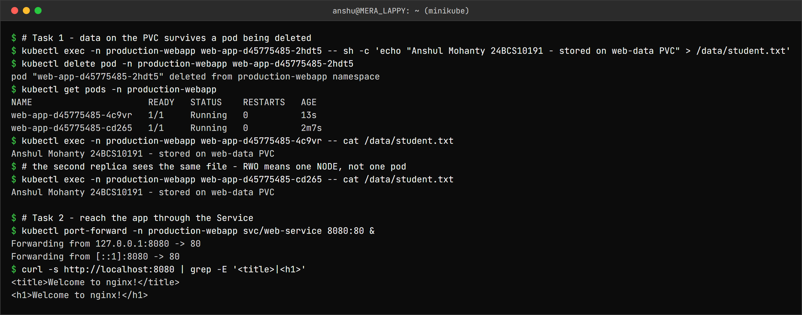

```
$ # Task 1 - data on the PVC survives a pod being deleted
$ kubectl exec -n production-webapp web-app-d45775485-2hdt5 -- sh -c 'echo "Anshul Mohanty 24BCS10191 - stored on web-data PVC" > /data/student.txt'
$ kubectl delete pod -n production-webapp web-app-d45775485-2hdt5
pod "web-app-d45775485-2hdt5" deleted from production-webapp namespace
$ kubectl get pods -n production-webapp
NAME                      READY   STATUS    RESTARTS   AGE
web-app-d45775485-4c9vr   1/1     Running   0          13s
web-app-d45775485-cd265   1/1     Running   0          2m7s
$ kubectl exec -n production-webapp web-app-d45775485-4c9vr -- cat /data/student.txt
Anshul Mohanty 24BCS10191 - stored on web-data PVC
$ # the second replica sees the same file - RWO means one NODE, not one pod
$ kubectl exec -n production-webapp web-app-d45775485-cd265 -- cat /data/student.txt
Anshul Mohanty 24BCS10191 - stored on web-data PVC

$ # Task 2 - reach the app through the Service
$ kubectl port-forward -n production-webapp svc/web-service 8080:80 &
Forwarding from 127.0.0.1:8080 -> 80
Forwarding from [::1]:8080 -> 80
$ curl -s http://localhost:8080 | grep -E '<title>|<h1>'
<title>Welcome to nginx!</title>
<h1>Welcome to nginx!</h1>
```

Both replicas could read the same file even though the PVC is `ReadWriteOnce`. **RWO means one
node, not one Pod** - on a single-node cluster every replica is on that node. On a real multi-node
cluster a second replica on another node would get stuck in `ContainerCreating` waiting for the
volume (`ReadWriteOncePod` is the mode that limits it to a single Pod). This is also why the
Deployment uses `strategy: Recreate`: with RWO, a rolling update could try to start the new Pod
on a different node while the old one still holds the volume.

### Autoscaling under load

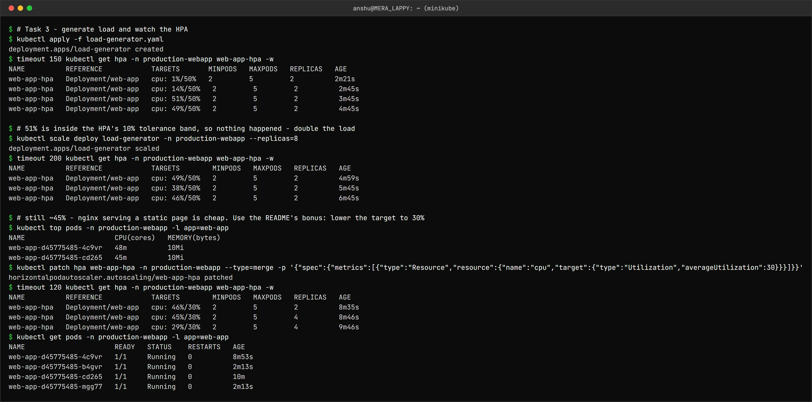

```
$ # Task 3 - generate load and watch the HPA
$ kubectl apply -f load-generator.yaml
deployment.apps/load-generator created
$ timeout 150 kubectl get hpa -n production-webapp web-app-hpa -w
NAME          REFERENCE            TARGETS       MINPODS   MAXPODS   REPLICAS   AGE
web-app-hpa   Deployment/web-app   cpu: 1%/50%   2         5         2          2m21s
web-app-hpa   Deployment/web-app   cpu: 14%/50%   2         5         2          2m45s
web-app-hpa   Deployment/web-app   cpu: 51%/50%   2         5         2          3m45s
web-app-hpa   Deployment/web-app   cpu: 49%/50%   2         5         2          4m45s

$ # 51% is inside the HPA's 10% tolerance band, so nothing happened - double the load
$ kubectl scale deploy load-generator -n production-webapp --replicas=8
deployment.apps/load-generator scaled
$ timeout 200 kubectl get hpa -n production-webapp web-app-hpa -w
NAME          REFERENCE            TARGETS        MINPODS   MAXPODS   REPLICAS   AGE
web-app-hpa   Deployment/web-app   cpu: 49%/50%   2         5         2          4m59s
web-app-hpa   Deployment/web-app   cpu: 38%/50%   2         5         2          5m45s
web-app-hpa   Deployment/web-app   cpu: 46%/50%   2         5         2          6m45s

$ # still ~45% - nginx serving a static page is cheap. Use the README's bonus: lower the target to 30%
$ kubectl top pods -n production-webapp -l app=web-app
NAME                      CPU(cores)   MEMORY(bytes)
web-app-d45775485-4c9vr   48m          10Mi
web-app-d45775485-cd265   45m          10Mi
$ kubectl patch hpa web-app-hpa -n production-webapp --type=merge -p '{"spec":{"metrics":[{"type":"Resource","resource":{"name":"cpu","target":{"type":"Utilization","averageUtilization":30}}}]}}'
horizontalpodautoscaler.autoscaling/web-app-hpa patched
$ timeout 120 kubectl get hpa -n production-webapp web-app-hpa -w
NAME          REFERENCE            TARGETS        MINPODS   MAXPODS   REPLICAS   AGE
web-app-hpa   Deployment/web-app   cpu: 46%/30%   2         5         2          8m35s
web-app-hpa   Deployment/web-app   cpu: 45%/30%   2         5         4          8m46s
web-app-hpa   Deployment/web-app   cpu: 29%/30%   2         5         4          9m46s
$ kubectl get pods -n production-webapp -l app=web-app
NAME                      READY   STATUS    RESTARTS   AGE
web-app-d45775485-4c9vr   1/1     Running   0          8m53s
web-app-d45775485-b4gvr   1/1     Running   0          2m13s
web-app-d45775485-cd265   1/1     Running   0          10m
web-app-d45775485-mgg77   1/1     Running   0          2m13s
```

This did not go as smoothly as Task 2, and the reason is worth writing down:

1. With 4 load pods the CPU reached **51%** against a 50% target - and nothing happened. The HPA
   ignores differences within a **10% tolerance** (0.9-1.1 of the target) to avoid flapping.
2. Doubling the load generators to 8 did not push it higher. `kubectl top` showed each nginx Pod
   at ~45-48m: nginx serving a static page is very cheap, and each `wget` loop is limited by
   round-trip time, not CPU. The node itself was only at 13%.
3. The project README's bonus step - **lowering the target to 30%** - fixed it:
   ceil(2 × 46 / 30) = ceil(3.07) = **4 replicas**, after which the average fell to 29% and the
   HPA held there.

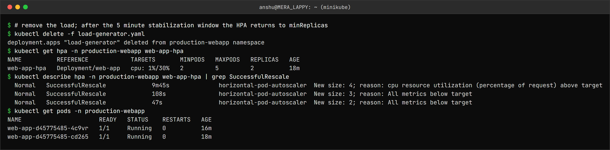

```
$ # remove the load; after the 5 minute stabilization window the HPA returns to minReplicas
$ kubectl delete -f load-generator.yaml
deployment.apps "load-generator" deleted from production-webapp namespace
$ kubectl get hpa -n production-webapp web-app-hpa
NAME          REFERENCE            TARGETS       MINPODS   MAXPODS   REPLICAS   AGE
web-app-hpa   Deployment/web-app   cpu: 1%/30%   2         5         2          18m
$ kubectl describe hpa -n production-webapp web-app-hpa | grep SuccessfulRescale
  Normal   SuccessfulRescale             9m45s              horizontal-pod-autoscaler  New size: 4; reason: cpu resource utilization (percentage of request) above target
  Normal   SuccessfulRescale             108s               horizontal-pod-autoscaler  New size: 3; reason: All metrics below target
  Normal   SuccessfulRescale             47s                horizontal-pod-autoscaler  New size: 2; reason: All metrics below target
$ kubectl get pods -n production-webapp
NAME                      READY   STATUS    RESTARTS   AGE
web-app-d45775485-4c9vr   1/1     Running   0          16m
web-app-d45775485-cd265   1/1     Running   0          18m
```

---

What I understood
-----------------

- A container's filesystem is temporary. **Where** data lives decides how long it lasts:
  emptyDir (Pod's lifetime), hostPath (node's lifetime), PV (independent of both).
- A PVC is a request, a PV is the supply, and a StorageClass is a factory that builds the supply
  on demand. Most real clusters use dynamic provisioning; static PVs are the exception.
- A claim with no `storageClassName` is **not** "no class" - it silently gets the default class.
  `storageClassName: ""` is how you say "bind to an existing PV".
- `Retain` vs `Delete` is the difference between "deleting the claim leaves the data for an admin"
  and "deleting the claim destroys the disk". Production databases should be on `Retain`.
- `ReadWriteOnce` is per **node**, not per Pod.
- HPA percentages are relative to the CPU **request**, not the limit and not the node. No request
  means the HPA cannot calculate anything.
- HPA needs metrics-server, ignores changes within 10% of the target, scales up quickly and scales
  down only after a 5 minute stabilization window.
- The load generator has to go through the Service. A port-forward pins everything to one Pod.
- Liveness failure = restart, readiness failure = no traffic, startup probe = grace period for slow
  starters. A wrong liveness probe produces a CrashLoopBackOff on a perfectly healthy app.
