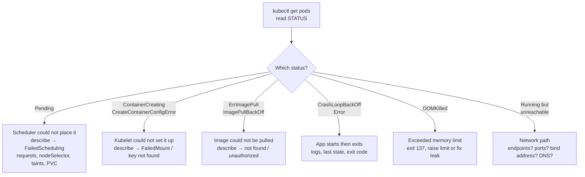
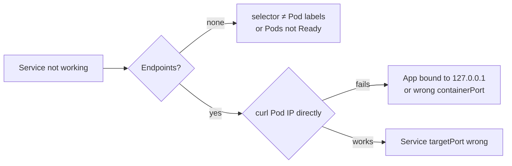

Kubernetes Troubleshooting – Learning Notes
===========================================

Name: Anshul Mohanty    Roll No: 24BCS10191    Section: A

## In one line

The Pod's STATUS tells you **which stage** failed - scheduling, setup, or the app itself - and
that tells you which command will have the answer.

## The picture

Service problems:

## Mental model

| Command | Best for |
|---|---|
| `get -o wide` | State, IP, node at a glance |
| `describe` | Events - anything before the app runs |
| `logs` / `logs -l app=x --prefix` | What the app said (all Pods with `-l`) |
| `exec` | Inside view: `netstat`, `resolv.conf`, `env` |
| `events --for` | Timeline of one object |
| `explain` | Field docs offline |
| `top` | Real CPU/memory vs requests and limits |

| Exit code | Meaning |
|---|---|
| 1 | The app chose to fail |
| 137 | SIGKILL - usually OOMKilled |
| 143 | SIGTERM - normal shutdown |

## Gotchas

- `CrashLoopBackOff` and `ImagePullBackOff` are **waiting** states; `kubectl get` often shows
  `Error` / `ErrImagePull` instead. Use `get -w` to see the cycle.
- `kubectl logs deploy/x` reads **one** Pod. Use `-l app=x --prefix` for all of them.
- Pending Pods have no IP and no logs - only the scheduler's events explain them.
- A missing ConfigMap **volume** fixes itself once the ConfigMap exists; a wrong **key** in the
  Pod spec needs the Pod recreated.
- After fixing a Service, wait a few seconds - kube-proxy has to update the rules.
- Short DNS names resolve in the **caller's** namespace. `ndots:5` makes failures look like slow
  timeouts.
- A server bound to `127.0.0.1` works in `exec` and fails from every other Pod.
- An OOMKilled app's logs just stop - no error message, because the kernel killed it.
