Kubernetes Troubleshooting – Homework
=====================================

Name: Anshul Mohanty    Roll No: 24BCS10191    Section: A

See also: [LEARNING.md](LEARNING.md) - diagram and revision notes for this topic.

Cluster: single-node minikube v1.39.0 (Kubernetes v1.37.0, docker driver, containerd), namespace
`devops-hw`, metrics-server enabled.

| Folder | Contents |
|---|---|
| [app/](app/) | A healthy 2-replica nginx Deployment, its Service, and a DNS debugging Pod |
| [scenarios/](scenarios/) | Nine broken manifests, each with its fix |
| [mini-project/](mini-project/) | The Session 14 troubleshooting mini project |

Every scenario follows the same five steps: **identify → investigate → root cause → fix → verify**.
The steps are marked as comments inside each screenshot.

---

Task 1: The troubleshooting commands
------------------------------------

Run against the healthy app in [app/](app/) so the normal output is known before anything breaks.

| Command | What it answers |
|---|---|
| `kubectl get` | What exists and what state is it in? |
| `kubectl get -o wide` | ...plus Pod IP and which node |
| `kubectl describe` | Full detail of one object **and its events** |
| `kubectl logs` | What did the application print? |
| `kubectl exec` | What does it look like from inside the container? |
| `kubectl events` / `get events` | What has the cluster been doing, in order? |
| `kubectl explain` | What does this YAML field mean? (built-in API docs) |
| `kubectl top` | How much CPU/memory is actually being used? |

### get and describe

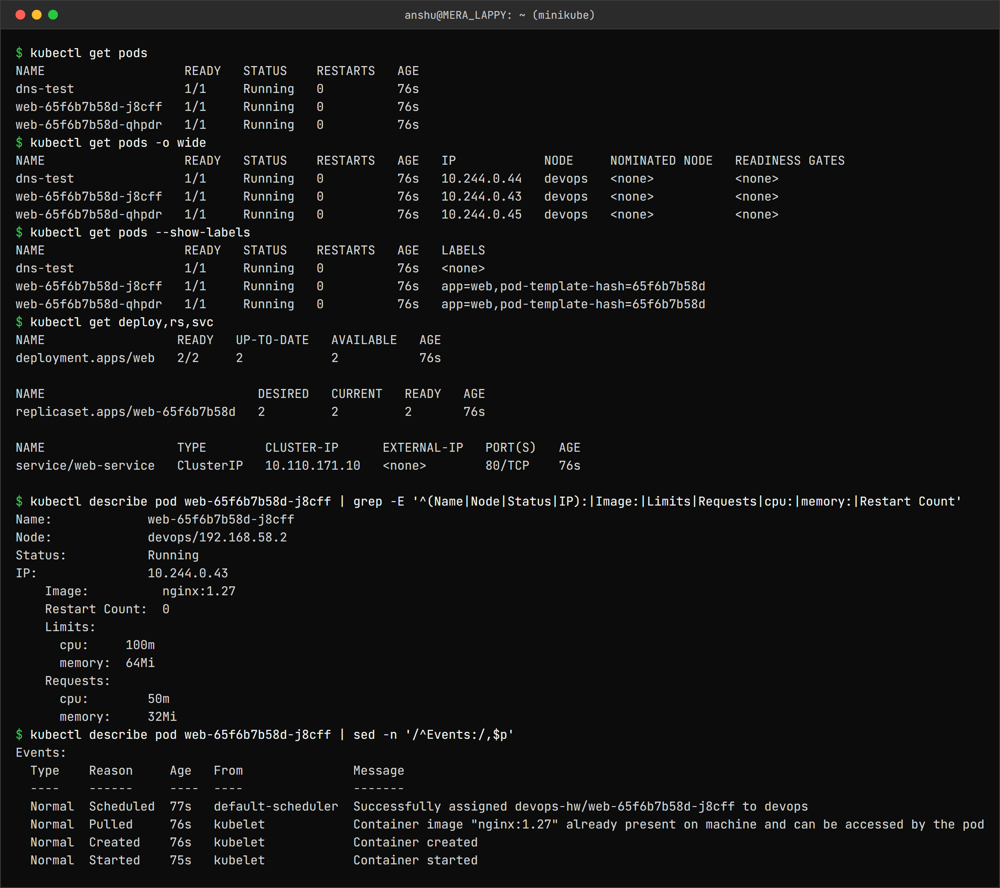

```
$ kubectl get pods
NAME                   READY   STATUS    RESTARTS   AGE
dns-test               1/1     Running   0          76s
web-65f6b7b58d-j8cff   1/1     Running   0          76s
web-65f6b7b58d-qhpdr   1/1     Running   0          76s
$ kubectl get pods -o wide
NAME                   READY   STATUS    RESTARTS   AGE   IP            NODE     NOMINATED NODE   READINESS GATES
dns-test               1/1     Running   0          76s   10.244.0.44   devops   <none>           <none>
web-65f6b7b58d-j8cff   1/1     Running   0          76s   10.244.0.43   devops   <none>           <none>
web-65f6b7b58d-qhpdr   1/1     Running   0          76s   10.244.0.45   devops   <none>           <none>
$ kubectl get pods --show-labels
NAME                   READY   STATUS    RESTARTS   AGE   LABELS
dns-test               1/1     Running   0          76s   <none>
web-65f6b7b58d-j8cff   1/1     Running   0          76s   app=web,pod-template-hash=65f6b7b58d
web-65f6b7b58d-qhpdr   1/1     Running   0          76s   app=web,pod-template-hash=65f6b7b58d
$ kubectl get deploy,rs,svc
NAME                  READY   UP-TO-DATE   AVAILABLE   AGE
deployment.apps/web   2/2     2            2           76s

NAME                             DESIRED   CURRENT   READY   AGE
replicaset.apps/web-65f6b7b58d   2         2         2       76s

NAME                  TYPE        CLUSTER-IP      EXTERNAL-IP   PORT(S)   AGE
service/web-service   ClusterIP   10.110.171.10   <none>        80/TCP    76s

$ kubectl describe pod web-65f6b7b58d-j8cff | grep -E '^(Name|Node|Status|IP):|Image:|Limits|Requests|cpu:|memory:|Restart Count'
Name:             web-65f6b7b58d-j8cff
Node:             devops/192.168.58.2
Status:           Running
IP:               10.244.0.43
    Image:          nginx:1.27
    Restart Count:  0
    Limits:
      cpu:     100m
      memory:  64Mi
    Requests:
      cpu:        50m
      memory:     32Mi
$ kubectl describe pod web-65f6b7b58d-j8cff | sed -n '/^Events:/,$p'
Events:
  Type    Reason     Age   From               Message
  ----    ------     ----  ----               -------
  Normal  Scheduled  77s   default-scheduler  Successfully assigned devops-hw/web-65f6b7b58d-j8cff to devops
  Normal  Pulled     76s   kubelet            Container image "nginx:1.27" already present on machine and can be accessed by the pod
  Normal  Created    76s   kubelet            Container created
  Normal  Started    75s   kubelet            Container started
```

`get` gives one line per object; `describe` gives everything about one object, and the **Events**
section at the bottom is usually where the answer is.

### logs and exec

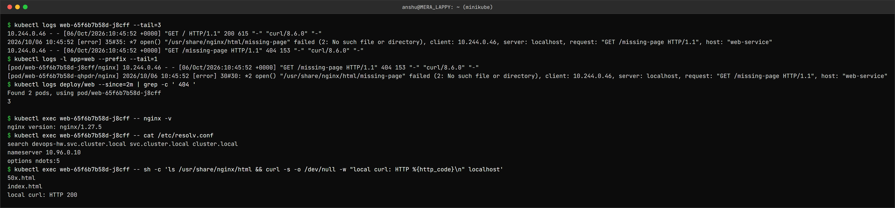

```
$ kubectl logs web-65f6b7b58d-j8cff --tail=3
10.244.0.46 - - [06/Oct/2026:10:45:52 +0000] "GET / HTTP/1.1" 200 615 "-" "curl/8.6.0" "-"
2026/10/06 10:45:52 [error] 35#35: *7 open() "/usr/share/nginx/html/missing-page" failed (2: No such file or directory), client: 10.244.0.46, server: localhost, request: "GET /missing-page HTTP/1.1", host: "web-service"
10.244.0.46 - - [06/Oct/2026:10:45:52 +0000] "GET /missing-page HTTP/1.1" 404 153 "-" "curl/8.6.0" "-"
$ kubectl logs -l app=web --prefix --tail=1
[pod/web-65f6b7b58d-j8cff/nginx] 10.244.0.46 - - [06/Oct/2026:10:45:52 +0000] "GET /missing-page HTTP/1.1" 404 153 "-" "curl/8.6.0" "-"
[pod/web-65f6b7b58d-qhpdr/nginx] 2026/10/06 10:45:52 [error] 30#30: *2 open() "/usr/share/nginx/html/missing-page" failed (2: No such file or directory), client: 10.244.0.46, server: localhost, request: "GET /missing-page HTTP/1.1", host: "web-service"
$ kubectl logs deploy/web --since=2m | grep -c ' 404 '
Found 2 pods, using pod/web-65f6b7b58d-j8cff
3

$ kubectl exec web-65f6b7b58d-j8cff -- nginx -v
nginx version: nginx/1.27.5
$ kubectl exec web-65f6b7b58d-j8cff -- cat /etc/resolv.conf
search devops-hw.svc.cluster.local svc.cluster.local cluster.local
nameserver 10.96.0.10
options ndots:5
$ kubectl exec web-65f6b7b58d-j8cff -- sh -c 'ls /usr/share/nginx/html && curl -s -o /dev/null -w "local curl: HTTP %{http_code}\n" localhost'
50x.html
index.html
local curl: HTTP 200
```

Requests (two of them to a missing page) were sent to the Service before this was captured.
`kubectl logs deploy/web` printed **"Found 2 pods, using pod/..."** and counted only 3 of the 4 404s
- for a Deployment it reads **one** Pod's logs. `-l app=web --prefix` reads all of them and labels
each line with its Pod. `exec` shows the Pod's own view: the DNS search path in `resolv.conf`
and nginx answering on `localhost`.

### events, explain, top

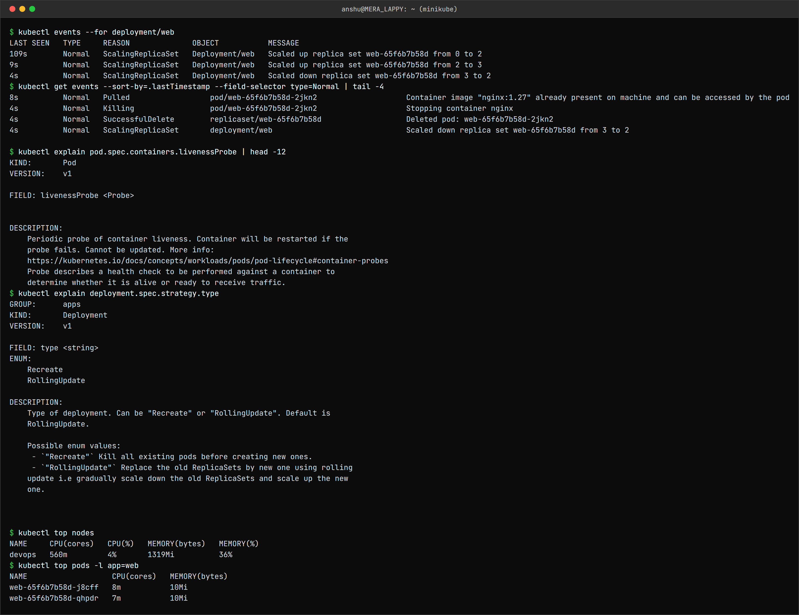

```
$ kubectl events --for deployment/web
LAST SEEN   TYPE     REASON              OBJECT           MESSAGE
109s        Normal   ScalingReplicaSet   Deployment/web   Scaled up replica set web-65f6b7b58d from 0 to 2
9s          Normal   ScalingReplicaSet   Deployment/web   Scaled up replica set web-65f6b7b58d from 2 to 3
4s          Normal   ScalingReplicaSet   Deployment/web   Scaled down replica set web-65f6b7b58d from 3 to 2
$ kubectl get events --sort-by=.lastTimestamp --field-selector type=Normal | tail -4
8s          Normal   Pulled                  pod/web-65f6b7b58d-2jkn2                    Container image "nginx:1.27" already present on machine and can be accessed by the pod
4s          Normal   Killing                 pod/web-65f6b7b58d-2jkn2                    Stopping container nginx
4s          Normal   SuccessfulDelete        replicaset/web-65f6b7b58d                   Deleted pod: web-65f6b7b58d-2jkn2
4s          Normal   ScalingReplicaSet       deployment/web                              Scaled down replica set web-65f6b7b58d from 3 to 2

$ kubectl explain pod.spec.containers.livenessProbe | head -12
KIND:       Pod
VERSION:    v1

FIELD: livenessProbe <Probe>


DESCRIPTION:
    Periodic probe of container liveness. Container will be restarted if the
    probe fails. Cannot be updated. More info:
    https://kubernetes.io/docs/concepts/workloads/pods/pod-lifecycle#container-probes
    Probe describes a health check to be performed against a container to
    determine whether it is alive or ready to receive traffic.
$ kubectl explain deployment.spec.strategy.type
GROUP:      apps
KIND:       Deployment
VERSION:    v1

FIELD: type <string>
ENUM:
    Recreate
    RollingUpdate

DESCRIPTION:
    Type of deployment. Can be "Recreate" or "RollingUpdate". Default is
    RollingUpdate.

    Possible enum values:
     - `"Recreate"` Kill all existing pods before creating new ones.
     - `"RollingUpdate"` Replace the old ReplicaSets by new one using rolling
    update i.e gradually scale down the old ReplicaSets and scale up the new
    one.


$ kubectl top nodes
NAME     CPU(cores)   CPU(%)   MEMORY(bytes)   MEMORY(%)
devops   560m         4%       1319Mi          36%
$ kubectl top pods -l app=web
NAME                   CPU(cores)   MEMORY(bytes)
web-65f6b7b58d-j8cff   8m           10Mi
web-65f6b7b58d-qhpdr   7m           10Mi
```

The Deployment was scaled 2 → 3 → 2 just before this, so the events show the full chain:
Deployment scales the ReplicaSet, the ReplicaSet deletes a Pod, the kubelet stops the container.
`kubectl explain` needs no internet - note that it says a liveness probe **"Cannot be updated"**,
which is why every Pod fix below replaces the Pod instead of editing it.

---

Task 2: Troubleshooting common issues
-------------------------------------

| # | Issue | STATUS seen | Where the answer was | Root cause |
|---|---|---|---|---|
| 1 | CrashLoopBackOff | `Error` / `CrashLoopBackOff` | `kubectl logs` | Required env var missing, app exits 1 |
| 2 | ErrImagePull / ImagePullBackOff | `ErrImagePull` → `ImagePullBackOff` | `describe` events | Image tag does not exist |
| 3 | Pending | `Pending`, no node, no IP | `describe` events | Requests 500 CPU / 1000Gi |
| 4 | ContainerCreating | `ContainerCreating` forever | `describe` events (`FailedMount`) | Mounted ConfigMap does not exist |
| 5 | Configuration issue | `CreateContainerConfigError` | `describe` events | Wrong ConfigMap key name |
| 6 | Service connectivity | Pods fine, Service refuses | `describe svc` | `targetPort` 8080, app on 80 |
| 7 | DNS | `Resolving timed out` | `resolv.conf` + `nslookup` | Short name used across namespaces |
| 8 | Pod networking | Pod fine, unreachable on its IP | `exec` + `netstat` | App bound to 127.0.0.1 |
| 9 | OOMKilled | `OOMKilled`, exit 137 | `describe` last state | 20Mi limit, app needs ~110Mi |

Pod specs are mostly immutable, so Pod fixes use `kubectl replace --force -f fixed.yaml` (delete
and recreate in one step).

### 1. CrashLoopBackOff

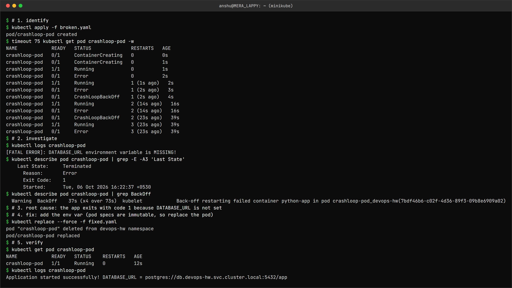

```
$ # 1. identify
$ kubectl apply -f broken.yaml
pod/crashloop-pod created
$ timeout 75 kubectl get pod crashloop-pod -w
NAME            READY   STATUS              RESTARTS   AGE
crashloop-pod   0/1     ContainerCreating   0          0s
crashloop-pod   0/1     ContainerCreating   0          1s
crashloop-pod   1/1     Running             0          1s
crashloop-pod   0/1     Error               0          2s
crashloop-pod   1/1     Running             1 (1s ago)   2s
crashloop-pod   0/1     Error               1 (2s ago)   3s
crashloop-pod   0/1     CrashLoopBackOff    1 (2s ago)   4s
crashloop-pod   1/1     Running             2 (14s ago)   16s
crashloop-pod   0/1     Error               2 (14s ago)   16s
crashloop-pod   0/1     CrashLoopBackOff    2 (23s ago)   39s
crashloop-pod   1/1     Running             3 (23s ago)   39s
crashloop-pod   0/1     Error               3 (23s ago)   39s
$ # 2. investigate
$ kubectl logs crashloop-pod
[FATAL ERROR]: DATABASE_URL environment variable is MISSING!
$ kubectl describe pod crashloop-pod | grep -E -A3 'Last State'
    Last State:     Terminated
      Reason:       Error
      Exit Code:    1
      Started:      Tue, 06 Oct 2026 16:22:37 +0530
$ kubectl describe pod crashloop-pod | grep BackOff
  Warning  BackOff    37s (x4 over 73s)  kubelet            Back-off restarting failed container python-app in pod crashloop-pod_devops-hw(7bdf46b6-c02f-4d36-89f3-09b8e6909a02)
$ # 3. root cause: the app exits with code 1 because DATABASE_URL is not set
$ # 4. fix: add the env var (pod specs are immutable, so replace the pod)
$ kubectl replace --force -f fixed.yaml
pod "crashloop-pod" deleted from devops-hw namespace
pod/crashloop-pod replaced
$ # 5. verify
$ kubectl get pod crashloop-pod
NAME            READY   STATUS    RESTARTS   AGE
crashloop-pod   1/1     Running   0          12s
$ kubectl logs crashloop-pod
Application started successfully! DATABASE_URL = postgres://db.devops-hw.svc.cluster.local:5432/app
```

The watch shows the real cycle: `Running` → `Error` (exit 1) → `CrashLoopBackOff` (waiting) →
`Running` again. The gaps between restarts grow - about 14s, then 23s - because the kubelet
doubles the back-off each time (10s, 20s, 40s ... up to 5 minutes). **CrashLoopBackOff is not an error itself**, it
is the kubelet *waiting* before the next restart; the actual error is in the logs. Most of the
time `kubectl get` shows the `Error` state, so watching is the reliable way to see the pattern.

### 2. ErrImagePull and ImagePullBackOff

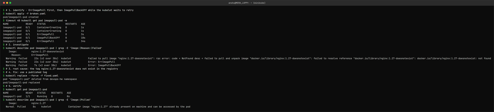

```
$ # 1. identify - ErrImagePull first, then ImagePullBackOff while the kubelet waits to retry
$ kubectl apply -f broken.yaml
pod/imagepull-pod created
$ timeout 40 kubectl get pod imagepull-pod -w
NAME            READY   STATUS              RESTARTS   AGE
imagepull-pod   0/1     ContainerCreating   0          1s
imagepull-pod   0/1     ContainerCreating   0          1s
imagepull-pod   0/1     ErrImagePull        0          3s
imagepull-pod   0/1     ImagePullBackOff    0          18s
imagepull-pod   0/1     ErrImagePull        0          34s
$ # 2. investigate
$ kubectl describe pod imagepull-pod | grep -E 'Image:|Reason:|Failed'
    Image:          nginx:1.27-doesnotexist
      Reason:       ErrImagePull
  Warning  Failed     22s (x2 over 38s)  kubelet            Failed to pull image "nginx:1.27-doesnotexist": rpc error: code = NotFound desc = failed to pull and unpack image "docker.io/library/nginx:1.27-doesnotexist": failed to resolve reference "docker.io/library/nginx:1.27-doesnotexist": docker.io/library/nginx:1.27-doesnotexist: not found
  Warning  Failed     22s (x2 over 38s)  kubelet            Error: ErrImagePull
  Warning  Failed     7s (x2 over 38s)   kubelet            Error: ImagePullBackOff
$ # 3. root cause: the tag nginx:1.27-doesnotexist does not exist in the registry
$ # 4. fix: use a published tag
$ kubectl replace --force -f fixed.yaml
pod "imagepull-pod" deleted from devops-hw namespace
pod/imagepull-pod replaced
$ # 5. verify
$ kubectl get pod imagepull-pod
NAME            READY   STATUS    RESTARTS   AGE
imagepull-pod   1/1     Running   0          8s
$ kubectl describe pod imagepull-pod | grep -E 'Image:|Pulled'
    Image:          nginx:1.27
  Normal  Pulled     8s    kubelet            Container image "nginx:1.27" already present on machine and can be accessed by the pod
```

These are the same problem in two phases: `ErrImagePull` is the failed pull, `ImagePullBackOff`
is the kubelet waiting before it tries again - the watch shows it alternating. The event message
says exactly what failed: `docker.io/library/nginx:1.27-doesnotexist: not found`. Other causes
with the same status: a typo in the image name, a private registry without an `imagePullSecret`,
or Docker Hub rate limits.

### 3. Pending

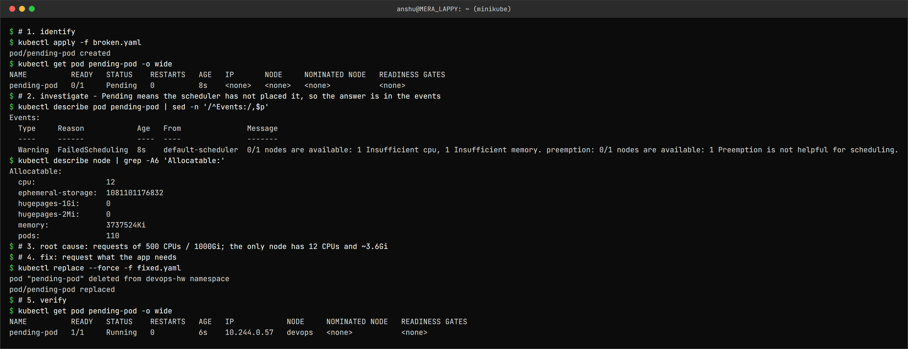

```
$ # 1. identify
$ kubectl apply -f broken.yaml
pod/pending-pod created
$ kubectl get pod pending-pod -o wide
NAME          READY   STATUS    RESTARTS   AGE   IP       NODE     NOMINATED NODE   READINESS GATES
pending-pod   0/1     Pending   0          8s    <none>   <none>   <none>           <none>
$ # 2. investigate - Pending means the scheduler has not placed it, so the answer is in the events
$ kubectl describe pod pending-pod | sed -n '/^Events:/,$p'
Events:
  Type     Reason            Age   From               Message
  ----     ------            ----  ----               -------
  Warning  FailedScheduling  8s    default-scheduler  0/1 nodes are available: 1 Insufficient cpu, 1 Insufficient memory. preemption: 0/1 nodes are available: 1 Preemption is not helpful for scheduling.
$ kubectl describe node | grep -A6 'Allocatable:'
Allocatable:
  cpu:                12
  ephemeral-storage:  1081101176832
  hugepages-1Gi:      0
  hugepages-2Mi:      0
  memory:             3737524Ki
  pods:               110
$ # 3. root cause: requests of 500 CPUs / 1000Gi; the only node has 12 CPUs and ~3.6Gi
$ # 4. fix: request what the app needs
$ kubectl replace --force -f fixed.yaml
pod "pending-pod" deleted from devops-hw namespace
pod/pending-pod replaced
$ # 5. verify
$ kubectl get pod pending-pod -o wide
NAME          READY   STATUS    RESTARTS   AGE   IP            NODE     NOMINATED NODE   READINESS GATES
pending-pod   1/1     Running   0          6s    10.244.0.57   devops   <none>           <none>
```

A `Pending` Pod has **no node and no IP** - the scheduler never placed it, so there are no
container logs to read. The scheduler explains itself in the events:
`0/1 nodes are available: 1 Insufficient cpu, 1 Insufficient memory`. Scheduling is based on
**requests**, not actual usage. Other reasons a Pod stays Pending: a `nodeSelector` no node
matches, a taint without a toleration, or an unbound PVC.

### 4. ContainerCreating

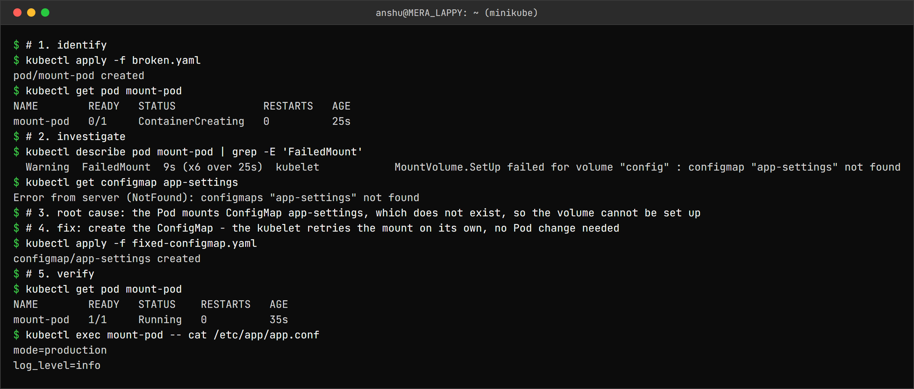

```
$ # 1. identify
$ kubectl apply -f broken.yaml
pod/mount-pod created
$ kubectl get pod mount-pod
NAME        READY   STATUS              RESTARTS   AGE
mount-pod   0/1     ContainerCreating   0          25s
$ # 2. investigate
$ kubectl describe pod mount-pod | grep -E 'FailedMount'
  Warning  FailedMount  9s (x6 over 25s)  kubelet            MountVolume.SetUp failed for volume "config" : configmap "app-settings" not found
$ kubectl get configmap app-settings
Error from server (NotFound): configmaps "app-settings" not found
$ # 3. root cause: the Pod mounts ConfigMap app-settings, which does not exist, so the volume cannot be set up
$ # 4. fix: create the ConfigMap - the kubelet retries the mount on its own, no Pod change needed
$ kubectl apply -f fixed-configmap.yaml
configmap/app-settings created
$ # 5. verify
$ kubectl get pod mount-pod
NAME        READY   STATUS    RESTARTS   AGE
mount-pod   1/1     Running   0          35s
$ kubectl exec mount-pod -- cat /etc/app/app.conf
mode=production
log_level=info
```

The Pod *was* scheduled, but the kubelet cannot finish setting it up - `FailedMount: configmap
"app-settings" not found`. This was the only fix that did **not** need the Pod to be replaced:
once the ConfigMap existed, the kubelet's next mount retry succeeded and the Pod started by itself.

### 5. Configuration issue - CreateContainerConfigError

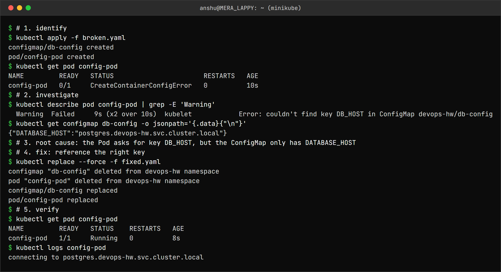

```
$ # 1. identify
$ kubectl apply -f broken.yaml
configmap/db-config created
pod/config-pod created
$ kubectl get pod config-pod
NAME         READY   STATUS                       RESTARTS   AGE
config-pod   0/1     CreateContainerConfigError   0          10s
$ # 2. investigate
$ kubectl describe pod config-pod | grep -E 'Warning'
  Warning  Failed     9s (x2 over 10s)  kubelet            Error: couldn't find key DB_HOST in ConfigMap devops-hw/db-config
$ kubectl get configmap db-config -o jsonpath='{.data}{"\n"}'
{"DATABASE_HOST":"postgres.devops-hw.svc.cluster.local"}
$ # 3. root cause: the Pod asks for key DB_HOST, but the ConfigMap only has DATABASE_HOST
$ # 4. fix: reference the right key
$ kubectl replace --force -f fixed.yaml
configmap "db-config" deleted from devops-hw namespace
pod "config-pod" deleted from devops-hw namespace
configmap/db-config replaced
pod/config-pod replaced
$ # 5. verify
$ kubectl get pod config-pod
NAME         READY   STATUS    RESTARTS   AGE
config-pod   1/1     Running   0          8s
$ kubectl logs config-pod
connecting to postgres.devops-hw.svc.cluster.local
```

The ConfigMap exists but the key does not: `couldn't find key DB_HOST in ConfigMap`. The
container is never started. Unlike case 4, this is a mistake in the **Pod** spec, so the Pod had
to be fixed. (`optional: true` on the `configMapKeyRef` would have let it start with an empty
variable instead - which would hide the bug.)

### 6. Service connectivity

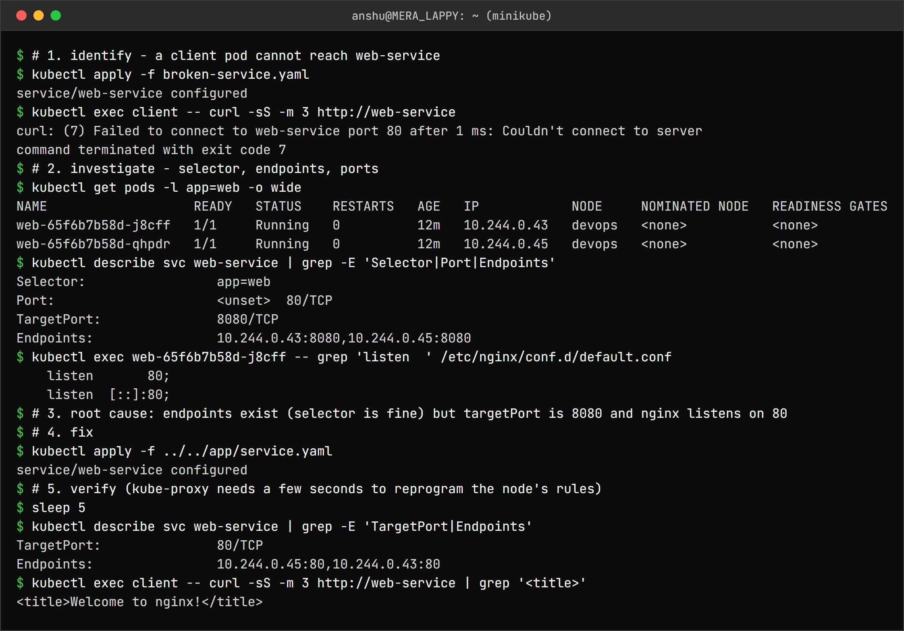

```
$ # 1. identify - a client pod cannot reach web-service
$ kubectl apply -f broken-service.yaml
service/web-service configured
$ kubectl exec client -- curl -sS -m 3 http://web-service
curl: (7) Failed to connect to web-service port 80 after 1 ms: Couldn't connect to server
command terminated with exit code 7
$ # 2. investigate - selector, endpoints, ports
$ kubectl get pods -l app=web -o wide
NAME                   READY   STATUS    RESTARTS   AGE   IP            NODE     NOMINATED NODE   READINESS GATES
web-65f6b7b58d-j8cff   1/1     Running   0          12m   10.244.0.43   devops   <none>           <none>
web-65f6b7b58d-qhpdr   1/1     Running   0          12m   10.244.0.45   devops   <none>           <none>
$ kubectl describe svc web-service | grep -E 'Selector|Port|Endpoints'
Selector:                 app=web
Port:                     <unset>  80/TCP
TargetPort:               8080/TCP
Endpoints:                10.244.0.43:8080,10.244.0.45:8080
$ kubectl exec web-65f6b7b58d-j8cff -- grep 'listen  ' /etc/nginx/conf.d/default.conf
    listen       80;
    listen  [::]:80;
$ # 3. root cause: endpoints exist (selector is fine) but targetPort is 8080 and nginx listens on 80
$ # 4. fix
$ kubectl apply -f ../../app/service.yaml
service/web-service configured
$ # 5. verify (kube-proxy needs a few seconds to reprogram the node's rules)
$ sleep 5
$ kubectl describe svc web-service | grep -E 'TargetPort|Endpoints'
TargetPort:               80/TCP
Endpoints:                10.244.0.45:80,10.244.0.43:80
$ kubectl exec client -- curl -sS -m 3 http://web-service | grep '<title>'
<title>Welcome to nginx!</title>
```

The quickest split for any Service problem is **does it have endpoints?**

- **No endpoints** → the selector does not match the Pod labels (that case is in the mini project).
- **Endpoints, but connections fail** → the ports are wrong. Here the endpoints were
  `10.244.0.43:8080` - the right Pods on the wrong port.

It took a few seconds after the fix for the request to succeed - kube-proxy has to rewrite the
node's forwarding rules after a Service changes.

### 7. DNS

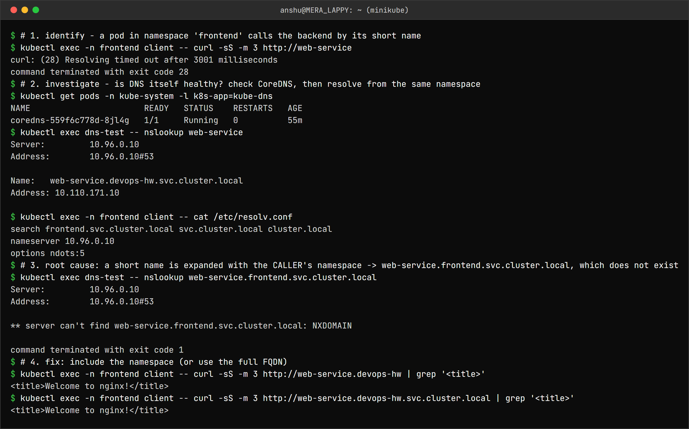

```
$ # 1. identify - a pod in namespace 'frontend' calls the backend by its short name
$ kubectl exec -n frontend client -- curl -sS -m 3 http://web-service
curl: (28) Resolving timed out after 3001 milliseconds
command terminated with exit code 28
$ # 2. investigate - is DNS itself healthy? check CoreDNS, then resolve from the same namespace
$ kubectl get pods -n kube-system -l k8s-app=kube-dns
NAME                       READY   STATUS    RESTARTS   AGE
coredns-559f6c778d-8jl4g   1/1     Running   0          55m
$ kubectl exec dns-test -- nslookup web-service
Server:		10.96.0.10
Address:	10.96.0.10#53

Name:	web-service.devops-hw.svc.cluster.local
Address: 10.110.171.10

$ kubectl exec -n frontend client -- cat /etc/resolv.conf
search frontend.svc.cluster.local svc.cluster.local cluster.local
nameserver 10.96.0.10
options ndots:5
$ # 3. root cause: a short name is expanded with the CALLER's namespace -> web-service.frontend.svc.cluster.local, which does not exist
$ kubectl exec dns-test -- nslookup web-service.frontend.svc.cluster.local
Server:		10.96.0.10
Address:	10.96.0.10#53

** server can't find web-service.frontend.svc.cluster.local: NXDOMAIN

command terminated with exit code 1
$ # 4. fix: include the namespace (or use the full FQDN)
$ kubectl exec -n frontend client -- curl -sS -m 3 http://web-service.devops-hw | grep '<title>'
<title>Welcome to nginx!</title>
$ kubectl exec -n frontend client -- curl -sS -m 3 http://web-service.devops-hw.svc.cluster.local | grep '<title>'
<title>Welcome to nginx!</title>
```

DNS itself was healthy - CoreDNS was running and `nslookup web-service` worked from a Pod in
`devops-hw`. The problem was **where the call came from**. The `search` line in the caller's
`resolv.conf` starts with its own namespace, so `web-service` became
`web-service.frontend.svc.cluster.local` → `NXDOMAIN`. Across namespaces the name has to include
the namespace (`web-service.devops-hw`) or be the full FQDN.

The failure showed up as a *timeout* rather than "could not resolve": with `ndots:5`, the resolver
tries every search domain and then sends the bare name to the upstream DNS server outside the
cluster, which is slow to answer.

The class repo's DNS debug image, `registry.k8s.io/e2e-test-images/dnsutils:1.3`, no longer exists
(`not found`), so [app/dns-test-pod.yaml](app/dns-test-pod.yaml) uses `jessie-dnsutils:1.7`.

### 8. Pod networking

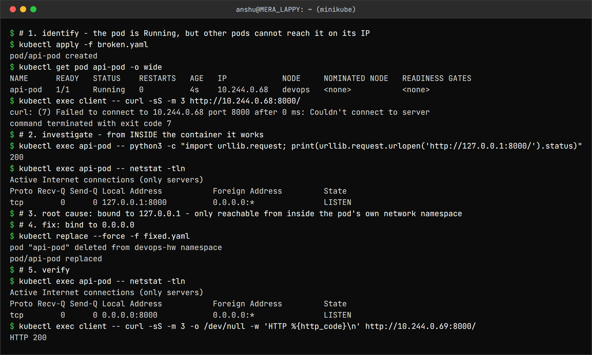

```
$ # 1. identify - the pod is Running, but other pods cannot reach it on its IP
$ kubectl apply -f broken.yaml
pod/api-pod created
$ kubectl get pod api-pod -o wide
NAME      READY   STATUS    RESTARTS   AGE   IP            NODE     NOMINATED NODE   READINESS GATES
api-pod   1/1     Running   0          4s    10.244.0.68   devops   <none>           <none>
$ kubectl exec client -- curl -sS -m 3 http://10.244.0.68:8000/
curl: (7) Failed to connect to 10.244.0.68 port 8000 after 0 ms: Couldn't connect to server
command terminated with exit code 7
$ # 2. investigate - from INSIDE the container it works
$ kubectl exec api-pod -- python3 -c "import urllib.request; print(urllib.request.urlopen('http://127.0.0.1:8000/').status)"
200
$ kubectl exec api-pod -- netstat -tln
Active Internet connections (only servers)
Proto Recv-Q Send-Q Local Address           Foreign Address         State
tcp        0      0 127.0.0.1:8000          0.0.0.0:*               LISTEN
$ # 3. root cause: bound to 127.0.0.1 - only reachable from inside the pod's own network namespace
$ # 4. fix: bind to 0.0.0.0
$ kubectl replace --force -f fixed.yaml
pod "api-pod" deleted from devops-hw namespace
pod/api-pod replaced
$ # 5. verify
$ kubectl exec api-pod -- netstat -tln
Active Internet connections (only servers)
Proto Recv-Q Send-Q Local Address           Foreign Address         State
tcp        0      0 0.0.0.0:8000            0.0.0.0:*               LISTEN
$ kubectl exec client -- curl -sS -m 3 -o /dev/null -w 'HTTP %{http_code}\n' http://10.244.0.69:8000/
HTTP 200
```

From inside the container the app answered `200`; from another Pod, the Pod IP refused the
connection. `netstat` showed why: `127.0.0.1:8000`. Every Pod has its own network namespace, and
its loopback interface is private to it. A server inside a container must listen on `0.0.0.0`.
This is a very common bug when an app's default config was written for a laptop.

### 9. OOMKilled

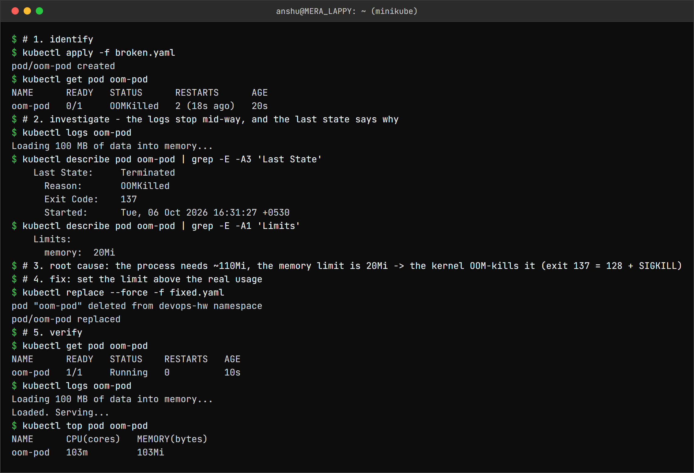

```
$ # 1. identify
$ kubectl apply -f broken.yaml
pod/oom-pod created
$ kubectl get pod oom-pod
NAME      READY   STATUS      RESTARTS      AGE
oom-pod   0/1     OOMKilled   2 (18s ago)   20s
$ # 2. investigate - the logs stop mid-way, and the last state says why
$ kubectl logs oom-pod
Loading 100 MB of data into memory...
$ kubectl describe pod oom-pod | grep -E -A3 'Last State'
    Last State:     Terminated
      Reason:       OOMKilled
      Exit Code:    137
      Started:      Tue, 06 Oct 2026 16:31:27 +0530
$ kubectl describe pod oom-pod | grep -E -A1 'Limits'
    Limits:
      memory:  20Mi
$ # 3. root cause: the process needs ~110Mi, the memory limit is 20Mi -> the kernel OOM-kills it (exit 137 = 128 + SIGKILL)
$ # 4. fix: set the limit above the real usage
$ kubectl replace --force -f fixed.yaml
pod "oom-pod" deleted from devops-hw namespace
pod/oom-pod replaced
$ # 5. verify
$ kubectl get pod oom-pod
NAME      READY   STATUS    RESTARTS   AGE
oom-pod   1/1     Running   0          10s
$ kubectl logs oom-pod
Loading 100 MB of data into memory...
Loaded. Serving...
$ kubectl top pod oom-pod
NAME      CPU(cores)   MEMORY(bytes)
oom-pod   103m         103Mi
```

The log stops after "Loading 100 MB..." with no error at all - the process was killed by the
kernel, so it never got the chance to print anything. **Exit code 137 = 128 + 9 (SIGKILL)** and
`Reason: OOMKilled` are the evidence. After raising the limit, `kubectl top` shows the real
usage: 103Mi. Memory limits are hard (exceed them and you are killed); CPU limits only throttle.

---

Task 3: Mini Project
--------------------

```
                 troubleshooting-service (ClusterIP)
                            │  selector: app=troubleshooting-app
              ┌─────────────┴─────────────┐
              ▼                           ▼
     troubleshooting-app Pod 1   troubleshooting-app Pod 2   (nginx:1.27)
```

### Investigate the healthy app

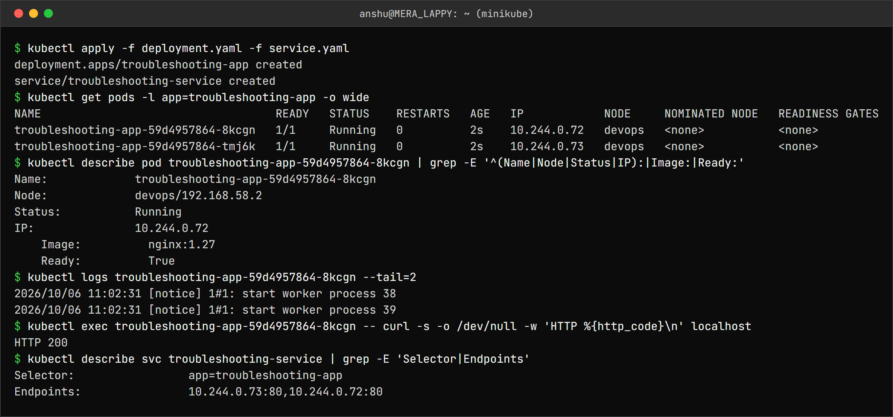

```
$ kubectl apply -f deployment.yaml -f service.yaml
deployment.apps/troubleshooting-app created
service/troubleshooting-service created
$ kubectl get pods -l app=troubleshooting-app -o wide
NAME                                   READY   STATUS    RESTARTS   AGE   IP            NODE     NOMINATED NODE   READINESS GATES
troubleshooting-app-59d4957864-8kcgn   1/1     Running   0          2s    10.244.0.72   devops   <none>           <none>
troubleshooting-app-59d4957864-tmj6k   1/1     Running   0          2s    10.244.0.73   devops   <none>           <none>
$ kubectl describe pod troubleshooting-app-59d4957864-8kcgn | grep -E '^(Name|Node|Status|IP):|Image:|Ready:'
Name:             troubleshooting-app-59d4957864-8kcgn
Node:             devops/192.168.58.2
Status:           Running
IP:               10.244.0.72
    Image:          nginx:1.27
    Ready:          True
$ kubectl logs troubleshooting-app-59d4957864-8kcgn --tail=2
2026/10/06 11:02:31 [notice] 1#1: start worker process 38
2026/10/06 11:02:31 [notice] 1#1: start worker process 39
$ kubectl exec troubleshooting-app-59d4957864-8kcgn -- curl -s -o /dev/null -w 'HTTP %{http_code}\n' localhost
HTTP 200
$ kubectl describe svc troubleshooting-service | grep -E 'Selector|Endpoints'
Selector:                 app=troubleshooting-app
Endpoints:                10.244.0.73:80,10.244.0.72:80
```

### The broken Pod

The rule for this part was to investigate before touching the YAML.

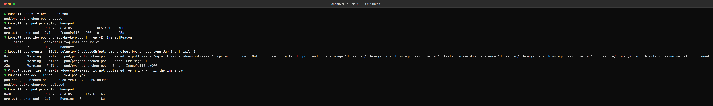

```
$ kubectl apply -f broken-pod.yaml
pod/project-broken-pod created
$ kubectl get pod project-broken-pod
NAME                 READY   STATUS             RESTARTS   AGE
project-broken-pod   0/1     ImagePullBackOff   0          25s
$ kubectl describe pod project-broken-pod | grep -E 'Image:|Reason:'
    Image:          nginx:this-tag-does-not-exist
      Reason:       ImagePullBackOff
$ kubectl get events --field-selector involvedObject.name=project-broken-pod,type=Warning | tail -3
8s          Warning   Failed   pod/project-broken-pod   Failed to pull image "nginx:this-tag-does-not-exist": rpc error: code = NotFound desc = failed to pull and unpack image "docker.io/library/nginx:this-tag-does-not-exist": failed to resolve reference "docker.io/library/nginx:this-tag-does-not-exist": docker.io/library/nginx:this-tag-does-not-exist: not found
8s          Warning   Failed   pod/project-broken-pod   Error: ErrImagePull
23s         Warning   Failed   pod/project-broken-pod   Error: ImagePullBackOff
$ # root cause: tag 'this-tag-does-not-exist' is not published for nginx -> fix the image tag
$ kubectl replace --force -f fixed-pod.yaml
pod "project-broken-pod" deleted from devops-hw namespace
pod/project-broken-pod replaced
$ kubectl get pod project-broken-pod
NAME                 READY   STATUS    RESTARTS   AGE
project-broken-pod   1/1     Running   0          8s
```

| Question | Answer |
|---|---|
| Q1. What is the Pod status? | `ImagePullBackOff` (preceded by `ErrImagePull`) |
| Q2. What error do you see? | `Failed to pull image "nginx:this-tag-does-not-exist" ... not found` |
| Q3. Which command helped most? | `kubectl describe pod` / `kubectl get events` - the status alone does not say *why* |
| Q4. What is wrong with the image? | The `nginx` repository exists but the tag `this-tag-does-not-exist` was never published |
| Q5. How do you fix it? | Use a real tag (`nginx:1.27`) and recreate the Pod - [fixed-pod.yaml](mini-project/fixed-pod.yaml) |

### The Service problem

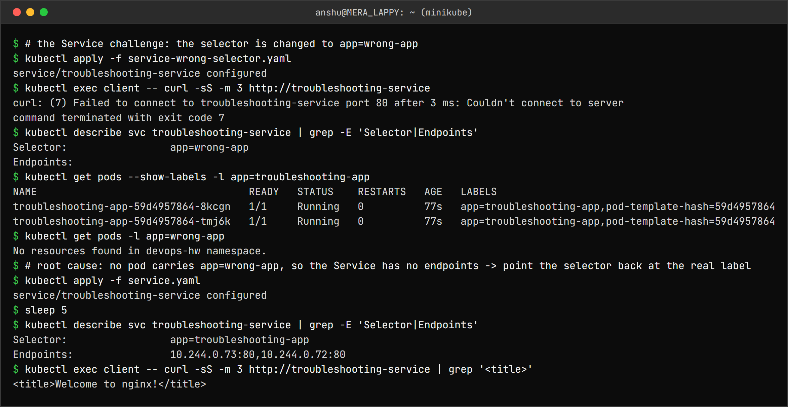

```
$ # the Service challenge: the selector is changed to app=wrong-app
$ kubectl apply -f service-wrong-selector.yaml
service/troubleshooting-service configured
$ kubectl exec client -- curl -sS -m 3 http://troubleshooting-service
curl: (7) Failed to connect to troubleshooting-service port 80 after 3 ms: Couldn't connect to server
command terminated with exit code 7
$ kubectl describe svc troubleshooting-service | grep -E 'Selector|Endpoints'
Selector:                 app=wrong-app
Endpoints:
$ kubectl get pods --show-labels -l app=troubleshooting-app
NAME                                   READY   STATUS    RESTARTS   AGE   LABELS
troubleshooting-app-59d4957864-8kcgn   1/1     Running   0          77s   app=troubleshooting-app,pod-template-hash=59d4957864
troubleshooting-app-59d4957864-tmj6k   1/1     Running   0          77s   app=troubleshooting-app,pod-template-hash=59d4957864
$ kubectl get pods -l app=wrong-app
No resources found in devops-hw namespace.
$ # root cause: no pod carries app=wrong-app, so the Service has no endpoints -> point the selector back at the real label
$ kubectl apply -f service.yaml
service/troubleshooting-service configured
$ sleep 5
$ kubectl describe svc troubleshooting-service | grep -E 'Selector|Endpoints'
Selector:                 app=troubleshooting-app
Endpoints:                10.244.0.73:80,10.244.0.72:80
$ kubectl exec client -- curl -sS -m 3 http://troubleshooting-service | grep '<title>'
<title>Welcome to nginx!</title>
```

`Endpoints:` was **empty**. `--show-labels` showed the Pods are labelled
`app=troubleshooting-app`, and `-l app=wrong-app` matched nothing - the selector and the labels
no longer agree.

### Troubleshooting table

| Problem | What I Saw | Command I Used | Root Cause | Fix |
| :--- | :--- | :--- | :--- | :--- |
| **Broken Pod** | `0/1 ImagePullBackOff` | `kubectl describe pod`, `kubectl get events` | Image tag `this-tag-does-not-exist` does not exist | Changed image to `nginx:1.27`, `kubectl replace --force` |
| **Service Problem** | `curl: (7) Couldn't connect`, `Endpoints:` empty | `kubectl describe svc`, `kubectl get pods --show-labels` | Selector `app=wrong-app` matches no Pod | Restored selector `app=troubleshooting-app` |
| **Image Problem** | `ErrImagePull` then `ImagePullBackOff`, `not found` in events | `kubectl describe pod` | Tag not published in the registry | Use a tag that exists; check with `docker pull` first |

### README questions

1. **What does `kubectl get` tell us?** What objects exist and a one-line summary of each - for
   Pods: ready containers, status, restarts, age. `-o wide` adds the IP and node.
2. **Difference between `get` and `describe`?** `get` is a summary list of many objects;
   `describe` is the full detail of one object, including its events - the *why* behind the status.
3. **Why do we use `kubectl logs`?** To read what the application itself printed (stdout/stderr).
   It is the first stop for a container that starts and then fails, like a CrashLoopBackOff.
4. **When would you use `kubectl exec`?** When you need to see the problem from inside the
   container: is the app listening, on which address (`netstat`), what does DNS resolve to, what
   files and env vars does it actually have.
5. **What does `CrashLoopBackOff` mean?** The container keeps exiting and the kubelet is waiting,
   with an increasing delay, before restarting it again. The real reason is in the logs or the
   last state's exit code.
6. **What does `ImagePullBackOff` mean?** The image could not be pulled and the kubelet is waiting
   before retrying. Usual causes: wrong name or tag, private registry without credentials, rate
   limits.
7. **Why can a Pod remain `Pending`?** The scheduler cannot find a node for it: not enough CPU or
   memory for its requests, a nodeSelector or affinity nothing matches, taints without
   tolerations, or a PVC that is not bound.
8. **Why can a Service have no endpoints?** Its selector matches no Pods (typo or label change),
   or the matching Pods are not Ready (failing readiness probe), or there are simply no Pods
   running.
9. **Relationship between a Service selector and Pod labels?** The Service sends traffic to every
   **Ready** Pod whose labels match all of its selector's key/value pairs. The match is the only
   link between them - nothing else ties a Service to a Deployment.
10. **What is Kubernetes DNS?** CoreDNS running in `kube-system`, at the IP in every Pod's
    `resolv.conf` (`10.96.0.10` here). It gives each Service the name
    `<service>.<namespace>.svc.cluster.local`, and the search domains let Pods use just
    `<service>` inside the same namespace.

---

What I understood
-----------------

- The STATUS column tells you **which phase** failed, and that decides where to look:
  `Pending` → scheduler/events, `ContainerCreating` / `CreateContainerConfigError` → kubelet events,
  `CrashLoopBackOff` → application logs, `OOMKilled` → limits.
- `describe` + events answer most questions before the app is running; `logs` answer most after.
- CrashLoopBackOff and ImagePullBackOff are both **waiting** states, not the error itself.
- Pods are close to immutable - fixes mean recreating them. That is one more reason to run
  everything through Deployments.
- For Services, check endpoints first: none means labels/selector, present means ports or the app.
- `127.0.0.1` inside a container means "this Pod only".
- Short DNS names only work inside the same namespace.
- Memory limits kill, CPU limits throttle. Exit code 137 means the process was SIGKILLed.
- Even the debugging tools can break - the class's own dnsutils image no longer exists.
