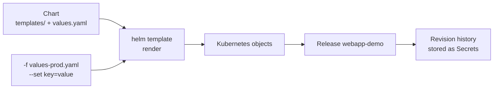
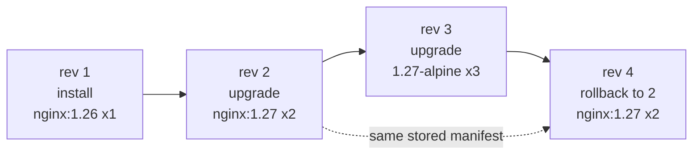

Helm – Learning Notes
=====================

Name: Anshul Mohanty    Roll No: 24BCS10191    Section: A

## In one line

A chart is templated YAML plus default values; every install, upgrade and rollback is a numbered
revision stored in the cluster - and a rollback is just a **new** revision that re-applies an old
one.

## The picture

The rollback workflow from Task 2:

## Mental model

| Term | Meaning |
|---|---|
| Chart | The package: `Chart.yaml`, `values.yaml`, `templates/` |
| Values | Inputs; `-f file` and `--set` override the defaults |
| Release | One installed instance of a chart |
| Revision | One version of a release |

| Command | Use |
|---|---|
| `lint` / `template` | Check and render locally |
| `install` / `upgrade` / `rollback` / `uninstall` | Change the release |
| `list` / `status` / `history` / `get values` / `get manifest` | Inspect it |
| `repo add` / `search repo` / `search hub` | Find charts |

| Helm v3 | Helm v4 |
|---|---|
| `--atomic` | `--rollback-on-failure` |
| `helm list --all` | removed |

## Gotchas

- `upgrade` starts from the **chart defaults** - forget `-f values-prod.yaml` and production
  becomes development without any warning.
- Without `--wait`, `STATUS: deployed` only means the YAML was accepted; the Pods can still be in
  ImagePullBackOff.
- Rollback re-applies the **stored manifest**, it does not re-render - `.Release.Revision` inside
  it keeps the old number.
- Rolling back to an identical Pod template reuses the old ReplicaSet.
- A ConfigMap change does not restart Pods; add a `checksum/config` annotation to the Deployment.
- `helm create` sets `appVersion: 1.16.0`, and an empty `image.tag` falls back to it - an ancient
  nginx unless you set the tag.
- Test only after `kubectl rollout status` - right after `--wait`, terminating Pods can still get
  traffic for a moment.
