Helm – Homework
===============

Name: Anshul Mohanty    Roll No: 24BCS10191    Section: A

See also: [LEARNING.md](LEARNING.md) - diagram and revision notes for this topic.

Cluster: single-node minikube v1.39.0 (Kubernetes v1.37.0), namespace `devops-hw`.
Helm: **v4.1.4**. The class material was written for Helm v3; the differences I ran into are
called out where they happen.

| Folder | Contents |
|---|---|
| [webapp/](webapp/) | Chart made with `helm create`, then customised (used for Tasks 1 and 2) |
| [rollback-demo/](rollback-demo/) | `values-v2.yaml`, `values-v3.yaml` - one file per upgrade |
| [mini-project/notes-chart/](mini-project/notes-chart/) | The Session 15 Notes app chart |

Helm is a package manager for Kubernetes. A **chart** is a folder of templated YAML plus default
values; installing it creates a **release**; every install/upgrade/rollback is a numbered
**revision** stored in the cluster, which is what makes rollback possible.

---

Task 1: Helm commands
---------------------

| Command | What it does | Shown in |
|---|---|---|
| `helm create` | Scaffolds a new chart | [01](#create-lint-template) |
| `helm lint` / `helm template` | Validates / renders the chart locally without installing | [01](#create-lint-template) |
| `helm install` | Renders the chart and creates a release (revision 1) | [02](#install-list-status-get) |
| `helm list` | Releases in the namespace | [02](#install-list-status-get) |
| `helm status` | State of one release | [02](#install-list-status-get) |
| `helm get values / manifest` | What a release was installed with / what it created | [02](#install-list-status-get) |
| `helm repo add / update / list` | Manage chart repositories | [03](#repo-and-search) |
| `helm search repo / hub` | Find charts in added repos / on Artifact Hub | [03](#repo-and-search) |
| `helm upgrade` | New revision with a new chart or new values | [Task 2](#task-2-helm-rollback) |
| `helm history` | Every revision of a release | [Task 2](#task-2-helm-rollback) |
| `helm rollback` | Re-applies an old revision as a new one | [Task 2](#task-2-helm-rollback) |
| `helm uninstall` | Deletes the release and its resources | [07](#uninstall) |

### create, lint, template

`helm create webapp` generates a full chart. I then changed three things so each release is
visible from the outside:

- `values.yaml`: `image.tag: "1.26"` (the default falls back to `appVersion`, which `helm create`
  sets to `1.16.0`) and a new `message` value.
- New [templates/configmap.yaml](webapp/templates/configmap.yaml): renders an `index.html` showing
  the message, release, revision, image and replica count.
- [templates/deployment.yaml](webapp/templates/deployment.yaml): mounts that ConfigMap over nginx's
  html folder, and adds a `checksum/config` annotation so the Pods restart whenever the page
  content changes.

```yaml
annotations:
  checksum/config: {{ include (print $.Template.BasePath "/configmap.yaml") . | sha256sum }}
```

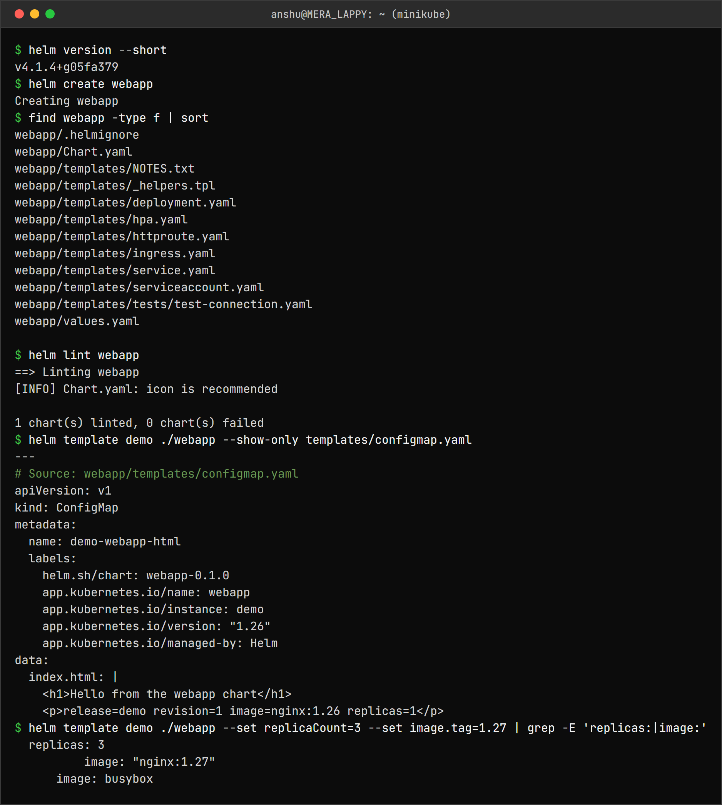

```
$ helm version --short
v4.1.4+g05fa379
$ helm create webapp
Creating webapp
$ find webapp -type f | sort
webapp/.helmignore
webapp/Chart.yaml
webapp/templates/NOTES.txt
webapp/templates/_helpers.tpl
webapp/templates/deployment.yaml
webapp/templates/hpa.yaml
webapp/templates/httproute.yaml
webapp/templates/ingress.yaml
webapp/templates/service.yaml
webapp/templates/serviceaccount.yaml
webapp/templates/tests/test-connection.yaml
webapp/values.yaml

$ helm lint webapp
==> Linting webapp
[INFO] Chart.yaml: icon is recommended

1 chart(s) linted, 0 chart(s) failed
$ helm template demo ./webapp --show-only templates/configmap.yaml
---
# Source: webapp/templates/configmap.yaml
apiVersion: v1
kind: ConfigMap
metadata:
  name: demo-webapp-html
  labels:
    helm.sh/chart: webapp-0.1.0
    app.kubernetes.io/name: webapp
    app.kubernetes.io/instance: demo
    app.kubernetes.io/version: "1.26"
    app.kubernetes.io/managed-by: Helm
data:
  index.html: |
    <h1>Hello from the webapp chart</h1>
    <p>release=demo revision=1 image=nginx:1.26 replicas=1</p>
$ helm template demo ./webapp --set replicaCount=3 --set image.tag=1.27 | grep -E 'replicas:|image:'
  replicas: 3
          image: "nginx:1.27"
      image: busybox
```

`helm template` renders locally with no cluster involved - the fastest way to check what a
`--set` will actually change.

### install, list, status, get

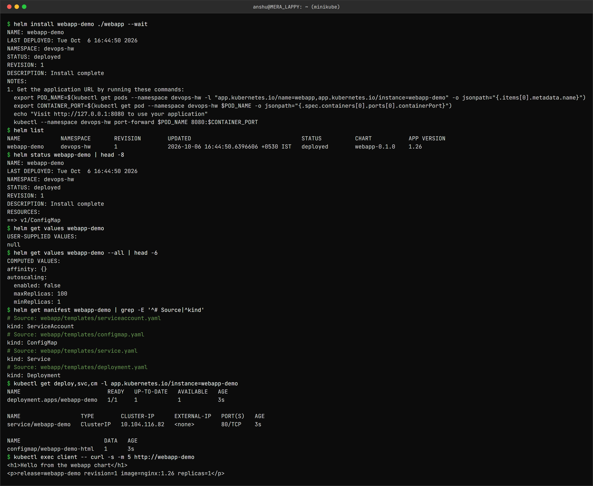

```
$ helm install webapp-demo ./webapp --wait
NAME: webapp-demo
LAST DEPLOYED: Tue Oct  6 16:44:50 2026
NAMESPACE: devops-hw
STATUS: deployed
REVISION: 1
DESCRIPTION: Install complete
NOTES:
1. Get the application URL by running these commands:
  export POD_NAME=$(kubectl get pods --namespace devops-hw -l "app.kubernetes.io/name=webapp,app.kubernetes.io/instance=webapp-demo" -o jsonpath="{.items[0].metadata.name}")
  export CONTAINER_PORT=$(kubectl get pod --namespace devops-hw $POD_NAME -o jsonpath="{.spec.containers[0].ports[0].containerPort}")
  echo "Visit http://127.0.0.1:8080 to use your application"
  kubectl --namespace devops-hw port-forward $POD_NAME 8080:$CONTAINER_PORT
$ helm list
NAME       	NAMESPACE	REVISION	UPDATED                              	STATUS  	CHART       	APP VERSION
webapp-demo	devops-hw	1       	2026-10-06 16:44:50.6396606 +0530 IST	deployed	webapp-0.1.0	1.26
$ helm status webapp-demo | head -8
NAME: webapp-demo
LAST DEPLOYED: Tue Oct  6 16:44:50 2026
NAMESPACE: devops-hw
STATUS: deployed
REVISION: 1
DESCRIPTION: Install complete
RESOURCES:
==> v1/ConfigMap
$ helm get values webapp-demo
USER-SUPPLIED VALUES:
null
$ helm get values webapp-demo --all | head -6
COMPUTED VALUES:
affinity: {}
autoscaling:
  enabled: false
  maxReplicas: 100
  minReplicas: 1
$ helm get manifest webapp-demo | grep -E '^# Source|^kind'
# Source: webapp/templates/serviceaccount.yaml
kind: ServiceAccount
# Source: webapp/templates/configmap.yaml
kind: ConfigMap
# Source: webapp/templates/service.yaml
kind: Service
# Source: webapp/templates/deployment.yaml
kind: Deployment
$ kubectl get deploy,svc,cm -l app.kubernetes.io/instance=webapp-demo
NAME                          READY   UP-TO-DATE   AVAILABLE   AGE
deployment.apps/webapp-demo   1/1     1            1           3s

NAME                  TYPE        CLUSTER-IP      EXTERNAL-IP   PORT(S)   AGE
service/webapp-demo   ClusterIP   10.104.116.82   <none>        80/TCP    3s

NAME                         DATA   AGE
configmap/webapp-demo-html   1      3s
$ kubectl exec client -- curl -s -m 5 http://webapp-demo
<h1>Hello from the webapp chart</h1>
<p>release=webapp-demo revision=1 image=nginx:1.26 replicas=1</p>
```

`helm get values` shows **`null`** - nothing was overridden, so it ran on chart defaults.
`--all` shows the full computed values. `helm get manifest` is the exact YAML Helm applied.

### repo and search

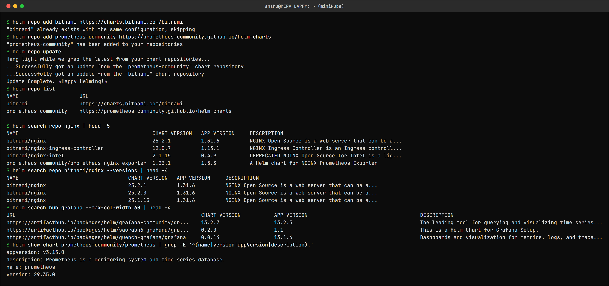

```
$ helm repo add bitnami https://charts.bitnami.com/bitnami
"bitnami" already exists with the same configuration, skipping
$ helm repo add prometheus-community https://prometheus-community.github.io/helm-charts
"prometheus-community" has been added to your repositories
$ helm repo update
Hang tight while we grab the latest from your chart repositories...
...Successfully got an update from the "prometheus-community" chart repository
...Successfully got an update from the "bitnami" chart repository
Update Complete. ⎈Happy Helming!⎈
$ helm repo list
NAME                	URL
bitnami             	https://charts.bitnami.com/bitnami
prometheus-community	https://prometheus-community.github.io/helm-charts

$ helm search repo nginx | head -5
NAME                                          	CHART VERSION	APP VERSION	DESCRIPTION
bitnami/nginx                                 	25.2.1       	1.31.6     	NGINX Open Source is a web server that can be a...
bitnami/nginx-ingress-controller              	12.0.7       	1.13.1     	NGINX Ingress Controller is an Ingress controll...
bitnami/nginx-intel                           	2.1.15       	0.4.9      	DEPRECATED NGINX Open Source for Intel is a lig...
prometheus-community/prometheus-nginx-exporter	1.23.1       	1.5.3      	A Helm chart for NGINX Prometheus Exporter
$ helm search repo bitnami/nginx --versions | head -4
NAME                            	CHART VERSION	APP VERSION	DESCRIPTION
bitnami/nginx                   	25.2.1       	1.31.6     	NGINX Open Source is a web server that can be a...
bitnami/nginx                   	25.2.0       	1.31.6     	NGINX Open Source is a web server that can be a...
bitnami/nginx                   	25.1.15      	1.31.6     	NGINX Open Source is a web server that can be a...
$ helm search hub grafana --max-col-width 60 | head -4
URL                                                         	CHART VERSION   	APP VERSION                             	DESCRIPTION
https://artifacthub.io/packages/helm/grafana-community/gr...	13.2.7          	13.2.3                                  	The leading tool for querying and visualizing time series...
https://artifacthub.io/packages/helm/saurabh6-grafana/gra...	0.2.0           	1.1                                     	This is a Helm Chart for Grafana Setup.
https://artifacthub.io/packages/helm/quench-grafana/grafana 	0.0.14          	13.1.6                                  	Dashboards and visualization for metrics, logs, and trace...
$ helm show chart prometheus-community/prometheus | grep -E '^(name|version|appVersion|description):'
appVersion: v3.15.0
description: Prometheus is a monitoring system and time series database.
name: prometheus
version: 29.35.0
```

`bitnami` was already added on this machine from class, hence "already exists". `search repo`
only searches repositories you have added and updated; `search hub` searches Artifact Hub online.
`CHART VERSION` (the packaging) and `APP VERSION` (the software inside) are separate numbers.

### uninstall

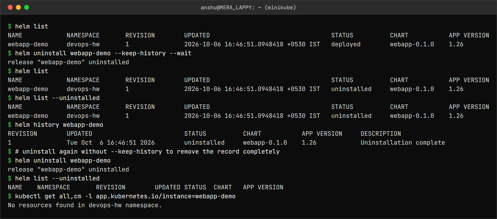

```
$ helm list
NAME       	NAMESPACE	REVISION	UPDATED                              	STATUS  	CHART       	APP VERSION
webapp-demo	devops-hw	1       	2026-10-06 16:46:51.0948418 +0530 IST	deployed	webapp-0.1.0	1.26
$ helm uninstall webapp-demo --keep-history --wait
release "webapp-demo" uninstalled
$ helm list
NAME       	NAMESPACE	REVISION	UPDATED                              	STATUS     	CHART       	APP VERSION
webapp-demo	devops-hw	1       	2026-10-06 16:46:51.0948418 +0530 IST	uninstalled	webapp-0.1.0	1.26
$ helm list --uninstalled
NAME       	NAMESPACE	REVISION	UPDATED                              	STATUS     	CHART       	APP VERSION
webapp-demo	devops-hw	1       	2026-10-06 16:46:51.0948418 +0530 IST	uninstalled	webapp-0.1.0	1.26
$ helm history webapp-demo
REVISION	UPDATED                 	STATUS     	CHART       	APP VERSION	DESCRIPTION
1       	Tue Oct  6 16:46:51 2026	uninstalled	webapp-0.1.0	1.26       	Uninstallation complete
$ # uninstall again without --keep-history to remove the record completely
$ helm uninstall webapp-demo
release "webapp-demo" uninstalled
$ helm list --uninstalled
NAME	NAMESPACE	REVISION	UPDATED	STATUS	CHART	APP VERSION
$ kubectl get all,cm -l app.kubernetes.io/instance=webapp-demo
No resources found in devops-hw namespace.
```

`--keep-history` removes the Kubernetes resources but keeps the release record, so `helm history`
still works. In **Helm v4**, plain `helm list` even shows it with status `uninstalled`, and the v3
flag `helm list --all` no longer exists (it gives `unknown flag: --all`). Running `uninstall` again
without the flag removes the record.

---

Task 2: Helm rollback
---------------------

The workflow: **Install → Upgrade → Verify → Upgrade again → Verify → Rollback → Verify**.
Each upgrade uses a values file so the change is recorded in the repo:

| Revision | How | Image | Replicas | Message |
|---|---|---|---|---|
| 1 | `helm install` | nginx:1.26 | 1 | Hello from the webapp chart |
| 2 | `upgrade -f values-v2.yaml` | nginx:1.27 | 2 | Version 2 |
| 3 | `upgrade -f values-v3.yaml` | nginx:1.27-alpine | 3 | Version 3 |
| 4 | `rollback webapp-demo 2` | nginx:1.27 | 2 | Version 2 |

Verification is the same three checks every time: `rollout status`, the Deployment's image and
replica count, and the page served through the Service.

### Install (revision 1) is shown in Task 1 above. Upgrade 1:

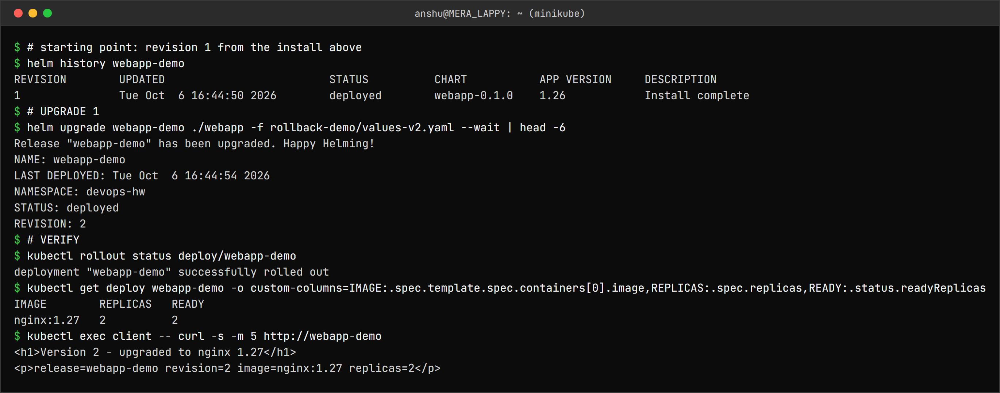

```
$ # starting point: revision 1 from the install above
$ helm history webapp-demo
REVISION	UPDATED                 	STATUS  	CHART       	APP VERSION	DESCRIPTION
1       	Tue Oct  6 16:44:50 2026	deployed	webapp-0.1.0	1.26       	Install complete
$ # UPGRADE 1
$ helm upgrade webapp-demo ./webapp -f rollback-demo/values-v2.yaml --wait | head -6
Release "webapp-demo" has been upgraded. Happy Helming!
NAME: webapp-demo
LAST DEPLOYED: Tue Oct  6 16:44:54 2026
NAMESPACE: devops-hw
STATUS: deployed
REVISION: 2
$ # VERIFY
$ kubectl rollout status deploy/webapp-demo
deployment "webapp-demo" successfully rolled out
$ kubectl get deploy webapp-demo -o custom-columns=IMAGE:.spec.template.spec.containers[0].image,REPLICAS:.spec.replicas,READY:.status.readyReplicas
IMAGE        REPLICAS   READY
nginx:1.27   2          2
$ kubectl exec client -- curl -s -m 5 http://webapp-demo
<h1>Version 2 - upgraded to nginx 1.27</h1>
<p>release=webapp-demo revision=2 image=nginx:1.27 replicas=2</p>
```

### Upgrade 2

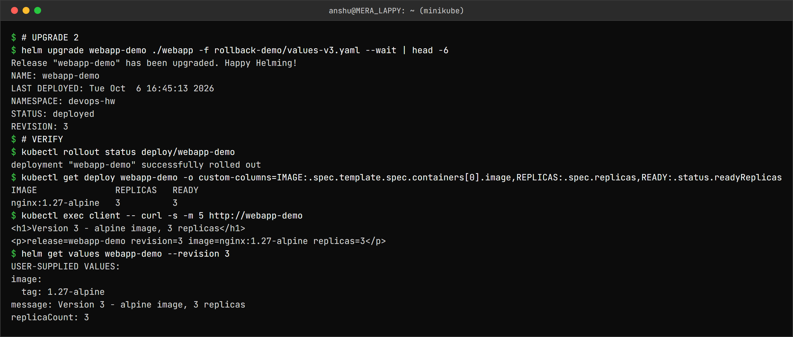

```
$ # UPGRADE 2
$ helm upgrade webapp-demo ./webapp -f rollback-demo/values-v3.yaml --wait | head -6
Release "webapp-demo" has been upgraded. Happy Helming!
NAME: webapp-demo
LAST DEPLOYED: Tue Oct  6 16:45:13 2026
NAMESPACE: devops-hw
STATUS: deployed
REVISION: 3
$ # VERIFY
$ kubectl rollout status deploy/webapp-demo
deployment "webapp-demo" successfully rolled out
$ kubectl get deploy webapp-demo -o custom-columns=IMAGE:.spec.template.spec.containers[0].image,REPLICAS:.spec.replicas,READY:.status.readyReplicas
IMAGE               REPLICAS   READY
nginx:1.27-alpine   3          3
$ kubectl exec client -- curl -s -m 5 http://webapp-demo
<h1>Version 3 - alpine image, 3 replicas</h1>
<p>release=webapp-demo revision=3 image=nginx:1.27-alpine replicas=3</p>
$ helm get values webapp-demo --revision 3
USER-SUPPLIED VALUES:
image:
  tag: 1.27-alpine
message: Version 3 - alpine image, 3 replicas
replicaCount: 3
```

### Rollback to revision 2

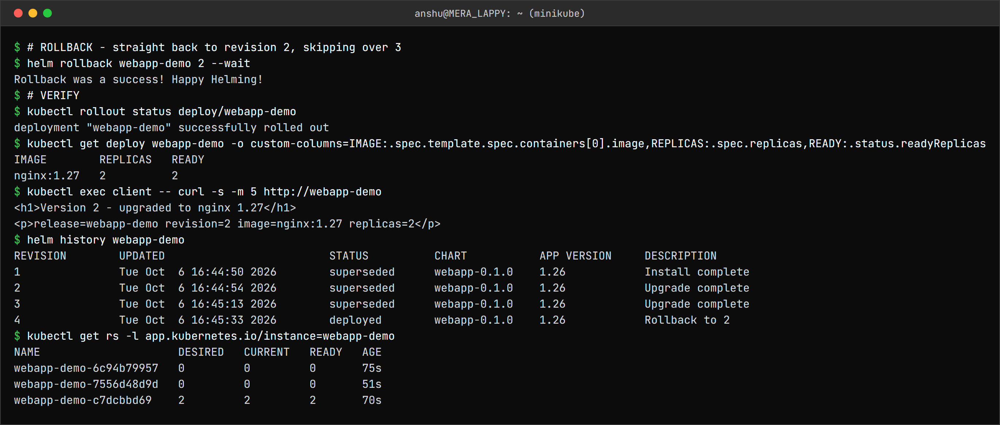

```
$ # ROLLBACK - straight back to revision 2, skipping over 3
$ helm rollback webapp-demo 2 --wait
Rollback was a success! Happy Helming!
$ # VERIFY
$ kubectl rollout status deploy/webapp-demo
deployment "webapp-demo" successfully rolled out
$ kubectl get deploy webapp-demo -o custom-columns=IMAGE:.spec.template.spec.containers[0].image,REPLICAS:.spec.replicas,READY:.status.readyReplicas
IMAGE        REPLICAS   READY
nginx:1.27   2          2
$ kubectl exec client -- curl -s -m 5 http://webapp-demo
<h1>Version 2 - upgraded to nginx 1.27</h1>
<p>release=webapp-demo revision=2 image=nginx:1.27 replicas=2</p>
$ helm history webapp-demo
REVISION	UPDATED                 	STATUS    	CHART       	APP VERSION	DESCRIPTION
1       	Tue Oct  6 16:44:50 2026	superseded	webapp-0.1.0	1.26       	Install complete
2       	Tue Oct  6 16:44:54 2026	superseded	webapp-0.1.0	1.26       	Upgrade complete
3       	Tue Oct  6 16:45:13 2026	superseded	webapp-0.1.0	1.26       	Upgrade complete
4       	Tue Oct  6 16:45:33 2026	deployed  	webapp-0.1.0	1.26       	Rollback to 2
$ kubectl get rs -l app.kubernetes.io/instance=webapp-demo
NAME                     DESIRED   CURRENT   READY   AGE
webapp-demo-6c94b79957   0         0         0       75s
webapp-demo-7556d48d9d   0         0         0       51s
webapp-demo-c7dcbbd69    2         2         2       70s
```

Three things worth noticing:

1. **A rollback is a new revision.** Revision 4 says "Rollback to 2"; history is never rewritten.
2. The page says `revision=2` while Helm is on revision 4. Rollback does not re-render the
   templates - it re-applies the **manifest stored for revision 2**, which was rendered when
   `.Release.Revision` was 2.
3. `kubectl get rs` shows the active ReplicaSet `c7dcbbd69` is **70s old** - older than revision 3's.
   The Pod template after rollback is identical to revision 2's, so the Deployment simply scaled
   revision 2's old ReplicaSet back up instead of creating a new one.

The first attempt at this task, without the `rollout status` step, had `curl` hang right after the
upgrade: `--wait` returns once the new Pods are ready, but an old Pod was still terminating and
briefly still in the Service's rotation. Waiting for the rollout to complete before testing fixed it.

### Bonus: automatic rollback on a failed upgrade

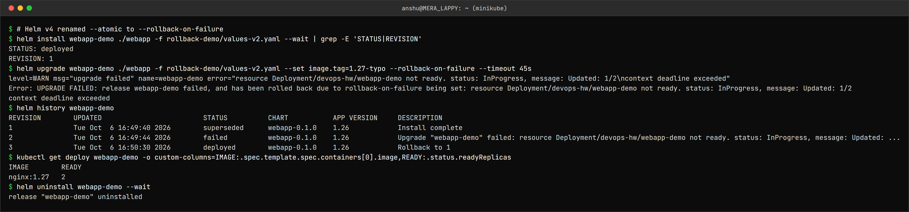

```
$ # Helm v4 renamed --atomic to --rollback-on-failure
$ helm install webapp-demo ./webapp -f rollback-demo/values-v2.yaml --wait | grep -E 'STATUS|REVISION'
STATUS: deployed
REVISION: 1
$ helm upgrade webapp-demo ./webapp -f rollback-demo/values-v2.yaml --set image.tag=1.27-typo --rollback-on-failure --timeout 45s
level=WARN msg="upgrade failed" name=webapp-demo error="resource Deployment/devops-hw/webapp-demo not ready. status: InProgress, message: Updated: 1/2\ncontext deadline exceeded"
Error: UPGRADE FAILED: release webapp-demo failed, and has been rolled back due to rollback-on-failure being set: resource Deployment/devops-hw/webapp-demo not ready. status: InProgress, message: Updated: 1/2
context deadline exceeded
$ helm history webapp-demo
REVISION	UPDATED                 	STATUS    	CHART       	APP VERSION	DESCRIPTION
1       	Tue Oct  6 16:49:40 2026	superseded	webapp-0.1.0	1.26       	Install complete
2       	Tue Oct  6 16:49:44 2026	failed    	webapp-0.1.0	1.26       	Upgrade "webapp-demo" failed: resource Deployment/devops-hw/webapp-demo not ready. status: InProgress, message: Updated: ...
3       	Tue Oct  6 16:50:30 2026	deployed  	webapp-0.1.0	1.26       	Rollback to 1
$ kubectl get deploy webapp-demo -o custom-columns=IMAGE:.spec.template.spec.containers[0].image,READY:.status.readyReplicas
IMAGE        READY
nginx:1.27   2
$ helm uninstall webapp-demo --wait
release "webapp-demo" uninstalled
```

Helm v4 renamed v3's `--atomic` to **`--rollback-on-failure`**. The upgrade to a non-existent tag
never became ready within 45s, so Helm marked revision 2 `failed` and immediately created revision 3
"Rollback to 1". The Deployment never lost its two ready Pods.

---

Task 3: Mini Project - Notes app chart
--------------------------------------

The [notes-chart](mini-project/notes-chart/) from the class repo: a ConfigMap (`APP_NAME`,
`ENVIRONMENT`), a Deployment that loads it with `envFrom`, and a NodePort Service. `values.yaml`
is development (1 replica, nginx:1.24), `values-prod.yaml` is production (3 replicas, nginx:1.25).

### Lint, render, install (development)

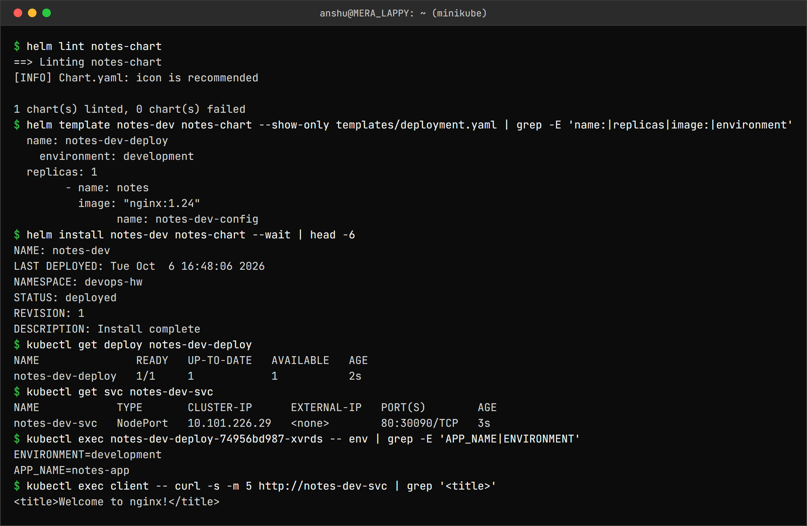

```
$ helm lint notes-chart
==> Linting notes-chart
[INFO] Chart.yaml: icon is recommended

1 chart(s) linted, 0 chart(s) failed
$ helm template notes-dev notes-chart --show-only templates/deployment.yaml | grep -E 'name:|replicas|image:|environment'
  name: notes-dev-deploy
    environment: development
  replicas: 1
        - name: notes
          image: "nginx:1.24"
                name: notes-dev-config
$ helm install notes-dev notes-chart --wait | head -6
NAME: notes-dev
LAST DEPLOYED: Tue Oct  6 16:48:06 2026
NAMESPACE: devops-hw
STATUS: deployed
REVISION: 1
DESCRIPTION: Install complete
$ kubectl get deploy notes-dev-deploy
NAME               READY   UP-TO-DATE   AVAILABLE   AGE
notes-dev-deploy   1/1     1            1           2s
$ kubectl get svc notes-dev-svc
NAME            TYPE       CLUSTER-IP      EXTERNAL-IP   PORT(S)        AGE
notes-dev-svc   NodePort   10.101.226.29   <none>        80:30090/TCP   3s
$ kubectl exec notes-dev-deploy-74956bd987-xvrds -- env | grep -E 'APP_NAME|ENVIRONMENT'
ENVIRONMENT=development
APP_NAME=notes-app
$ kubectl exec client -- curl -s -m 5 http://notes-dev-svc | grep '<title>'
<title>Welcome to nginx!</title>
```

The NodePort `30090` is not reachable from Windows with minikube's docker driver (same limitation
as topic 10), so the app is tested from a client Pod through the Service.

### Upgrade to production

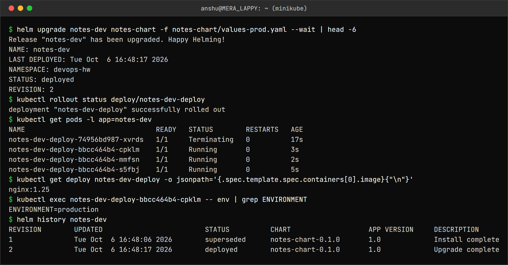

```
$ helm upgrade notes-dev notes-chart -f notes-chart/values-prod.yaml --wait | head -6
Release "notes-dev" has been upgraded. Happy Helming!
NAME: notes-dev
LAST DEPLOYED: Tue Oct  6 16:48:17 2026
NAMESPACE: devops-hw
STATUS: deployed
REVISION: 2
$ kubectl rollout status deploy/notes-dev-deploy
deployment "notes-dev-deploy" successfully rolled out
$ kubectl get pods -l app=notes-dev
NAME                                READY   STATUS        RESTARTS   AGE
notes-dev-deploy-74956bd987-xvrds   1/1     Terminating   0          17s
notes-dev-deploy-bbcc464b4-cpklm    1/1     Running       0          3s
notes-dev-deploy-bbcc464b4-mmfsn    1/1     Running       0          2s
notes-dev-deploy-bbcc464b4-s5fbj    1/1     Running       0          5s
$ kubectl get deploy notes-dev-deploy -o jsonpath='{.spec.template.spec.containers[0].image}{"\n"}'
nginx:1.25
$ kubectl exec notes-dev-deploy-bbcc464b4-cpklm -- env | grep ENVIRONMENT
ENVIRONMENT=production
$ helm history notes-dev
REVISION	UPDATED                 	STATUS    	CHART            	APP VERSION	DESCRIPTION
1       	Tue Oct  6 16:48:06 2026	superseded	notes-chart-0.1.0	1.0        	Install complete
2       	Tue Oct  6 16:48:17 2026	deployed  	notes-chart-0.1.0	1.0        	Upgrade complete
```

### A bad upgrade

The class README's command: `helm upgrade notes-dev notes-chart --set image.tag=broken-tag-does-not-exist`.

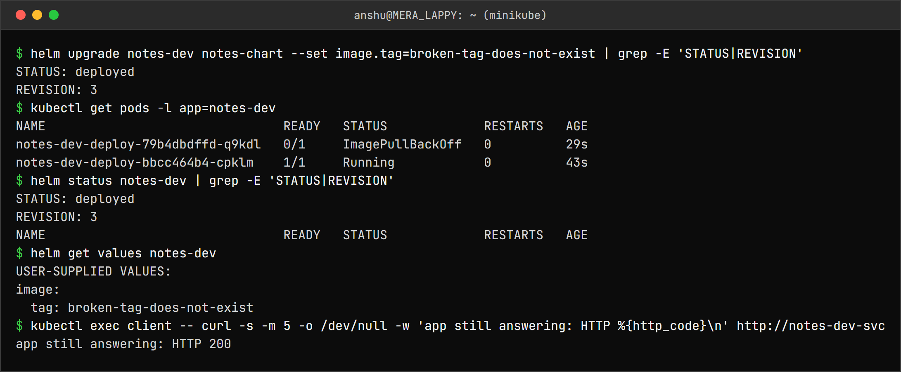

```
$ helm upgrade notes-dev notes-chart --set image.tag=broken-tag-does-not-exist | grep -E 'STATUS|REVISION'
STATUS: deployed
REVISION: 3
$ kubectl get pods -l app=notes-dev
NAME                                READY   STATUS             RESTARTS   AGE
notes-dev-deploy-79b4dbdffd-q9kdl   0/1     ImagePullBackOff   0          29s
notes-dev-deploy-bbcc464b4-cpklm    1/1     Running            0          43s
$ helm status notes-dev | grep -E 'STATUS|REVISION'
STATUS: deployed
REVISION: 3
NAME                                READY   STATUS             RESTARTS   AGE
$ helm get values notes-dev
USER-SUPPLIED VALUES:
image:
  tag: broken-tag-does-not-exist
$ kubectl exec client -- curl -s -m 5 -o /dev/null -w 'app still answering: HTTP %{http_code}\n' http://notes-dev-svc
app still answering: HTTP 200
```

This one step shows three separate traps:

1. **Helm said `STATUS: deployed`** for a release whose new Pod is in `ImagePullBackOff`. Without
   `--wait`, Helm only checks that Kubernetes *accepted* the objects, not that they work.
2. **The production values were silently dropped.** The command has no `-f values-prod.yaml`, and
   `helm get values` shows only `image.tag`. An upgrade starts from the chart defaults plus what
   you pass *this time*, so replicas went from 3 back to 1 and `ENVIRONMENT` back to
   `development`.
3. The app **still answered HTTP 200**. With 1 desired replica, the rolling update is not allowed
   to remove the last working old Pod until the new one is ready - which it never will be.

### Rollback and uninstall

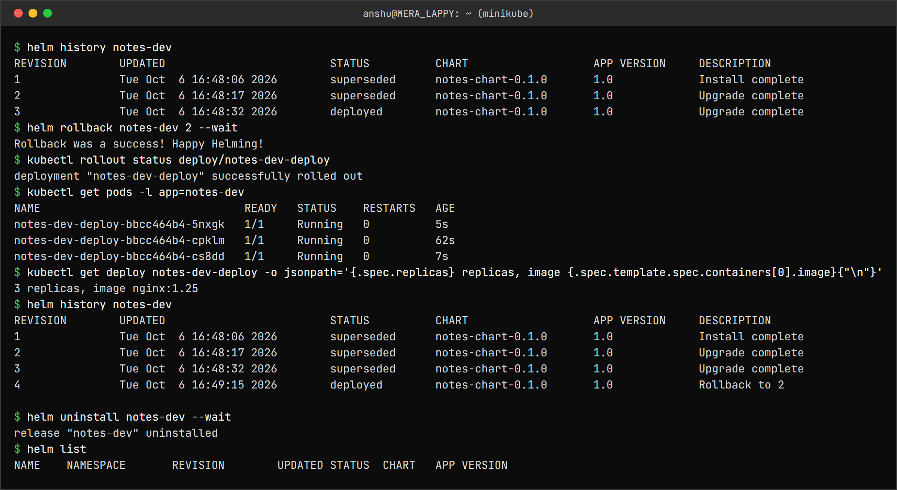

```
$ helm history notes-dev
REVISION	UPDATED                 	STATUS    	CHART            	APP VERSION	DESCRIPTION
1       	Tue Oct  6 16:48:06 2026	superseded	notes-chart-0.1.0	1.0        	Install complete
2       	Tue Oct  6 16:48:17 2026	superseded	notes-chart-0.1.0	1.0        	Upgrade complete
3       	Tue Oct  6 16:48:32 2026	deployed  	notes-chart-0.1.0	1.0        	Upgrade complete
$ helm rollback notes-dev 2 --wait
Rollback was a success! Happy Helming!
$ kubectl rollout status deploy/notes-dev-deploy
deployment "notes-dev-deploy" successfully rolled out
$ kubectl get pods -l app=notes-dev
NAME                               READY   STATUS    RESTARTS   AGE
notes-dev-deploy-bbcc464b4-5nxgk   1/1     Running   0          5s
notes-dev-deploy-bbcc464b4-cpklm   1/1     Running   0          62s
notes-dev-deploy-bbcc464b4-cs8dd   1/1     Running   0          7s
$ kubectl get deploy notes-dev-deploy -o jsonpath='{.spec.replicas} replicas, image {.spec.template.spec.containers[0].image}{"\n"}'
3 replicas, image nginx:1.25
$ helm history notes-dev
REVISION	UPDATED                 	STATUS    	CHART            	APP VERSION	DESCRIPTION
1       	Tue Oct  6 16:48:06 2026	superseded	notes-chart-0.1.0	1.0        	Install complete
2       	Tue Oct  6 16:48:17 2026	superseded	notes-chart-0.1.0	1.0        	Upgrade complete
3       	Tue Oct  6 16:48:32 2026	superseded	notes-chart-0.1.0	1.0        	Upgrade complete
4       	Tue Oct  6 16:49:15 2026	deployed  	notes-chart-0.1.0	1.0        	Rollback to 2

$ helm uninstall notes-dev --wait
release "notes-dev" uninstalled
$ helm list
NAME	NAMESPACE	REVISION	UPDATED	STATUS	CHART	APP VERSION
```

Rollback to revision 2 brought back all of revision 2's values - 3 replicas, nginx:1.25 -
including the production values the bad upgrade had dropped.

---

What I understood
-----------------

- Chart = templates + default values. Release = one installed copy of a chart. Revision = one
  version of a release. Same chart, different values = different environments.
- `helm template` and `helm lint` catch most mistakes before anything touches the cluster.
- Every upgrade starts from the chart's defaults. Forgetting `-f values-prod.yaml` quietly turns
  production into development. (`--reuse-values` exists but hides what is actually deployed;
  passing the values file every time is clearer.)
- Without `--wait`, "deployed" only means "Kubernetes accepted the YAML". With
  `--rollback-on-failure`, a failed upgrade undoes itself.
- Rollback creates a new revision and re-applies the old **stored manifest** - it does not
  re-render, which is why `.Release.Revision` in the page stayed 2.
- Pods only restart when their template changes. A ConfigMap change alone does not restart them,
  which is why the webapp chart has a `checksum/config` annotation (the notes-chart does not -
  it only picked up new config because the image changed at the same time).
- Helm v4 vs v3: `--atomic` → `--rollback-on-failure`, `helm list --all` removed, uninstalled
  releases kept with `--keep-history` show in plain `helm list`.
