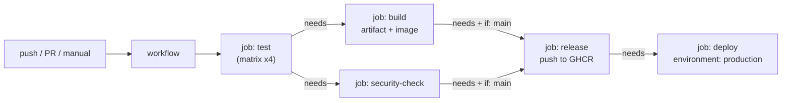

CI/CD and GitHub Actions – Learning Notes
=========================================

Name: Anshul Mohanty    Roll No: 24BCS10191    Section: A

## In one line

CI proves every change works; CD ships the proven artifact automatically - and in GitHub Actions
that is just jobs on runners, ordered by `needs:` and gated by `if:`.

## The picture

## Mental model

| Term | One line |
|---|---|
| Workflow | YAML in the **root** `.github/workflows/` |
| Event | `push`, `pull_request`, `workflow_dispatch`, `schedule` |
| Job | Runs on its own runner; parallel unless `needs:` |
| Step | `run:` a command or `uses:` an action |
| Runner | `ubuntu-latest`, `windows-latest`, `macos-latest`, or self-hosted |
| Matrix | One job → many combinations |
| Secret | Encrypted, masked in logs, not given to fork PRs |
| Artifact | Files kept after the job (reports, builds) |

| CI | CD |
|---|---|
| test, lint, scan, build | publish artifact, deploy, verify |
| every push and PR | only from `main` |

## Gotchas

- A `.github/workflows` folder inside a sub-directory is **ignored** - workflows must be at the root.
- `defaults.run.working-directory` only affects `run:` steps, not `uses:` actions (artifact paths
  still need the folder prefix).
- `build.sh` with Windows CRLF line endings breaks on Linux runners - `.gitattributes` `*.sh eol=lf`.
- Git on Windows does not keep the execute bit - `chmod +x` in the workflow (or `git update-index --chmod=+x`).
- Without `fail-fast: false`, one failing matrix job cancels the others.
- `if: always()` on upload steps keeps test reports from failed runs.
- Job log lines are visible only to signed-in users; repository secrets can only be created by
  someone signed in with admin access.
