CI/CD and GitHub Actions – Homework
===================================

Name: Anshul Mohanty    Roll No: 24BCS10191    Section: A

See also: [LEARNING.md](LEARNING.md) - diagram and revision notes for this topic.

A complete CI/CD demo project built on the class `10-final-cicd-pipeline` calculator:
tests on a matrix of runners, a build artifact, a Docker image, a repository secret, and a CD part
that publishes the image to a registry and deploys and verifies it.

| Path | Contents |
|---|---|
| [app/calculator.py](app/calculator.py) | The class calculator + the `power()` student task |
| [app/server.py](app/server.py) | A small HTTP API around it so it can run as a container |
| [tests/](tests/) | 6 calculator tests + 4 API tests |
| [build.sh](build.sh) | Packages the app into `build/` with build metadata |
| [Dockerfile](Dockerfile) | `python:3.12-slim`, non-root user |
| [../.github/workflows/15-calculator-cicd.yml](../.github/workflows/15-calculator-cicd.yml) | The pipeline |
| [k8s/deployment.yaml](k8s/deployment.yaml) | Runs the published image on minikube |

GitHub only reads workflows from `.github/workflows/` at the **repository root** - a `.github`
folder inside a sub-folder is ignored. So the workflow lives at the root and uses `paths:` filters
plus a default `working-directory` to act only on this folder. A root
[.gitattributes](../.gitattributes) keeps `*.sh` files at LF line endings, because a `build.sh`
checked out with Windows CRLF endings fails on the Linux runner.

---

Concepts
--------

### CI vs CD

| | Continuous Integration | Continuous Delivery | Continuous Deployment |
|---|---|---|---|
| Goal | Every change is merged often and **verified automatically** | Every verified change is **packaged and ready** to release | Every verified change is **released automatically** |
| Output | Green tests, a build artifact | A versioned artifact in a registry | The new version running |
| Here | `test`, `security-check`, `build` jobs | `release` job → image in GHCR | `deploy` job → image started and smoke-tested |

### The building blocks, as used in this workflow

| Term | Meaning | In [15-calculator-cicd.yml](../.github/workflows/15-calculator-cicd.yml) |
|---|---|---|
| **Workflow** | A YAML file in `.github/workflows/` | `15 - Calculator CI/CD` |
| **Event / trigger** | What starts it | `push` to `main` and `ci-demo/**`, `pull_request` to `main`, `workflow_dispatch` (manual) - all filtered by `paths:` |
| **Job** | A set of steps on one runner; jobs run in **parallel** unless linked with `needs:` | `test`, `security-check`, `build`, `secrets-demo`, `release`, `deploy` |
| **Step** | One command (`run:`) or one reusable action (`uses:`) | `actions/checkout@v7`, `pytest -v ...` |
| **Runner** | The machine that runs a job | GitHub-hosted `ubuntu-latest` and `windows-latest` |
| **Matrix** | One job definition expanded into many | 2 OS × 2 Python = **4** test jobs |
| **Secrets** | Encrypted values injected at run time, masked in logs | `secrets.GITHUB_TOKEN` (automatic), `secrets.DEMO_SECRET` |
| **Artifacts** | Files a job uploads for later jobs or for download | test reports (JUnit XML), `calculator-build` |
| **Environment** | A named deployment target with its own history and protection rules | `production` on the `deploy` job |
| **Conditions** | Run a job/step only sometimes | `if: always()` (upload reports even when tests fail), `if: github.ref == 'refs/heads/main'` (CD only on main) |

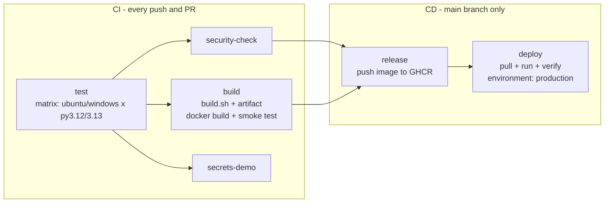

---

The app, run locally first
--------------------------

### Tests and build script

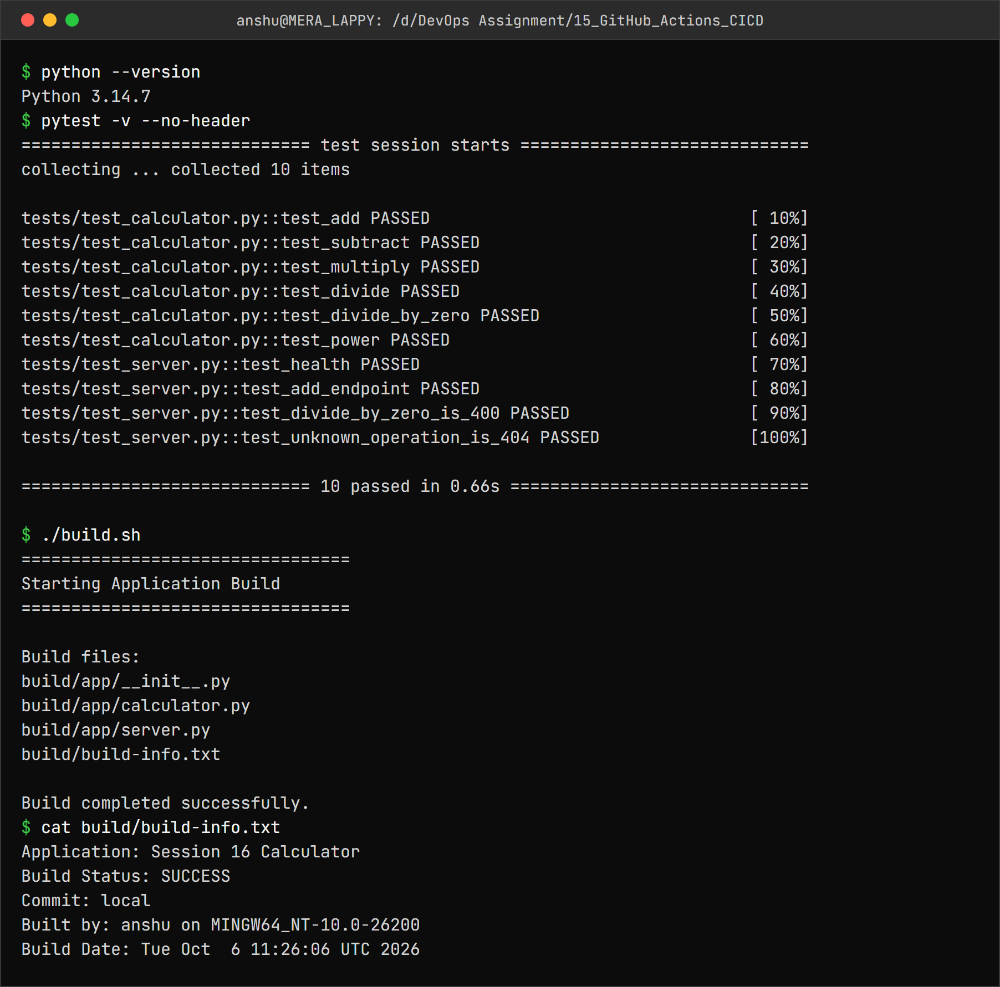

```
$ python --version
Python 3.14.7
$ pytest -v --no-header
============================= test session starts =============================
collecting ... collected 10 items

tests/test_calculator.py::test_add PASSED                                [ 10%]
tests/test_calculator.py::test_subtract PASSED                           [ 20%]
tests/test_calculator.py::test_multiply PASSED                           [ 30%]
tests/test_calculator.py::test_divide PASSED                             [ 40%]
tests/test_calculator.py::test_divide_by_zero PASSED                     [ 50%]
tests/test_calculator.py::test_power PASSED                              [ 60%]
tests/test_server.py::test_health PASSED                                 [ 70%]
tests/test_server.py::test_add_endpoint PASSED                           [ 80%]
tests/test_server.py::test_divide_by_zero_is_400 PASSED                  [ 90%]
tests/test_server.py::test_unknown_operation_is_404 PASSED               [100%]

============================= 10 passed in 0.66s ==============================

$ ./build.sh
=================================
Starting Application Build
=================================

Build files:
build/app/__init__.py
build/app/calculator.py
build/app/server.py
build/build-info.txt

Build completed successfully.
$ cat build/build-info.txt
Application: Session 16 Calculator
Build Status: SUCCESS
Commit: local
Built by: anshu on MINGW64_NT-10.0-26200
Build Date: Tue Oct  6 11:26:06 UTC 2026
```

### The container

```dockerfile
FROM python:3.12-slim
WORKDIR /app
ARG APP_VERSION=dev
ENV APP_VERSION=${APP_VERSION} PYTHONUNBUFFERED=1
COPY app/ ./app/
RUN useradd --create-home appuser
USER appuser
EXPOSE 8000
CMD ["python", "-m", "app.server"]
```

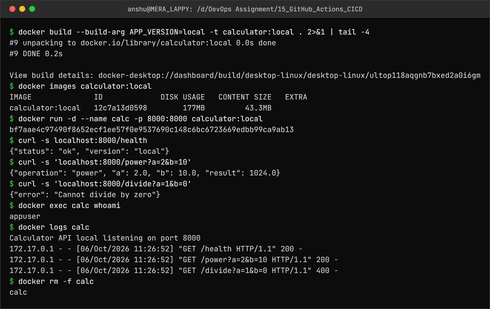

```
$ docker build --build-arg APP_VERSION=local -t calculator:local . 2>&1 | tail -4
#9 unpacking to docker.io/library/calculator:local 0.0s done
#9 DONE 0.2s

View build details: docker-desktop://dashboard/build/desktop-linux/desktop-linux/ultop118aqgnb7bxed2a0i6gm
$ docker images calculator:local
IMAGE              ID             DISK USAGE   CONTENT SIZE   EXTRA
calculator:local   12c7a13d0598        177MB         43.3MB
$ docker run -d --name calc -p 8000:8000 calculator:local
bf7aae4c97490f8652ecf1ee57f0e9537690c148c6bc6723669edbb99ca9ab13
$ curl -s localhost:8000/health
{"status": "ok", "version": "local"}
$ curl -s 'localhost:8000/power?a=2&b=10'
{"operation": "power", "a": 2.0, "b": 10.0, "result": 1024.0}
$ curl -s 'localhost:8000/divide?a=1&b=0'
{"error": "Cannot divide by zero"}
$ docker exec calc whoami
appuser
$ docker logs calc
Calculator API local listening on port 8000
172.17.0.1 - - [06/Oct/2026 11:26:52] "GET /health HTTP/1.1" 200 -
172.17.0.1 - - [06/Oct/2026 11:26:52] "GET /power?a=2&b=10 HTTP/1.1" 200 -
172.17.0.1 - - [06/Oct/2026 11:26:52] "GET /divide?a=1&b=0 HTTP/1.1" 400 -
$ docker rm -f calc
calc
```

`APP_VERSION` is a build argument: in CI it is set to the **commit SHA**, so `/health` reports
exactly which commit is running.

---

Pipeline execution
------------------

### A successful run - CI and CD

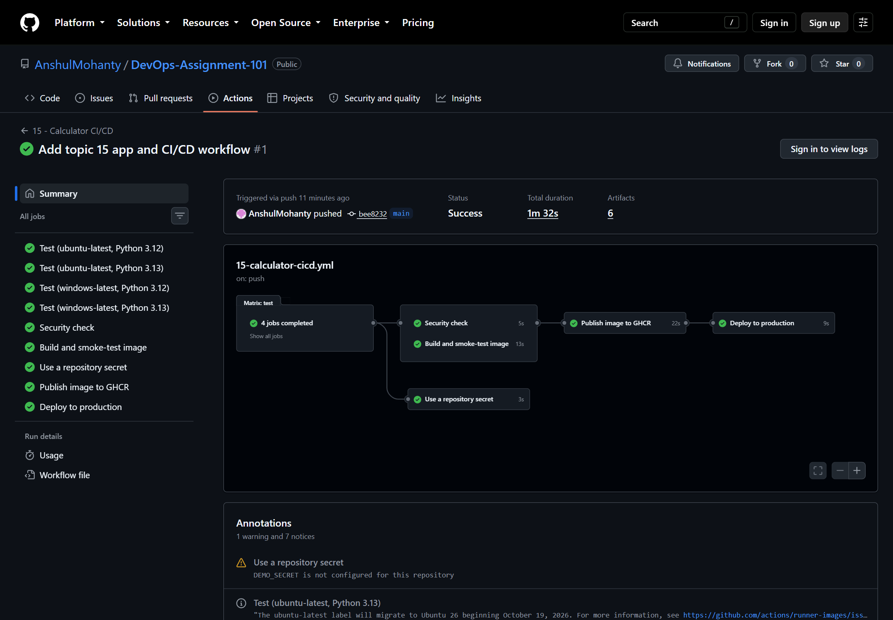

Run: [15 - Calculator CI/CD #1](https://github.com/AnshulMohanty/DevOps-Assignment-101/actions/runs/37456510126) -
**9 jobs, all green, 1 min 32 s**, triggered by the push of commit `bee8232`. The graph shows the
dependency structure: the 4 matrix test jobs first, then security check, build and the secret job in
parallel, then release, then deploy. The run produced 6 artifacts (4 test reports, the
`calculator-build` bundle and the Docker build record).

Inside the jobs (step lists are public; log lines need a GitHub sign-in):

| Test on a Windows runner | Build and smoke-test image |
|---|---|
| 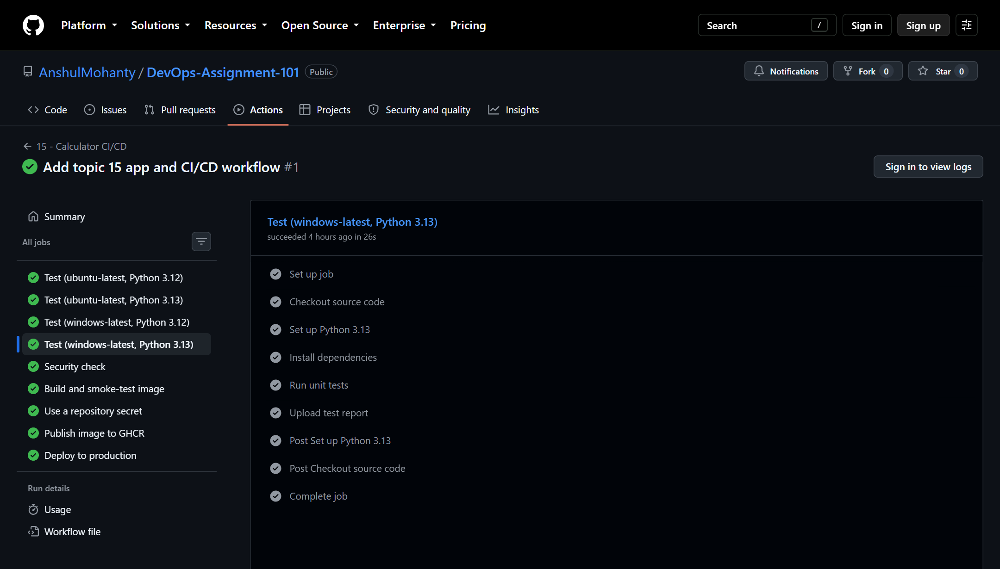 | 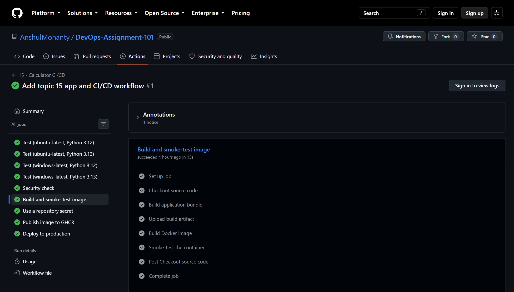 |

| Publish image to GHCR (CD) | Deploy to production (CD) |
|---|---|
| 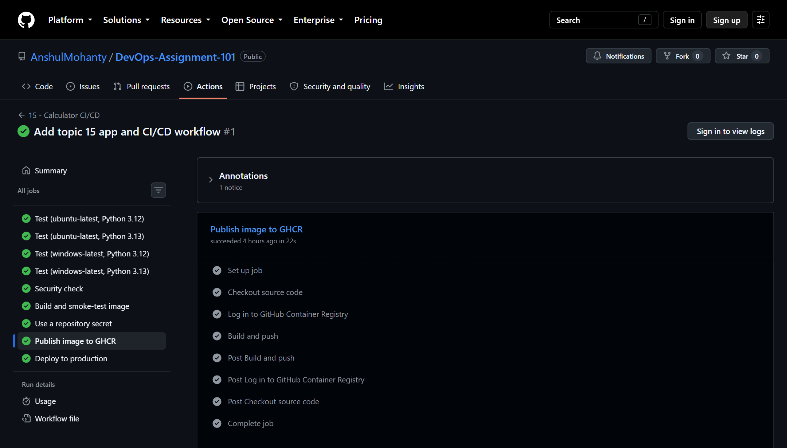 | 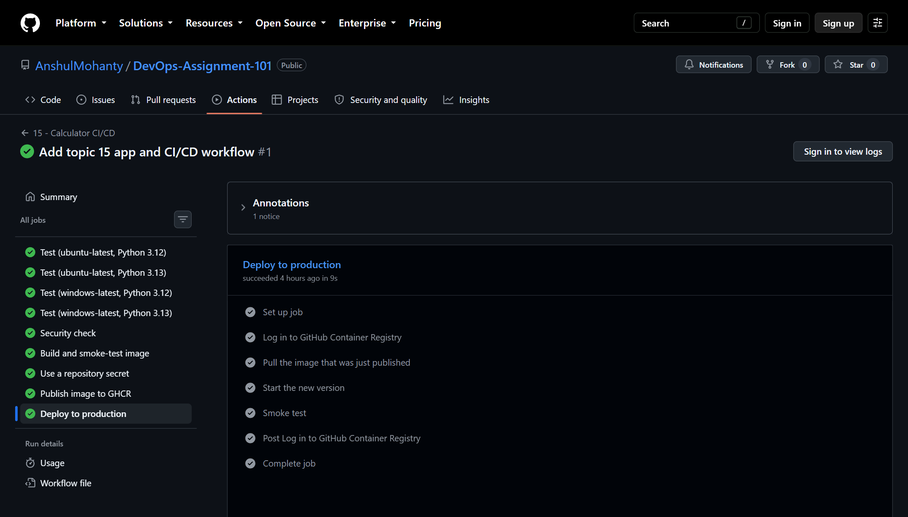 |

The `deploy` job pulls the image that `release` just pushed, starts it, and the smoke test fails the
job unless `/health` reports the **same commit SHA** and `/multiply?a=6&b=7` returns `42.0` - so a
wrong or broken version cannot pass silently.

### A failing run - CI stops CD

To see the pipeline catch a bug, `add()` was changed to `return a + b + 1` on a separate branch,
`ci-demo/broken-add` (so `main` never carried the bug):

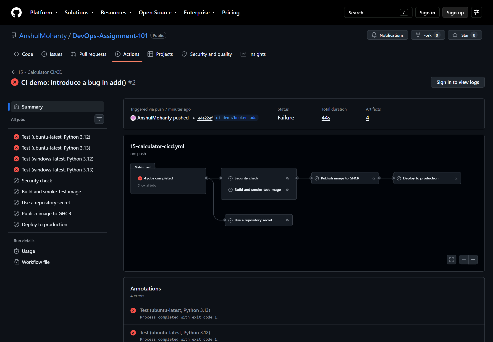

Run: [15 - Calculator CI/CD #2](https://github.com/AnshulMohanty/DevOps-Assignment-101/actions/runs/37457045646) -
all **4** test jobs failed (`fail-fast: false`, so every OS/Python combination reports), and every
job after them was **skipped**: no build, no image, no deploy.

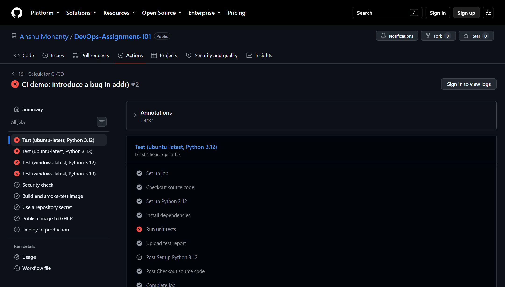

"Run unit tests" failed, but "Upload test report" still ran - that is the `if: always()` on that
step, so the JUnit report of the failure is still downloadable as an artifact. Also, `release` and
`deploy` would not have run on this branch even if tests passed: CD is restricted to `main`.

---

The CD output
-------------

### The image in the registry

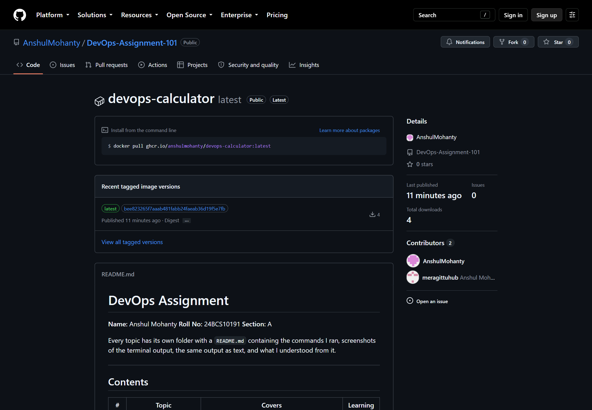

`ghcr.io/anshulmohanty/devops-calculator`, tagged `latest` and with the full commit SHA,
pushed with the workflow's own `GITHUB_TOKEN` (`permissions: packages: write`) - no registry
password stored anywhere. It inherited the repository's public visibility.

### Deployed from the registry to Kubernetes

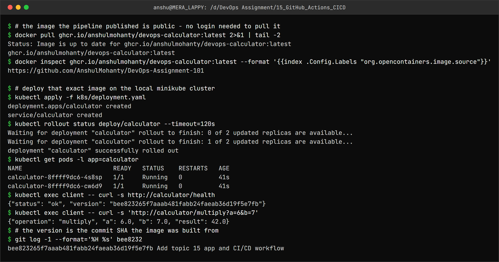

```
$ # the image the pipeline published is public - no login needed to pull it
$ docker pull ghcr.io/anshulmohanty/devops-calculator:latest 2>&1 | tail -2
Status: Image is up to date for ghcr.io/anshulmohanty/devops-calculator:latest
ghcr.io/anshulmohanty/devops-calculator:latest
$ docker inspect ghcr.io/anshulmohanty/devops-calculator:latest --format '{{index .Config.Labels "org.opencontainers.image.source"}}'
https://github.com/AnshulMohanty/DevOps-Assignment-101

$ # deploy that exact image on the local minikube cluster
$ kubectl apply -f k8s/deployment.yaml
deployment.apps/calculator created
service/calculator created
$ kubectl rollout status deploy/calculator --timeout=120s
Waiting for deployment "calculator" rollout to finish: 0 of 2 updated replicas are available...
Waiting for deployment "calculator" rollout to finish: 1 of 2 updated replicas are available...
deployment "calculator" successfully rolled out
$ kubectl get pods -l app=calculator
NAME                         READY   STATUS    RESTARTS   AGE
calculator-8ffff9dc6-4s8sp   1/1     Running   0          41s
calculator-8ffff9dc6-cw6d9   1/1     Running   0          41s
$ kubectl exec client -- curl -s http://calculator/health
{"status": "ok", "version": "bee823265f7aaab481fabb24faeab36d19f5e7fb"}
$ kubectl exec client -- curl -s 'http://calculator/multiply?a=6&b=7'
{"operation": "multiply", "a": 6.0, "b": 7.0, "result": 42.0}
$ # the version is the commit SHA the image was built from
$ git log -1 --format='%H %s' bee8232
bee823265f7aaab481fabb24faeab36d19f5e7fb Add topic 15 app and CI/CD workflow
```

The image pulled with no login, its OCI label links back to this repository, and when run on
minikube its `/health` reports `bee8232...` - the exact commit the pipeline built it from.

---

Secrets
-------

The workflow uses two kinds:

| Secret | How it is set | Used for |
|---|---|---|
| `GITHUB_TOKEN` | Created automatically for every run, expires when the run ends | Logging in to GHCR in `release` and `deploy` |
| `DEMO_SECRET` | A repository secret: **Settings → Secrets and variables → Actions** | The `secrets-demo` job |

```yaml
- name: Read DEMO_SECRET
  env:
    DEMO_SECRET: ${{ secrets.DEMO_SECRET }}
  run: |
    if [ -z "$DEMO_SECRET" ]; then
      echo "::warning::DEMO_SECRET is not configured for this repository"
      exit 0
    fi
    echo "Trying to print the secret: $DEMO_SECRET"   # GitHub replaces the value with ***
    echo "The secret is ${#DEMO_SECRET} characters long"
```

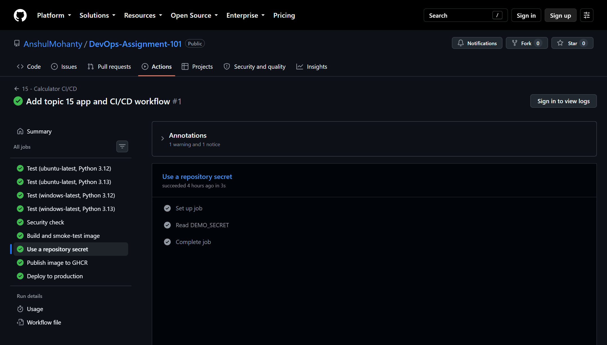

**Not completed:** creating a repository secret requires signing in to GitHub (web UI or
`gh auth login`), which was not available while this was done, so the run above took the
"not configured" branch and raised the warning visible in the run summary. To finish it: add
`DEMO_SECRET` under Settings → Secrets and variables → Actions, then re-run the workflow - the log
will show `Trying to print the secret: ***`, because GitHub masks secret values in logs.

What secrets protect, and what they don't: they are encrypted at rest, only exposed to the steps
that reference them, masked in logs, and **not passed to workflows triggered from forks**. But a
step that can read a secret can still leak it (e.g. by encoding it), so secrets should only be given
to the jobs that need them - which is why `GITHUB_TOKEN` gets `packages: write` only in the
`release` job.

---

What I understood
-----------------

- **CI** answers "is this change OK?" on every push; **CD** turns an OK change into a released
  version without manual steps. Splitting them with `needs:` and `if:` means a failing test
  physically prevents a deploy.
- A **workflow** reacts to **events**; **jobs** run in parallel on separate **runners** unless
  `needs:` orders them; **steps** run in sequence inside a job and share its filesystem.
- A **matrix** tests every OS/Python combination from one definition; `fail-fast: false` makes all of
  them report instead of cancelling on the first failure.
- **Artifacts** carry files between jobs and out of the pipeline; `if: always()` keeps the evidence
  of a failure.
- Tagging the image with the **commit SHA** and baking it into the app makes "what is running?" a
  one-request question - and lets the deploy step verify it.
- `GITHUB_TOKEN` + least-privilege `permissions:` is better than stored registry passwords.
- Workflows must live in the repository root `.github/workflows/`; in a monorepo, `paths:` filters
  keep each pipeline to its own folder.
