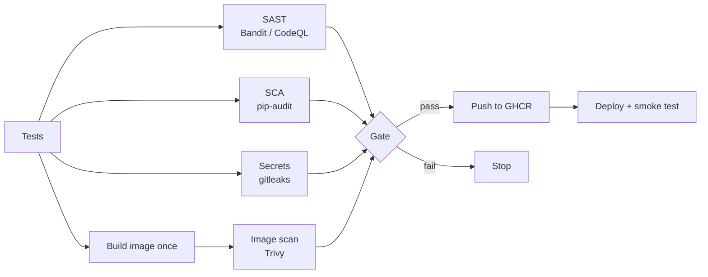

CI/CD and DevSecOps – Learning Notes
====================================

Name: Anshul Mohanty    Roll No: 24BCS10191    Section: A

## In one line

Every push is tested and scanned from four directions - our code, our dependencies, our secrets and
our image - and a single gate with a written policy decides whether that exact image may ship.

## The picture

## Mental model

| Check | Scans | Example finding here |
|---|---|---|
| SAST | Source code we wrote | `debug=True` (B201, HIGH) |
| SCA | Declared dependencies | gunicorn 21.2.0 - 4 CVEs |
| Secret scan | Every commit | fake `ghp_` token (`github-pat`) |
| Image scan | OS packages + libs in the image | 44 unfixable HIGH in Debian slim |

| Policy (gate.py) | Blocks on |
|---|---|
| Bandit | any HIGH |
| pip-audit | any known CVE |
| gitleaks | any leak |
| Trivy | any CRITICAL, or HIGH with a fix |

## Gotchas

- `app.run(debug=True)` = remote code execution through the Werkzeug debugger.
- A scanner with no exit code / no gate is just a log nobody reads.
- `pip-audit` without `-r` audits the CI runner's environment, not the app.
- Unfixable base-image CVEs: change the base image (alpine/distroless) rather than ignore them.
- Rebuilding the image after scanning means you ship something you did not scan.
- `readOnlyRootFilesystem` broke gunicorn 26's control socket in `$HOME` → `--no-control-socket`.
- A fake secret is still a secret to push protection - never commit test tokens.
- Job log lines on GitHub need sign-in; run/job pages and steps are public.
