CI/CD and DevSecOps – Homework
==============================

Name: Anshul Mohanty    Roll No: 24BCS10191    Section: A

See also: [LEARNING.md](LEARNING.md) - diagram and revision notes for this topic.

A complete CI/CD pipeline with security checks built in, for the Flask "DevSecOps Dashboard" app
from the class repo. The workflow is
[.github/workflows/16-devsecops.yml](../.github/workflows/16-devsecops.yml) (GitHub only runs
workflows from the repository root, so it is path-filtered to this folder).

| Path | Contents |
|---|---|
| [app/](app/), [tests/](tests/) | The class Flask app and its 8 unit tests |
| [Dockerfile](Dockerfile) | Alpine base, non-root user, gunicorn |
| [requirements.txt](requirements.txt) | Pinned runtime dependencies (what SCA audits) |
| [security/gate.py](security/gate.py) | The security gate: reads every scanner's report and applies the policy |
| [k8s/](k8s/) | Hardened Deployment + Service |

---

The pipeline
------------

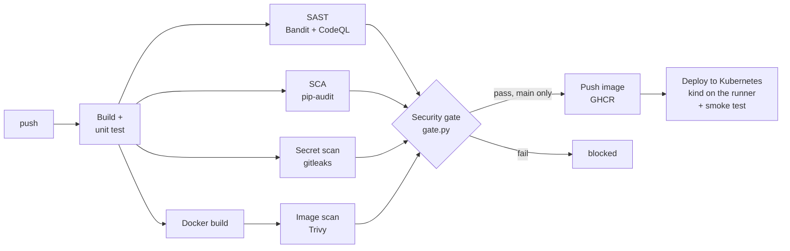
```mermaid
flowchart LR
    CODE["push"] --> BT["Build +<br/>unit test"]
    BT --> SAST["SAST<br/>Bandit + CodeQL"]
    BT --> SCA["SCA<br/>pip-audit"]
    BT --> SEC["Secret scan<br/>gitleaks"]
    BT --> DB["Docker build"] --> IS["Image scan<br/>Trivy"]
    SAST --> GATE{"Security gate<br/>gate.py"}
    SCA --> GATE
    SEC --> GATE
    IS --> GATE
    GATE -->|"pass, main only"| PUSH["Push image<br/>GHCR"] --> DEP["Deploy to Kubernetes<br/>kind on the runner<br/>+ smoke test"]
    GATE -->|"fail"| STOP["blocked"]
```

The homework's flow is followed in order, with one improvement: the four scans run **in
parallel** after the tests instead of one after another, and their results meet in a single gate.

| Job | Tool | What it looks for | Blocks when (policy in `gate.py`) |
|---|---|---|---|
| Build and unit test | `compileall`, pytest + coverage | Broken code | Any test fails |
| SAST | **Bandit** (+ **CodeQL** → Security tab) | Insecure patterns in *our* code | Any HIGH severity finding |
| SCA | **pip-audit** | Known CVEs in *dependencies* | Any known vulnerability |
| Secret scan | **gitleaks** (whole Git history) | Committed tokens/keys | Any finding |
| Docker build | `docker build` | - | Build fails |
| Image scan | **Trivy** | CVEs in the *image* (OS packages + libraries) | Any CRITICAL, or a HIGH that has a fix |
| Security gate | `security/gate.py` | All four reports | Any of the above |
| Push image | GHCR via `GITHUB_TOKEN` | - | Only on `main`, only after the gate |
| Deploy | kind cluster on the runner | Rollout + `curl` through the Service | Rollout or smoke test fails |

The image is built **once**, saved as an artifact, and the *same* bytes are scanned, gated and
pushed - nothing is rebuilt between the scan and the push.

---

What the class app looked like to the scanners
----------------------------------------------

Every tool was first run locally on the app exactly as it came from the class repo. Each finding was
real, and each was fixed before the pipeline went green.

### SAST - Bandit

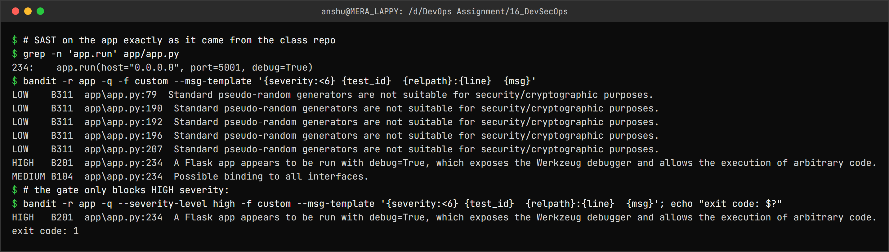

```
$ # SAST on the app exactly as it came from the class repo
$ grep -n 'app.run' app/app.py
234:    app.run(host="0.0.0.0", port=5001, debug=True)
$ bandit -r app -q -f custom --msg-template '{severity:<6} {test_id}  {relpath}:{line}  {msg}'
LOW    B311  app\app.py:79  Standard pseudo-random generators are not suitable for security/cryptographic purposes.
LOW    B311  app\app.py:190  Standard pseudo-random generators are not suitable for security/cryptographic purposes.
LOW    B311  app\app.py:192  Standard pseudo-random generators are not suitable for security/cryptographic purposes.
LOW    B311  app\app.py:196  Standard pseudo-random generators are not suitable for security/cryptographic purposes.
LOW    B311  app\app.py:207  Standard pseudo-random generators are not suitable for security/cryptographic purposes.
HIGH   B201  app\app.py:234  A Flask app appears to be run with debug=True, which exposes the Werkzeug debugger and allows the execution of arbitrary code.
MEDIUM B104  app\app.py:234  Possible binding to all interfaces.
$ # the gate only blocks HIGH severity:
$ bandit -r app -q --severity-level high -f custom --msg-template '{severity:<6} {test_id}  {relpath}:{line}  {msg}'; echo "exit code: $?"
HIGH   B201  app\app.py:234  A Flask app appears to be run with debug=True, which exposes the Werkzeug debugger and allows the execution of arbitrary code.
exit code: 1
```

`B201` is serious: `app.run(debug=True)` turns on the Werkzeug interactive debugger, which lets
anyone who can trigger an error **execute arbitrary Python on the server**. `B104` (binding to all
interfaces) comes from the same line. The five `B311` findings are `random` used to generate demo
data - not a security use, so they are accepted as LOW.

The fix: production now runs under **gunicorn** (the Dockerfile `CMD`), and the `__main__` block is
only a local development server bound to `127.0.0.1` with debug taken from an env var.

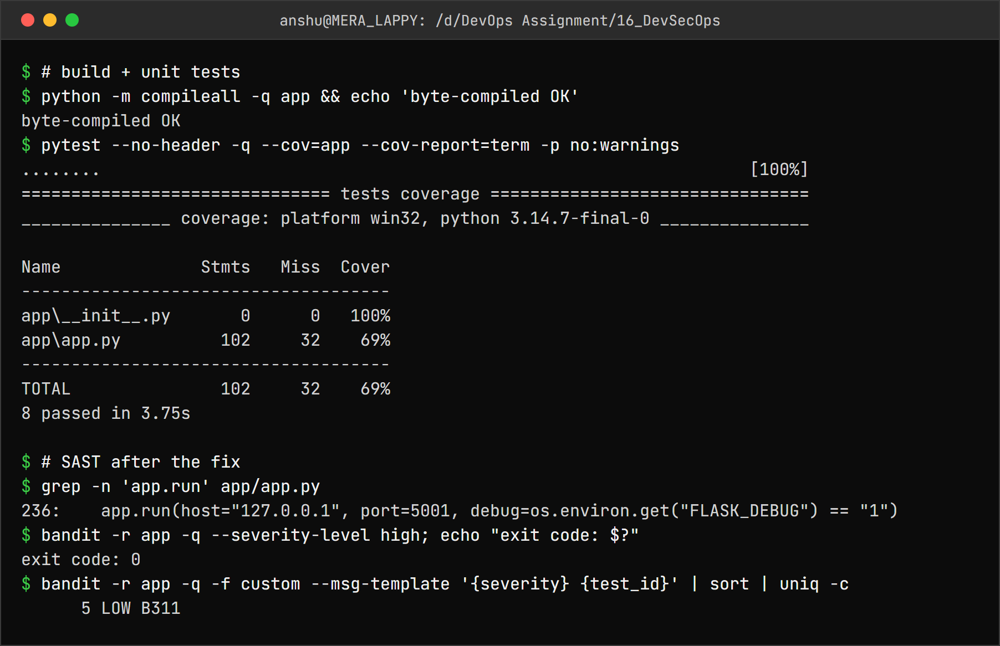

```
$ # build + unit tests
$ python -m compileall -q app && echo 'byte-compiled OK'
byte-compiled OK
$ pytest --no-header -q --cov=app --cov-report=term -p no:warnings
........                                                                 [100%]
=============================== tests coverage ================================
_______________ coverage: platform win32, python 3.14.7-final-0 _______________

Name              Stmts   Miss  Cover
-------------------------------------
app\__init__.py       0      0   100%
app\app.py          102     32    69%
-------------------------------------
TOTAL               102     32    69%
8 passed in 3.75s

$ # SAST after the fix
$ grep -n 'app.run' app/app.py
236:    app.run(host="127.0.0.1", port=5001, debug=os.environ.get("FLASK_DEBUG") == "1")
$ bandit -r app -q --severity-level high; echo "exit code: $?"
exit code: 0
$ bandit -r app -q -f custom --msg-template '{severity} {test_id}' | sort | uniq -c
      5 LOW B311
```

### SCA - pip-audit

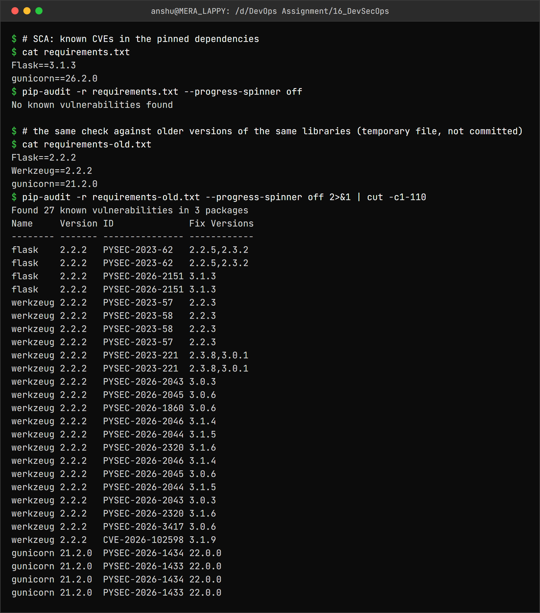

```
$ # SCA: known CVEs in the pinned dependencies
$ cat requirements.txt
Flask==3.1.3
gunicorn==26.2.0
$ pip-audit -r requirements.txt --progress-spinner off
No known vulnerabilities found

$ # the same check against older versions of the same libraries (temporary file, not committed)
$ cat requirements-old.txt
Flask==2.2.2
Werkzeug==2.2.2
gunicorn==21.2.0
$ pip-audit -r requirements-old.txt --progress-spinner off 2>&1 | cut -c1-110
Found 27 known vulnerabilities in 3 packages
Name     Version ID              Fix Versions
-------- ------- --------------- ------------
flask    2.2.2   PYSEC-2023-62   2.2.5,2.3.2
flask    2.2.2   PYSEC-2023-62   2.2.5,2.3.2
flask    2.2.2   PYSEC-2026-2151 3.1.3
flask    2.2.2   PYSEC-2026-2151 3.1.3
werkzeug 2.2.2   PYSEC-2023-57   2.2.3
werkzeug 2.2.2   PYSEC-2023-58   2.2.3
werkzeug 2.2.2   PYSEC-2023-58   2.2.3
werkzeug 2.2.2   PYSEC-2023-57   2.2.3
werkzeug 2.2.2   PYSEC-2023-221  2.3.8,3.0.1
werkzeug 2.2.2   PYSEC-2023-221  2.3.8,3.0.1
werkzeug 2.2.2   PYSEC-2026-2043 3.0.3
werkzeug 2.2.2   PYSEC-2026-2045 3.0.6
werkzeug 2.2.2   PYSEC-2026-1860 3.0.6
werkzeug 2.2.2   PYSEC-2026-2046 3.1.4
werkzeug 2.2.2   PYSEC-2026-2044 3.1.5
werkzeug 2.2.2   PYSEC-2026-2320 3.1.6
werkzeug 2.2.2   PYSEC-2026-2046 3.1.4
werkzeug 2.2.2   PYSEC-2026-2045 3.0.6
werkzeug 2.2.2   PYSEC-2026-2044 3.1.5
werkzeug 2.2.2   PYSEC-2026-2043 3.0.3
werkzeug 2.2.2   PYSEC-2026-2320 3.1.6
werkzeug 2.2.2   PYSEC-2026-3417 3.0.6
werkzeug 2.2.2   CVE-2026-102598 3.1.9
gunicorn 21.2.0  PYSEC-2026-1434 22.0.0
gunicorn 21.2.0  PYSEC-2026-1433 22.0.0
gunicorn 21.2.0  PYSEC-2026-1434 22.0.0
gunicorn 21.2.0  PYSEC-2026-1433 22.0.0
```

The pinned versions are clean. The same libraries a few versions older carry **27** published
vulnerabilities - which is why dependencies are pinned *and* audited on every run. (The class
workflow ran `pip-audit` with no `-r`, which audits the runner's whole Python environment instead of
the app's dependencies; here it audits `requirements.txt`.)

### Secret scanning - gitleaks

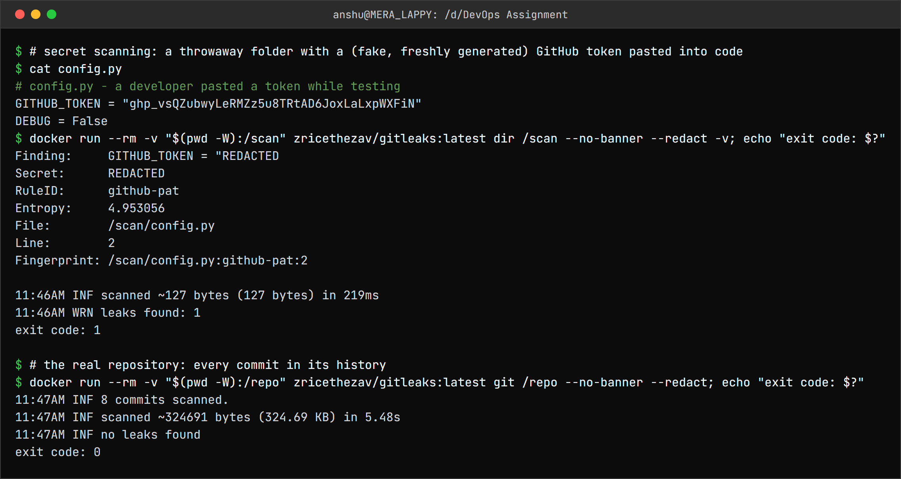

```
$ # secret scanning: a throwaway folder with a (fake, freshly generated) GitHub token pasted into code
$ cat config.py
# config.py - a developer pasted a token while testing
GITHUB_TOKEN = "ghp_************************************"
DEBUG = False
$ docker run --rm -v "$(pwd -W):/scan" zricethezav/gitleaks:latest dir /scan --no-banner --redact -v; echo "exit code: $?"
Finding:     GITHUB_TOKEN = "REDACTED
Secret:      REDACTED
RuleID:      github-pat
Entropy:     4.953056
File:        /scan/config.py
Line:        2
Fingerprint: /scan/config.py:github-pat:2

11:46AM INF scanned ~127 bytes (127 bytes) in 219ms
11:46AM WRN leaks found: 1
exit code: 1

$ # the real repository: every commit in its history
$ docker run --rm -v "$(pwd -W):/repo" zricethezav/gitleaks:latest git /repo --no-banner --redact; echo "exit code: $?"
11:47AM INF 8 commits scanned.
11:47AM INF scanned ~324691 bytes (324.69 KB) in 5.48s
11:47AM INF no leaks found
exit code: 0
```

A freshly generated fake GitHub token in a throwaway folder is caught as `github-pat` (and
redacted in gitleaks' own output). The real repository - every commit in its history at that
point - had no leaks. The token value is masked with `*` in this document; see
[the pipeline caught me](#the-pipeline-caught-me) for why.

### Image scan - Trivy

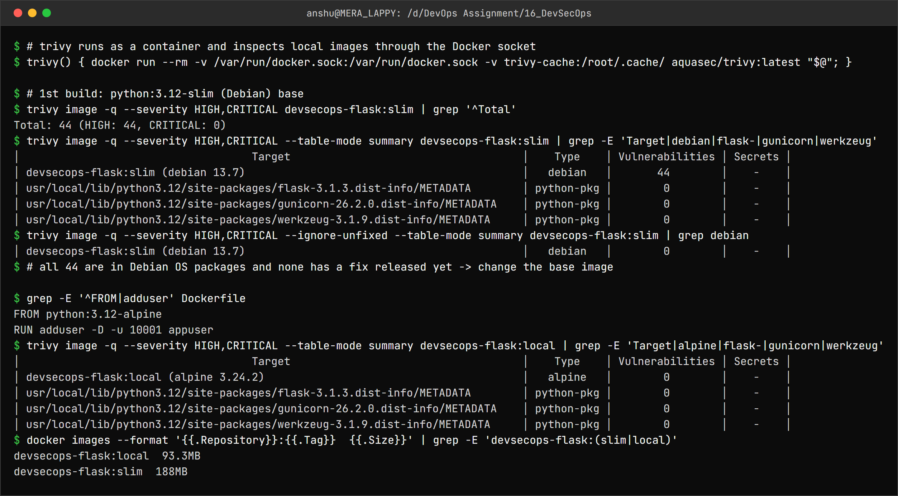

```
$ # trivy runs as a container and inspects local images through the Docker socket
$ trivy() { docker run --rm -v /var/run/docker.sock:/var/run/docker.sock -v trivy-cache:/root/.cache/ aquasec/trivy:latest "$@"; }

$ # 1st build: python:3.12-slim (Debian) base
$ trivy image -q --severity HIGH,CRITICAL devsecops-flask:slim | grep '^Total'
Total: 44 (HIGH: 44, CRITICAL: 0)
$ trivy image -q --severity HIGH,CRITICAL --table-mode summary devsecops-flask:slim | grep -E 'Target|debian|flask-|gunicorn|werkzeug'
│                                    Target                                    │    Type    │ Vulnerabilities │ Secrets │
│ devsecops-flask:slim (debian 13.7)                                           │   debian   │       44        │    -    │
│ usr/local/lib/python3.12/site-packages/flask-3.1.3.dist-info/METADATA        │ python-pkg │        0        │    -    │
│ usr/local/lib/python3.12/site-packages/gunicorn-26.2.0.dist-info/METADATA    │ python-pkg │        0        │    -    │
│ usr/local/lib/python3.12/site-packages/werkzeug-3.1.9.dist-info/METADATA     │ python-pkg │        0        │    -    │
$ trivy image -q --severity HIGH,CRITICAL --ignore-unfixed --table-mode summary devsecops-flask:slim | grep debian
│ devsecops-flask:slim (debian 13.7)                                           │   debian   │        0        │    -    │
$ # all 44 are in Debian OS packages and none has a fix released yet -> change the base image

$ grep -E '^FROM|adduser' Dockerfile
FROM python:3.12-alpine
RUN adduser -D -u 10001 appuser
$ trivy image -q --severity HIGH,CRITICAL --table-mode summary devsecops-flask:local | grep -E 'Target|alpine|flask-|gunicorn|werkzeug'
│                                    Target                                    │    Type    │ Vulnerabilities │ Secrets │
│ devsecops-flask:local (alpine 3.24.2)                                        │   alpine   │        0        │    -    │
│ usr/local/lib/python3.12/site-packages/flask-3.1.3.dist-info/METADATA        │ python-pkg │        0        │    -    │
│ usr/local/lib/python3.12/site-packages/gunicorn-26.2.0.dist-info/METADATA    │ python-pkg │        0        │    -    │
│ usr/local/lib/python3.12/site-packages/werkzeug-3.1.9.dist-info/METADATA     │ python-pkg │        0        │    -    │
$ docker images --format '{{.Repository}}:{{.Tag}}  {{.Size}}' | grep -E 'devsecops-flask:(slim|local)'
devsecops-flask:local  93.3MB
devsecops-flask:slim  188MB
```

The first image used `python:3.12-slim` (Debian): **44 HIGH** vulnerabilities, all in OS packages,
**none with a fix released** (`--ignore-unfixed` → 0). Rather than accept 44 unfixable CVEs,
the base image was switched to `python:3.12-alpine`: **0 HIGH/CRITICAL** and half the size
(93 MB vs 188 MB). Smaller base image = smaller attack surface.

### The fixed image runs

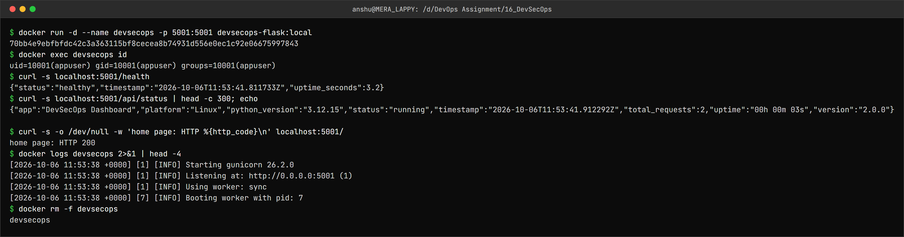

```
$ docker run -d --name devsecops -p 5001:5001 devsecops-flask:local
70bb4e9ebfbfdc42c3a363115bf8cecea8b74931d556e0ec1c92e06675997843
$ docker exec devsecops id
uid=10001(appuser) gid=10001(appuser) groups=10001(appuser)
$ curl -s localhost:5001/health
{"status":"healthy","timestamp":"2026-10-06T11:53:41.811733Z","uptime_seconds":3.2}
$ curl -s localhost:5001/api/status | head -c 300; echo
{"app":"DevSecOps Dashboard","platform":"Linux","python_version":"3.12.15","status":"running","timestamp":"2026-10-06T11:53:41.912292Z","total_requests":2,"uptime":"00h 00m 03s","version":"2.0.0"}

$ curl -s -o /dev/null -w 'home page: HTTP %{http_code}\n' localhost:5001/
home page: HTTP 200
$ docker logs devsecops 2>&1 | head -4
[2026-10-06 11:53:38 +0000] [1] [INFO] Starting gunicorn 26.2.0
[2026-10-06 11:53:38 +0000] [1] [INFO] Listening at: http://0.0.0.0:5001 (1)
[2026-10-06 11:53:38 +0000] [1] [INFO] Using worker: sync
[2026-10-06 11:53:38 +0000] [7] [INFO] Booting worker with pid: 7
$ docker rm -f devsecops
devsecops
```

Running as uid 10001 under gunicorn - not root, not the Flask development server.

---

The security gate
-----------------

[security/gate.py](security/gate.py) reads the four JSON reports and applies the policy in one
place, writes a table to the job summary, and exits 1 to block. It is run here locally on reports
produced from the two versions of the code that went through the pipeline (the job's own log needs
a GitHub sign-in to view - see the note at the end):

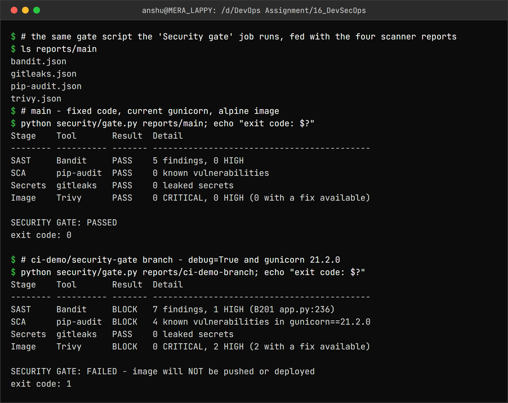

```
$ # the same gate script the 'Security gate' job runs, fed with the four scanner reports
$ ls reports/main
bandit.json
gitleaks.json
pip-audit.json
trivy.json
$ # main - fixed code, current gunicorn, alpine image
$ python security/gate.py reports/main; echo "exit code: $?"
Stage    Tool       Result  Detail
-------- ---------- ------- -------------------------------------------
SAST     Bandit     PASS    5 findings, 0 HIGH
SCA      pip-audit  PASS    0 known vulnerabilities
Secrets  gitleaks   PASS    0 leaked secrets
Image    Trivy      PASS    0 CRITICAL, 0 HIGH (0 with a fix available)

SECURITY GATE: PASSED
exit code: 0

$ # ci-demo/security-gate branch - debug=True and gunicorn 21.2.0
$ python security/gate.py reports/ci-demo-branch; echo "exit code: $?"
Stage    Tool       Result  Detail
-------- ---------- ------- -------------------------------------------
SAST     Bandit     BLOCK   7 findings, 1 HIGH (B201 app.py:236)
SCA      pip-audit  BLOCK   4 known vulnerabilities in gunicorn==21.2.0
Secrets  gitleaks   PASS    0 leaked secrets
Image    Trivy      BLOCK   0 CRITICAL, 2 HIGH (2 with a fix available)

SECURITY GATE: FAILED - image will NOT be pushed or deployed
exit code: 1
```

On the demo branch three checks block for two root causes: `debug=True` (Bandit) and the old
`gunicorn 21.2.0`, which is caught **twice** - by pip-audit in `requirements.txt` and by Trivy
inside the built image. Defence in depth: either one alone would have stopped it.

---

On GitHub Actions
-----------------

### A green run on main - every stage, then push and deploy

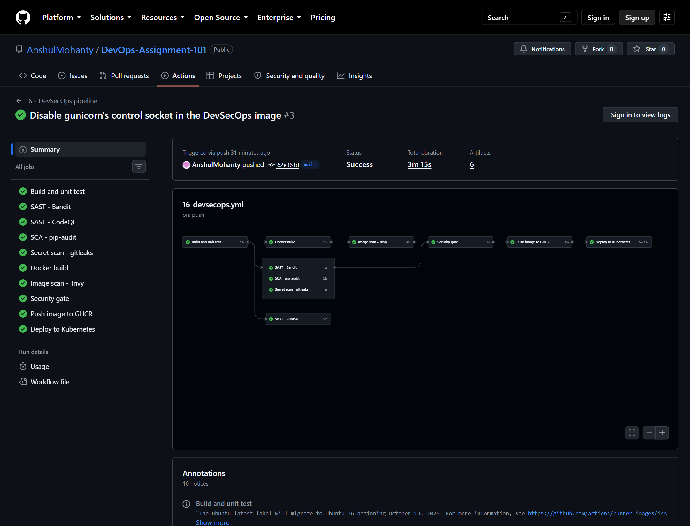

Run: [16 - DevSecOps pipeline #3](https://github.com/AnshulMohanty/DevOps-Assignment-101/actions/runs/37461570413)
- all 10 jobs passed in about 3 minutes.

The jobs' steps (public visitors can see the steps, not the log lines):

| Secret scan | Image scan |
|---|---|
| 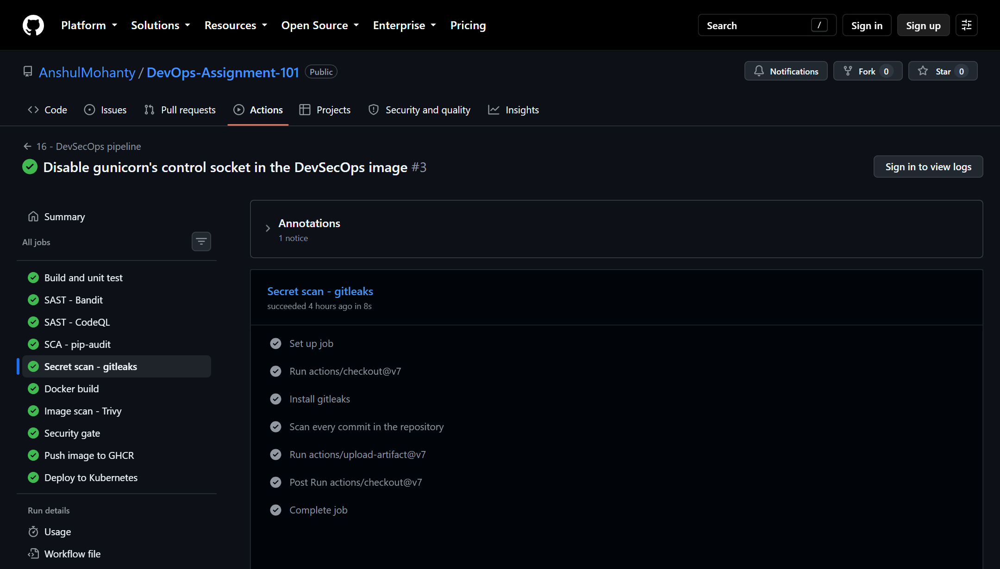 | 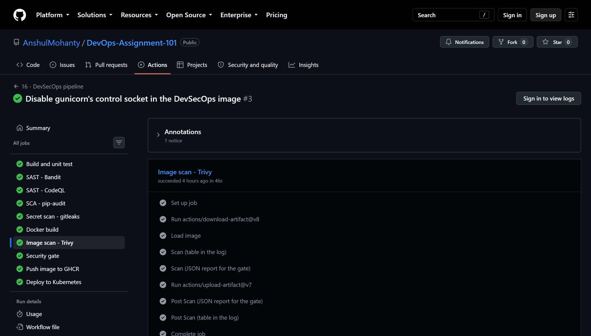 |

| Security gate | Deploy to Kubernetes |
|---|---|
| 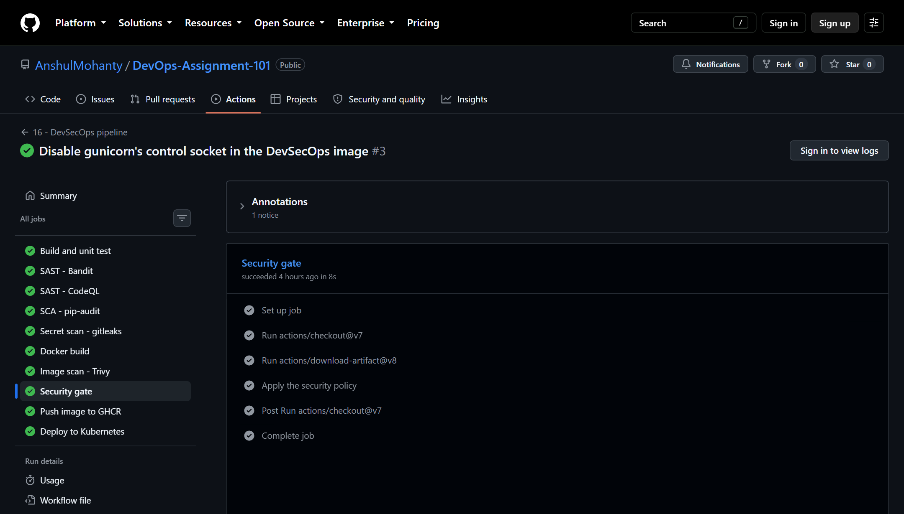 | 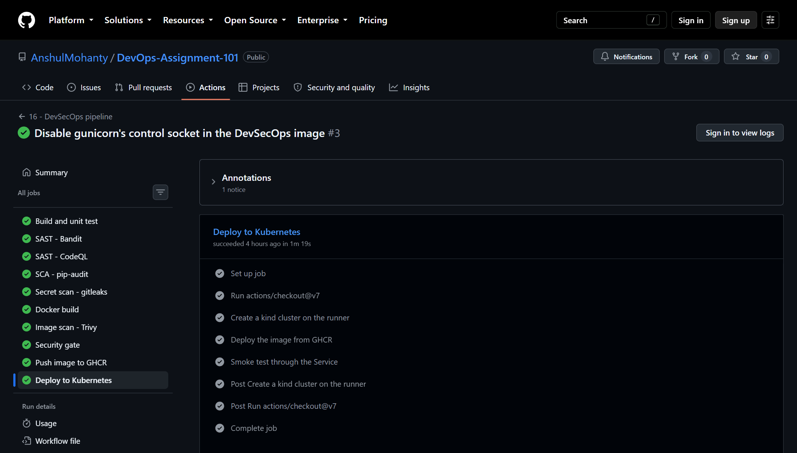 |

### Container registry

The gated image, tagged with the commit SHA and `latest`, published to GHCR with the workflow's own
`GITHUB_TOKEN` - no registry password stored anywhere:

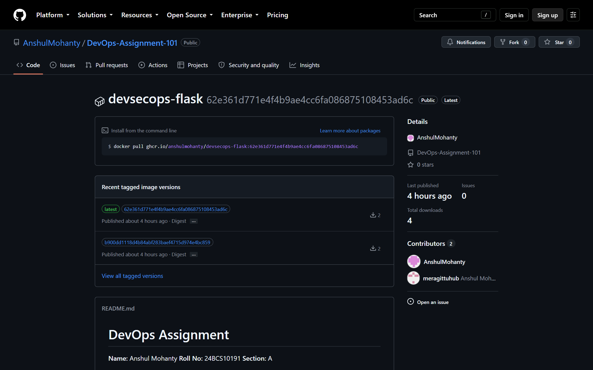

### The gate blocking a bad change

The insecure version (`debug=True` and `gunicorn 21.2.0`) was pushed to a separate branch,
`ci-demo/security-gate`, so `main` never carried it:

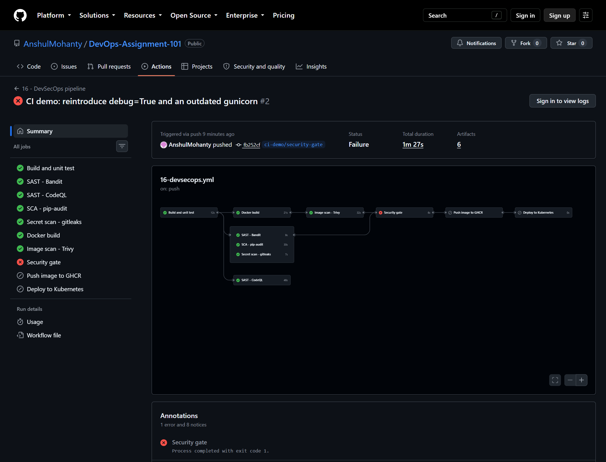

Run: [16 - DevSecOps pipeline #2](https://github.com/AnshulMohanty/DevOps-Assignment-101/actions/runs/37460501324).
Every scan job itself is green - their job is to *report* - and the **Security gate** is the one
that fails, so **Push image** and **Deploy** never run:

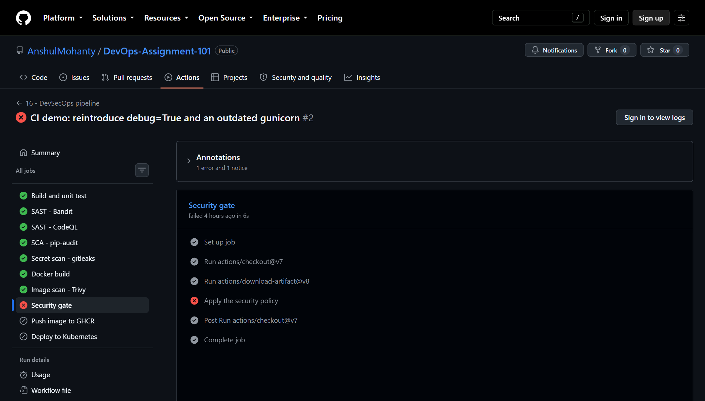

### The pipeline caught me

The first version of this README pasted the secret-scanning demo output above *including the fake
token itself*. The next push to `main` ran the pipeline, gitleaks scanned the full history, found
the token in commit `edfaca9`, and the gate blocked `main`:

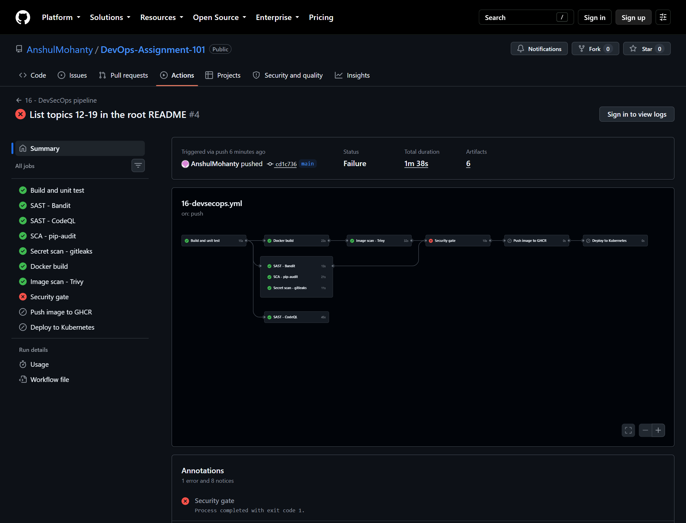

Run: [16 - DevSecOps pipeline #4](https://github.com/AnshulMohanty/DevOps-Assignment-101/actions/runs/37495885801)

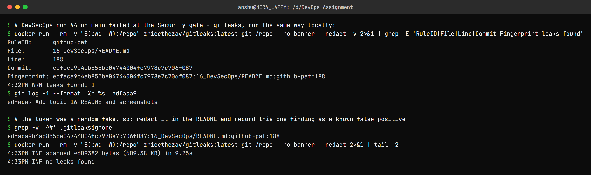

```
$ # DevSecOps run #4 on main failed at the Security gate - gitleaks, run the same way locally:
$ docker run --rm -v "$(pwd -W):/repo" zricethezav/gitleaks:latest git /repo --no-banner --redact -v 2>&1 | grep -E 'RuleID|File|Line|Commit|Fingerprint|leaks found'
RuleID:      github-pat
File:        16_DevSecOps/README.md
Line:        188
Commit:      edfaca9b4ab855be04744004fc7978e7c706f087
Fingerprint: edfaca9b4ab855be04744004fc7978e7c706f087:16_DevSecOps/README.md:github-pat:188
4:32PM WRN leaks found: 1
$ git log -1 --format='%h %s' edfaca9
edfaca9 Add topic 16 README and screenshots

$ # the token was a random fake, so: redact it in the README and record this one finding as a known false positive
$ grep -v '^#' .gitleaksignore
edfaca9b4ab855be04744004fc7978e7c706f087:16_DevSecOps/README.md:github-pat:188
$ docker run --rm -v "$(pwd -W):/repo" zricethezav/gitleaks:latest git /repo --no-banner --redact 2>&1 | tail -2
4:33PM INF scanned ~609382 bytes (609.38 KB) in 9.25s
4:33PM INF no leaks found
```

This is the kind of mistake secret scanning exists for: nobody meant to commit a token - it came
along inside documentation. Because this token was randomly generated and never valid, the fix was
to mask it in the README and record that one finding in [.gitleaksignore](../.gitleaksignore) with
a comment explaining why. The finding is pinned to that exact commit, file and line, so any *new*
token is still caught. With a **real** token the order is different: revoke it first, because
anything that reached a public Git history has to be treated as leaked - deleting or ignoring it
afterwards does not un-leak it.

After the fix, [run #5](https://github.com/AnshulMohanty/DevOps-Assignment-101/actions/runs/37496791855) passed all 10 jobs again.

---

Kubernetes deployment
---------------------

In the pipeline, the `deploy` job creates a throwaway **kind** cluster on the runner, deploys the
image it just pushed, waits for the rollout and `curl`s `/health` and `/api/status` through the
Service. A GitHub-hosted runner cannot reach a cluster on my laptop, so this is the honest way to
test the deployment inside CI.

The same image (by SHA) on the local minikube cluster, with the hardening from
[k8s/deployment.yaml](k8s/deployment.yaml) checked from inside the pod:

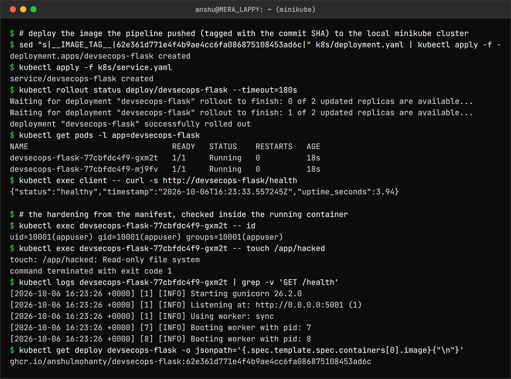

```
$ # deploy the image the pipeline pushed (tagged with the commit SHA) to the local minikube cluster
$ sed "s|__IMAGE_TAG__|62e361d771e4f4b9ae4cc6fa086875108453ad6c|" k8s/deployment.yaml | kubectl apply -f -
deployment.apps/devsecops-flask created
$ kubectl apply -f k8s/service.yaml
service/devsecops-flask created
$ kubectl rollout status deploy/devsecops-flask --timeout=180s
Waiting for deployment "devsecops-flask" rollout to finish: 0 of 2 updated replicas are available...
Waiting for deployment "devsecops-flask" rollout to finish: 1 of 2 updated replicas are available...
deployment "devsecops-flask" successfully rolled out
$ kubectl get pods -l app=devsecops-flask
NAME                               READY   STATUS    RESTARTS   AGE
devsecops-flask-77cbfdc4f9-gxm2t   1/1     Running   0          18s
devsecops-flask-77cbfdc4f9-mj9fv   1/1     Running   0          18s
$ kubectl exec client -- curl -s http://devsecops-flask/health
{"status":"healthy","timestamp":"2026-10-06T16:23:33.557245Z","uptime_seconds":3.94}

$ # the hardening from the manifest, checked inside the running container
$ kubectl exec devsecops-flask-77cbfdc4f9-gxm2t -- id
uid=10001(appuser) gid=10001(appuser) groups=10001(appuser)
$ kubectl exec devsecops-flask-77cbfdc4f9-gxm2t -- touch /app/hacked
touch: /app/hacked: Read-only file system
command terminated with exit code 1
$ kubectl logs devsecops-flask-77cbfdc4f9-gxm2t | grep -v 'GET /health'
[2026-10-06 16:23:26 +0000] [1] [INFO] Starting gunicorn 26.2.0
[2026-10-06 16:23:26 +0000] [1] [INFO] Listening at: http://0.0.0.0:5001 (1)
[2026-10-06 16:23:26 +0000] [1] [INFO] Using worker: sync
[2026-10-06 16:23:26 +0000] [7] [INFO] Booting worker with pid: 7
[2026-10-06 16:23:26 +0000] [8] [INFO] Booting worker with pid: 8
$ kubectl get deploy devsecops-flask -o jsonpath='{.spec.template.spec.containers[0].image}{"\n"}'
ghcr.io/anshulmohanty/devsecops-flask:62e361d771e4f4b9ae4cc6fa086875108453ad6c
```

| Manifest setting | Proof above |
|---|---|
| `runAsNonRoot`, `runAsUser: 10001` | `id` → uid 10001 |
| `readOnlyRootFilesystem: true` | `touch /app/hacked` → Read-only file system |
| `capabilities: drop: [ALL]`, `allowPrivilegeEscalation: false` | - |
| readiness/liveness probes on `/health` | Pods `1/1 Ready` |
| resource requests/limits | - |

**A finding from deploying it:** the first deployment logged
`Control server error: [Errno 30] Read-only file system: '/home/appuser/.gunicorn'` on every pod.
gunicorn 26 opens a control socket in `$HOME`, which the read-only root filesystem forbids. The
control interface is not used, so the image now starts gunicorn with `--no-control-socket` (commit
*"Disable gunicorn's control socket in the DevSecOps image"*) - the logs above are clean.

---

Changes from the class demo
---------------------------

| Class repo | Here | Why |
|---|---|---|
| `app.run(debug=True)` | gunicorn; dev server on 127.0.0.1, debug from env | Bandit HIGH: remote code execution |
| `python:3.12-slim`, root user | `python:3.12-alpine`, uid 10001 | 44 unfixable HIGH CVEs → 0; no root |
| Push to a hard-coded Docker Hub account with a stored token | GHCR with `GITHUB_TOKEN` | No long-lived registry secret |
| `pip-audit` with no `-r` | `pip-audit -r requirements.txt` | Audit the app, not the runner |
| Trivy report only (no exit code) | Results feed the gate | A scan that cannot fail is not a gate |
| No secret scanning job | gitleaks over the full history | Required by the homework flow |
| Gate = just the `needs:` chain | Explicit `Security gate` job with a written policy | One place to read and change the rules |
| Image rebuilt in each job | Built once, scanned and pushed as the same artifact | What was scanned is what ships |

---

What I understood
-----------------

- **Shift left**: each class of problem has its own scanner, and each runs on every push -
  SAST for our code, SCA for other people's code, secret scanning for credentials, image scanning
  for the OS and everything inside the container.
- Scanners should **report**, and one **gate** should **decide** - with a written policy, because
  "fail on every finding" either blocks everything or gets switched off.
- Not every finding is equal: `debug=True` is critical, `random` for demo data is not; a CVE with no
  fix available is a different decision from one with a fix.
- The cheapest fix for image CVEs is often a smaller base image.
- One bad version can be caught by more than one control (gunicorn by both SCA and Trivy) - that
  overlap is the point of defence in depth.
- Build the image once; scan, sign/push and deploy the same artifact.
- Deployment hardening (non-root, read-only filesystem, dropped capabilities) can break software that
  assumes it can write to disk - test it, as the gunicorn control socket showed.
- `GITHUB_TOKEN` with `packages: write` replaces a stored registry password.
- Secrets leak through documentation and example output, not just code - my own README tripped the
  gate. Scanning the whole history on every push is what caught it.

**Note on screenshots:** GitHub only shows job *log lines* to signed-in users, and no GitHub CLI login
was available while this was done, so the CI evidence is the run and job pages (graph, statuses and
steps). The gate's table is reproduced above by running the same `gate.py` locally on the same
inputs.
