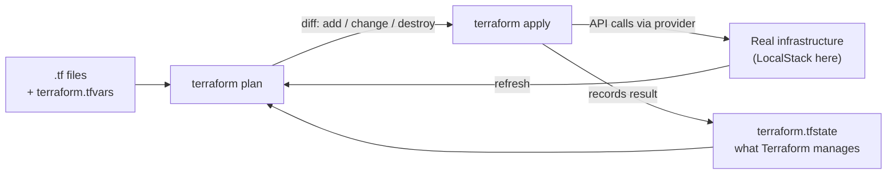
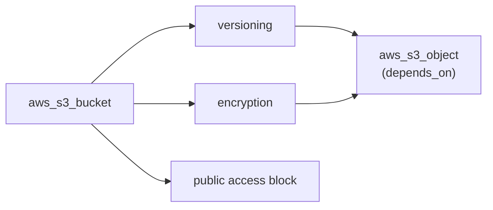

Terraform and IaC – Learning Notes
==================================

Name: Anshul Mohanty    Roll No: 24BCS10191    Section: A

## In one line

Describe the infrastructure you want in files; Terraform compares that with its **state** and the
real world, and makes the smallest set of API calls to close the gap.

## The picture

The dependency graph from the demo (apply goes left to right, destroy right to left):

## Mental model

| Command | Does |
|---|---|
| `init` | Downloads providers, writes `.terraform.lock.hcl` |
| `fmt` | Canonical formatting |
| `validate` | Syntax + references, no API calls |
| `plan -out=f` | Shows and saves the diff |
| `apply f` | Executes exactly that plan |
| `show` / `output` / `state list` | Reads the state |
| `destroy` | Removes everything in the state |

| File | Commit it? |
|---|---|
| `*.tf`, `terraform.tfvars` (no secrets) | Yes |
| `.terraform.lock.hcl` | Yes |
| `terraform.tfstate*`, `.terraform/`, `tfplan` | No |

| AWS service | One line |
|---|---|
| IAM | Who can do what - deny by default, explicit deny wins |
| EC2 | Virtual servers: AMI + instance type + security group + EBS |
| S3 | Objects in globally named buckets; versioning, classes, lifecycle |
| VPC | Your network; the route table makes a subnet public or private |
| DynamoDB / RDS | Key-value at any scale / managed SQL with Multi-AZ and replicas |

## Gotchas

- `localstack/localstack:latest` now needs an account token - pin `4.14` for the free emulator.
- Bucket names are **global**; a name like `demo` is always taken.
- `force_destroy = true` or `destroy` fails on a bucket that still has objects.
- Only use `depends_on` for ordering Terraform cannot see; references create the graph already.
- Running `plan` twice with no change must say **no changes** - if it does not, something outside
  Terraform is fighting it.
- Drift (manual changes) is found by `plan`'s refresh and repaired by `apply`.
- State can contain secrets - never commit it; use a remote backend with locking in a team.
- Newer Terraform accepts a `type` argument in `output` blocks, so the class repo's `outputs.tf`
  validates fine on 1.16.
