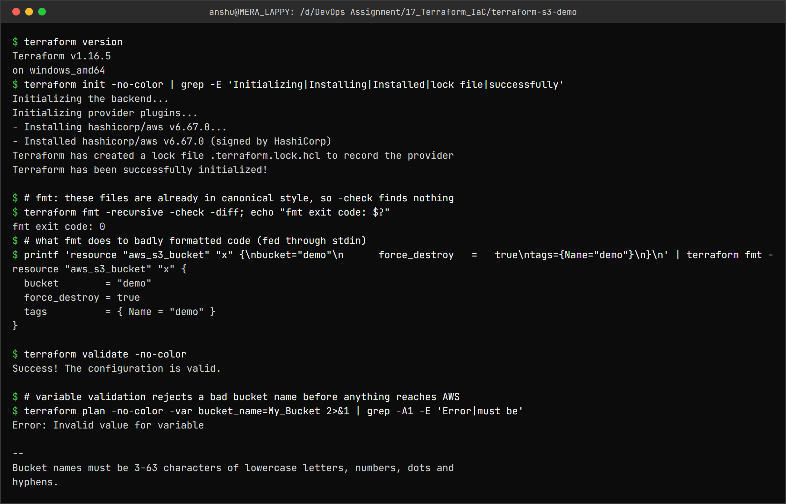
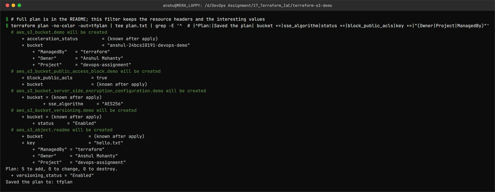
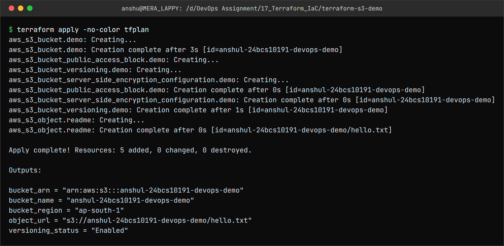
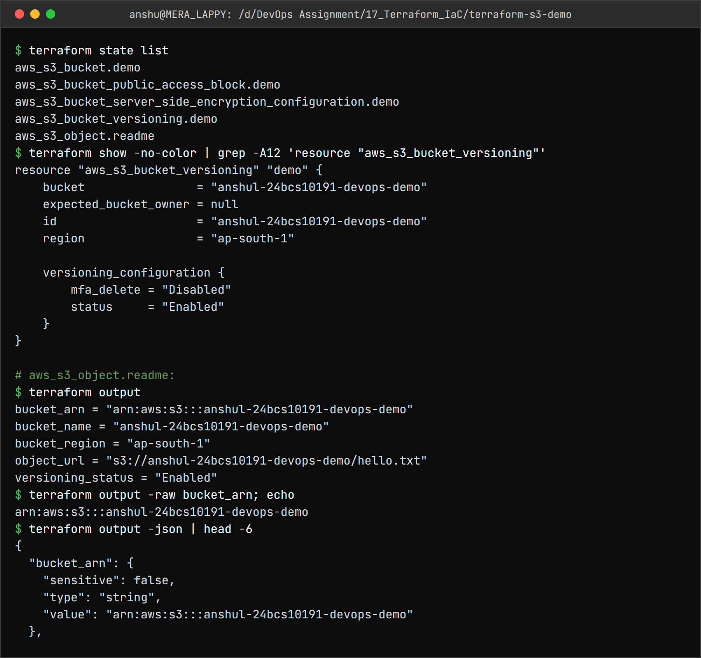
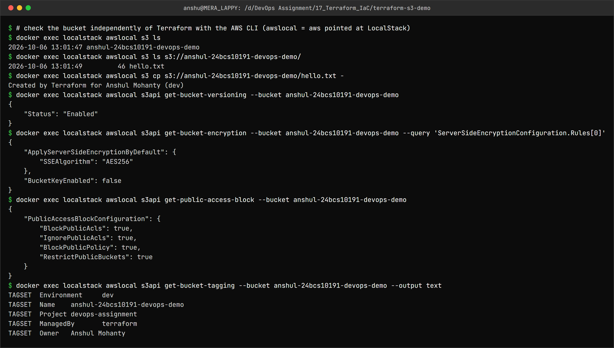
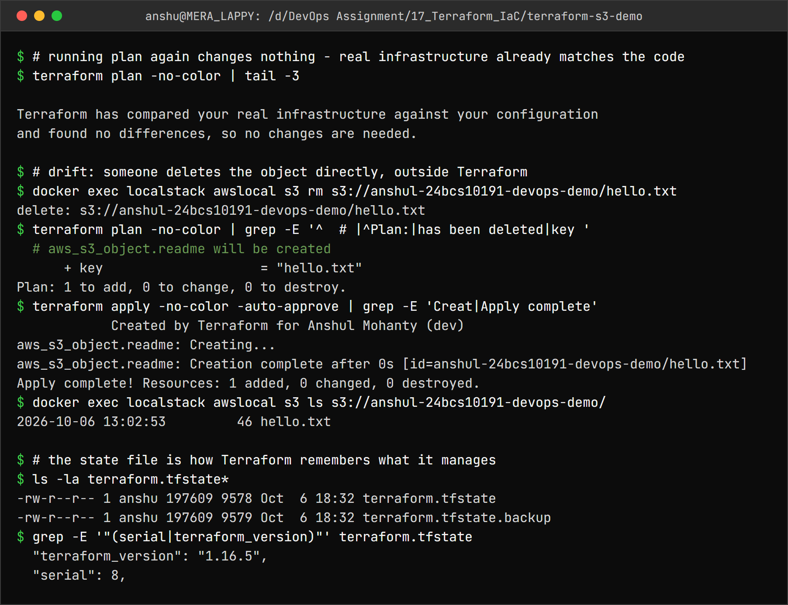
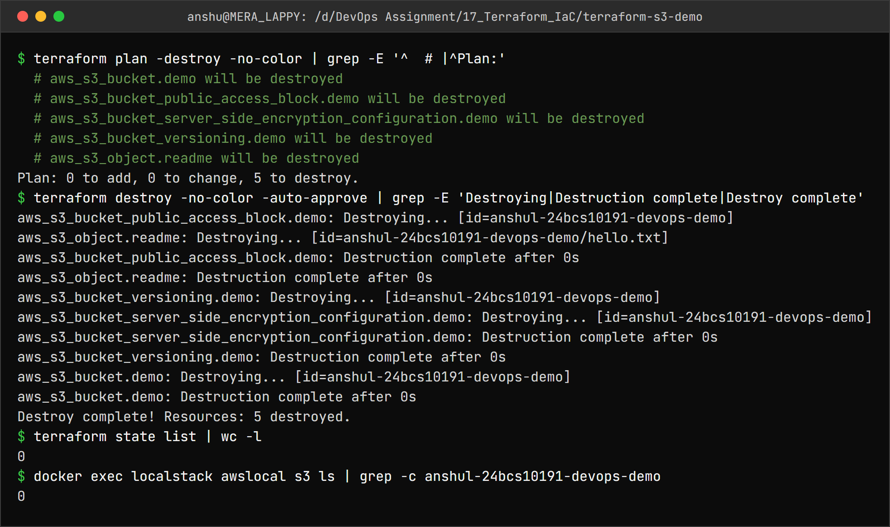

Terraform and Infrastructure as Code – Homework
===============================================

Name: Anshul Mohanty    Roll No: 24BCS10191    Section: A

See also: [LEARNING.md](LEARNING.md) - diagram and revision notes for this topic.

| Folder | Contents |
|---|---|
| [terraform-s3-demo/](terraform-s3-demo/) | Task 1 - the Terraform project (`main.tf`, `variables.tf`, `outputs.tf`, `provider.tf`, `terraform.tfvars`, `README.md`) |
| [aws-services/](aws-services/) | Task 2 - IAM, EC2, S3, VPC, DynamoDB/RDS write-ups, each with a hands-on run |

### Where the AWS is

I do not have an AWS account, so every AWS API call in this topic goes to **LocalStack** - an
open-source emulator of the AWS APIs that runs as a Docker container on `localhost:4566`.
Terraform's real `hashicorp/aws` provider is used unchanged; only the endpoint is different.

```
terraform  --->  hashicorp/aws provider  --->  http://localhost:4566  (LocalStack 4.14 in Docker)
aws CLI    --->  awslocal (inside the LocalStack container) -------->  same emulator
```

| Tool | Version |
|---|---|
| Terraform | 1.16.5 (`hashicorp/aws` provider 6.67.0) |
| LocalStack | **4.14.0**, community image `localstack/localstack:4.14` |

The current `localstack/localstack:latest` (2026.9) **refuses to start without an account token**
(`License activation failed! ... set the LOCALSTACK_AUTH_TOKEN variable`). 4.14 is the last
community release that runs without one, so the image is pinned to it.

```
docker run -d --name localstack -p 4566:4566 localstack/localstack:4.14
```

The project is not tied to LocalStack: `use_localstack = false` in `terraform.tfvars` makes the
same code use real AWS with normal credentials (see [provider.tf](terraform-s3-demo/provider.tf)).

---

Task 1: Terraform S3 demo
-------------------------

What gets created - five resources, not just one bucket, because a production bucket needs more
than a name:

| Resource | Why |
|---|---|
| `aws_s3_bucket.demo` | The bucket (`force_destroy` so `destroy` works with objects inside) |
| `aws_s3_bucket_versioning.demo` | Keep every version of every object |
| `aws_s3_bucket_server_side_encryption_configuration.demo` | AES-256 at rest |
| `aws_s3_bucket_public_access_block.demo` | Nothing in it can ever be made public |
| `aws_s3_object.readme` | A `hello.txt`, uploaded only after encryption/versioning are in place (`depends_on`) |

```hcl
variable "bucket_name" {
  description = "Globally unique S3 bucket name (lowercase letters, numbers, dots and hyphens)"
  type        = string

  validation {
    condition     = can(regex("^[a-z0-9][a-z0-9.-]{1,61}[a-z0-9]$", var.bucket_name))
    error_message = "Bucket names must be 3-63 characters of lowercase letters, numbers, dots and hyphens."
  }
}
```

```hcl
# terraform.tfvars
aws_region  = "ap-south-1"
bucket_name = "anshul-24bcs10191-devops-demo"
environment = "dev"
owner       = "Anshul Mohanty"
use_localstack = true
```

The provider also sets `default_tags` (`Project`, `ManagedBy`, `Owner`), so every resource is
tagged without repeating the tags in each block.

### 1. init, fmt, validate



```
$ terraform version
Terraform v1.16.5
on windows_amd64
$ terraform init -no-color | grep -E 'Initializing|Installing|Installed|lock file|successfully'
Initializing the backend...
Initializing provider plugins...
- Installing hashicorp/aws v6.67.0...
- Installed hashicorp/aws v6.67.0 (signed by HashiCorp)
Terraform has created a lock file .terraform.lock.hcl to record the provider
Terraform has been successfully initialized!

$ # fmt: these files are already in canonical style, so -check finds nothing
$ terraform fmt -recursive -check -diff; echo "fmt exit code: $?"
fmt exit code: 0
$ # what fmt does to badly formatted code (fed through stdin)
$ printf 'resource "aws_s3_bucket" "x" {\nbucket="demo"\n      force_destroy   =   true\ntags={Name="demo"}\n}\n' | terraform fmt -
resource "aws_s3_bucket" "x" {
  bucket        = "demo"
  force_destroy = true
  tags          = { Name = "demo" }
}

$ terraform validate -no-color
Success! The configuration is valid.

$ # variable validation rejects a bad bucket name before anything reaches AWS
$ terraform plan -no-color -var bucket_name=My_Bucket 2>&1 | grep -A1 -E 'Error|must be'
Error: Invalid value for variable

--
Bucket names must be 3-63 characters of lowercase letters, numbers, dots and
hyphens.
```

- `init` downloaded the AWS provider and wrote `.terraform.lock.hcl`, which pins the exact
  provider version - it is committed so everyone gets the same one. `.terraform/` itself is not.
- `fmt -check` found nothing because the files were already formatted; piping a messy snippet
  through `terraform fmt -` shows what it does - indentation and aligned `=`.
- `validate` checks syntax and references without calling AWS. The custom `validation` block
  rejected `My_Bucket` before any API call was made.

### 2. plan



```
$ # full plan is in the README; this filter keeps the resource headers and the interesting values
$ terraform plan -no-color -out=tfplan | tee plan.txt | grep -E '^  # |^Plan:|Saved the plan| bucket +=|sse_algorithm|status +=|block_public_acls|key +=|"(Owner|Project|ManagedBy)"'
  # aws_s3_bucket.demo will be created
      + acceleration_status         = (known after apply)
      + bucket                      = "anshul-24bcs10191-devops-demo"
          + "ManagedBy"   = "terraform"
          + "Owner"       = "Anshul Mohanty"
          + "Project"     = "devops-assignment"
  # aws_s3_bucket_public_access_block.demo will be created
      + block_public_acls       = true
      + bucket                  = (known after apply)
  # aws_s3_bucket_server_side_encryption_configuration.demo will be created
      + bucket = (known after apply)
              + sse_algorithm     = "AES256"
  # aws_s3_bucket_versioning.demo will be created
      + bucket = (known after apply)
          + status     = "Enabled"
  # aws_s3_object.readme will be created
      + bucket                 = (known after apply)
      + key                    = "hello.txt"
          + "ManagedBy" = "terraform"
          + "Owner"     = "Anshul Mohanty"
          + "Project"   = "devops-assignment"
Plan: 5 to add, 0 to change, 0 to destroy.
  + versioning_status = "Enabled"
Saved the plan to: tfplan
```

`plan -out=tfplan` saves exactly what will be done; `apply tfplan` then applies that plan and
nothing else. Note how `Owner`/`Project`/`ManagedBy` appear in `tags_all` even though they are not
written on the resources - that is `default_tags` from the provider.

<details>
<summary>Full plan output (144 lines)</summary>

```

Terraform used the selected providers to generate the following execution
plan. Resource actions are indicated with the following symbols:
  + create

Terraform will perform the following actions:

  # aws_s3_bucket.demo will be created
  + resource "aws_s3_bucket" "demo" {
      + acceleration_status         = (known after apply)
      + acl                         = (known after apply)
      + arn                         = (known after apply)
      + bucket                      = "anshul-24bcs10191-devops-demo"
      + bucket_domain_name          = (known after apply)
      + bucket_namespace            = (known after apply)
      + bucket_prefix               = (known after apply)
      + bucket_region               = (known after apply)
      + bucket_regional_domain_name = (known after apply)
      + force_destroy               = true
      + hosted_zone_id              = (known after apply)
      + id                          = (known after apply)
      + object_lock_enabled         = (known after apply)
      + policy                      = (known after apply)
      + region                      = "ap-south-1"
      + request_payer               = (known after apply)
      + tags                        = {
          + "Environment" = "dev"
          + "Name"        = "anshul-24bcs10191-devops-demo"
        }
      + tags_all                    = {
          + "Environment" = "dev"
          + "ManagedBy"   = "terraform"
          + "Name"        = "anshul-24bcs10191-devops-demo"
          + "Owner"       = "Anshul Mohanty"
          + "Project"     = "devops-assignment"
        }
      + website_domain              = (known after apply)
      + website_endpoint            = (known after apply)

      + cors_rule (known after apply)

      + grant (known after apply)

      + lifecycle_rule (known after apply)

      + logging (known after apply)

      + object_lock_configuration (known after apply)

      + replication_configuration (known after apply)

      + server_side_encryption_configuration (known after apply)

      + versioning (known after apply)

      + website (known after apply)
    }

  # aws_s3_bucket_public_access_block.demo will be created
  + resource "aws_s3_bucket_public_access_block" "demo" {
      + block_public_acls       = true
      + block_public_policy     = true
      + bucket                  = (known after apply)
      + id                      = (known after apply)
      + ignore_public_acls      = true
      + region                  = "ap-south-1"
      + restrict_public_buckets = true
    }

  # aws_s3_bucket_server_side_encryption_configuration.demo will be created
  + resource "aws_s3_bucket_server_side_encryption_configuration" "demo" {
      + bucket = (known after apply)
      + id     = (known after apply)
      + region = "ap-south-1"

      + rule {
          + blocked_encryption_types = (known after apply)
          + bucket_key_enabled       = (known after apply)

          + apply_server_side_encryption_by_default {
              + kms_master_key_id = (known after apply)
              + sse_algorithm     = "AES256"
            }
        }
    }

  # aws_s3_bucket_versioning.demo will be created
  + resource "aws_s3_bucket_versioning" "demo" {
      + bucket = (known after apply)
      + id     = (known after apply)
      + region = "ap-south-1"

      + versioning_configuration {
          + mfa_delete = (known after apply)
          + status     = "Enabled"
        }
    }

  # aws_s3_object.readme will be created
  + resource "aws_s3_object" "readme" {
      + acl                    = (known after apply)
      + arn                    = (known after apply)
      + bucket                 = (known after apply)
      + bucket_key_enabled     = (known after apply)
      + checksum_crc32         = (known after apply)
      + checksum_crc32c        = (known after apply)
      + checksum_crc64nvme     = (known after apply)
      + checksum_sha1          = (known after apply)
      + checksum_sha256        = (known after apply)
      + content                = <<-EOT
            Created by Terraform for Anshul Mohanty (dev)
        EOT
      + content_type           = "text/plain"
      + etag                   = (known after apply)
      + force_destroy          = false
      + id                     = (known after apply)
      + key                    = "hello.txt"
      + kms_key_id             = (known after apply)
      + region                 = "ap-south-1"
      + server_side_encryption = (known after apply)
      + storage_class          = (known after apply)
      + tags_all               = {
          + "ManagedBy" = "terraform"
          + "Owner"     = "Anshul Mohanty"
          + "Project"   = "devops-assignment"
        }
      + version_id             = (known after apply)
    }

Plan: 5 to add, 0 to change, 0 to destroy.

Changes to Outputs:
  + bucket_arn        = (known after apply)
  + bucket_name       = "anshul-24bcs10191-devops-demo"
  + bucket_region     = "ap-south-1"
  + object_url        = (known after apply)
  + versioning_status = "Enabled"

─────────────────────────────────────────────────────────────────────────────

Saved the plan to: tfplan

To perform exactly these actions, run the following command to apply:
    terraform apply "tfplan"
```

</details>

### 3. apply



```
$ terraform apply -no-color tfplan
aws_s3_bucket.demo: Creating...
aws_s3_bucket.demo: Creation complete after 3s [id=anshul-24bcs10191-devops-demo]
aws_s3_bucket_public_access_block.demo: Creating...
aws_s3_bucket_versioning.demo: Creating...
aws_s3_bucket_server_side_encryption_configuration.demo: Creating...
aws_s3_bucket_public_access_block.demo: Creation complete after 0s [id=anshul-24bcs10191-devops-demo]
aws_s3_bucket_server_side_encryption_configuration.demo: Creation complete after 0s [id=anshul-24bcs10191-devops-demo]
aws_s3_bucket_versioning.demo: Creation complete after 1s [id=anshul-24bcs10191-devops-demo]
aws_s3_object.readme: Creating...
aws_s3_object.readme: Creation complete after 0s [id=anshul-24bcs10191-devops-demo/hello.txt]

Apply complete! Resources: 5 added, 0 changed, 0 destroyed.

Outputs:

bucket_arn = "arn:aws:s3:::anshul-24bcs10191-devops-demo"
bucket_name = "anshul-24bcs10191-devops-demo"
bucket_region = "ap-south-1"
object_url = "s3://anshul-24bcs10191-devops-demo/hello.txt"
versioning_status = "Enabled"
```

The order in which things were created **is the dependency graph**: the bucket first (everything
references `aws_s3_bucket.demo.id`), then versioning, encryption and the public access block **in
parallel** (they do not depend on each other), and the object last because of its `depends_on`.

### 4. show, output, state



```
$ terraform state list
aws_s3_bucket.demo
aws_s3_bucket_public_access_block.demo
aws_s3_bucket_server_side_encryption_configuration.demo
aws_s3_bucket_versioning.demo
aws_s3_object.readme
$ terraform show -no-color | grep -A12 'resource "aws_s3_bucket_versioning"'
resource "aws_s3_bucket_versioning" "demo" {
    bucket                = "anshul-24bcs10191-devops-demo"
    expected_bucket_owner = null
    id                    = "anshul-24bcs10191-devops-demo"
    region                = "ap-south-1"

    versioning_configuration {
        mfa_delete = "Disabled"
        status     = "Enabled"
    }
}

# aws_s3_object.readme:
$ terraform output
bucket_arn = "arn:aws:s3:::anshul-24bcs10191-devops-demo"
bucket_name = "anshul-24bcs10191-devops-demo"
bucket_region = "ap-south-1"
object_url = "s3://anshul-24bcs10191-devops-demo/hello.txt"
versioning_status = "Enabled"
$ terraform output -raw bucket_arn; echo
arn:aws:s3:::anshul-24bcs10191-devops-demo
$ terraform output -json | head -6
{
  "bucket_arn": {
    "sensitive": false,
    "type": "string",
    "value": "arn:aws:s3:::anshul-24bcs10191-devops-demo"
  },
```

`terraform show` reads the state; `terraform output` prints just the declared outputs (`-raw` for
scripts, `-json` for tools).

### 5. Checked from outside Terraform



```
$ # check the bucket independently of Terraform with the AWS CLI (awslocal = aws pointed at LocalStack)
$ docker exec localstack awslocal s3 ls
2026-10-06 13:01:47 anshul-24bcs10191-devops-demo
$ docker exec localstack awslocal s3 ls s3://anshul-24bcs10191-devops-demo/
2026-10-06 13:01:49         46 hello.txt
$ docker exec localstack awslocal s3 cp s3://anshul-24bcs10191-devops-demo/hello.txt -
Created by Terraform for Anshul Mohanty (dev)
$ docker exec localstack awslocal s3api get-bucket-versioning --bucket anshul-24bcs10191-devops-demo
{
    "Status": "Enabled"
}
$ docker exec localstack awslocal s3api get-bucket-encryption --bucket anshul-24bcs10191-devops-demo --query 'ServerSideEncryptionConfiguration.Rules[0]'
{
    "ApplyServerSideEncryptionByDefault": {
        "SSEAlgorithm": "AES256"
    },
    "BucketKeyEnabled": false
}
$ docker exec localstack awslocal s3api get-public-access-block --bucket anshul-24bcs10191-devops-demo
{
    "PublicAccessBlockConfiguration": {
        "BlockPublicAcls": true,
        "IgnorePublicAcls": true,
        "BlockPublicPolicy": true,
        "RestrictPublicBuckets": true
    }
}
$ docker exec localstack awslocal s3api get-bucket-tagging --bucket anshul-24bcs10191-devops-demo --output text
TAGSET	Environment	dev
TAGSET	Name	anshul-24bcs10191-devops-demo
TAGSET	Project	devops-assignment
TAGSET	ManagedBy	terraform
TAGSET	Owner	Anshul Mohanty
```

Every setting from the code is really on the bucket: versioning `Enabled`, `AES256` encryption,
all four public-access blocks `true`, and the merged tags.

### 6. State and drift



```
$ # running plan again changes nothing - real infrastructure already matches the code
$ terraform plan -no-color | tail -3

Terraform has compared your real infrastructure against your configuration
and found no differences, so no changes are needed.

$ # drift: someone deletes the object directly, outside Terraform
$ docker exec localstack awslocal s3 rm s3://anshul-24bcs10191-devops-demo/hello.txt
delete: s3://anshul-24bcs10191-devops-demo/hello.txt
$ terraform plan -no-color | grep -E '^  # |^Plan:|has been deleted|key '
  # aws_s3_object.readme will be created
      + key                    = "hello.txt"
Plan: 1 to add, 0 to change, 0 to destroy.
$ terraform apply -no-color -auto-approve | grep -E 'Creat|Apply complete'
            Created by Terraform for Anshul Mohanty (dev)
aws_s3_object.readme: Creating...
aws_s3_object.readme: Creation complete after 0s [id=anshul-24bcs10191-devops-demo/hello.txt]
Apply complete! Resources: 1 added, 0 changed, 0 destroyed.
$ docker exec localstack awslocal s3 ls s3://anshul-24bcs10191-devops-demo/
2026-10-06 13:02:53         46 hello.txt

$ # the state file is how Terraform remembers what it manages
$ ls -la terraform.tfstate*
-rw-r--r-- 1 anshu 197609 9578 Oct  6 18:32 terraform.tfstate
-rw-r--r-- 1 anshu 197609 9579 Oct  6 18:32 terraform.tfstate.backup
$ grep -E '"(serial|terraform_version)"' terraform.tfstate
  "terraform_version": "1.16.5",
  "serial": 8,
```

- A second `plan` with no code changes: **no changes** - Terraform is idempotent.
- Deleting `hello.txt` behind Terraform's back is **drift**. On the next `plan` Terraform refreshed
  its state from the real API, noticed the object was gone, and planned to create it again.
- `terraform.tfstate` is the record of what Terraform manages (the `serial` increases with every
  change; `.backup` is the previous version). It can contain sensitive values and is never
  committed - in a team it lives in a remote backend (S3 + locking) instead.

### 7. destroy



```
$ terraform plan -destroy -no-color | grep -E '^  # |^Plan:'
  # aws_s3_bucket.demo will be destroyed
  # aws_s3_bucket_public_access_block.demo will be destroyed
  # aws_s3_bucket_server_side_encryption_configuration.demo will be destroyed
  # aws_s3_bucket_versioning.demo will be destroyed
  # aws_s3_object.readme will be destroyed
Plan: 0 to add, 0 to change, 5 to destroy.
$ terraform destroy -no-color -auto-approve | grep -E 'Destroying|Destruction complete|Destroy complete'
aws_s3_bucket_public_access_block.demo: Destroying... [id=anshul-24bcs10191-devops-demo]
aws_s3_object.readme: Destroying... [id=anshul-24bcs10191-devops-demo/hello.txt]
aws_s3_bucket_public_access_block.demo: Destruction complete after 0s
aws_s3_object.readme: Destruction complete after 0s
aws_s3_bucket_versioning.demo: Destroying... [id=anshul-24bcs10191-devops-demo]
aws_s3_bucket_server_side_encryption_configuration.demo: Destroying... [id=anshul-24bcs10191-devops-demo]
aws_s3_bucket_server_side_encryption_configuration.demo: Destruction complete after 0s
aws_s3_bucket_versioning.demo: Destruction complete after 0s
aws_s3_bucket.demo: Destroying... [id=anshul-24bcs10191-devops-demo]
aws_s3_bucket.demo: Destruction complete after 0s
Destroy complete! Resources: 5 destroyed.
$ terraform state list | wc -l
0
$ docker exec localstack awslocal s3 ls | grep -c anshul-24bcs10191-devops-demo
0
```

Destroy ran the dependency graph **backwards**: object and public-access block first, then
versioning and encryption, then the bucket last. State is empty and the bucket is gone.

---

Task 2: AWS services research
-----------------------------

Each write-up covers every point from the homework list, plus a hands-on run against LocalStack
with a screenshot.

| # | Service | Category | Hands-on |
|---|---|---|---|
| 01 | [IAM](aws-services/01-iam/README.md) | Governance | Group + least-privilege policy + user, an EC2 role |
| 02 | [EC2](aws-services/02-ec2/README.md) | Compute | AMI, key pair, security group, instance lifecycle, EBS |
| 03 | [S3](aws-services/03-s3/README.md) | Storage | Versions, storage classes, lifecycle rule, bucket policy |
| 04 | [VPC](aws-services/04-vpc/README.md) | Networking | Public/private subnets, IGW, NAT, route tables, NACL |
| 05 | [DynamoDB & RDS](aws-services/05-dynamodb-rds/README.md) | Database | DynamoDB table with partition + sort key, query vs scan |

RDS could not be tried: LocalStack's community edition does not emulate it, and returns
`not included in your current license plan`. It is covered from the documentation.

---

What I understood
-----------------

- IaC means the infrastructure is described in files that are reviewed, versioned and repeatable,
  instead of being clicked together in a console and remembered by nobody.
- Terraform is **declarative**: the files say *what* should exist; Terraform works out the order
  from references between resources and does independent ones in parallel.
- `init` → `fmt` → `validate` → `plan` → `apply` → `destroy`. `plan -out` + `apply <plan>` makes
  sure what was reviewed is exactly what runs.
- The state file is Terraform's memory. Without it Terraform cannot know what it created; with
  `plan` it compares state, code and reality, which is how drift is detected and repaired.
- Variables (with `validation`) and `tfvars` separate *what is built* from *with which values*.
  Outputs expose values for people and for other tooling.
- A provider is just a translator to an API. Pointing the AWS provider at LocalStack ran the real
  Terraform workflow with no account and no cost - and one variable switches it to real AWS.
- Resources depending on each other through references (`aws_s3_bucket.demo.id`) is usually
  enough; `depends_on` is for ordering Terraform cannot see from the code.
