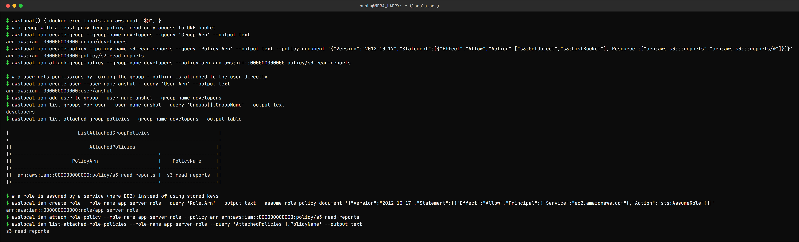

IAM – Identity and Access Management (Governance)
=================================================

Name: Anshul Mohanty    Roll No: 24BCS10191    Section: A

## What is IAM?

IAM is the AWS service that answers two questions for **every** API call made to an account:

- **Authentication** - *who* is calling? (a user, a role, a service)
- **Authorization** - *is this caller allowed* to do this action on this resource?

It is global (not tied to a region) and free. Every other AWS service relies on it - an S3
bucket, an EC2 instance or a Lambda function is only as secure as the IAM rules around it.

## The building blocks

| Concept | What it is | Has long-lived credentials? |
|---|---|---|
| **Root user** | The email that created the account; can do everything, including closing it | Yes - lock it away, enable MFA, never use day to day |
| **User** | A person or an application with a permanent identity | Password and/or access keys |
| **Group** | A collection of users; permissions attached to the group apply to every member | No - groups cannot log in |
| **Role** | An identity that is *assumed* temporarily by a user, a service (EC2, Lambda) or another account | No - temporary credentials from STS that expire |
| **Policy** | A JSON document listing what is allowed or denied | - |

### Policies and permissions

```json
{
  "Version": "2012-10-17",
  "Statement": [{
    "Effect": "Allow",
    "Action": ["s3:GetObject", "s3:ListBucket"],
    "Resource": ["arn:aws:s3:::reports", "arn:aws:s3:::reports/*"]
  }]
}
```

A statement is **Effect + Action + Resource** (+ optional **Condition**, e.g. only from an IP
range or only with MFA).

| Policy type | Attached to | Example |
|---|---|---|
| AWS managed | Users/groups/roles | `ReadOnlyAccess`, `AmazonS3FullAccess` |
| Customer managed | Users/groups/roles | The `s3-read-reports` policy below |
| Inline | Exactly one identity | Rarely the right choice - hard to audit |
| Resource-based | The resource itself | S3 bucket policy, KMS key policy |
| Trust policy | A role | *Who* may assume the role |

How a request is evaluated:

1. Everything is **denied by default**.
2. An explicit **Allow** in any applicable policy allows it...
3. ...unless any policy has an explicit **Deny** - a Deny always wins.

### Least privilege

Grant only the actions, on only the resources, that a job actually needs - and widen it only when
something legitimately fails. `s3:GetObject` on one bucket instead of `s3:*` on `*`. If those
credentials ever leak, the damage is limited to what they could do.

## Best practices

- Lock away the root user: MFA on, no access keys, use it only for the few root-only tasks.
- One identity per person - never shared logins.
- Attach policies to **groups** (or roles), not to individual users.
- Prefer **roles** (temporary credentials) over access keys, especially for applications: an EC2
  instance gets an instance profile, a GitHub Actions workflow uses OIDC to assume a role.
- MFA for every human user.
- Rotate or delete unused access keys; review with the IAM credential report and Access Analyzer.
- Use conditions and permission boundaries for extra guard rails.

## Common use cases

- Developers in a `developers` group with read access to logs and one S3 bucket.
- An EC2 instance role that lets the app read one bucket without storing keys on the server.
- A CI/CD pipeline that assumes a deploy role through OIDC instead of using a stored secret.
- Cross-account access: an auditing account assumes a read-only role in production.

## Tried it (on LocalStack)

A group with a least-privilege policy, a user who gets permissions only through the group, and a
role that EC2 is trusted to assume.



```
$ awslocal() { docker exec localstack awslocal "$@"; }
$ # a group with a least-privilege policy: read-only access to ONE bucket
$ awslocal iam create-group --group-name developers --query 'Group.Arn' --output text
arn:aws:iam::000000000000:group/developers
$ awslocal iam create-policy --policy-name s3-read-reports --query 'Policy.Arn' --output text --policy-document '{"Version":"2012-10-17","Statement":[{"Effect":"Allow","Action":["s3:GetObject","s3:ListBucket"],"Resource":["arn:aws:s3:::reports","arn:aws:s3:::reports/*"]}]}'
arn:aws:iam::000000000000:policy/s3-read-reports
$ awslocal iam attach-group-policy --group-name developers --policy-arn arn:aws:iam::000000000000:policy/s3-read-reports

$ # a user gets permissions by joining the group - nothing is attached to the user directly
$ awslocal iam create-user --user-name anshul --query 'User.Arn' --output text
arn:aws:iam::000000000000:user/anshul
$ awslocal iam add-user-to-group --user-name anshul --group-name developers
$ awslocal iam list-groups-for-user --user-name anshul --query 'Groups[].GroupName' --output text
developers
$ awslocal iam list-attached-group-policies --group-name developers --output table
---------------------------------------------------------------------------
|                        ListAttachedGroupPolicies                        |
+-------------------------------------------------------------------------+
||                           AttachedPolicies                            ||
|+---------------------------------------------------+-------------------+|
||                     PolicyArn                     |    PolicyName     ||
|+---------------------------------------------------+-------------------+|
||  arn:aws:iam::000000000000:policy/s3-read-reports |  s3-read-reports  ||
|+---------------------------------------------------+-------------------+|

$ # a role is assumed by a service (here EC2) instead of using stored keys
$ awslocal iam create-role --role-name app-server-role --query 'Role.Arn' --output text --assume-role-policy-document '{"Version":"2012-10-17","Statement":[{"Effect":"Allow","Principal":{"Service":"ec2.amazonaws.com"},"Action":"sts:AssumeRole"}]}'
arn:aws:iam::000000000000:role/app-server-role
$ awslocal iam attach-role-policy --role-name app-server-role --policy-arn arn:aws:iam::000000000000:policy/s3-read-reports
$ awslocal iam list-attached-role-policies --role-name app-server-role --query 'AttachedPolicies[].PolicyName' --output text
s3-read-reports
```

The user has **no** policy of its own - removing them from `developers` removes all their access
in one step. The role's trust policy (`Principal: ec2.amazonaws.com`) says *who* can assume it;
the attached policy says *what* it can then do. LocalStack accepts these calls but does not enforce
IAM by default, so this shows the structure rather than a permission being denied.
