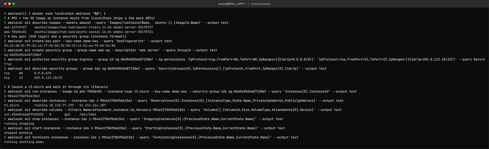

EC2 – Elastic Compute Cloud (Compute)
=====================================

Name: Anshul Mohanty    Roll No: 24BCS10191    Section: A

## What is EC2?

Virtual servers in the cloud, billed per second while they run. You choose the operating system,
CPU/memory size, disk, network and firewall rules, and AWS runs the machine on its hardware in the
Availability Zone you pick. EC2 is IaaS - AWS manages the hardware and hypervisor, you manage
everything from the OS up (patches, software, data).

## AMI - Amazon Machine Image

The template an instance boots from: an OS (Amazon Linux, Ubuntu, Windows...) plus optional
pre-installed software. AMIs are **regional** and have an ID like `ami-0abc...` that differs per
region - which is why Terraform code usually *looks the AMI up* with a `data "aws_ami"` filter
instead of hard-coding an ID. You can build your own "golden" AMI with your app pre-installed.

## Instance types

Named `family + generation + (attributes) . size`, e.g. `t3.micro`, `m7g.large`, `c7i.2xlarge`.

| Family | Optimised for | Example use |
|---|---|---|
| `t` (burstable) | Low baseline CPU that can burst using CPU credits | Small web servers, dev boxes (`t2/t3.micro` = free tier) |
| `m` (general purpose) | Balanced CPU/memory | Application servers |
| `c` (compute) | High CPU per GB | Batch jobs, video encoding |
| `r`, `x` (memory) | High memory per CPU | In-memory caches, large databases |
| `g`, `p` (accelerated) | GPUs | ML training/inference |
| `i`, `d` (storage) | Fast local NVMe disks | High-I/O databases |

A `g` in the name (`m7g`) means an AWS Graviton (ARM) CPU - usually cheaper for the same work.

## Key pairs

SSH login uses a key pair: AWS keeps the **public** key and puts it on the instance; you download
the **private** key once (`.pem`) and nobody can download it again. Lose it and you cannot SSH in
with it. Modern alternatives avoid keys entirely: **EC2 Instance Connect** and **Session Manager**.

## Security groups

A **stateful firewall attached to the instance** (actually to its network interface).

- Rules are **allow-only** - anything not allowed is denied.
- Stateful: if inbound traffic is allowed, the reply is automatically allowed out.
- Sources can be CIDRs (`203.0.113.10/32`) or **other security groups** ("allow 5432 from the
  app servers' group"), which is how tiers are wired together without hard-coding IPs.
- Default: all outbound allowed, no inbound allowed.

## EBS - Elastic Block Store

Network-attached disks for instances. The root volume (where the OS lives) is EBS by default.

| Type | Use |
|---|---|
| `gp3` / `gp2` (SSD) | General purpose - the default |
| `io2` (provisioned IOPS SSD) | Databases needing guaranteed IOPS |
| `st1` / `sc1` (HDD) | Large sequential/cold data |

EBS volumes live in **one Availability Zone**, persist independently of the instance (if
`DeleteOnTermination` is false), can be resized, and are backed up with **snapshots** stored in S3.
Instance store (local NVMe on some types) is faster but is wiped on stop.

## Public vs private IP

| | Private IP | Public IP | Elastic IP |
|---|---|---|---|
| From | The subnet's CIDR | AWS's pool | Allocated to your account |
| Reachable from | Inside the VPC (and peered/VPN networks) | The internet (if the subnet routes to an IGW) | The internet |
| On stop/start | **Kept** | **Changes** | Kept - you own it until released |

An instance in a private subnet has only a private IP; it reaches the internet outbound through a
NAT gateway, and nothing on the internet can start a connection to it.

## Instance lifecycle

```
pending -> running -> stopping -> stopped -> pending -> running ... -> shutting-down -> terminated
```

| State | Billed for compute? | Notes |
|---|---|---|
| `pending` / `running` | Yes | |
| `stopped` | No (EBS still billed) | Data on EBS kept, public IP released |
| `terminated` | No | Gone for good; root EBS deleted by default |

Reboot keeps the same host and IPs. Hibernate saves RAM to EBS and resumes it later.

## Common use cases

Web and application servers, CI build runners, batch jobs, self-managed databases, Kubernetes
worker nodes (EKS node groups are EC2 instances), bastion hosts. Auto Scaling Groups add/remove
identical instances behind a load balancer as demand changes.

## Tried it (on LocalStack)



```
$ awslocal() { docker exec localstack awslocal "$@"; }
$ # AMI = the OS image an instance boots from (LocalStack ships a few mock AMIs)
$ awslocal ec2 describe-images --owners amazon --query 'Images[?contains(Name, `ubuntu`)].[ImageId,Name]' --output text
ami-1e749f67	ubuntu/images/hvm-ssd/ubuntu-trusty-14.04-amd64-server-20170727
ami-785db401	ubuntu/images/hvm-ssd/ubuntu-xenial-16.04-amd64-server-20170721
$ # key pair (SSH login) and a security group (instance firewall)
$ awslocal ec2 create-key-pair --key-name demo-key --query 'KeyFingerprint' --output text
25:42:48:81:99:82:c6:f7:9e:05:35:50:1f:c1:51:ea:f9:b5:fa:8d
$ awslocal ec2 create-security-group --group-name web-sg --description 'web server' --query GroupId --output text
sg-06d9e5026687130ef
$ awslocal ec2 authorize-security-group-ingress --group-id sg-06d9e5026687130ef --ip-permissions 'IpProtocol=tcp,FromPort=80,ToPort=80,IpRanges=[{CidrIp=0.0.0.0/0}]' 'IpProtocol=tcp,FromPort=22,ToPort=22,IpRanges=[{CidrIp=203.0.113.10/32}]' --query Return
true
$ awslocal ec2 describe-security-groups --group-ids sg-06d9e5026687130ef --query 'SecurityGroups[0].IpPermissions[].[IpProtocol,FromPort,IpRanges[0].CidrIp]' --output text
tcp	80	0.0.0.0/0
tcp	22	203.0.113.10/32

$ # launch a t3.micro and walk it through its lifecycle
$ awslocal ec2 run-instances --image-id ami-785db401 --instance-type t3.micro --key-name demo-key --security-group-ids sg-06d9e5026687130ef --query 'Instances[0].InstanceId' --output text
i-904a1270695eb15e1
$ awslocal ec2 describe-instances --instance-ids i-904a1270695eb15e1 --query 'Reservations[0].Instances[0].[InstanceType,State.Name,PrivateIpAddress,PublicIpAddress]' --output text
t3.micro	running	10.145.77.199	54.214.164.207
$ awslocal ec2 describe-volumes --filters Name=attachment.instance-id,Values=i-904a1270695eb15e1 --query 'Volumes[].[VolumeId,Size,VolumeType,Attachments[0].Device]' --output text
vol-d5e60c6ad37fa5d36	8	gp2	/dev/sda1
$ awslocal ec2 stop-instances --instance-ids i-904a1270695eb15e1 --query 'StoppingInstances[0].[PreviousState.Name,CurrentState.Name]' --output text
running	stopping
$ awslocal ec2 start-instances --instance-ids i-904a1270695eb15e1 --query 'StartingInstances[0].[PreviousState.Name,CurrentState.Name]' --output text
stopped	pending
$ awslocal ec2 terminate-instances --instance-ids i-904a1270695eb15e1 --query 'TerminatingInstances[0].[PreviousState.Name,CurrentState.Name]' --output text
running	shutting-down
```

- The security group allows HTTP from anywhere but SSH from a **single** IP (`/32`).
- The instance got a private IP from the subnet range and a public IP, plus an 8 GiB `gp2` root
  EBS volume at `/dev/sda1`.
- Each call shows the state transition: `running → stopping`, `stopped → pending`,
  `running → shutting-down` (then `terminated`).

LocalStack's EC2 is a mock: it tracks the API objects and states but does not boot a real VM, so
there is nothing to SSH into.
