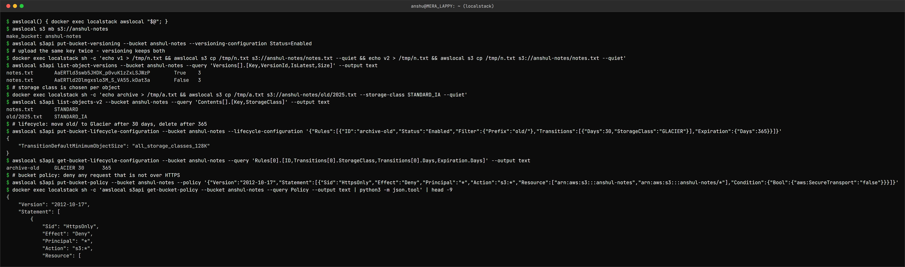

S3 – Simple Storage Service (Storage)
=====================================

Name: Anshul Mohanty    Roll No: 24BCS10191    Section: A

## What is S3?

Object storage: you store **objects** (any file, up to 5 TB each) in **buckets** and fetch them
over HTTPS by key. There are no folders or disks to manage and no capacity to provision - you pay
per GB stored and per request. AWS designs S3 Standard for 99.999999999% (11 nines) durability by
storing copies across multiple Availability Zones.

## Buckets

- A bucket name is **globally unique** across all AWS accounts (3-63 lowercase characters) - which
  is why the Terraform demo uses `anshul-24bcs10191-devops-demo` instead of something like `demo`.
- A bucket lives in one region, chosen at creation.
- New buckets are private: Block Public Access is on and ACLs are disabled by default.

## Objects

An object is **key + data + metadata**. The key is the full name, e.g. `reports/2026/october.csv`
- the `/` only *looks* like a folder; S3 is a flat key-value store and the console simply groups
keys by prefix. Each object also has a storage class, optional tags, and (with versioning) a
version ID.

## Storage classes

| Class | For | Notes |
|---|---|---|
| S3 Standard | Frequently accessed data | Default |
| S3 Intelligent-Tiering | Unknown/changing access patterns | Moves objects between tiers automatically |
| S3 Standard-IA | Infrequent access, needed quickly | Cheaper storage, retrieval fee, 30-day minimum |
| S3 One Zone-IA | Re-creatable infrequent data | Single AZ - less resilient |
| Glacier Instant Retrieval | Archives needed in milliseconds | |
| Glacier Flexible Retrieval | Archives, minutes-hours retrieval | |
| Glacier Deep Archive | Long-term compliance archives | Cheapest, ~12 h retrieval |

## Versioning

When enabled, overwriting or deleting an object keeps the old version - a delete just adds a
*delete marker*. That protects against accidental overwrites and ransomware-style deletes. Once
enabled, versioning can only be **suspended**, never fully turned off, and every version is billed.

## Lifecycle policies

Rules that act on objects automatically by age/prefix/tag:

- **Transition** to a cheaper class (e.g. to Glacier after 30 days).
- **Expire** (delete) after N days.
- Delete **noncurrent versions** after N days - essential with versioning, or old versions grow forever.
- Abort incomplete multipart uploads.

## Encryption

- **At rest:** every new object is encrypted by default with SSE-S3 (AES-256, keys managed by
  AWS). SSE-KMS uses keys in AWS KMS, so key usage is logged in CloudTrail and access to the key
  can be controlled separately. Client-side encryption encrypts before upload.
- **In transit:** HTTPS. A bucket policy can deny any request where `aws:SecureTransport` is false.

## Bucket policies

A resource-based JSON policy attached to the bucket: who (Principal) can do what (Action) on
which objects (Resource), under which conditions. Used for cross-account access, forcing HTTPS,
allowing only a CloudFront distribution or a VPC endpoint, or (rarely, deliberately) public read
for a static website. IAM policies say what a *user* can do; bucket policies say who can touch
*this bucket*. Both are evaluated, and an explicit Deny in either wins.

## Common use cases

Static website hosting (with CloudFront), backups and archives, data lakes for analytics,
application uploads (images, documents), build artifacts, logs, and **Terraform remote state**
(an S3 backend with locking).

## Tried it (on LocalStack)

The Terraform demo in this topic already covers creating a bucket with versioning, encryption and
Block Public Access. This adds versions, storage classes, a lifecycle rule and a bucket policy.



```
$ awslocal() { docker exec localstack awslocal "$@"; }
$ awslocal s3 mb s3://anshul-notes
make_bucket: anshul-notes
$ awslocal s3api put-bucket-versioning --bucket anshul-notes --versioning-configuration Status=Enabled
$ # upload the same key twice - versioning keeps both
$ docker exec localstack sh -c 'echo v1 > /tmp/n.txt && awslocal s3 cp /tmp/n.txt s3://anshul-notes/notes.txt --quiet && echo v2 > /tmp/n.txt && awslocal s3 cp /tmp/n.txt s3://anshul-notes/notes.txt --quiet'
$ awslocal s3api list-object-versions --bucket anshul-notes --query 'Versions[].[Key,VersionId,IsLatest,Size]' --output text
notes.txt	AaERTld3swb5JHDK_p0vuK1zZxLSJWzP	True	3
notes.txt	AaERTld2Dlmgxslo3M_S_VA55.kDat3a	False	3
$ # storage class is chosen per object
$ docker exec localstack sh -c 'echo archive > /tmp/a.txt && awslocal s3 cp /tmp/a.txt s3://anshul-notes/old/2025.txt --storage-class STANDARD_IA --quiet'
$ awslocal s3api list-objects-v2 --bucket anshul-notes --query 'Contents[].[Key,StorageClass]' --output text
notes.txt	STANDARD
old/2025.txt	STANDARD_IA
$ # lifecycle: move old/ to Glacier after 30 days, delete after 365
$ awslocal s3api put-bucket-lifecycle-configuration --bucket anshul-notes --lifecycle-configuration '{"Rules":[{"ID":"archive-old","Status":"Enabled","Filter":{"Prefix":"old/"},"Transitions":[{"Days":30,"StorageClass":"GLACIER"}],"Expiration":{"Days":365}}]}'
{
    "TransitionDefaultMinimumObjectSize": "all_storage_classes_128K"
}
$ awslocal s3api get-bucket-lifecycle-configuration --bucket anshul-notes --query 'Rules[0].[ID,Transitions[0].StorageClass,Transitions[0].Days,Expiration.Days]' --output text
archive-old	GLACIER	30	365
$ # bucket policy: deny any request that is not over HTTPS
$ awslocal s3api put-bucket-policy --bucket anshul-notes --policy '{"Version":"2012-10-17","Statement":[{"Sid":"HttpsOnly","Effect":"Deny","Principal":"*","Action":"s3:*","Resource":["arn:aws:s3:::anshul-notes","arn:aws:s3:::anshul-notes/*"],"Condition":{"Bool":{"aws:SecureTransport":"false"}}}]}'
$ docker exec localstack sh -c 'awslocal s3api get-bucket-policy --bucket anshul-notes --query Policy --output text | python3 -m json.tool' | head -9
{
    "Version": "2012-10-17",
    "Statement": [
        {
            "Sid": "HttpsOnly",
            "Effect": "Deny",
            "Principal": "*",
            "Action": "s3:*",
            "Resource": [
```

- Two uploads of `notes.txt` gave **two versions**; only the newest has `IsLatest = True`.
- `old/2025.txt` was stored directly as `STANDARD_IA`; everything else defaulted to `STANDARD`.
- The lifecycle rule applies only to the `old/` prefix: Glacier after 30 days, deleted after 365.
- The bucket policy is an explicit **Deny** for non-HTTPS requests, which overrides any Allow.
