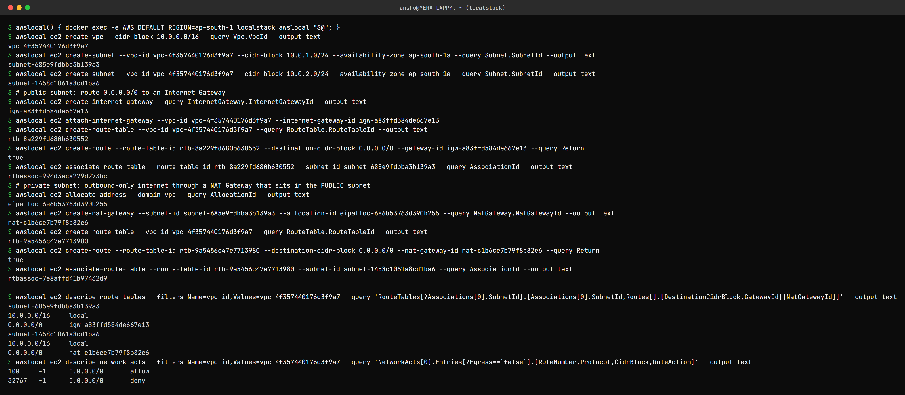

VPC – Virtual Private Cloud (Networking)
========================================

Name: Anshul Mohanty    Roll No: 24BCS10191    Section: A

## What is a VPC?

A logically isolated private network inside AWS, in one region, where you decide the IP range,
the subnets, how traffic is routed and what is allowed in and out. Every EC2 instance, RDS
database and EKS node lives in a subnet of some VPC. Each region also has a *default VPC* so you
can launch things immediately, but real environments define their own.

```
                 Internet
                    │
            Internet Gateway
                    │
 ┌──────────────── VPC 10.0.0.0/16 ─────────────────┐
 │  Public subnet 10.0.1.0/24   Private subnet 10.0.2.0/24
 │  route 0.0.0.0/0 → IGW       route 0.0.0.0/0 → NAT
 │  [load balancer] [NAT GW] ──→ [app servers] [database]
 └──────────────────────────────────────────────────┘
```

## CIDR

The VPC's address range in CIDR notation: `10.0.0.0/16` = the first 16 bits are fixed, giving
2^16 = 65,536 addresses. Allowed VPC sizes are `/16` to `/28`. Use private (RFC 1918) ranges and
avoid overlapping with other VPCs or the office network you might connect later - overlapping
ranges cannot be peered.

## Subnets

A slice of the VPC's range in **one Availability Zone** (`10.0.1.0/24` = 256 addresses, of which
AWS reserves 5, so 251 usable). High availability means at least one subnet per AZ for each tier.

## Route tables

Each subnet is associated with exactly one route table, which decides where packets for each
destination go. Every route table has the `local` route for the VPC CIDR so everything inside the
VPC can reach everything else (subject to firewalls). The **most specific** matching route wins.

## Internet Gateway (IGW)

A horizontally scaled, highly available gateway attached to the VPC that allows traffic between
the VPC and the internet, and does 1:1 NAT for instances that have public IPs. One per VPC.

## NAT Gateway

Lets instances in **private** subnets start **outbound** connections to the internet (for OS
updates, calling external APIs, pulling images) while nothing on the internet can start a
connection to them. It sits in a **public** subnet with an Elastic IP; the private route table
sends `0.0.0.0/0` to it. It is billed per hour and per GB - often the surprise item on a bill.
For high availability, one per AZ.

## Security groups vs Network ACLs

| | Security group | Network ACL |
|---|---|---|
| Applies to | An instance's network interface | A whole subnet |
| Rules | Allow only | Allow **and** deny |
| State | **Stateful** - replies allowed automatically | **Stateless** - return traffic needs its own rule (ephemeral ports 1024-65535) |
| Evaluation | All rules together | In order of rule number, first match wins |
| Default | Deny all in, allow all out | Default NACL allows everything |

Security groups are the main tool; NACLs are a coarse subnet-level backstop, e.g. to block an
abusive IP range.

## Public vs private subnet

There is no "public" checkbox - the **route table** makes the difference:

| | Public subnet | Private subnet |
|---|---|---|
| Default route | `0.0.0.0/0 → Internet Gateway` | `0.0.0.0/0 → NAT Gateway` (or none at all) |
| Instances get public IPs | Yes | No |
| Reachable from the internet | Yes, if the security group allows | No |
| Typical contents | Load balancers, NAT gateways, bastion hosts | App servers, databases, internal services |

## Tried it (on LocalStack)

The diagram above, built with the CLI: one VPC, a public and a private subnet, an IGW, a NAT
gateway in the public subnet, and one route table for each subnet.



```
$ awslocal() { docker exec -e AWS_DEFAULT_REGION=ap-south-1 localstack awslocal "$@"; }
$ awslocal ec2 create-vpc --cidr-block 10.0.0.0/16 --query Vpc.VpcId --output text
vpc-4f357440176d3f9a7
$ awslocal ec2 create-subnet --vpc-id vpc-4f357440176d3f9a7 --cidr-block 10.0.1.0/24 --availability-zone ap-south-1a --query Subnet.SubnetId --output text
subnet-685e9fdbba3b139a3
$ awslocal ec2 create-subnet --vpc-id vpc-4f357440176d3f9a7 --cidr-block 10.0.2.0/24 --availability-zone ap-south-1a --query Subnet.SubnetId --output text
subnet-1458c1061a8cd1ba6
$ # public subnet: route 0.0.0.0/0 to an Internet Gateway
$ awslocal ec2 create-internet-gateway --query InternetGateway.InternetGatewayId --output text
igw-a83ffd584de667e13
$ awslocal ec2 attach-internet-gateway --vpc-id vpc-4f357440176d3f9a7 --internet-gateway-id igw-a83ffd584de667e13
$ awslocal ec2 create-route-table --vpc-id vpc-4f357440176d3f9a7 --query RouteTable.RouteTableId --output text
rtb-8a229fd680b630552
$ awslocal ec2 create-route --route-table-id rtb-8a229fd680b630552 --destination-cidr-block 0.0.0.0/0 --gateway-id igw-a83ffd584de667e13 --query Return
true
$ awslocal ec2 associate-route-table --route-table-id rtb-8a229fd680b630552 --subnet-id subnet-685e9fdbba3b139a3 --query AssociationId --output text
rtbassoc-994d3aca279d273bc
$ # private subnet: outbound-only internet through a NAT Gateway that sits in the PUBLIC subnet
$ awslocal ec2 allocate-address --domain vpc --query AllocationId --output text
eipalloc-6e6b53763d390b255
$ awslocal ec2 create-nat-gateway --subnet-id subnet-685e9fdbba3b139a3 --allocation-id eipalloc-6e6b53763d390b255 --query NatGateway.NatGatewayId --output text
nat-c1b6ce7b79f8b82e6
$ awslocal ec2 create-route-table --vpc-id vpc-4f357440176d3f9a7 --query RouteTable.RouteTableId --output text
rtb-9a5456c47e7713980
$ awslocal ec2 create-route --route-table-id rtb-9a5456c47e7713980 --destination-cidr-block 0.0.0.0/0 --nat-gateway-id nat-c1b6ce7b79f8b82e6 --query Return
true
$ awslocal ec2 associate-route-table --route-table-id rtb-9a5456c47e7713980 --subnet-id subnet-1458c1061a8cd1ba6 --query AssociationId --output text
rtbassoc-7e8affd41b97432d9

$ awslocal ec2 describe-route-tables --filters Name=vpc-id,Values=vpc-4f357440176d3f9a7 --query 'RouteTables[?Associations[0].SubnetId].[Associations[0].SubnetId,Routes[].[DestinationCidrBlock,GatewayId||NatGatewayId]]' --output text
subnet-685e9fdbba3b139a3
10.0.0.0/16	local
0.0.0.0/0	igw-a83ffd584de667e13
subnet-1458c1061a8cd1ba6
10.0.0.0/16	local
0.0.0.0/0	nat-c1b6ce7b79f8b82e6
$ awslocal ec2 describe-network-acls --filters Name=vpc-id,Values=vpc-4f357440176d3f9a7 --query 'NetworkAcls[0].Entries[?Egress==`false`].[RuleNumber,Protocol,CidrBlock,RuleAction]' --output text
100	-1	0.0.0.0/0	allow
32767	-1	0.0.0.0/0	deny
```

The final route table query is the whole idea of public vs private in two lines: both subnets
have `10.0.0.0/16 → local`, but the public one sends everything else to `igw-...` and the private
one to `nat-...`. The default network ACL allows all inbound traffic (rule 100) with the implicit
final deny (rule 32767). The same network is built with Terraform in
[topic 18](../../../18_Cloud_Terraform/README.md).
