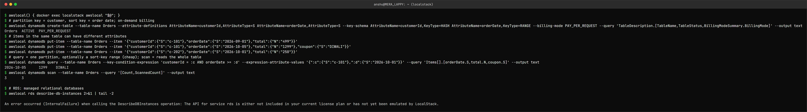

DynamoDB and RDS – Database Services
====================================

Name: Anshul Mohanty    Roll No: 24BCS10191    Section: A

| | DynamoDB | RDS |
|---|---|---|
| Model | NoSQL key-value / document | Relational (SQL) |
| Schema | Only the key is fixed; items can differ | Fixed tables and columns |
| Scaling | Horizontal, automatic, effectively unlimited | Vertical (bigger instance) + read replicas |
| Servers | None - fully serverless | You pick an instance class |
| Queries | By key; no joins | Full SQL, joins, transactions |
| Best for | Known access patterns at any scale | Relational data and ad-hoc queries |

---

DynamoDB
--------

### NoSQL

DynamoDB is a fully managed, serverless NoSQL database with single-digit-millisecond reads and
writes at any scale. There is no server to size or patch: you create a table and choose **on-demand**
(pay per request) or **provisioned** (set read/write capacity, optionally auto-scaled) billing.

### Tables, items, attributes

| Term | SQL equivalent | Note |
|---|---|---|
| Table | Table | |
| Item | Row | Up to 400 KB |
| Attribute | Column | Each item can have **different** attributes |

### Partition key and sort key

- **Partition key** (`HASH`): required. DynamoDB hashes it to decide which partition stores the
  item. A good one has many distinct, evenly used values (`customerId`), otherwise one "hot"
  partition becomes a bottleneck.
- **Sort key** (`RANGE`): optional. Items with the same partition key are stored sorted by it,
  which enables range queries ("this customer's orders since October").
- Partition key alone = must be unique. Partition key + sort key = the *pair* must be unique.

`Query` reads one partition (fast, cheap); `Scan` reads the whole table (slow, expensive). Other
access patterns are served by secondary indexes (GSI/LSI). Design starts from the queries you
need, not from the entities.

### Use cases

Shopping carts and orders, user sessions and profiles, gaming leaderboards, IoT device data,
serverless backends with Lambda, and **Terraform state locking** (older S3 backends).

### Tried it (on LocalStack)



```
$ awslocal() { docker exec localstack awslocal "$@"; }
$ # partition key = customer, sort key = order date; on-demand billing
$ awslocal dynamodb create-table --table-name Orders --attribute-definitions AttributeName=customerId,AttributeType=S AttributeName=orderDate,AttributeType=S --key-schema AttributeName=customerId,KeyType=HASH AttributeName=orderDate,KeyType=RANGE --billing-mode PAY_PER_REQUEST --query 'TableDescription.[TableName,TableStatus,BillingModeSummary.BillingMode]' --output text
Orders	ACTIVE	PAY_PER_REQUEST
$ # items in the same table can have different attributes
$ awslocal dynamodb put-item --table-name Orders --item '{"customerId":{"S":"c-101"},"orderDate":{"S":"2026-09-01"},"total":{"N":"499"}}'
$ awslocal dynamodb put-item --table-name Orders --item '{"customerId":{"S":"c-101"},"orderDate":{"S":"2026-10-05"},"total":{"N":"1299"},"coupon":{"S":"DIWALI"}}'
$ awslocal dynamodb put-item --table-name Orders --item '{"customerId":{"S":"c-202"},"orderDate":{"S":"2026-10-01"},"total":{"N":"250"}}'
$ # query = one partition, optionally a sort-key range (cheap); scan = reads the whole table
$ awslocal dynamodb query --table-name Orders --key-condition-expression 'customerId = :c AND orderDate >= :d' --expression-attribute-values '{":c":{"S":"c-101"},":d":{"S":"2026-10-01"}}' --query 'Items[].[orderDate.S,total.N,coupon.S]' --output text
2026-10-05	1299	DIWALI
$ awslocal dynamodb scan --table-name Orders --query '[Count,ScannedCount]' --output text
3	3

$ # RDS: managed relational databases
$ awslocal rds describe-db-instances 2>&1 | tail -2

An error occurred (InternalFailure) when calling the DescribeDBInstances operation: The API for service rds is either not included in your current license plan or has not yet been emulated by LocalStack.
```

- The table has a composite key: `customerId` (partition) + `orderDate` (sort), on-demand billing.
- The second item has a `coupon` attribute the others do not - no schema change needed.
- The `query` asked for one customer's orders from October onwards and returned exactly one item,
  using only the key. The `scan` had to read all 3 items (`ScannedCount`) even to count them.

---

RDS
---

### Relational database

Amazon RDS is managed relational databases. AWS handles provisioning, OS and database patching,
backups, failure detection and failover; you still design the schema, write the SQL and tune
queries.

### Supported engines

PostgreSQL, MySQL, MariaDB, Oracle, Microsoft SQL Server, IBM Db2 - and **Amazon Aurora**
(MySQL- and PostgreSQL-compatible, with storage that auto-grows and is replicated six ways across
three AZs).

### DB instances

A DB instance is a database server with an **instance class** (e.g. `db.t4g.micro`,
`db.r7g.large`) and **storage** (gp3 or io2, which can auto-scale). It has an endpoint DNS name
that applications connect to; you never SSH into it.

### Security

- Put it in **private subnets** (a DB subnet group) with *Publicly accessible = No*.
- A **security group** that allows the DB port (5432/3306) only from the application servers'
  security group.
- **Encryption at rest** with KMS (choose at creation) and **TLS** in transit.
- Master password stored in **Secrets Manager** (RDS can manage and rotate it), or **IAM database
  authentication** instead of passwords.

### Backups

- **Automated backups**: daily snapshot plus transaction logs, kept 1-35 days, giving
  **point-in-time restore** to any second in that window.
- **Manual snapshots**: kept until you delete them; can be copied to other regions/accounts.
- A restore always creates a **new** DB instance.

### Multi-AZ

A **standby** copy in another Availability Zone, kept in sync with **synchronous** replication.
If the primary fails (or during maintenance) RDS fails over automatically by repointing the same
endpoint DNS name, usually within a minute or two. The standby is for **availability**, not for
reads.

### Read replicas

**Asynchronous** copies that serve **read** traffic, in the same or another region (up to 15 for
Aurora). They scale reads (reports, dashboards) and can be promoted to a standalone database
(e.g. for disaster recovery). Because replication is asynchronous, a replica can lag slightly
behind the primary.

| | Multi-AZ standby | Read replica |
|---|---|---|
| Purpose | High availability | Read scaling / DR |
| Replication | Synchronous | Asynchronous |
| Serves traffic | No (until failover) | Yes, reads |
| Failover | Automatic | Manual promotion |

### Use cases

Web and mobile application backends, e-commerce orders and payments, ERP/CRM systems - anything
that needs joins, transactions and consistent relational data, without running the database
servers yourself.

### Not tried hands-on

The last command in the screenshot above shows LocalStack's community edition does not emulate
RDS (`not included in your current license plan`). Creating a real RDS instance needs an AWS
account, so RDS is covered here from the documentation only.
