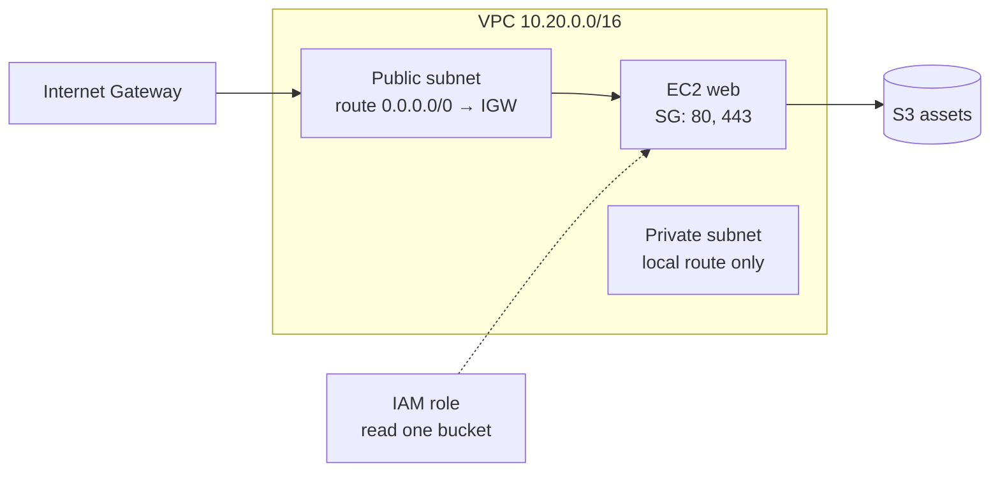
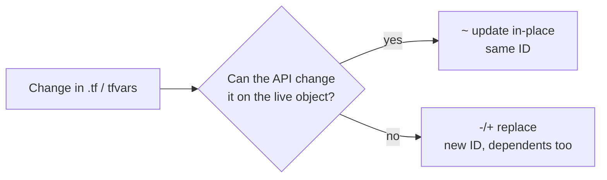

Cloud and Terraform in Action – Learning Notes
==============================================

Name: Anshul Mohanty    Roll No: 24BCS10191    Section: A

## In one line

A whole environment - network, firewall, server, permissions, storage - is just a graph of
resources; Terraform builds it from references, in parallel where it can, and tears it down in
reverse.

## The picture

How a change is classified:

## Mental model

| Building block | In this project |
|---|---|
| Providers | `aws`, `random` |
| Variables | region, project, CIDRs, instance type, `use_localstack` |
| Data sources | `aws_ami`, `aws_availability_zones` |
| Resources | 21 - VPC, subnets, IGW, routes, SG + rules, S3, IAM, EC2 |
| Outputs | IDs, IPs, bucket name, URL |
| State | 23 entries mapping addresses to real IDs |

| Plan symbol | Meaning |
|---|---|
| `+` | create |
| `~` | update in place |
| `-/+` | destroy and recreate (`forces replacement`) |
| `-` | destroy |

## Gotchas

- `awslocal`/the AWS CLI default region was `us-east-1` while Terraform used `ap-south-1` -
  the VPC "did not exist" until the CLI was pointed at the same region. Regions are separate worlds.
- `terraform graph` is transitively reduced: the instance has no direct edge to the subnet because
  the route table association already depends on it.
- Changing a subnet CIDR replaces the subnet **and everything inside it**.
- Resizing an instance in place still stops and starts it.
- LocalStack EC2 is a mock: instances get IDs and IPs but never boot, so `user_data` does not run.
- A NAT gateway costs money every hour; leave it out until a private subnet really needs outbound
  internet.
