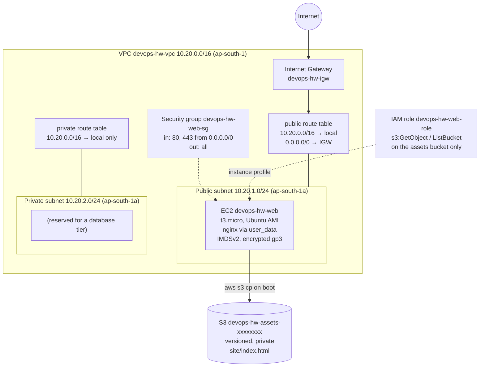
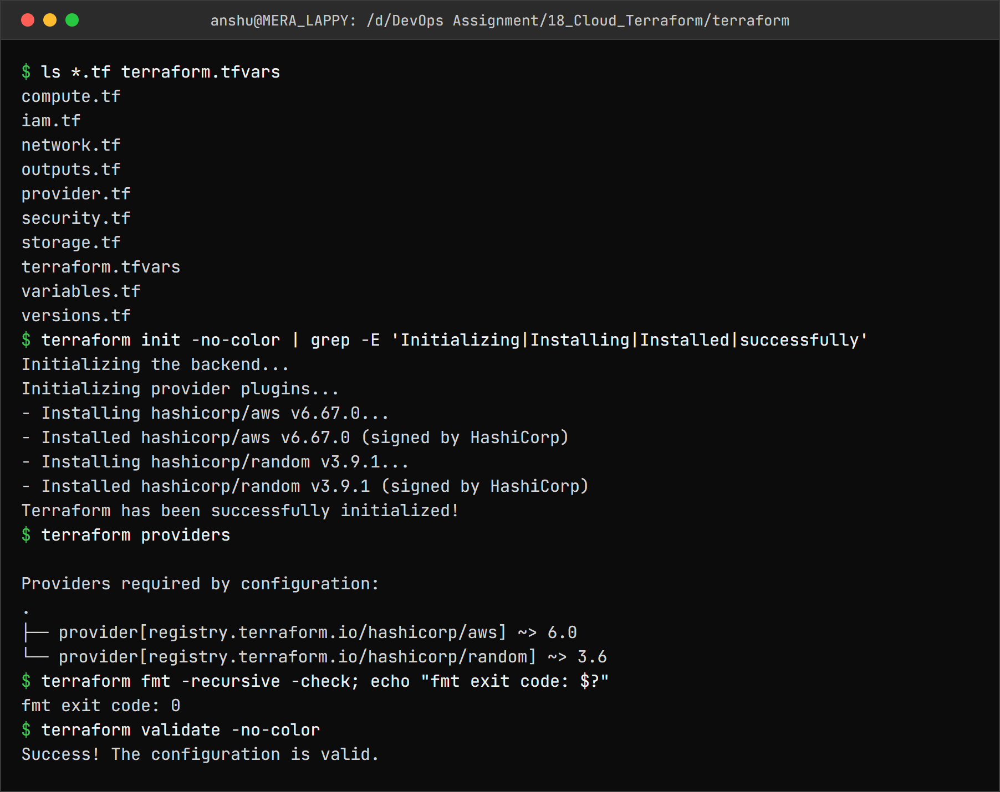
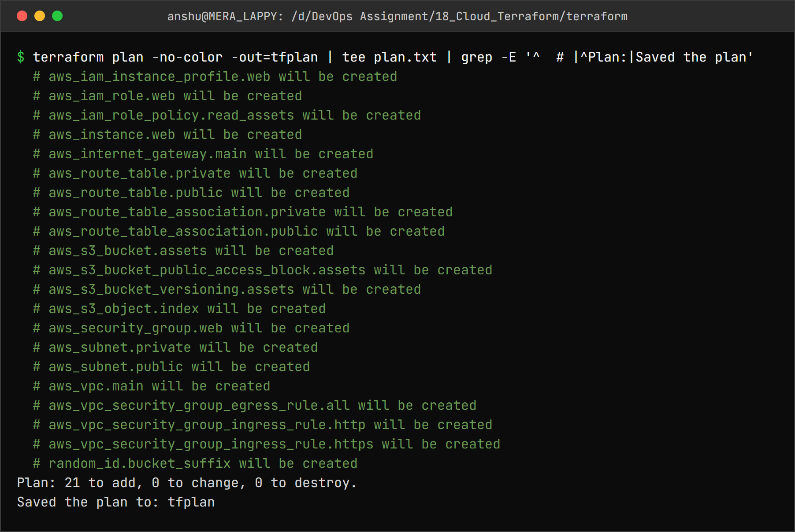
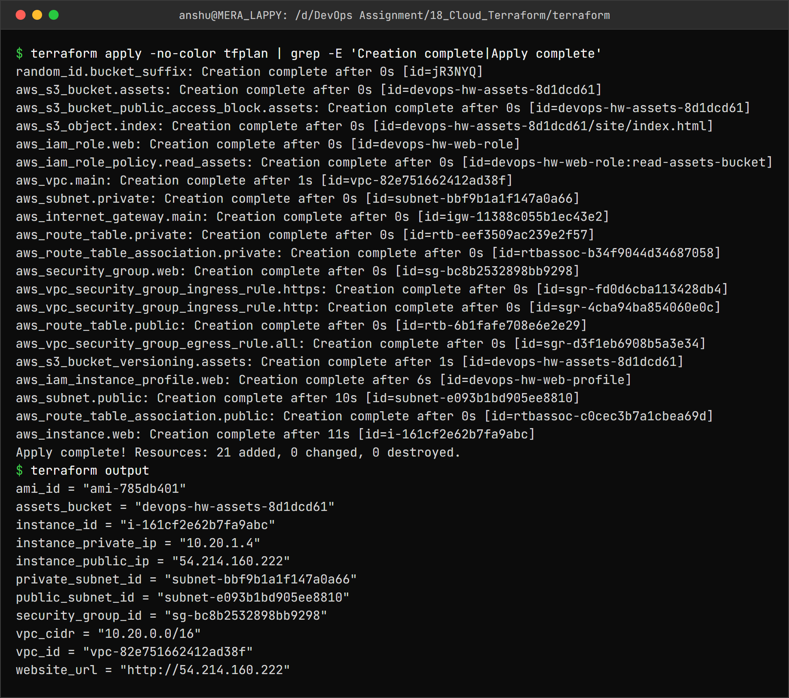
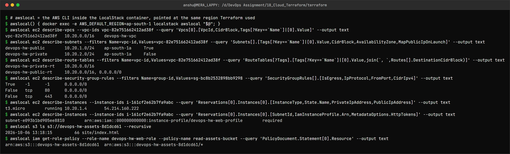
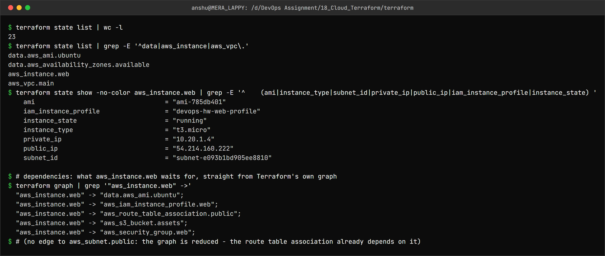
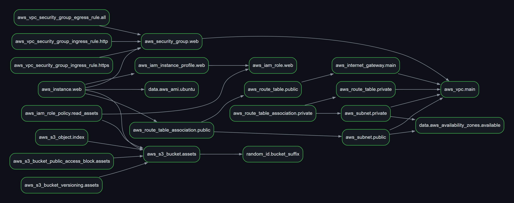
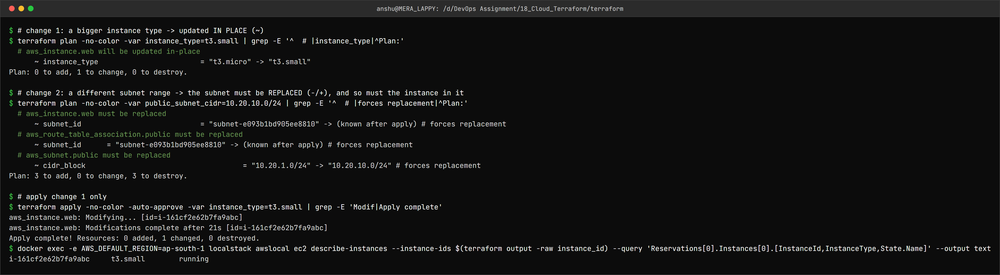
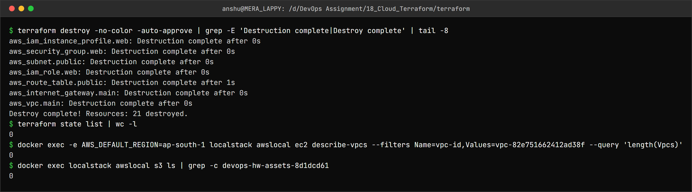

Cloud and Terraform in Action – Homework
========================================

Name: Anshul Mohanty    Roll No: 24BCS10191    Section: A

See also: [LEARNING.md](LEARNING.md) - diagram and revision notes for this topic.

An end-to-end cloud environment defined entirely in Terraform: a VPC with public and private
subnets, an Internet Gateway, route tables, a security group, an EC2 web server with an IAM role,
and an S3 bucket holding the site files.

As in [topic 17](../17_Terraform_IaC/README.md), the AWS APIs are provided by **LocalStack 4.14**
running in Docker (no AWS account). The code is ordinary AWS Terraform - `use_localstack = false`
in [terraform.tfvars](terraform/terraform.tfvars) points the same code at real AWS.

---

Architecture
------------



| Layer | Resources | File |
|---|---|---|
| Providers | `hashicorp/aws ~> 6.0`, `hashicorp/random ~> 3.6` | [versions.tf](terraform/versions.tf), [provider.tf](terraform/provider.tf) |
| Network | VPC, 2 subnets, IGW, 2 route tables + associations | [network.tf](terraform/network.tf) |
| Firewall | Security group + 2 ingress rules + 1 egress rule | [security.tf](terraform/security.tf) |
| Storage | `random_id`, S3 bucket, versioning, public access block, `index.html` | [storage.tf](terraform/storage.tf) |
| Identity | IAM role, inline least-privilege policy, instance profile | [iam.tf](terraform/iam.tf) |
| Compute | AMI lookup (data source), EC2 instance with `user_data` | [compute.tf](terraform/compute.tf) |
| Inputs / outputs | 9 variables, 11 outputs | [variables.tf](terraform/variables.tf), [outputs.tf](terraform/outputs.tf) |

21 managed resources + 2 data sources. Design choices worth noting:

- The instance reads its web page from S3 through an **IAM role** - no access keys on the server -
  and the role can only *read* that *one* bucket.
- The AMI is **looked up** (`data "aws_ami"`) rather than hard-coded; AMI IDs differ per region.
- The private subnet has **no** route out of the VPC. A NAT gateway would give it outbound
  internet but costs money per hour, and nothing in it needs the internet yet.
- IMDSv2 required and an encrypted root volume - two defaults that cost nothing.
- `random_id` (a second provider) makes the bucket name globally unique.

---

Terraform workflow
------------------

### init, providers, validate



```
$ ls *.tf terraform.tfvars
compute.tf
iam.tf
network.tf
outputs.tf
provider.tf
security.tf
storage.tf
terraform.tfvars
variables.tf
versions.tf
$ terraform init -no-color | grep -E 'Initializing|Installing|Installed|successfully'
Initializing the backend...
Initializing provider plugins...
- Installing hashicorp/aws v6.67.0...
- Installed hashicorp/aws v6.67.0 (signed by HashiCorp)
- Installing hashicorp/random v3.9.1...
- Installed hashicorp/random v3.9.1 (signed by HashiCorp)
Terraform has been successfully initialized!
$ terraform providers

Providers required by configuration:
.
├── provider[registry.terraform.io/hashicorp/aws] ~> 6.0
└── provider[registry.terraform.io/hashicorp/random] ~> 3.6
$ terraform fmt -recursive -check; echo "fmt exit code: $?"
fmt exit code: 0
$ terraform validate -no-color
Success! The configuration is valid.
```

Splitting the configuration across files by concern changes nothing for Terraform - it loads every
`.tf` file in the directory as one configuration. `init` installed **both** providers.

### plan



```
$ terraform plan -no-color -out=tfplan | tee plan.txt | grep -E '^  # |^Plan:|Saved the plan'
  # aws_iam_instance_profile.web will be created
  # aws_iam_role.web will be created
  # aws_iam_role_policy.read_assets will be created
  # aws_instance.web will be created
  # aws_internet_gateway.main will be created
  # aws_route_table.private will be created
  # aws_route_table.public will be created
  # aws_route_table_association.private will be created
  # aws_route_table_association.public will be created
  # aws_s3_bucket.assets will be created
  # aws_s3_bucket_public_access_block.assets will be created
  # aws_s3_bucket_versioning.assets will be created
  # aws_s3_object.index will be created
  # aws_security_group.web will be created
  # aws_subnet.private will be created
  # aws_subnet.public will be created
  # aws_vpc.main will be created
  # aws_vpc_security_group_egress_rule.all will be created
  # aws_vpc_security_group_ingress_rule.http will be created
  # aws_vpc_security_group_ingress_rule.https will be created
  # random_id.bucket_suffix will be created
Plan: 21 to add, 0 to change, 0 to destroy.
Saved the plan to: tfplan
```

<details>
<summary>Full plan output</summary>

```
data.aws_availability_zones.available: Reading...
data.aws_ami.ubuntu: Reading...
data.aws_availability_zones.available: Read complete after 1s [id=ap-south-1]
data.aws_ami.ubuntu: Read complete after 1s [id=ami-785db401]

Terraform used the selected providers to generate the following execution
plan. Resource actions are indicated with the following symbols:
  + create

Terraform will perform the following actions:

  # aws_iam_instance_profile.web will be created
  + resource "aws_iam_instance_profile" "web" {
      + arn         = (known after apply)
      + create_date = (known after apply)
      + id          = (known after apply)
      + name        = "devops-hw-web-profile"
      + name_prefix = (known after apply)
      + path        = "/"
      + role        = "devops-hw-web-role"
      + tags_all    = {
          + "Environment" = "dev"
          + "ManagedBy"   = "terraform"
          + "Owner"       = "Anshul Mohanty"
          + "Project"     = "devops-hw"
        }
      + unique_id   = (known after apply)
    }

  # aws_iam_role.web will be created
  + resource "aws_iam_role" "web" {
      + arn                   = (known after apply)
      + assume_role_policy    = jsonencode(
            {
              + Statement = [
                  + {
                      + Action    = "sts:AssumeRole"
                      + Effect    = "Allow"
                      + Principal = {
                          + Service = "ec2.amazonaws.com"
                        }
                    },
                ]
              + Version   = "2012-10-17"
            }
        )
      + create_date           = (known after apply)
      + force_detach_policies = false
      + id                    = (known after apply)
      + managed_policy_arns   = (known after apply)
      + max_session_duration  = 3600
      + name                  = "devops-hw-web-role"
      + name_prefix           = (known after apply)
      + path                  = "/"
      + tags_all              = {
          + "Environment" = "dev"
          + "ManagedBy"   = "terraform"
          + "Owner"       = "Anshul Mohanty"
          + "Project"     = "devops-hw"
        }
      + unique_id             = (known after apply)

      + inline_policy (known after apply)
    }

  # aws_iam_role_policy.read_assets will be created
  + resource "aws_iam_role_policy" "read_assets" {
      + id          = (known after apply)
      + name        = "read-assets-bucket"
      + name_prefix = (known after apply)
      + policy      = (known after apply)
      + role        = (known after apply)
    }

  # aws_instance.web will be created
  + resource "aws_instance" "web" {
      + ami                                  = "ami-785db401"
      + arn                                  = (known after apply)
      + associate_public_ip_address          = (known after apply)
      + availability_zone                    = (known after apply)
      + disable_api_stop                     = (known after apply)
      + disable_api_termination              = (known after apply)
      + ebs_optimized                        = (known after apply)
      + enable_primary_ipv6                  = (known after apply)
      + force_destroy                        = false
      + get_password_data                    = false
      + host_id                              = (known after apply)
      + host_resource_group_arn              = (known after apply)
      + iam_instance_profile                 = "devops-hw-web-profile"
      + id                                   = (known after apply)
      + instance_initiated_shutdown_behavior = (known after apply)
      + instance_lifecycle                   = (known after apply)
      + instance_state                       = (known after apply)
      + instance_type                        = "t3.micro"
      + ipv6_address_count                   = (known after apply)
      + ipv6_addresses                       = (known after apply)
      + key_name                             = (known after apply)
      + monitoring                           = (known after apply)
      + outpost_arn                          = (known after apply)
      + password_data                        = (known after apply)
      + placement_group                      = (known after apply)
      + placement_group_id                   = (known after apply)
      + placement_partition_number           = (known after apply)
      + primary_network_interface_id         = (known after apply)
      + private_dns                          = (known after apply)
      + private_ip                           = (known after apply)
      + public_dns                           = (known after apply)
      + public_ip                            = (known after apply)
      + region                               = "ap-south-1"
      + secondary_private_ips                = (known after apply)
      + security_groups                      = (known after apply)
      + source_dest_check                    = true
      + spot_instance_request_id             = (known after apply)
      + subnet_id                            = (known after apply)
      + tags                                 = {
          + "Name" = "devops-hw-web"
        }
      + tags_all                             = {
          + "Environment" = "dev"
          + "ManagedBy"   = "terraform"
          + "Name"        = "devops-hw-web"
          + "Owner"       = "Anshul Mohanty"
          + "Project"     = "devops-hw"
        }
      + tenancy                              = (known after apply)
      + user_data                            = (known after apply)
      + user_data_base64                     = (known after apply)
      + user_data_replace_on_change          = false
      + vpc_security_group_ids               = (known after apply)

      + capacity_reservation_specification (known after apply)

      + cpu_options (known after apply)

      + ebs_block_device (known after apply)

      + enclave_options (known after apply)

      + ephemeral_block_device (known after apply)

      + instance_market_options (known after apply)

      + maintenance_options (known after apply)

      + metadata_options {
          + http_endpoint               = "enabled"
          + http_protocol_ipv6          = "disabled"
          + http_put_response_hop_limit = (known after apply)
          + http_tokens                 = "required"
          + instance_metadata_tags      = (known after apply)
        }

      + network_interface (known after apply)

      + primary_network_interface (known after apply)

      + private_dns_name_options (known after apply)

      + root_block_device {
          + delete_on_termination = true
          + device_name           = (known after apply)
          + encrypted             = true
          + iops                  = (known after apply)
          + kms_key_id            = (known after apply)
          + tags_all              = (known after apply)
          + throughput            = (known after apply)
          + volume_id             = (known after apply)
          + volume_size           = 8
          + volume_type           = "gp3"
        }

      + secondary_network_interface (known after apply)
    }

  # aws_internet_gateway.main will be created
  + resource "aws_internet_gateway" "main" {
      + arn      = (known after apply)
      + id       = (known after apply)
      + owner_id = (known after apply)
      + region   = "ap-south-1"
      + tags     = {
          + "Name" = "devops-hw-igw"
        }
      + tags_all = {
          + "Environment" = "dev"
          + "ManagedBy"   = "terraform"
          + "Name"        = "devops-hw-igw"
          + "Owner"       = "Anshul Mohanty"
          + "Project"     = "devops-hw"
        }
      + vpc_id   = (known after apply)
    }

  # aws_route_table.private will be created
  + resource "aws_route_table" "private" {
      + arn              = (known after apply)
      + id               = (known after apply)
      + owner_id         = (known after apply)
      + propagating_vgws = (known after apply)
      + region           = "ap-south-1"
      + route            = (known after apply)
      + tags             = {
          + "Name" = "devops-hw-private-rt"
        }
      + tags_all         = {
          + "Environment" = "dev"
          + "ManagedBy"   = "terraform"
          + "Name"        = "devops-hw-private-rt"
          + "Owner"       = "Anshul Mohanty"
          + "Project"     = "devops-hw"
        }
      + vpc_id           = (known after apply)
    }

  # aws_route_table.public will be created
  + resource "aws_route_table" "public" {
      + arn              = (known after apply)
      + id               = (known after apply)
      + owner_id         = (known after apply)
      + propagating_vgws = (known after apply)
      + region           = "ap-south-1"
      + route            = [
          + {
              + cidr_block                 = "0.0.0.0/0"
              + gateway_id                 = (known after apply)
                # (12 unchanged attributes hidden)
            },
        ]
      + tags             = {
          + "Name" = "devops-hw-public-rt"
        }
      + tags_all         = {
          + "Environment" = "dev"
          + "ManagedBy"   = "terraform"
          + "Name"        = "devops-hw-public-rt"
          + "Owner"       = "Anshul Mohanty"
          + "Project"     = "devops-hw"
        }
      + vpc_id           = (known after apply)
    }

  # aws_route_table_association.private will be created
  + resource "aws_route_table_association" "private" {
      + id             = (known after apply)
      + region         = "ap-south-1"
      + route_table_id = (known after apply)
      + subnet_id      = (known after apply)
    }

  # aws_route_table_association.public will be created
  + resource "aws_route_table_association" "public" {
      + id             = (known after apply)
      + region         = "ap-south-1"
      + route_table_id = (known after apply)
      + subnet_id      = (known after apply)
    }

  # aws_s3_bucket.assets will be created
  + resource "aws_s3_bucket" "assets" {
      + acceleration_status         = (known after apply)
      + acl                         = (known after apply)
      + arn                         = (known after apply)
      + bucket                      = (known after apply)
      + bucket_domain_name          = (known after apply)
      + bucket_namespace            = (known after apply)
      + bucket_prefix               = (known after apply)
      + bucket_region               = (known after apply)
      + bucket_regional_domain_name = (known after apply)
      + force_destroy               = true
      + hosted_zone_id              = (known after apply)
      + id                          = (known after apply)
      + object_lock_enabled         = (known after apply)
      + policy                      = (known after apply)
      + region                      = "ap-south-1"
      + request_payer               = (known after apply)
      + tags                        = {
          + "Name" = "devops-hw-assets"
        }
      + tags_all                    = {
          + "Environment" = "dev"
          + "ManagedBy"   = "terraform"
          + "Name"        = "devops-hw-assets"
          + "Owner"       = "Anshul Mohanty"
          + "Project"     = "devops-hw"
        }
      + website_domain              = (known after apply)
      + website_endpoint            = (known after apply)

      + cors_rule (known after apply)

      + grant (known after apply)

      + lifecycle_rule (known after apply)

      + logging (known after apply)

      + object_lock_configuration (known after apply)

      + replication_configuration (known after apply)

      + server_side_encryption_configuration (known after apply)

      + versioning (known after apply)

      + website (known after apply)
    }

  # aws_s3_bucket_public_access_block.assets will be created
  + resource "aws_s3_bucket_public_access_block" "assets" {
      + block_public_acls       = true
      + block_public_policy     = true
      + bucket                  = (known after apply)
      + id                      = (known after apply)
      + ignore_public_acls      = true
      + region                  = "ap-south-1"
      + restrict_public_buckets = true
    }

  # aws_s3_bucket_versioning.assets will be created
  + resource "aws_s3_bucket_versioning" "assets" {
      + bucket = (known after apply)
      + id     = (known after apply)
      + region = "ap-south-1"

      + versioning_configuration {
          + mfa_delete = (known after apply)
          + status     = "Enabled"
        }
    }

  # aws_s3_object.index will be created
  + resource "aws_s3_object" "index" {
      + acl                    = (known after apply)
      + arn                    = (known after apply)
      + bucket                 = (known after apply)
      + bucket_key_enabled     = (known after apply)
      + checksum_crc32         = (known after apply)
      + checksum_crc32c        = (known after apply)
      + checksum_crc64nvme     = (known after apply)
      + checksum_sha1          = (known after apply)
      + checksum_sha256        = (known after apply)
      + content                = <<-EOT
            <h1>devops-hw</h1><p>Deployed by Terraform for Anshul Mohanty</p>
        EOT
      + content_type           = "text/html"
      + etag                   = (known after apply)
      + force_destroy          = false
      + id                     = (known after apply)
      + key                    = "site/index.html"
      + kms_key_id             = (known after apply)
      + region                 = "ap-south-1"
      + server_side_encryption = (known after apply)
      + storage_class          = (known after apply)
      + tags_all               = {
          + "Environment" = "dev"
          + "ManagedBy"   = "terraform"
          + "Owner"       = "Anshul Mohanty"
          + "Project"     = "devops-hw"
        }
      + version_id             = (known after apply)
    }

  # aws_security_group.web will be created
  + resource "aws_security_group" "web" {
      + arn                    = (known after apply)
      + description            = "HTTP and HTTPS in from anywhere, everything out"
      + egress                 = (known after apply)
      + id                     = (known after apply)
      + ingress                = (known after apply)
      + name                   = "devops-hw-web-sg"
      + name_prefix            = (known after apply)
      + owner_id               = (known after apply)
      + region                 = "ap-south-1"
      + revoke_rules_on_delete = false
      + tags                   = {
          + "Name" = "devops-hw-web-sg"
        }
      + tags_all               = {
          + "Environment" = "dev"
          + "ManagedBy"   = "terraform"
          + "Name"        = "devops-hw-web-sg"
          + "Owner"       = "Anshul Mohanty"
          + "Project"     = "devops-hw"
        }
      + vpc_id                 = (known after apply)
    }

  # aws_subnet.private will be created
  + resource "aws_subnet" "private" {
      + arn                                            = (known after apply)
      + assign_ipv6_address_on_creation                = false
      + availability_zone                              = "ap-south-1a"
      + availability_zone_id                           = (known after apply)
      + cidr_block                                     = "10.20.2.0/24"
      + enable_dns64                                   = false
      + enable_resource_name_dns_a_record_on_launch    = false
      + enable_resource_name_dns_aaaa_record_on_launch = false
      + id                                             = (known after apply)
      + ipv6_cidr_block                                = (known after apply)
      + ipv6_cidr_block_association_id                 = (known after apply)
      + ipv6_native                                    = false
      + map_public_ip_on_launch                        = false
      + owner_id                                       = (known after apply)
      + private_dns_hostname_type_on_launch            = (known after apply)
      + region                                         = "ap-south-1"
      + tags                                           = {
          + "Name" = "devops-hw-private"
          + "Tier" = "private"
        }
      + tags_all                                       = {
          + "Environment" = "dev"
          + "ManagedBy"   = "terraform"
          + "Name"        = "devops-hw-private"
          + "Owner"       = "Anshul Mohanty"
          + "Project"     = "devops-hw"
          + "Tier"        = "private"
        }
      + vpc_id                                         = (known after apply)
    }

  # aws_subnet.public will be created
  + resource "aws_subnet" "public" {
      + arn                                            = (known after apply)
      + assign_ipv6_address_on_creation                = false
      + availability_zone                              = "ap-south-1a"
      + availability_zone_id                           = (known after apply)
      + cidr_block                                     = "10.20.1.0/24"
      + enable_dns64                                   = false
      + enable_resource_name_dns_a_record_on_launch    = false
      + enable_resource_name_dns_aaaa_record_on_launch = false
      + id                                             = (known after apply)
      + ipv6_cidr_block                                = (known after apply)
      + ipv6_cidr_block_association_id                 = (known after apply)
      + ipv6_native                                    = false
      + map_public_ip_on_launch                        = true
      + owner_id                                       = (known after apply)
      + private_dns_hostname_type_on_launch            = (known after apply)
      + region                                         = "ap-south-1"
      + tags                                           = {
          + "Name" = "devops-hw-public"
          + "Tier" = "public"
        }
      + tags_all                                       = {
          + "Environment" = "dev"
          + "ManagedBy"   = "terraform"
          + "Name"        = "devops-hw-public"
          + "Owner"       = "Anshul Mohanty"
          + "Project"     = "devops-hw"
          + "Tier"        = "public"
        }
      + vpc_id                                         = (known after apply)
    }

  # aws_vpc.main will be created
  + resource "aws_vpc" "main" {
      + arn                                  = (known after apply)
      + cidr_block                           = "10.20.0.0/16"
      + default_network_acl_id               = (known after apply)
      + default_route_table_id               = (known after apply)
      + default_security_group_id            = (known after apply)
      + dhcp_options_id                      = (known after apply)
      + enable_dns_hostnames                 = true
      + enable_dns_support                   = true
      + enable_network_address_usage_metrics = (known after apply)
      + id                                   = (known after apply)
      + instance_tenancy                     = "default"
      + ipv6_association_id                  = (known after apply)
      + ipv6_cidr_block                      = (known after apply)
      + ipv6_cidr_block_network_border_group = (known after apply)
      + main_route_table_id                  = (known after apply)
      + owner_id                             = (known after apply)
      + region                               = "ap-south-1"
      + tags                                 = {
          + "Name" = "devops-hw-vpc"
        }
      + tags_all                             = {
          + "Environment" = "dev"
          + "ManagedBy"   = "terraform"
          + "Name"        = "devops-hw-vpc"
          + "Owner"       = "Anshul Mohanty"
          + "Project"     = "devops-hw"
        }
    }

  # aws_vpc_security_group_egress_rule.all will be created
  + resource "aws_vpc_security_group_egress_rule" "all" {
      + arn                    = (known after apply)
      + cidr_ipv4              = "0.0.0.0/0"
      + description            = "All outbound"
      + id                     = (known after apply)
      + ip_protocol            = "-1"
      + region                 = "ap-south-1"
      + security_group_id      = (known after apply)
      + security_group_rule_id = (known after apply)
      + tags_all               = {
          + "Environment" = "dev"
          + "ManagedBy"   = "terraform"
          + "Owner"       = "Anshul Mohanty"
          + "Project"     = "devops-hw"
        }
    }

  # aws_vpc_security_group_ingress_rule.http will be created
  + resource "aws_vpc_security_group_ingress_rule" "http" {
      + arn                    = (known after apply)
      + cidr_ipv4              = "0.0.0.0/0"
      + description            = "HTTP"
      + from_port              = 80
      + id                     = (known after apply)
      + ip_protocol            = "tcp"
      + region                 = "ap-south-1"
      + security_group_id      = (known after apply)
      + security_group_rule_id = (known after apply)
      + tags_all               = {
          + "Environment" = "dev"
          + "ManagedBy"   = "terraform"
          + "Owner"       = "Anshul Mohanty"
          + "Project"     = "devops-hw"
        }
      + to_port                = 80
    }

  # aws_vpc_security_group_ingress_rule.https will be created
  + resource "aws_vpc_security_group_ingress_rule" "https" {
      + arn                    = (known after apply)
      + cidr_ipv4              = "0.0.0.0/0"
      + description            = "HTTPS"
      + from_port              = 443
      + id                     = (known after apply)
      + ip_protocol            = "tcp"
      + region                 = "ap-south-1"
      + security_group_id      = (known after apply)
      + security_group_rule_id = (known after apply)
      + tags_all               = {
          + "Environment" = "dev"
          + "ManagedBy"   = "terraform"
          + "Owner"       = "Anshul Mohanty"
          + "Project"     = "devops-hw"
        }
      + to_port                = 443
    }

  # random_id.bucket_suffix will be created
  + resource "random_id" "bucket_suffix" {
      + b64_std     = (known after apply)
      + b64_url     = (known after apply)
      + byte_length = 4
      + dec         = (known after apply)
      + hex         = (known after apply)
      + id          = (known after apply)
    }

Plan: 21 to add, 0 to change, 0 to destroy.

Changes to Outputs:
  + ami_id              = "ami-785db401"
  + assets_bucket       = (known after apply)
  + instance_id         = (known after apply)
  + instance_private_ip = (known after apply)
  + instance_public_ip  = (known after apply)
  + private_subnet_id   = (known after apply)
  + public_subnet_id    = (known after apply)
  + security_group_id   = (known after apply)
  + vpc_cidr            = "10.20.0.0/16"
  + vpc_id              = (known after apply)
  + website_url         = (known after apply)

─────────────────────────────────────────────────────────────────────────────

Saved the plan to: tfplan

To perform exactly these actions, run the following command to apply:
    terraform apply "tfplan"
```

</details>

### apply



```
$ terraform apply -no-color tfplan | grep -E 'Creation complete|Apply complete'
random_id.bucket_suffix: Creation complete after 0s [id=jR3NYQ]
aws_s3_bucket.assets: Creation complete after 0s [id=devops-hw-assets-8d1dcd61]
aws_s3_bucket_public_access_block.assets: Creation complete after 0s [id=devops-hw-assets-8d1dcd61]
aws_s3_object.index: Creation complete after 0s [id=devops-hw-assets-8d1dcd61/site/index.html]
aws_iam_role.web: Creation complete after 0s [id=devops-hw-web-role]
aws_iam_role_policy.read_assets: Creation complete after 0s [id=devops-hw-web-role:read-assets-bucket]
aws_vpc.main: Creation complete after 1s [id=vpc-82e751662412ad38f]
aws_subnet.private: Creation complete after 0s [id=subnet-bbf9b1a1f147a0a66]
aws_internet_gateway.main: Creation complete after 0s [id=igw-11388c055b1ec43e2]
aws_route_table.private: Creation complete after 0s [id=rtb-eef3509ac239e2f57]
aws_route_table_association.private: Creation complete after 0s [id=rtbassoc-b34f9044d34687058]
aws_security_group.web: Creation complete after 0s [id=sg-bc8b2532898bb9298]
aws_vpc_security_group_ingress_rule.https: Creation complete after 0s [id=sgr-fd0d6cba113428db4]
aws_vpc_security_group_ingress_rule.http: Creation complete after 0s [id=sgr-4cba94ba854060e0c]
aws_route_table.public: Creation complete after 0s [id=rtb-6b1fafe708e6e2e29]
aws_vpc_security_group_egress_rule.all: Creation complete after 0s [id=sgr-d3f1eb6908b5a3e34]
aws_s3_bucket_versioning.assets: Creation complete after 1s [id=devops-hw-assets-8d1dcd61]
aws_iam_instance_profile.web: Creation complete after 6s [id=devops-hw-web-profile]
aws_subnet.public: Creation complete after 10s [id=subnet-e093b1bd905ee8810]
aws_route_table_association.public: Creation complete after 0s [id=rtbassoc-c0cec3b7a1cbea69d]
aws_instance.web: Creation complete after 11s [id=i-161cf2e62b7fa9abc]
Apply complete! Resources: 21 added, 0 changed, 0 destroyed.
$ terraform output
ami_id = "ami-785db401"
assets_bucket = "devops-hw-assets-8d1dcd61"
instance_id = "i-161cf2e62b7fa9abc"
instance_private_ip = "10.20.1.4"
instance_public_ip = "54.214.160.222"
private_subnet_id = "subnet-bbf9b1a1f147a0a66"
public_subnet_id = "subnet-e093b1bd905ee8810"
security_group_id = "sg-bc8b2532898bb9298"
vpc_cidr = "10.20.0.0/16"
vpc_id = "vpc-82e751662412ad38f"
website_url = "http://54.214.160.222"
```

The order of creation follows the dependencies: the random suffix before the bucket that uses it,
the VPC before everything inside it, and the **instance last** - it waits for the AMI lookup, the
security group, the instance profile (which waits for the role), the bucket name used in
`user_data`, and the public route table association.

### The resources, checked from the AWS side



```
$ # awslocal = the AWS CLI inside the LocalStack container, pointed at the same region Terraform used
$ awslocal() { docker exec -e AWS_DEFAULT_REGION=ap-south-1 localstack awslocal "$@"; }
$ awslocal ec2 describe-vpcs --vpc-ids vpc-82e751662412ad38f --query 'Vpcs[0].[VpcId,CidrBlock,Tags[?Key==`Name`]|[0].Value]' --output text
vpc-82e751662412ad38f	10.20.0.0/16	devops-hw-vpc
$ awslocal ec2 describe-subnets --filters Name=vpc-id,Values=vpc-82e751662412ad38f --query 'Subnets[].[Tags[?Key==`Name`]|[0].Value,CidrBlock,AvailabilityZone,MapPublicIpOnLaunch]' --output text
devops-hw-public	10.20.1.0/24	ap-south-1a	True
devops-hw-private	10.20.2.0/24	ap-south-1a	False
$ awslocal ec2 describe-route-tables --filters Name=vpc-id,Values=vpc-82e751662412ad38f --query 'RouteTables[?Tags].[Tags[?Key==`Name`]|[0].Value,join(`, `,Routes[].DestinationCidrBlock)]' --output text
devops-hw-private-rt	10.20.0.0/16
devops-hw-public-rt	10.20.0.0/16, 0.0.0.0/0
$ awslocal ec2 describe-security-group-rules --filters Name=group-id,Values=sg-bc8b2532898bb9298 --query 'SecurityGroupRules[].[IsEgress,IpProtocol,FromPort,CidrIpv4]' --output text
True	-1	-1	0.0.0.0/0
False	tcp	80	0.0.0.0/0
False	tcp	443	0.0.0.0/0
$ awslocal ec2 describe-instances --instance-ids i-161cf2e62b7fa9abc --query 'Reservations[0].Instances[0].[InstanceType,State.Name,PrivateIpAddress,PublicIpAddress]' --output text
t3.micro	running	10.20.1.4	54.214.160.222
$ awslocal ec2 describe-instances --instance-ids i-161cf2e62b7fa9abc --query 'Reservations[0].Instances[0].[SubnetId,IamInstanceProfile.Arn,MetadataOptions.HttpTokens]' --output text
subnet-e093b1bd905ee8810	arn:aws:iam::000000000000:instance-profile/devops-hw-web-profile	required
$ awslocal s3 ls s3://devops-hw-assets-8d1dcd61 --recursive
2026-10-06 13:18:15         66 site/index.html
$ awslocal iam get-role-policy --role-name devops-hw-web-role --policy-name read-assets-bucket --query 'PolicyDocument.Statement[0].Resource' --output text
arn:aws:s3:::devops-hw-assets-8d1dcd61	arn:aws:s3:::devops-hw-assets-8d1dcd61/*
```

- Only the public subnet assigns public IPs (`True`), and only the public route table has
  `0.0.0.0/0` - that single route is the whole difference between public and private.
- The security group has exactly the two ingress rules and the all-outbound rule from the code.
- The instance is in the public subnet with a private IP from `10.20.1.0/24`, a public IP, the
  instance profile attached, and IMDSv2 `required`.

LocalStack's EC2 is an API mock - it records the instance, IPs and attributes but does not boot a
VM, so `user_data` never actually runs and the `website_url` output points nowhere. On real AWS
the same code would serve the page at that address.

---

Dependencies
------------

There are two kinds:

| Kind | How it is created | Example here |
|---|---|---|
| **Implicit** | One resource references another's attribute | `subnet_id = aws_subnet.public.id`, `role = aws_iam_role.web.id` |
| **Explicit** | `depends_on = [...]` for ordering Terraform cannot infer | The instance `depends_on` the public route table association |



```
$ terraform state list | wc -l
23
$ terraform state list | grep -E '^data|aws_instance|aws_vpc\.'
data.aws_ami.ubuntu
data.aws_availability_zones.available
aws_instance.web
aws_vpc.main
$ terraform state show -no-color aws_instance.web | grep -E '^    (ami|instance_type|subnet_id|private_ip|public_ip|iam_instance_profile|instance_state) '
    ami                                  = "ami-785db401"
    iam_instance_profile                 = "devops-hw-web-profile"
    instance_state                       = "running"
    instance_type                        = "t3.micro"
    private_ip                           = "10.20.1.4"
    public_ip                            = "54.214.160.222"
    subnet_id                            = "subnet-e093b1bd905ee8810"

$ # dependencies: what aws_instance.web waits for, straight from Terraform's own graph
$ terraform graph | grep '"aws_instance.web" ->'
  "aws_instance.web" -> "data.aws_ami.ubuntu";
  "aws_instance.web" -> "aws_iam_instance_profile.web";
  "aws_instance.web" -> "aws_route_table_association.public";
  "aws_instance.web" -> "aws_s3_bucket.assets";
  "aws_instance.web" -> "aws_security_group.web";
$ # (no edge to aws_subnet.public: the graph is reduced - the route table association already depends on it)
```

The full graph, rendered from `terraform graph` (arrows point to what a resource depends on):



Independent branches - the network, the bucket, the IAM role - are created **in parallel**;
Terraform only serialises along the arrows. Destroy walks the same graph in reverse.

---

Terraform state
---------------

`terraform.tfstate` maps each resource address (`aws_instance.web`) to the real object
(`i-161cf2e62b7fa9abc`) and its last known attributes. `terraform state list` showed 23 entries
(21 resources + 2 data sources) and `state show` the recorded attributes of one of them. Without the
state file Terraform could not know which instance in the account is "its" web server.

The state is in `.gitignore`: it contains every attribute of every resource (including anything
sensitive) and must be shared through a remote backend with locking when more than one person
runs Terraform - for AWS, an S3 bucket with state locking.

### Changing the infrastructure: update in place vs replace



```
$ # change 1: a bigger instance type -> updated IN PLACE (~)
$ terraform plan -no-color -var instance_type=t3.small | grep -E '^  # |instance_type|^Plan:'
  # aws_instance.web will be updated in-place
      ~ instance_type                        = "t3.micro" -> "t3.small"
Plan: 0 to add, 1 to change, 0 to destroy.

$ # change 2: a different subnet range -> the subnet must be REPLACED (-/+), and so must the instance in it
$ terraform plan -no-color -var public_subnet_cidr=10.20.10.0/24 | grep -E '^  # |forces replacement|^Plan:'
  # aws_instance.web must be replaced
      ~ subnet_id                            = "subnet-e093b1bd905ee8810" -> (known after apply) # forces replacement
  # aws_route_table_association.public must be replaced
      ~ subnet_id      = "subnet-e093b1bd905ee8810" -> (known after apply) # forces replacement
  # aws_subnet.public must be replaced
      ~ cidr_block                                     = "10.20.1.0/24" -> "10.20.10.0/24" # forces replacement
Plan: 3 to add, 0 to change, 3 to destroy.

$ # apply change 1 only
$ terraform apply -no-color -auto-approve -var instance_type=t3.small | grep -E 'Modif|Apply complete'
aws_instance.web: Modifying... [id=i-161cf2e62b7fa9abc]
aws_instance.web: Modifications complete after 21s [id=i-161cf2e62b7fa9abc]
Apply complete! Resources: 0 added, 1 changed, 0 destroyed.
$ docker exec -e AWS_DEFAULT_REGION=ap-south-1 localstack awslocal ec2 describe-instances --instance-ids $(terraform output -raw instance_id) --query 'Reservations[0].Instances[0].[InstanceId,InstanceType,State.Name]' --output text
i-161cf2e62b7fa9abc	t3.small	running
```

| Change | Plan symbol | What happens |
|---|---|---|
| `instance_type` t3.micro → t3.small | `~` update in-place | Same instance ID, stopped, resized, started (21s) |
| Subnet CIDR | `-/+` must be replaced | A subnet's range cannot change, so a **new** subnet - and the instance and association in it must be recreated too |

`# forces replacement` on a line in the plan is the thing to look for before applying: it means
the resource will be destroyed and recreated, with a new ID and new IPs.

### destroy



```
$ terraform destroy -no-color -auto-approve | grep -E 'Destruction complete|Destroy complete' | tail -8
aws_iam_instance_profile.web: Destruction complete after 0s
aws_security_group.web: Destruction complete after 0s
aws_subnet.public: Destruction complete after 0s
aws_iam_role.web: Destruction complete after 0s
aws_route_table.public: Destruction complete after 1s
aws_internet_gateway.main: Destruction complete after 0s
aws_vpc.main: Destruction complete after 0s
Destroy complete! Resources: 21 destroyed.
$ terraform state list | wc -l
0
$ docker exec -e AWS_DEFAULT_REGION=ap-south-1 localstack awslocal ec2 describe-vpcs --filters Name=vpc-id,Values=vpc-82e751662412ad38f --query 'length(Vpcs)'
0
$ docker exec localstack awslocal s3 ls | grep -c devops-hw-assets-8d1dcd61
0
```

The last things destroyed were the route table, the Internet Gateway and finally the VPC - the
reverse of creation, because everything else lived inside the VPC.

---

What I understood
-----------------

- **Providers** are plugins that talk to an API; one configuration can use several (`aws` and
  `random` here), each pinned by version in `versions.tf` and the lock file.
- **Variables** keep values (CIDRs, instance type, environment) out of the resource code;
  `terraform.tfvars` supplies them and `-var` overrides them for a single run.
- **Resources** are the things created; **data sources** (`aws_ami`, `aws_availability_zones`) only
  read existing information.
- **Outputs** expose IDs and IPs for people and for other tooling.
- **Dependencies** mostly come for free from references; Terraform builds a graph, runs independent
  branches in parallel, and destroys in reverse order. `depends_on` is only for hidden ordering.
- **State** is the link between code and real resources; `plan` compares code, state and reality.
- Read the plan before applying: `~` is safe-ish, `-/+` / `forces replacement` means new IDs and
  downtime for that resource.
- A subnet is public only because of its route table. Security groups are the per-instance
  firewall. Roles beat access keys on servers.
