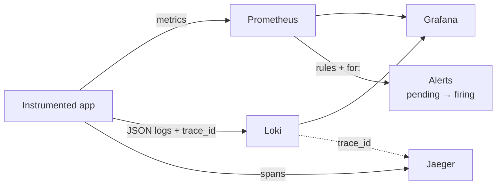
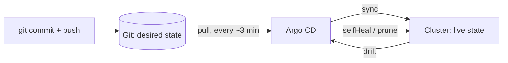

Monitoring, Observability and GitOps – Learning Notes
=====================================================

Name: Anshul Mohanty    Roll No: 24BCS10191    Section: A

## In one line

Metrics tell you *that* something is wrong, logs *what* happened, traces *where* - and GitOps makes
Git the only way to change what is running, with an agent that keeps the cluster equal to the repo.

## The picture

## Mental model

| Pillar | Answers | Tool here |
|---|---|---|
| Metrics | Is it wrong? How much? | Prometheus |
| Logs | What exactly happened? | Loki |
| Traces | Where did this request spend its time / fail? | Jaeger |

| Metric type | Example | Query with |
|---|---|---|
| Counter | `http_requests_total` | `rate()` |
| Gauge | `http_requests_in_flight` | direct value |
| Histogram | `http_request_duration_seconds` | `histogram_quantile()` |

| Argo CD setting | Effect |
|---|---|
| `automated` | Sync when Git changes |
| `prune: true` | Delete resources removed from Git |
| `selfHeal: true` | Revert manual changes in the cluster |
| `CreateNamespace=true` | Create the destination namespace |

## Gotchas

- `localhost` in an Alpine container resolved to `::1` - the healthcheck failed against an
  IPv4-only app. Use `127.0.0.1`.
- Short PromQL windows right after a restart give misleading rates - wait for the window to fill.
- Alerts need `for:`; without it a single bad scrape pages someone.
- Jaeger 2.21 serves only the v3 API, so Grafana's Jaeger data source failed - logs link straight
  to the Jaeger UI instead.
- Grafana keeps provisioned data sources in its database; removing one from the YAML needs a
  fresh container (or `deleteDatasources`).
- The Argo CD Application must live outside the folder it syncs.
- Argo CD polls about every 3 minutes - a commit is not deployed instantly without a webhook.
- In GitOps, `kubectl scale`/`edit` changes are undone within seconds - fix it in Git instead.
