Monitoring, Observability and GitOps – Homework
===============================================

Name: Anshul Mohanty    Roll No: 24BCS10191    Section: A

See also: [LEARNING.md](LEARNING.md) - diagram and revision notes for this topic.

| Folder | Contents |
|---|---|
| [monitoring/](monitoring/) | Docker Compose stack: an instrumented `orders-api`, Prometheus + alert rules, node-exporter, cAdvisor, Grafana (provisioned dashboard), Loki + Alloy, Jaeger |
| [gitops/](gitops/) | `app/` - the manifests Argo CD keeps in sync; `argocd/application.yaml` - the Argo CD Application |

Instead of a demo that only shows Prometheus scraping itself, the monitoring stack watches a small
service built to emit **all three** kinds of telemetry, so every pillar can be shown with real data:

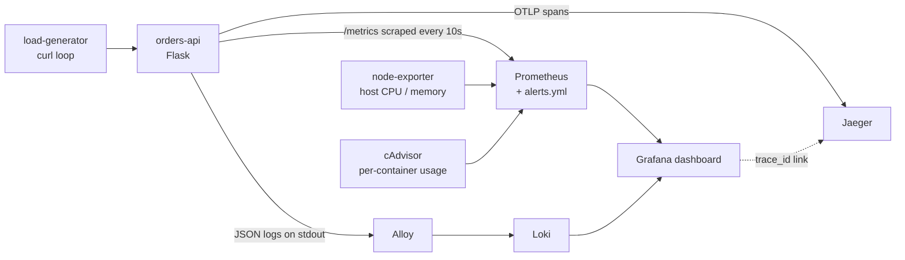
```mermaid
flowchart LR
    LG["load-generator<br/>curl loop"] --> APP["orders-api<br/>Flask"]
    APP -->|"/metrics scraped every 10s"| PROM["Prometheus<br/>+ alerts.yml"]
    NE["node-exporter<br/>host CPU / memory"] --> PROM
    CA["cAdvisor<br/>per-container usage"] --> PROM
    APP -->|"JSON logs on stdout"| AL["Alloy"] --> LOKI["Loki"]
    APP -->|"OTLP spans"| JAE["Jaeger"]
    PROM --> GRAF["Grafana dashboard"]
    LOKI --> GRAF
    GRAF -.->|"trace_id link"| JAE
```

`orders-api` ([monitoring/app/app.py](monitoring/app/app.py)) serves `/api/orders`, which runs a
simulated database query (5% of them slow, 0.8-1.6 s) and fails 3% of the time - both rates
can be raised with environment variables to cause incidents on purpose.

| Pillar | How the app emits it | Collected by | Viewed in |
|---|---|---|---|
| Metrics | `prometheus_client`: `http_requests_total`, `http_request_duration_seconds` (histogram), `http_requests_in_flight` | Prometheus | Grafana, PromQL |
| Logs | One JSON line per request with `level`, `route`, `status`, `duration_ms` and the **`trace_id`** | Alloy → Loki | Grafana, LogQL |
| Traces | OpenTelemetry: a span per request with child spans `db.query orders` and `pricing.calculate` | Jaeger (OTLP) | Jaeger UI |

---

Task 1: Monitoring
------------------

### The stack running

```
cd monitoring
docker compose up -d --build
```

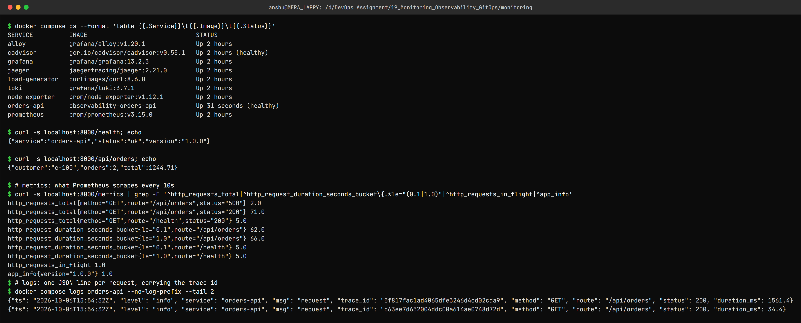

```
$ docker compose ps --format 'table {{.Service}}\t{{.Image}}\t{{.Status}}'
SERVICE          IMAGE                              STATUS
alloy            grafana/alloy:v1.20.1              Up 2 hours
cadvisor         gcr.io/cadvisor/cadvisor:v0.55.1   Up 2 hours (healthy)
grafana          grafana/grafana:13.2.3             Up 2 hours
jaeger           jaegertracing/jaeger:2.21.0        Up 2 hours
load-generator   curlimages/curl:8.6.0              Up 2 hours
loki             grafana/loki:3.7.1                 Up 2 hours
node-exporter    prom/node-exporter:v1.12.1         Up 2 hours
orders-api       observability-orders-api           Up 31 seconds (healthy)
prometheus       prom/prometheus:v3.15.0            Up 2 hours

$ curl -s localhost:8000/health; echo
{"service":"orders-api","status":"ok","version":"1.0.0"}

$ curl -s localhost:8000/api/orders; echo
{"customer":"c-100","orders":2,"total":1244.71}

$ # metrics: what Prometheus scrapes every 10s
$ curl -s localhost:8000/metrics | grep -E '^http_requests_total|^http_request_duration_seconds_bucket\{.*le="(0.1|1.0)"|^http_requests_in_flight|^app_info'
http_requests_total{method="GET",route="/api/orders",status="500"} 2.0
http_requests_total{method="GET",route="/api/orders",status="200"} 71.0
http_requests_total{method="GET",route="/health",status="200"} 5.0
http_request_duration_seconds_bucket{le="0.1",route="/api/orders"} 62.0
http_request_duration_seconds_bucket{le="1.0",route="/api/orders"} 66.0
http_request_duration_seconds_bucket{le="0.1",route="/health"} 5.0
http_request_duration_seconds_bucket{le="1.0",route="/health"} 5.0
http_requests_in_flight 1.0
app_info{version="1.0.0"} 1.0
$ # logs: one JSON line per request, carrying the trace id
$ docker compose logs orders-api --no-log-prefix --tail 2
{"ts": "2026-10-06T15:54:32Z", "level": "info", "service": "orders-api", "msg": "request", "trace_id": "5f817fac1ad4065dfe3246d4cd02cda9", "method": "GET", "route": "/api/orders", "status": 200, "duration_ms": 1561.4}
{"ts": "2026-10-06T15:54:32Z", "level": "info", "service": "orders-api", "msg": "request", "trace_id": "c63ee7d652004ddc00a614ae0748d72d", "method": "GET", "route": "/api/orders", "status": 200, "duration_ms": 34.4}
```

### A health check that lied

The first version of the compose healthcheck called `http://localhost:8000/health`, and Docker
kept reporting `orders-api` as **unhealthy** even though it was answering requests:

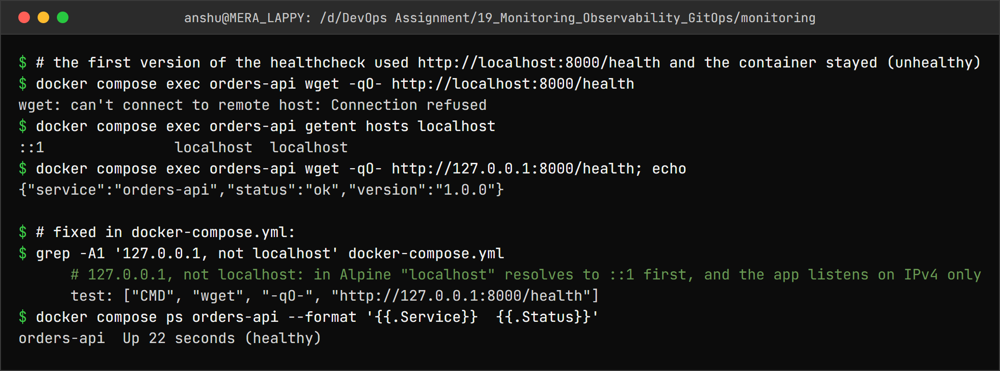

```
$ # the first version of the healthcheck used http://localhost:8000/health and the container stayed (unhealthy)
$ docker compose exec orders-api wget -qO- http://localhost:8000/health
wget: can't connect to remote host: Connection refused
$ docker compose exec orders-api getent hosts localhost
::1               localhost  localhost
$ docker compose exec orders-api wget -qO- http://127.0.0.1:8000/health; echo
{"service":"orders-api","status":"ok","version":"1.0.0"}

$ # fixed in docker-compose.yml:
$ grep -A1 '127.0.0.1, not localhost' docker-compose.yml
      # 127.0.0.1, not localhost: in Alpine "localhost" resolves to ::1 first, and the app listens on IPv4 only
      test: ["CMD", "wget", "-qO-", "http://127.0.0.1:8000/health"]
$ docker compose ps orders-api --format '{{.Service}}  {{.Status}}'
orders-api  Up 22 seconds (healthy)
```

Inside the Alpine image `localhost` resolves to the IPv6 address `::1` first, but Flask listens on
IPv4 `0.0.0.0` only, so the probe was refused. The app was fine; the **health check** was wrong.
Using `127.0.0.1` fixed it. A health check that does not test what it claims to is worse than none.

### Metrics: application health, CPU and memory

Every target Prometheus scrapes, and its health:

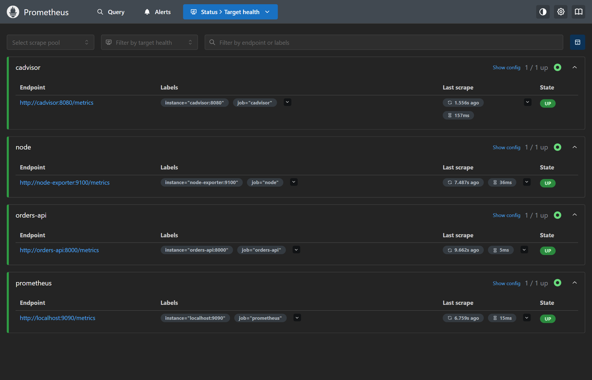

The questions monitoring has to answer, as PromQL:

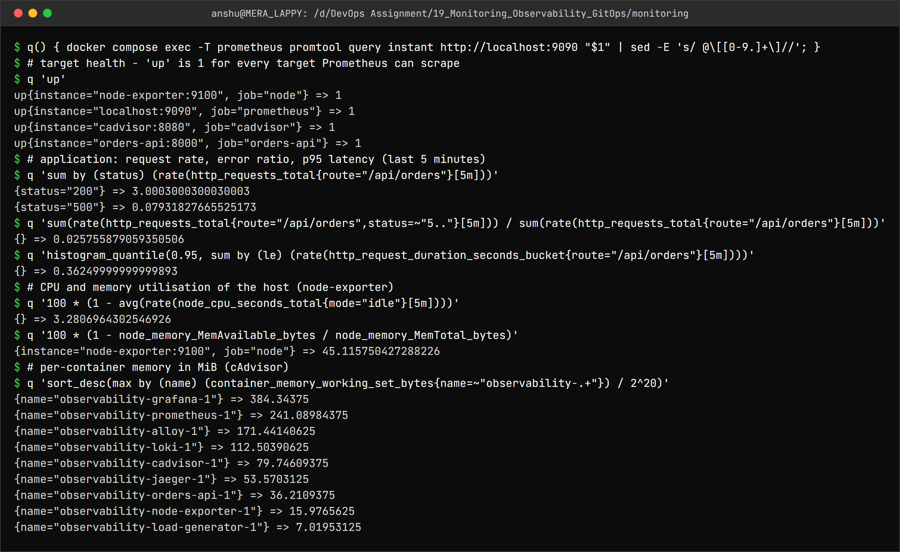

```
$ q() { docker compose exec -T prometheus promtool query instant http://localhost:9090 "$1" | sed -E 's/ @\[[0-9.]+\]//'; }
$ # target health - 'up' is 1 for every target Prometheus can scrape
$ q 'up'
up{instance="node-exporter:9100", job="node"} => 1
up{instance="localhost:9090", job="prometheus"} => 1
up{instance="cadvisor:8080", job="cadvisor"} => 1
up{instance="orders-api:8000", job="orders-api"} => 1
$ # application: request rate, error ratio, p95 latency (last 5 minutes)
$ q 'sum by (status) (rate(http_requests_total{route="/api/orders"}[5m]))'
{status="200"} => 3.0003000300030003
{status="500"} => 0.07931827665525173
$ q 'sum(rate(http_requests_total{route="/api/orders",status=~"5.."}[5m])) / sum(rate(http_requests_total{route="/api/orders"}[5m]))'
{} => 0.025755879059350506
$ q 'histogram_quantile(0.95, sum by (le) (rate(http_request_duration_seconds_bucket{route="/api/orders"}[5m])))'
{} => 0.36249999999999893
$ # CPU and memory utilisation of the host (node-exporter)
$ q '100 * (1 - avg(rate(node_cpu_seconds_total{mode="idle"}[5m])))'
{} => 3.2806964302546926
$ q '100 * (1 - node_memory_MemAvailable_bytes / node_memory_MemTotal_bytes)'
{instance="node-exporter:9100", job="node"} => 45.115750427288226
$ # per-container memory in MiB (cAdvisor)
$ q 'sort_desc(max by (name) (container_memory_working_set_bytes{name=~"observability-.+"}) / 2^20)'
{name="observability-grafana-1"} => 384.34375
{name="observability-prometheus-1"} => 241.08984375
{name="observability-alloy-1"} => 171.44140625
{name="observability-loki-1"} => 112.50390625
{name="observability-cadvisor-1"} => 79.74609375
{name="observability-jaeger-1"} => 53.5703125
{name="observability-orders-api-1"} => 36.2109375
{name="observability-node-exporter-1"} => 15.9765625
{name="observability-load-generator-1"} => 7.01953125
```

| Question | Signal | Value |
|---|---|---|
| Is the app up? | `up{job="orders-api"}` | 1 |
| How much traffic? | rate of `http_requests_total` | ~3.1 req/s |
| How many fail? | 5xx / all | 2.6% (configured: 3%) |
| How slow? | p95 of the latency histogram | 0.36 s |
| Host CPU utilisation | node-exporter idle time | 3.3% |
| Host memory utilisation | `MemAvailable / MemTotal` | 45% |
| Memory per container | cAdvisor working set | Grafana 384 MiB ... load-generator 7 MiB |

"Host" here is the Docker Desktop Linux VM, which is where node-exporter runs.

### Dashboard

Provisioned from [grafana/dashboards/orders-api.json](monitoring/grafana/dashboards/orders-api.json) -
no clicking in the UI. This capture was taken during the two incidents below: the steady period,
the **gap** where the app was down, and the **error spike** after it came back.

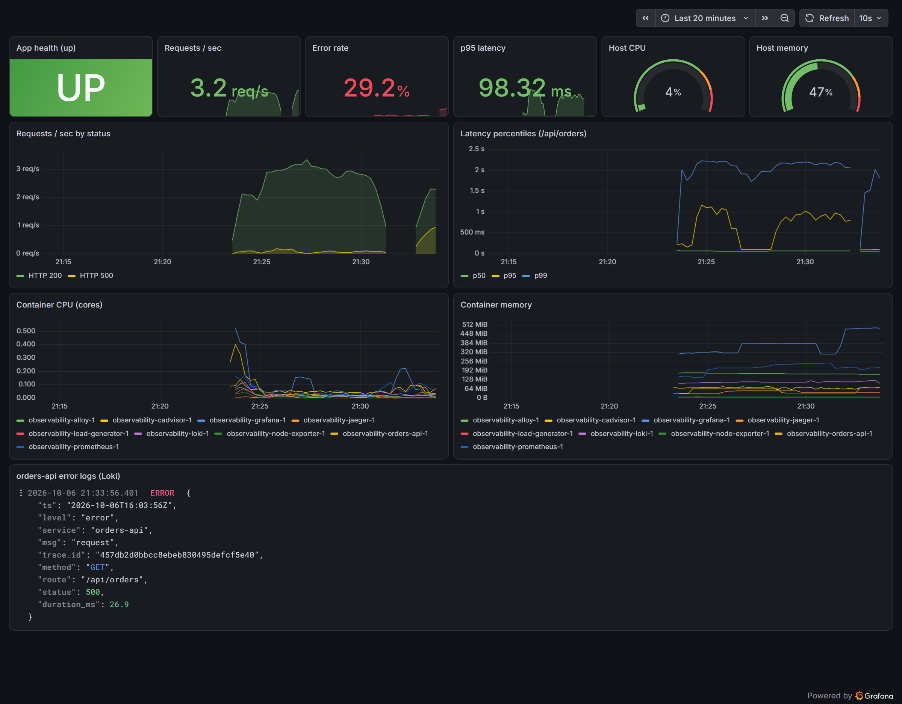

### Alerts

Rules in [prometheus/alerts.yml](monitoring/prometheus/alerts.yml):

| Alert | Condition | For | Severity |
|---|---|---|---|
| `OrdersApiDown` | `up{job="orders-api"} == 0` | 30s | critical |
| `OrdersApiHighErrorRate` | 5xx ratio of `/api/orders` > 10% | 1m | warning |
| `OrdersApiSlowP95` | p95 latency > 1 s | 2m | warning |
| `HostHighCpu` | host CPU > 85% | 2m | warning |
| `HostHighMemory` | host memory > 90% | 2m | warning |

The `for:` clause is what stops alerts from paging on a single bad scrape: an alert is **pending**
while the condition is true, and only **fires** if it stays true for the whole duration.

#### Incident 1: the service goes down

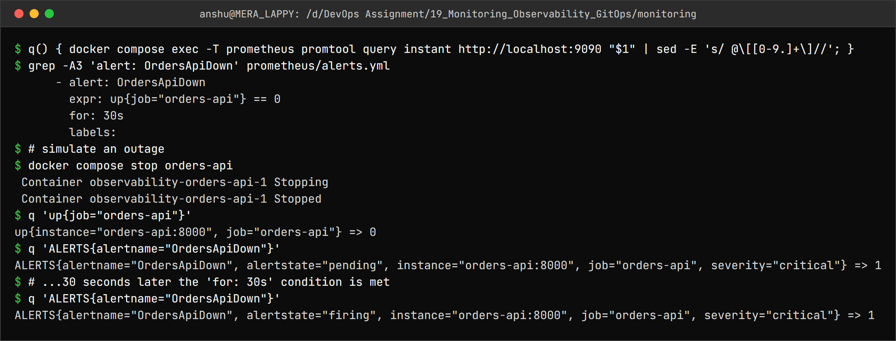

```
$ q() { docker compose exec -T prometheus promtool query instant http://localhost:9090 "$1" | sed -E 's/ @\[[0-9.]+\]//'; }
$ grep -A3 'alert: OrdersApiDown' prometheus/alerts.yml
      - alert: OrdersApiDown
        expr: up{job="orders-api"} == 0
        for: 30s
        labels:
$ # simulate an outage
$ docker compose stop orders-api
 Container observability-orders-api-1 Stopping
 Container observability-orders-api-1 Stopped
$ q 'up{job="orders-api"}'
up{instance="orders-api:8000", job="orders-api"} => 0
$ q 'ALERTS{alertname="OrdersApiDown"}'
ALERTS{alertname="OrdersApiDown", alertstate="pending", instance="orders-api:8000", job="orders-api", severity="critical"} => 1
$ # ...30 seconds later the 'for: 30s' condition is met
$ q 'ALERTS{alertname="OrdersApiDown"}'
ALERTS{alertname="OrdersApiDown", alertstate="firing", instance="orders-api:8000", job="orders-api", severity="critical"} => 1
```

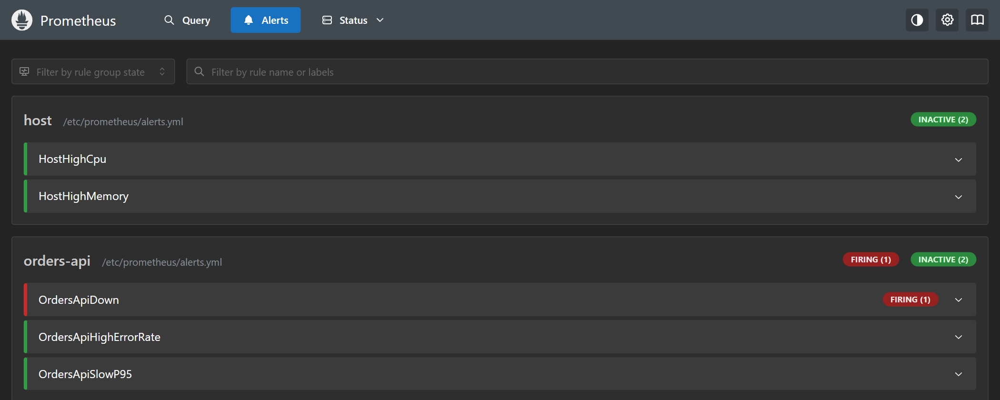

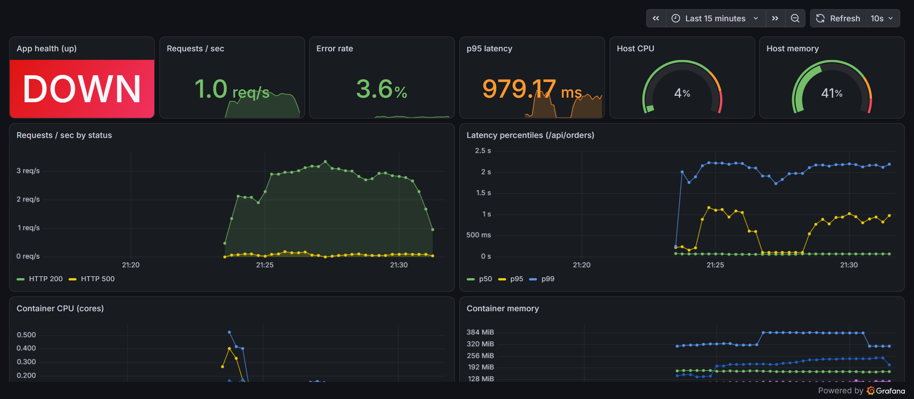

#### Incident 2: a bad release - 30% of requests fail

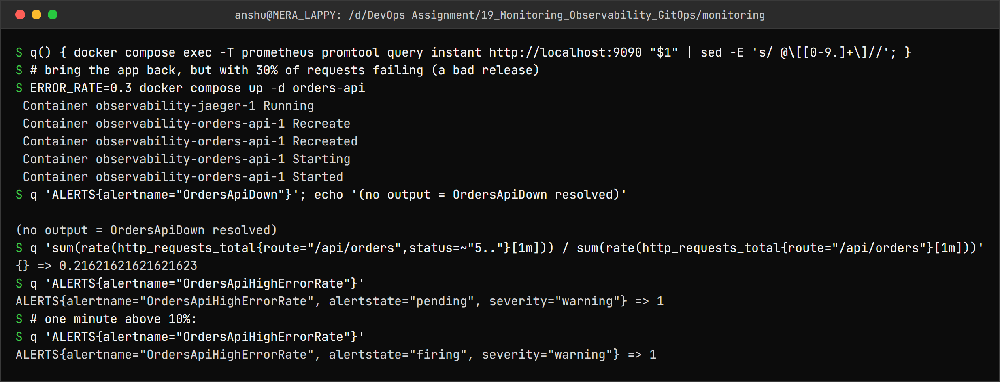

```
$ q() { docker compose exec -T prometheus promtool query instant http://localhost:9090 "$1" | sed -E 's/ @\[[0-9.]+\]//'; }
$ # bring the app back, but with 30% of requests failing (a bad release)
$ ERROR_RATE=0.3 docker compose up -d orders-api
 Container observability-jaeger-1 Running
 Container observability-orders-api-1 Recreate
 Container observability-orders-api-1 Recreated
 Container observability-orders-api-1 Starting
 Container observability-orders-api-1 Started
$ q 'ALERTS{alertname="OrdersApiDown"}'; echo '(no output = OrdersApiDown resolved)'

(no output = OrdersApiDown resolved)
$ q 'sum(rate(http_requests_total{route="/api/orders",status=~"5.."}[1m])) / sum(rate(http_requests_total{route="/api/orders"}[1m]))'
{} => 0.21621621621621623
$ q 'ALERTS{alertname="OrdersApiHighErrorRate"}'
ALERTS{alertname="OrdersApiHighErrorRate", alertstate="pending", severity="warning"} => 1
$ # one minute above 10%:
$ q 'ALERTS{alertname="OrdersApiHighErrorRate"}'
ALERTS{alertname="OrdersApiHighErrorRate", alertstate="firing", severity="warning"} => 1
```

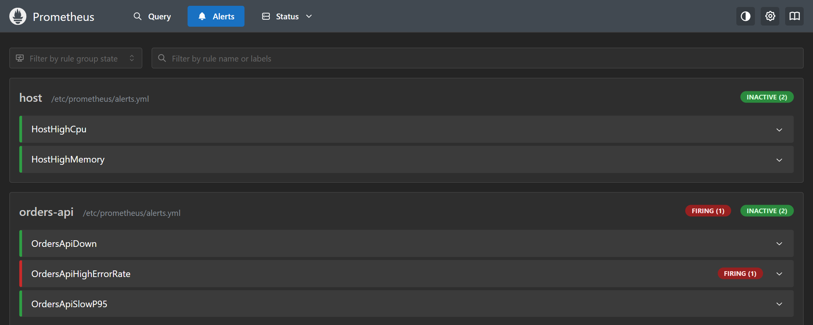

Starting the app again resolved `OrdersApiDown` by itself - alerts are re-evaluated every 10
seconds, so they clear when the condition does. Firing alerts would normally go to Alertmanager,
which groups, de-duplicates and routes them to Slack/e-mail/PagerDuty; this demo stops at
Prometheus.

### Monitoring in Kubernetes

The same questions on the cluster, with metrics-server, probes and events:

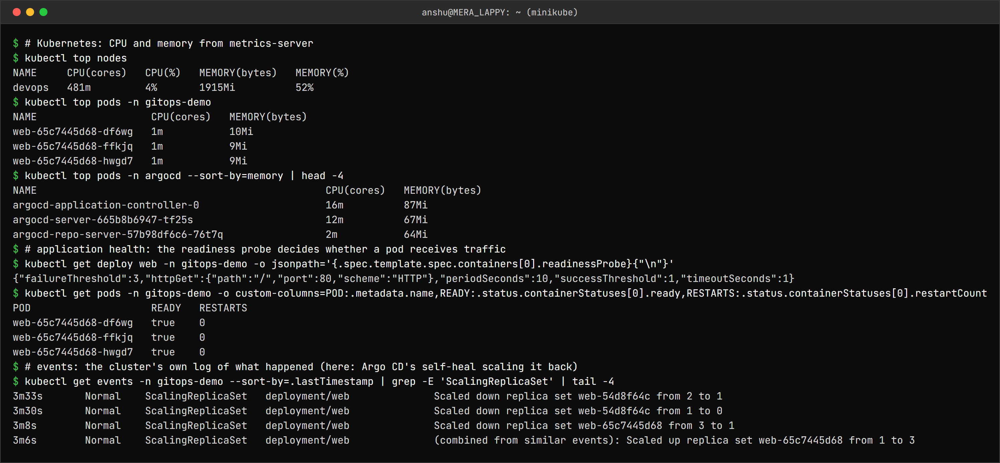

```
$ # Kubernetes: CPU and memory from metrics-server
$ kubectl top nodes
NAME     CPU(cores)   CPU(%)   MEMORY(bytes)   MEMORY(%)
devops   481m         4%       1915Mi          52%
$ kubectl top pods -n gitops-demo
NAME                   CPU(cores)   MEMORY(bytes)
web-65c7445d68-df6wg   1m           10Mi
web-65c7445d68-ffkjq   1m           9Mi
web-65c7445d68-hwgd7   1m           9Mi
$ kubectl top pods -n argocd --sort-by=memory | head -4
NAME                                                CPU(cores)   MEMORY(bytes)
argocd-application-controller-0                     16m          87Mi
argocd-server-665b8b6947-tf25s                      12m          67Mi
argocd-repo-server-57b98df6c6-76t7q                 2m           64Mi
$ # application health: the readiness probe decides whether a pod receives traffic
$ kubectl get deploy web -n gitops-demo -o jsonpath='{.spec.template.spec.containers[0].readinessProbe}{"\n"}'
{"failureThreshold":3,"httpGet":{"path":"/","port":80,"scheme":"HTTP"},"periodSeconds":10,"successThreshold":1,"timeoutSeconds":1}
$ kubectl get pods -n gitops-demo -o custom-columns=POD:.metadata.name,READY:.status.containerStatuses[0].ready,RESTARTS:.status.containerStatuses[0].restartCount
POD                    READY   RESTARTS
web-65c7445d68-df6wg   true    0
web-65c7445d68-ffkjq   true    0
web-65c7445d68-hwgd7   true    0
$ # events: the cluster's own log of what happened (here: Argo CD's self-heal scaling it back)
$ kubectl get events -n gitops-demo --sort-by=.lastTimestamp | grep -E 'ScalingReplicaSet' | tail -4
3m33s       Normal    ScalingReplicaSet   deployment/web              Scaled down replica set web-54d8f64c from 2 to 1
3m30s       Normal    ScalingReplicaSet   deployment/web              Scaled down replica set web-54d8f64c from 1 to 0
3m8s        Normal    ScalingReplicaSet   deployment/web              Scaled down replica set web-65c7445d68 from 3 to 1
3m6s        Normal    ScalingReplicaSet   deployment/web              (combined from similar events): Scaled up replica set web-65c7445d68 from 1 to 3
```

---

Task 2: Observability
---------------------

### Monitoring vs observability

| | Monitoring | Observability |
|---|---|---|
| Question | *Is* something wrong? | *Why* is it wrong? |
| Approach | Pre-defined checks and dashboards for known failure modes | Rich telemetry you can query in ways you did not plan for |
| Example here | `OrdersApiHighErrorRate` fired | The trace shows the request failed *after* a 22 ms DB query, before pricing |

Monitoring tells you the error rate went up. Observability lets you take one failed request and
follow it.

### The three pillars

| Pillar | What it is | Good at | Weak at | Here |
|---|---|---|---|---|
| **Metrics** | Numbers over time, aggregated (counters, gauges, histograms) | Cheap to store, trends, alerting, dashboards | No detail about individual requests | Prometheus |
| **Logs** | Timestamped records of discrete events | Full detail of what happened, error messages | Expensive at volume, hard to aggregate unless structured | Loki |
| **Traces** | The path of **one request** through the code (and through services), as a tree of timed spans | Where the time went, which step failed | Usually sampled; need instrumentation | Jaeger |

They are most useful **connected**. Every log line carries the request's `trace_id`, so an error
log leads straight to its trace:

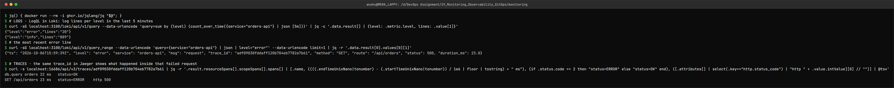

```
$ jq() { docker run --rm -i ghcr.io/jqlang/jq "$@"; }
$ # LOGS - LogQL in Loki: log lines per level in the last 5 minutes
$ curl -sG localhost:3100/loki/api/v1/query --data-urlencode 'query=sum by (level) (count_over_time({service="orders-api"} | json [5m]))' | jq -c '.data.result[] | {level: .metric.level, lines: .value[1]}'
{"level":"error","lines":"20"}
{"level":"info","lines":"889"}
$ # the most recent error line
$ curl -sG localhost:3100/loki/api/v1/query_range --data-urlencode 'query={service="orders-api"} | json | level="error"' --data-urlencode limit=1 | jq -r '.data.result[0].values[0][1]'
{"ts": "2026-10-06T15:59:39Z", "level": "error", "service": "orders-api", "msg": "request", "trace_id": "adf09030fddaff120b704eb7782a7b61", "method": "GET", "route": "/api/orders", "status": 500, "duration_ms": 23.0}

$ # TRACES - the same trace_id in Jaeger shows what happened inside that failed request
$ curl -s localhost:16686/api/v3/traces/adf09030fddaff120b704eb7782a7b61 | jq -r '.result.resourceSpans[].scopeSpans[].spans[] | [.name, ((((.endTimeUnixNano|tonumber) - (.startTimeUnixNano|tonumber)) / 1e6 | floor | tostring) + " ms"), (if .status.code == 2 then "status=ERROR" else "status=OK" end), ([.attributes[] | select(.key=="http.status_code") | "http " + .value.intValue][0] // "")] | @tsv'
db.query orders	22 ms	status=OK
GET /api/orders	23 ms	status=ERROR	http 500
```

The error log line gives the `trace_id`; the trace shows `db.query orders` succeeded in 22 ms and the
request span ended with `status=ERROR` and HTTP 500 - without a `pricing.calculate` span. So the
failure happened between the database call and pricing (the simulated payment timeout), not in the
database. Neither the metric nor the log alone says that.

### Traces in Jaeger

Searching for requests slower than 700 ms - each dot is one request; the red one also failed:

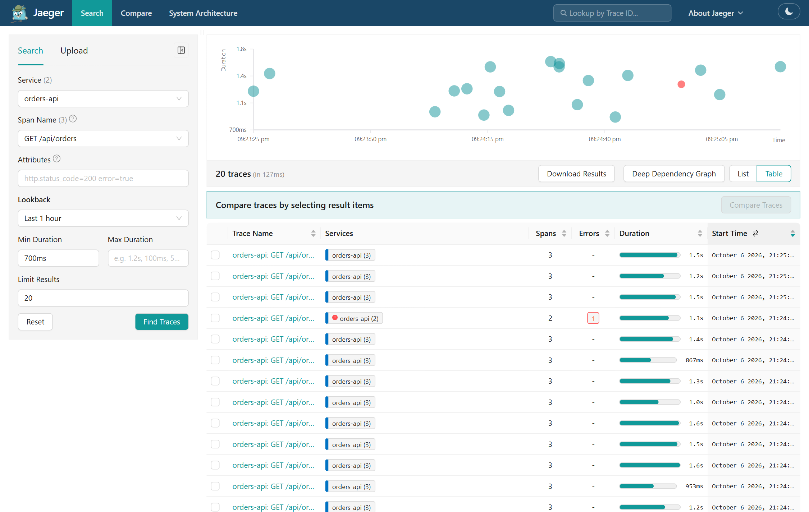

One of them opened. The waterfall answers "why was this request slow?" immediately: almost the whole
1.2 s is the `db.query orders` span, whose attributes show `db.slow = true`, the SQL statement and
the customer:

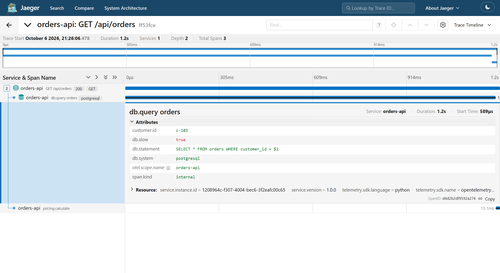

The p95 latency metric could only say "some requests are slow"; the trace says which part of which
request and why.

### Why observability is required

- Modern systems are distributed: one user request crosses many services, queues and databases, and
  failures are often new combinations no dashboard was built for.
- It shortens **MTTR** (mean time to recovery): from "error rate is up" to the cause in minutes.
- It makes SLOs measurable (e.g. "99% of `/api/orders` under 500 ms").
- It shows the real impact of a deploy - the error spike in the dashboard lines up exactly with the
  bad release.

### Common tools

| Area | Open source | Managed / commercial |
|---|---|---|
| Metrics | Prometheus, VictoriaMetrics, Thanos/Mimir (long-term) | Amazon CloudWatch, Datadog, Grafana Cloud |
| Logs | Loki, Elasticsearch/OpenSearch (ELK/EFK), Fluent Bit, Vector | CloudWatch Logs, Splunk, Datadog |
| Traces | Jaeger, Grafana Tempo, Zipkin | AWS X-Ray, Honeycomb, Datadog APM |
| Visualisation | Grafana, Kibana | Vendor UIs |
| Instrumentation standard | **OpenTelemetry** (vendor-neutral SDKs + collector) | - |
| Alerting | Alertmanager, Grafana Alerting | PagerDuty, Opsgenie |

### Kubernetes observability

| Layer | Metrics | Logs | Traces / other |
|---|---|---|---|
| Cluster/nodes | node-exporter, kube-state-metrics | kubelet, system journals | Kubernetes **events** (`kubectl get events`) |
| Pods/containers | metrics-server (`kubectl top`), cAdvisor in the kubelet | `kubectl logs`, collected by Fluent Bit / Alloy into Loki | Probes (`readiness`/`liveness`) report health |
| Applications | `/metrics` scraped via ServiceMonitor | stdout JSON | OpenTelemetry Collector as a DaemonSet → Jaeger/Tempo |

In a real cluster this is usually installed with the **kube-prometheus-stack** Helm chart
(Prometheus Operator + Grafana + Alertmanager + node-exporter + kube-state-metrics) plus Loki and an
OpenTelemetry Collector. Kubernetes-specific signals to watch: restarts and `CrashLoopBackOff`,
`OOMKilled`, Pending pods, HPA replica counts, node pressure, and failing probes (all covered in
topics 12 and 13).

---

Task 3: GitOps
--------------

### What GitOps is

| Principle | Meaning | In this demo |
|---|---|---|
| **Declarative** | The desired state is described (YAML), not a list of commands | [gitops/app/](gitops/app/) - Deployment, Service, ConfigMap |
| **Git as the source of truth** | That description lives in Git; the cluster should equal the repo | `main` of this repository |
| **Pulled automatically** | An agent *in the cluster* pulls from Git - CI does not push into the cluster | Argo CD polls the repo |
| **Continuously reconciled** | The agent keeps comparing live state with Git and corrects any difference | `selfHeal: true`, `prune: true` |

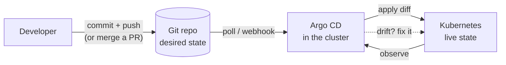
```mermaid
flowchart LR
    DEV["Developer"] -->|"commit + push<br/>(or merge a PR)"| GIT[("Git repo<br/>desired state")]
    GIT -->|"poll / webhook"| ARGO["Argo CD<br/>in the cluster"]
    ARGO -->|"apply diff"| K8S["Kubernetes<br/>live state"]
    K8S -->|"observe"| ARGO
    ARGO -.->|"drift? fix it"| K8S
```

The workflow is: change YAML → pull request → review → merge → Argo CD syncs. Every deployment is a
commit (who, what, when, why), rollback is `git revert`, and nobody needs `kubectl` write access to
production.

### Argo CD installed on minikube

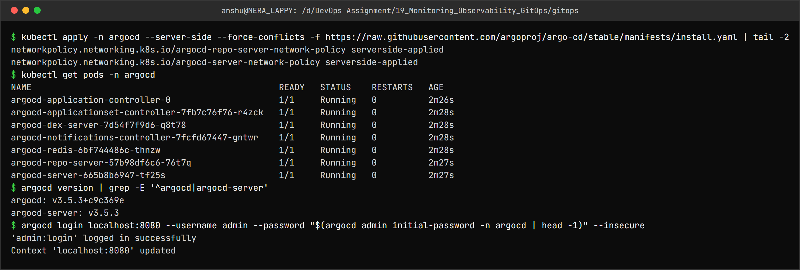

```
$ kubectl apply -n argocd --server-side --force-conflicts -f https://raw.githubusercontent.com/argoproj/argo-cd/stable/manifests/install.yaml | tail -2
networkpolicy.networking.k8s.io/argocd-repo-server-network-policy serverside-applied
networkpolicy.networking.k8s.io/argocd-server-network-policy serverside-applied
$ kubectl get pods -n argocd
NAME                                                READY   STATUS    RESTARTS   AGE
argocd-application-controller-0                     1/1     Running   0          2m26s
argocd-applicationset-controller-7fb7c76f76-r4zck   1/1     Running   0          2m28s
argocd-dex-server-7d54f7f9d6-q8t78                  1/1     Running   0          2m28s
argocd-notifications-controller-7fcfd67447-gntwr    1/1     Running   0          2m28s
argocd-redis-6bf744486c-thnzw                       1/1     Running   0          2m28s
argocd-repo-server-57b98df6c6-76t7q                 1/1     Running   0          2m27s
argocd-server-665b8b6947-tf25s                      1/1     Running   0          2m27s
$ argocd version | grep -E '^argocd|argocd-server'
argocd: v3.5.3+c9c369e
argocd-server: v3.5.3
$ argocd login localhost:8080 --username admin --password "$(argocd admin initial-password -n argocd | head -1)" --insecure
'admin:login' logged in successfully
Context 'localhost:8080' updated
```

### The Application

```yaml
apiVersion: argoproj.io/v1alpha1
kind: Application
metadata:
  name: gitops-demo
  namespace: argocd
spec:
  project: default
  source:
    repoURL: https://github.com/AnshulMohanty/DevOps-Assignment-101.git
    targetRevision: main
    path: 19_Monitoring_Observability_GitOps/gitops/app
  destination:
    server: https://kubernetes.default.svc
    namespace: gitops-demo
  syncPolicy:
    automated:
      prune: true      # delete what was removed from Git
      selfHeal: true   # undo changes made directly in the cluster
    syncOptions:
      - CreateNamespace=true
```

It sits in `gitops/argocd/`, **outside** the synced `app/` folder - otherwise Argo CD would be
managing its own definition. The repository is public, so Argo CD needs no credentials to read it.

### 1. First sync - version 1 from commit f54f2b2

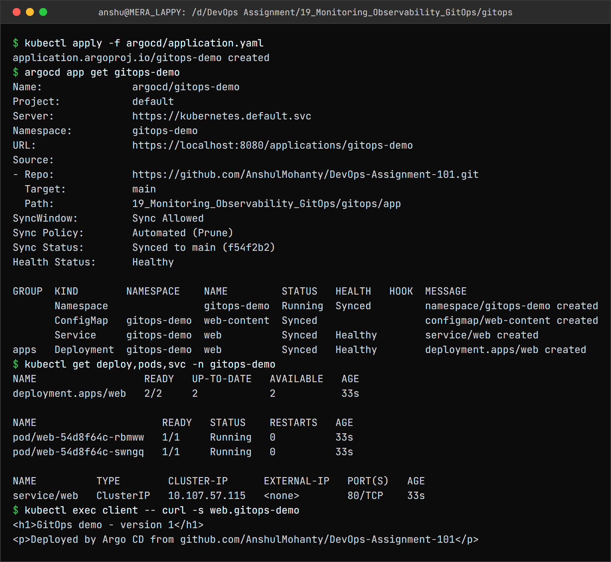

```
$ kubectl apply -f argocd/application.yaml
application.argoproj.io/gitops-demo created
$ argocd app get gitops-demo
Name:               argocd/gitops-demo
Project:            default
Server:             https://kubernetes.default.svc
Namespace:          gitops-demo
URL:                https://localhost:8080/applications/gitops-demo
Source:
- Repo:             https://github.com/AnshulMohanty/DevOps-Assignment-101.git
  Target:           main
  Path:             19_Monitoring_Observability_GitOps/gitops/app
SyncWindow:         Sync Allowed
Sync Policy:        Automated (Prune)
Sync Status:        Synced to main (f54f2b2)
Health Status:      Healthy

GROUP  KIND        NAMESPACE    NAME         STATUS   HEALTH   HOOK  MESSAGE
       Namespace                gitops-demo  Running  Synced         namespace/gitops-demo created
       ConfigMap   gitops-demo  web-content  Synced                  configmap/web-content created
       Service     gitops-demo  web          Synced   Healthy        service/web created
apps   Deployment  gitops-demo  web          Synced   Healthy        deployment.apps/web created
$ kubectl get deploy,pods,svc -n gitops-demo
NAME                  READY   UP-TO-DATE   AVAILABLE   AGE
deployment.apps/web   2/2     2            2           33s

NAME                     READY   STATUS    RESTARTS   AGE
pod/web-54d8f64c-rbmww   1/1     Running   0          33s
pod/web-54d8f64c-swngq   1/1     Running   0          33s

NAME          TYPE        CLUSTER-IP      EXTERNAL-IP   PORT(S)   AGE
service/web   ClusterIP   10.107.57.115   <none>        80/TCP    33s
$ kubectl exec client -- curl -s web.gitops-demo
<h1>GitOps demo - version 1</h1>
<p>Deployed by Argo CD from github.com/AnshulMohanty/DevOps-Assignment-101</p>
```

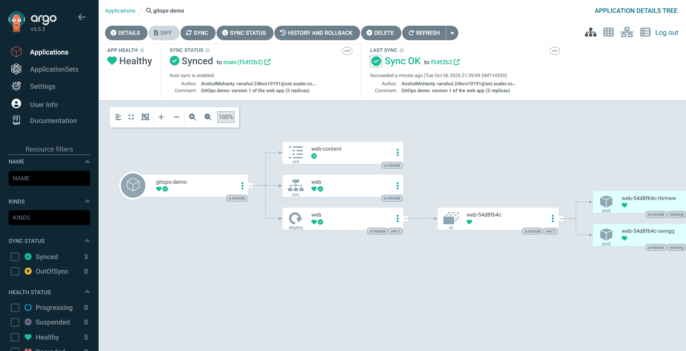

### 2. A change made only through Git - version 2

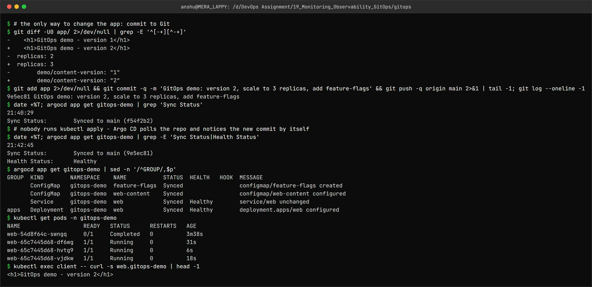

```
$ # the only way to change the app: commit to Git
$ git diff -U0 app/ 2>/dev/null | grep -E '^[-+][^-+]'
-    <h1>GitOps demo - version 1</h1>
+    <h1>GitOps demo - version 2</h1>
-  replicas: 2
+  replicas: 3
-        demo/content-version: "1"
+        demo/content-version: "2"
$ git add app 2>/dev/null && git commit -q -m 'GitOps demo: version 2, scale to 3 replicas, add feature-flags' && git push -q origin main 2>&1 | tail -1; git log --oneline -1
9e5ec81 GitOps demo: version 2, scale to 3 replicas, add feature-flags
$ date +%T; argocd app get gitops-demo | grep 'Sync Status'
21:40:29
Sync Status:        Synced to main (f54f2b2)
$ # nobody runs kubectl apply - Argo CD polls the repo and notices the new commit by itself
$ date +%T; argocd app get gitops-demo | grep -E 'Sync Status|Health Status'
21:42:45
Sync Status:        Synced to main (9e5ec81)
Health Status:      Healthy
$ argocd app get gitops-demo | sed -n '/^GROUP/,$p'
GROUP  KIND        NAMESPACE    NAME           STATUS  HEALTH   HOOK  MESSAGE
       ConfigMap   gitops-demo  feature-flags  Synced                 configmap/feature-flags created
       ConfigMap   gitops-demo  web-content    Synced                 configmap/web-content configured
       Service     gitops-demo  web            Synced  Healthy        service/web unchanged
apps   Deployment  gitops-demo  web            Synced  Healthy        deployment.apps/web configured
$ kubectl get pods -n gitops-demo
NAME                   READY   STATUS      RESTARTS   AGE
web-54d8f64c-swngq     0/1     Completed   0          3m38s
web-65c7445d68-df6wg   1/1     Running     0          31s
web-65c7445d68-hvtg9   1/1     Running     0          6s
web-65c7445d68-vjdkw   1/1     Running     0          18s
$ kubectl exec client -- curl -s web.gitops-demo | head -1
<h1>GitOps demo - version 2</h1>
```

Nobody ran `kubectl apply`. The commit was pushed at 21:40, Argo CD was still on `f54f2b2`, and by
21:42 it had found `9e5ec81` on its own (default polling is every ~3 minutes; a Git webhook makes
it near-instant), created `feature-flags`, updated the ConfigMap and rolled the Deployment to 3
replicas serving version 2.

### 3. Self-heal - manual changes are undone

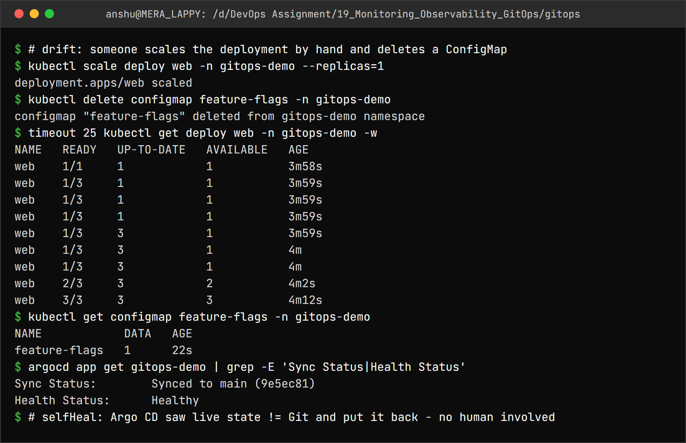

```
$ # drift: someone scales the deployment by hand and deletes a ConfigMap
$ kubectl scale deploy web -n gitops-demo --replicas=1
deployment.apps/web scaled
$ kubectl delete configmap feature-flags -n gitops-demo
configmap "feature-flags" deleted from gitops-demo namespace
$ timeout 25 kubectl get deploy web -n gitops-demo -w
NAME   READY   UP-TO-DATE   AVAILABLE   AGE
web    1/1     1            1           3m58s
web    1/3     1            1           3m59s
web    1/3     1            1           3m59s
web    1/3     1            1           3m59s
web    1/3     3            1           3m59s
web    1/3     3            1           4m
web    1/3     3            1           4m
web    2/3     3            2           4m2s
web    3/3     3            3           4m12s
$ kubectl get configmap feature-flags -n gitops-demo
NAME            DATA   AGE
feature-flags   1      22s
$ argocd app get gitops-demo | grep -E 'Sync Status|Health Status'
Sync Status:        Synced to main (9e5ec81)
Health Status:      Healthy
$ # selfHeal: Argo CD saw live state != Git and put it back - no human involved
```

Within a second of scaling to 1 replica Argo CD set it back to 3, and the deleted ConfigMap was
recreated. With GitOps, a manual hotfix in the cluster does not survive - the change has to go
through Git, where it is reviewed and recorded.

### 4. Prune and history

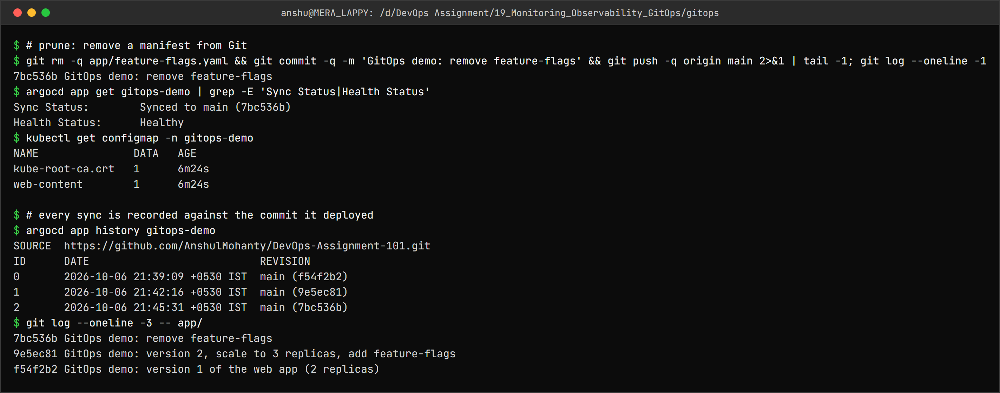

```
$ # prune: remove a manifest from Git
$ git rm -q app/feature-flags.yaml && git commit -q -m 'GitOps demo: remove feature-flags' && git push -q origin main 2>&1 | tail -1; git log --oneline -1
7bc536b GitOps demo: remove feature-flags
$ argocd app get gitops-demo | grep -E 'Sync Status|Health Status'
Sync Status:        Synced to main (7bc536b)
Health Status:      Healthy
$ kubectl get configmap -n gitops-demo
NAME               DATA   AGE
kube-root-ca.crt   1      6m24s
web-content        1      6m24s

$ # every sync is recorded against the commit it deployed
$ argocd app history gitops-demo
SOURCE  https://github.com/AnshulMohanty/DevOps-Assignment-101.git
ID      DATE                           REVISION
0       2026-10-06 21:39:09 +0530 IST  main (f54f2b2)
1       2026-10-06 21:42:16 +0530 IST  main (9e5ec81)
2       2026-10-06 21:45:31 +0530 IST  main (7bc536b)
$ git log --oneline -3 -- app/
7bc536b GitOps demo: remove feature-flags
9e5ec81 GitOps demo: version 2, scale to 3 replicas, add feature-flags
f54f2b2 GitOps demo: version 1 of the web app (2 replicas)
```

Deleting `feature-flags.yaml` from Git deleted the ConfigMap from the cluster (`prune: true`).
Argo CD's history and `git log` line up commit for commit:

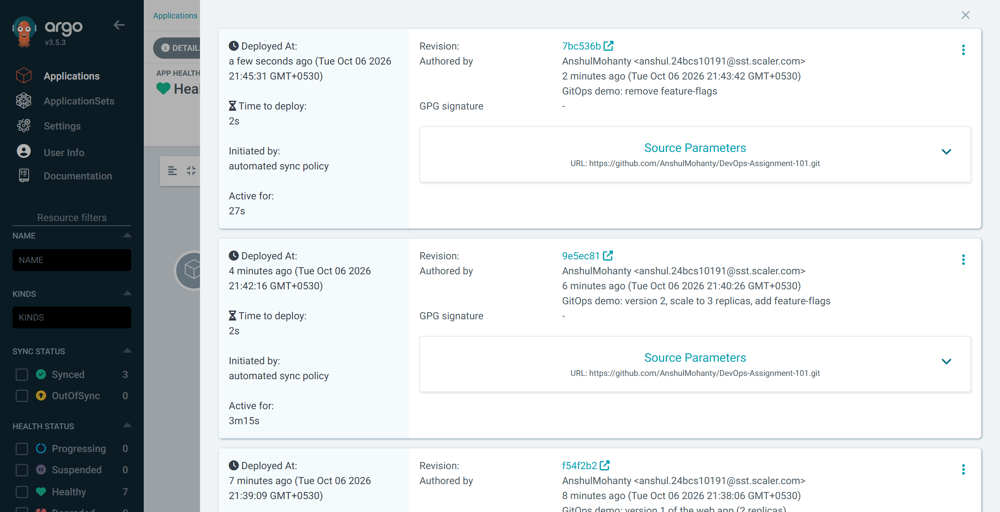

Every deployment says **"Initiated by: automated sync policy"** and links to the commit, its author
and its message. The final state - 3 pods, version 2, no feature flags, synced to `7bc536b`:

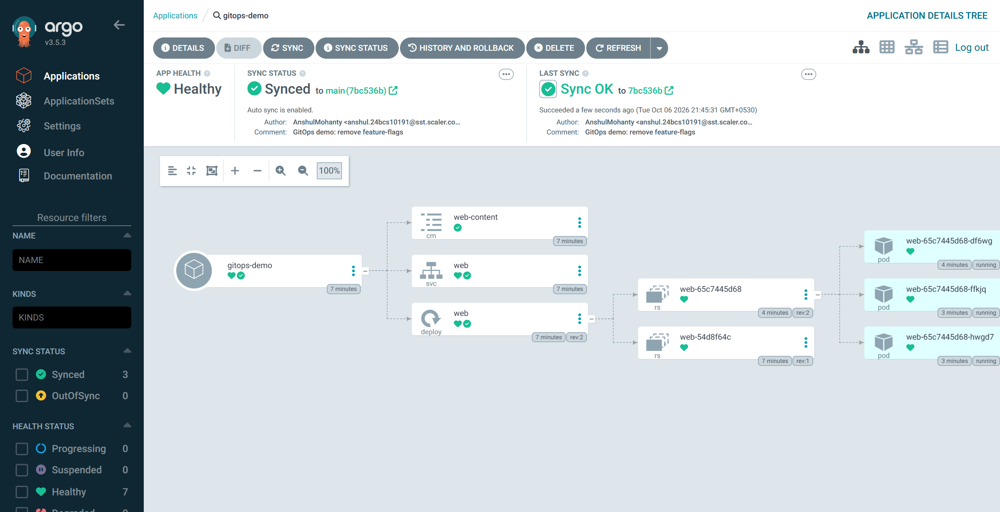

The old ReplicaSet (`rev:1`) is kept at 0 replicas, which is what a Kubernetes-level rollback would
use - but in GitOps the rollback is a `git revert`, so the history stays in Git.

---

What I understood
-----------------

- **Monitoring** answers known questions (up? how fast? how many errors? how much CPU/memory?) and
  **alerts** when an answer crosses a threshold for long enough (`for:`), not on a single blip.
- **Observability** is being able to ask new questions: metrics show *that* something is wrong,
  logs show *what* happened, traces show *where in the request* it happened. Linking them with a
  `trace_id` is what makes the three pillars work together.
- Instrumentation is part of the application. The dashboard, alerts and traces here exist only
  because the code exposes `/metrics`, logs JSON and creates spans (OpenTelemetry).
- Percentiles beat averages: the p50 stayed in the tens of milliseconds while p95/p99 showed the slow 5%.
- A health check has to be tested too - mine reported a healthy app as unhealthy (`localhost` →
  `::1`).
- **GitOps**: Git is the single source of truth; an agent inside the cluster pulls and continuously
  reconciles. Deploy = merge, rollback = revert, drift is corrected automatically, and the audit
  trail is the commit history.
- Argo CD's `prune` removes what left Git; `selfHeal` reverts what changed outside Git. Without them
  it only *reports* OutOfSync.
