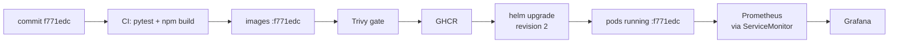
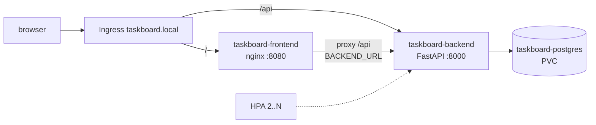

Demo Project: TaskBoard – Learning Notes
=======================================

Name: Anshul Mohanty    Roll No: 24BCS10191    Section: A

## In one line

One commit travels the whole path - tests, an image tagged with that commit, a security scan, a registry,
Terraform-built infrastructure, a Helm release behind an Ingress, autoscaling and monitoring - and every
stage can be traced back to the commit.

## The picture

## Mental model

| Stage | Tool | Question it answers |
|---|---|---|
| Test | pytest | Does the code do what it should? |
| Build | Docker (multi-stage) | Can it run anywhere, as non-root? |
| Scan | Trivy | Does the image contain known, fixable HIGH/CRITICAL CVEs? |
| Store | GHCR | Which exact image belongs to which commit? |
| Provision | Terraform | Where does it run (VPC, subnets, EKS)? |
| Package | Helm | One versioned release with upgrade and rollback |
| Expose | Service + Ingress | How does traffic find the pods? |
| Scale | HPA | How many pods does the load need? |
| Observe | Prometheus + Grafana | Is it up, how busy, how slow, how many errors? |

| Endpoint | Used by | Means |
|---|---|---|
| `/health` | liveness probe | the process is alive |
| `/ready` | readiness probe | it can reach the database and take traffic |
| `/metrics` | Prometheus | numbers about requests and latency |

| Symptom | First command | Usual cause |
|---|---|---|
| `ImagePullBackOff` | `kubectl describe pod` | wrong image name/tag, no pull access |
| `CrashLoopBackOff` | `kubectl logs` | missing config, dependency not ready |
| Service with no endpoints | `kubectl get endpointslices` + `--show-labels` | selector does not match pod labels |
| Endpoints but connection refused | compare `targetPort` with the container port | wrong `targetPort` |

## Gotchas

- `TestClient(app)` without `with` never runs the startup/lifespan hook - the tables are never created.
- Compose `depends_on` waits for a container to *start*, not to be *ready* - add a healthcheck.
- In React, `e.currentTarget` is `null` after an `await` - keep a reference to the form first.
- Docker image names must be lower case; `github.repository_owner` may not be.
- Every name in a Helm chart (Service, Ingress backend, proxy target) should come from one helper.
- A non-root nginx cannot bind port 80 - `nginx-unprivileged` listens on 8080.
- HCL needs one argument per line; a one-line block may hold only one argument.
- LocalStack's free edition has no EKS API - VPC and IAM apply, the cluster does not.
- The HPA scales up in seconds but waits 5 minutes before scaling down.
- An HPA cannot create capacity: on a 2.7 GiB single-node minikube, too many pods starved the API server.
- `kubectl port-forward` sticks to one pod and dies when that pod restarts.
- kube-proxy needs a moment after a Service change before traffic follows it.
